# ADR-0135: Increment Creation Sync Orchestration Flow

**Status**: Accepted
**Date**: 2025-11-24
**Deciders**: Anton Abyzov (Tech Lead), Claude (Architect)
**Related**: ADR-0134 (External Tool Detection), ADR-0131 (External Tool Sync Context)

## Context

### Problem Statement

SpecWeave has automatic sync for **task completion** (works great!), but NOT for **increment creation** (broken!).

**What Works Today** ✅:
```
User completes task with TodoWrite
  ↓
post-task-completion.sh hook fires
  ↓
consolidated-sync.js orchestrates sync
  ↓
us-completion-orchestrator detects completed user stories
  ↓
livingDocsSync.syncIncrement() syncs to living docs
  ↓
syncToExternalTools() updates GitHub issues
  ↓
✅ GitHub issues updated automatically!
```

**What's Broken Today** ❌:
```
User creates increment with /specweave:increment
  ↓
increment-planner creates spec.md, plan.md, tasks.md
  ↓
❌ NO AUTOMATIC SYNC!
  ↓
User must manually run:
  1. /specweave:sync-specs (sync to living docs)
  2. /specweave-github:sync (create GitHub issues)
  ↓
❌ 3-step workflow instead of 1!
```

### User Impact

**Current Workflow (3 manual steps)**:
```bash
$ /specweave:increment "Add user authentication"
✅ Increment 0057 created

$ /specweave:sync-specs 0057    # ← Manual step 1
✅ Synced to living docs

$ /specweave-github:sync 0057    # ← Manual step 2
✅ GitHub issues created
```

**Target Workflow (1 automatic step)**:
```bash
$ /specweave:increment "Add user authentication"
✅ Increment 0057 created
✅ Synced to living docs
✅ GitHub issues created
   - Milestone #17 created
   - Issue #740: US-001 User Login
   - Issue #741: US-002 Password Reset
   - Issue #742: US-003 Session Management
```

**SpecWeave Dog-Fooding Requirement** (ADR-0007):
The SpecWeave repo MUST use GitHub Issues to demonstrate its own features publicly. Manual sync breaks this requirement.

## Decision

**Implement automatic sync orchestration for increment creation** by enhancing the existing infrastructure (not rebuilding from scratch).

### Architecture Overview

**Key Insight**: The sync infrastructure already exists! We just need to trigger it after increment creation.

**Components Involved**:
1. `/specweave:increment` command (slash command)
2. `increment-planner` skill (orchestrates PM → Architect → test-aware-planner)
3. **NEW**: Post-increment hook (triggers sync)
4. `LivingDocsSync.syncIncrement()` (existing - works!)
5. `syncToExternalTools()` (existing - works with ADR-0134 fix)

### Complete Flow (NEW)

```mermaid
sequenceDiagram
    participant User
    participant IncrementCmd as /specweave:increment
    participant Planner as increment-planner skill
    participant PM as PM Agent
    participant Arch as Architect Agent
    participant TAP as test-aware-planner
    participant Hook as post-increment-planning.sh
    participant LDS as LivingDocsSync
    participant GH as GitHub Sync

    User->>IncrementCmd: /specweave:increment "feature"
    IncrementCmd->>Planner: Invoke skill

    Planner->>PM: Create spec.md
    PM-->>Planner: spec.md created

    Planner->>Arch: Create plan.md + ADRs
    Arch-->>Planner: plan.md + ADRs created

    Planner->>TAP: Create tasks.md
    TAP-->>Planner: tasks.md created

    Note over Planner: All files created!

    Planner->>Hook: Trigger post-increment hook
    Hook->>LDS: syncIncrement(0057)

    LDS->>LDS: Parse spec.md (user stories, ACs)
    LDS->>LDS: Create living docs structure
    Note over LDS: .specweave/docs/internal/specs/_features/FS-057/
    Note over LDS: .specweave/docs/internal/specs/specweave/FS-057/us-*.md

    LDS->>LDS: detectExternalTools() (ADR-0134 enhancement)
    Note over LDS: Checks config.json → GitHub profile found!

    LDS->>GH: syncToGitHub(FS-057)
    GH->>GH: Create milestone
    GH->>GH: Create issues for each US
    GH-->>LDS: Milestone #17, Issues [740,741,742]

    LDS->>LDS: Update metadata.json with GitHub links
    LDS-->>Hook: Sync complete
    Hook-->>Planner: Hook complete
    Planner-->>IncrementCmd: Increment ready
    IncrementCmd-->>User: ✅ Increment created + GitHub synced!
```



## Implementation Details

### 1. Post-Increment Planning Hook

**New File**: `plugins/specweave/hooks/post-increment-planning.sh`

```bash
#!/bin/bash
# Post-Increment Planning Hook
# Runs after increment-planner skill completes
# Triggers living docs sync + external tool sync

set +e  # Don't propagate errors to Claude Code

# Get increment ID from environment
INCREMENT_ID="${SPECWEAVE_INCREMENT_ID:-}"

if [[ -z "$INCREMENT_ID" ]]; then
  echo "⚠️  No increment ID provided, skipping sync"
  exit 0
fi

echo "🔄 Post-increment sync for $INCREMENT_ID..."

# Find sync script
SYNC_SCRIPT=""
if [ -f "plugins/specweave/lib/hooks/sync-living-docs.js" ]; then
  SYNC_SCRIPT="plugins/specweave/lib/hooks/sync-living-docs.js"
elif [ -f "dist/plugins/specweave/lib/hooks/sync-living-docs.js" ]; then
  SYNC_SCRIPT="dist/plugins/specweave/lib/hooks/sync-living-docs.js"
elif [ -n "${CLAUDE_PLUGIN_ROOT:-}" ] && [ -f "${CLAUDE_PLUGIN_ROOT}/lib/hooks/sync-living-docs.js" ]; then
  SYNC_SCRIPT="${CLAUDE_PLUGIN_ROOT}/lib/hooks/sync-living-docs.js"
fi

if [ -z "$SYNC_SCRIPT" ]; then
  echo "⚠️  Sync script not found, skipping"
  exit 0
fi

# Load GitHub token from .env
if [ -f ".env" ]; then
  GITHUB_TOKEN_FROM_ENV=$(grep -E '^GITHUB_TOKEN=' ".env" 2>/dev/null | head -1 | cut -d'=' -f2- | sed 's/^["'\'']//' | sed 's/["'\'']$//')
  if [ -n "$GITHUB_TOKEN_FROM_ENV" ]; then
    export GITHUB_TOKEN="$GITHUB_TOKEN_FROM_ENV"
  fi
fi

# Run sync (background process)
(
  set +e
  if node "$SYNC_SCRIPT" "$INCREMENT_ID"; then
    echo "✅ Living docs + external tools synced"
  else
    echo "⚠️  Sync had errors (non-blocking)"
  fi
) &

# Don't wait for background process
exit 0
```

### 2. Hook Registration

**Update**: `plugins/specweave/.claude-plugin/manifest.json`

```json
{
  "hooks": {
    "PostToolUse": [
      {
        "matcher": "TodoWrite",
        "hooks": [
          {
            "type": "command",
            "command": "${CLAUDE_PLUGIN_ROOT}/hooks/post-task-completion.sh",
            "timeout": 10
          }
        ]
      }
    ],
    "Notification": [
      {
        "matcher": "IncrementCreated",
        "hooks": [
          {
            "type": "command",
            "command": "${CLAUDE_PLUGIN_ROOT}/hooks/post-increment-planning.sh",
            "timeout": 30
          }
        ]
      }
    ]
  }
}
```

### 3. Skill Trigger

**Update**: `plugins/specweave/skills/increment-planner/SKILL.md` (Step 12)

```markdown
### Step 12: Trigger Post-Increment Sync

After all files created (spec.md, plan.md, tasks.md, metadata.json):

\```typescript
// Notify Claude Code that increment was created
console.log('[NOTIFICATION:IncrementCreated]', {
  incrementId: '0057-feature-name',
  spec: '.specweave/increments/_archive/0057-feature-name/spec.md',
  plan: '.specweave/increments/_archive/0057-feature-name/plan.md',
  tasks: '.specweave/increments/_archive/0057-feature-name/tasks.md'
});
\```

This triggers the `post-increment-planning.sh` hook which:
1. Syncs specs to living docs (LivingDocsSync.syncIncrement)
2. Creates GitHub milestone and issues (if GitHub configured)
3. Updates metadata.json with external links

**Note**: Sync runs in background (non-blocking). Increment creation completes immediately.
```

## Alternatives Considered

### Alternative 1: Modify /specweave:increment Command Directly (Rejected)

**Approach**: Add sync logic directly to the increment command:

```typescript
// In /specweave:increment command handler
await incrementPlanner.createIncrement(description);
await livingDocsSync.syncIncrement(incrementId); // ← Add this
await githubSync.syncToGitHub(incrementId);      // ← And this
```

**Pros**:
- Simple, direct approach
- No hooks needed

**Cons**:
- **Tight coupling** - command knows about sync internals
- **Blocks user** - user waits for GitHub API calls
- **Hard to test** - command becomes monolithic
- **Violates SRP** - command does planning AND syncing
- **Hard to extend** - adding Jira/ADO requires modifying command

**Rejected because**: Violates separation of concerns, creates tight coupling.

### Alternative 2: Manual Sync with Better UX (Rejected)

**Approach**: Keep manual sync but improve the user experience:

```bash
$ /specweave:increment "feature"
✅ Increment created

💡 Next steps:
   1. /specweave:sync-specs 0057 (sync to living docs)
   2. /specweave-github:sync 0057 (create GitHub issues)

Or run both: /specweave:sync-all 0057
```

**Pros**:
- No architecture changes
- Explicit control for users
- Easy to implement

**Cons**:
- **Still manual** - users must remember to sync
- **Error-prone** - users forget to sync
- **Breaks dog-fooding** - SpecWeave doesn't use its own features
- **Poor UX** - 3 commands instead of 1

**Rejected because**: Doesn't solve the core problem (manual workflow).

### Alternative 3: Polling Instead of Hooks (Rejected)

**Approach**: Poll for new increments and sync them:

```typescript
// Background watcher
setInterval(async () => {
  const newIncrements = await findIncrements({ status: 'planned', synced: false });
  for (const inc of newIncrements) {
    await syncIncrement(inc.id);
  }
}, 60000); // Every minute
```

**Pros**:
- No hooks needed
- Decoupled from increment creation

**Cons**:
- **Delayed sync** - up to 1 minute delay
- **Resource waste** - constant polling even when idle
- **Complexity** - need background process management
- **Hard to debug** - when did sync happen? Why delayed?

**Rejected because**: Hooks are event-driven (better than polling).

## Consequences

### Positive

1. **1-Step Workflow** ✅
   - User runs ONE command (`/specweave:increment`)
   - Everything happens automatically
   - No manual sync commands needed

2. **Consistent with Task Completion** ✅
   - Same sync infrastructure used for both:
     * Task completion (TodoWrite hook)
     * Increment creation (IncrementCreated notification)
   - Consistent behavior reduces confusion

3. **Non-Blocking** ✅
   - Sync runs in background
   - User can start working immediately
   - Increment creation completes in <2 seconds

4. **Extensible** ✅
   - Easy to add Jira/ADO sync (just enhance `detectExternalTools()`)
   - No command changes needed
   - Plugins can register their own sync handlers

5. **Dog-Fooding Compliance** ✅
   - SpecWeave repo automatically creates GitHub issues
   - Public progress tracking
   - Demonstrates features to community

### Negative

1. **Background Sync Visibility**
   - User doesn't see sync happen in real-time
   - **Mitigation**: Show notification when sync completes

2. **Error Handling Complexity**
   - Sync errors happen after user moved on
   - **Mitigation**: Log errors to `.specweave/logs/`, show in status line

3. **Hook Dependency**
   - Requires Claude Code hook support
   - **Mitigation**: Falls back gracefully if hooks disabled

## Error Handling Strategy

### Principle: **Never Block Increment Creation**

External tool sync (GitHub/Jira/ADO) is **nice-to-have**, not **required**.

**Error Handling Levels**:

#### Level 1: Living Docs Sync (CRITICAL)
```typescript
try {
  await livingDocsSync.syncIncrement(incrementId);
} catch (error) {
  // Living docs sync failed - this is serious!
  logger.error(`❌ Living docs sync failed: ${error.message}`);
  logger.error(`   Increment ${incrementId} may be incomplete`);
  logger.error(`   Manual sync required: /specweave:sync-specs ${incrementId}`);

  // Don't throw - let user continue working
  return { success: false, error: error.message };
}
```

#### Level 2: External Tool Sync (OPTIONAL)
```typescript
// Inside livingDocsSync.syncIncrement():
try {
  const tools = await this.detectExternalTools(incrementId);
  await this.syncToExternalTools(incrementId, featureId, projectPath);
} catch (error) {
  // External tool sync failed - log but continue
  this.logger.warn(`⚠️  External tool sync failed: ${error.message}`);
  this.logger.warn(`   Living docs sync completed successfully`);
  this.logger.warn(`   Manual GitHub sync: /specweave-github:sync ${incrementId}`);

  // Don't throw - living docs are more important
}
```

#### Level 3: Individual Tool Failures (GRACEFUL)
```typescript
// Inside syncToExternalTools():
for (const tool of tools) {
  try {
    if (tool === 'github') await this.syncToGitHub(featureId, projectPath);
    if (tool === 'jira') await this.syncToJira(featureId, projectPath);
    if (tool === 'ado') await this.syncToADO(featureId, projectPath);
  } catch (error) {
    this.logger.warn(`⚠️  ${tool} sync failed: ${error.message}`);
    // Continue to next tool
  }
}
```

**Result**: Increment creation ALWAYS succeeds, even if:
- GitHub API is down
- Rate limit exceeded
- Network timeout
- Invalid credentials

## Testing Strategy

### Unit Tests

```typescript
describe('Post-Increment Sync Orchestration', () => {
  it('should trigger sync after increment creation', async () => {
    const mockHook = vi.fn();
    registerHook('IncrementCreated', mockHook);

    await createIncrement('0999-test');

    expect(mockHook).toHaveBeenCalledWith({
      incrementId: '0999-test',
      spec: expect.stringContaining('spec.md'),
      plan: expect.stringContaining('plan.md'),
      tasks: expect.stringContaining('tasks.md')
    });
  });

  it('should call living docs sync from hook', async () => {
    const syncSpy = vi.spyOn(LivingDocsSync.prototype, 'syncIncrement');

    await triggerHook('IncrementCreated', { incrementId: '0999-test' });

    expect(syncSpy).toHaveBeenCalledWith('0999-test');
  });

  it('should detect GitHub from config.json', async () => {
    await setupGitHubConfig('default', { owner: 'test', repo: 'test' });

    const tools = await detectExternalTools('0999-test');

    expect(tools).toContain('github');
  });
});
```

### Integration Tests

```typescript
describe('Increment Creation E2E', () => {
  it('should automatically create GitHub issues', async () => {
    // 1. Create increment
    await runCommand('/specweave:increment "test feature"');

    // 2. Wait for background sync (max 5 seconds)
    await waitFor(() => {
      const metadata = readMetadata('0999-test-feature');
      return metadata.external_links?.github?.milestone !== null;
    }, { timeout: 5000 });

    // 3. Verify GitHub milestone created
    const metadata = readMetadata('0999-test-feature');
    expect(metadata.external_links.github.milestone).toBeGreaterThan(0);

    // 4. Verify GitHub issues created
    expect(metadata.external_links.github.issues).toHaveLength(3);

    // 5. Verify living docs created
    expect(fs.existsSync('.specweave/docs/internal/specs/_features/FS-999/FEATURE.md')).toBe(true);
  });

  it('should gracefully handle GitHub API failures', async () => {
    // Mock GitHub API to fail
    mockGitHubAPI.createMilestone.mockRejectedValue(new Error('API rate limit'));

    // Create increment should still succeed
    await runCommand('/specweave:increment "test feature"');

    // Verify increment created
    expect(fs.existsSync('.specweave/increments/0999-test-feature/spec.md')).toBe(true);

    // Verify living docs created (even though GitHub failed)
    expect(fs.existsSync('.specweave/docs/internal/specs/_features/FS-999/FEATURE.md')).toBe(true);

    // Verify error logged
    expect(logs).toContain('⚠️  GitHub sync failed: API rate limit');
  });
});
```

## Deployment Plan

### Phase 1: Deploy ADR-0134 Enhancement (Week 1)
- Enhance `detectExternalTools()` to check config.json
- Deploy to production
- Monitor for issues
- **Risk**: LOW (backward compatible)

### Phase 2: Add Post-Increment Hook (Week 2)
- Create `post-increment-planning.sh`
- Register hook in manifest.json
- Update increment-planner skill
- Deploy to production
- **Risk**: MEDIUM (new hook, could have unexpected behavior)

### Phase 3: Enable for SpecWeave Repo (Week 2)
- Test on SpecWeave repo first (dog-fooding)
- Verify automatic GitHub issue creation
- Monitor for issues
- **Risk**: LOW (isolated to one repo)

### Phase 4: Roll Out to All Users (Week 3)
- Announce in release notes
- Update documentation
- Monitor support requests
- **Risk**: LOW (backward compatible, non-blocking)

## Rollback Plan

If issues arise:

1. **Emergency Rollback** (< 5 minutes):
   ```bash
   # Disable hook globally
   export SPECWEAVE_DISABLE_HOOKS=1

   # Or remove hook registration
   git revert <commit-sha>
   npm run rebuild
   ```

2. **Gradual Rollback** (< 1 hour):
   - Revert ADR-0134 changes to `detectExternalTools()`
   - Revert hook registration
   - Keep post-increment-planning.sh (no-op without hook registration)

3. **Data Recovery** (if needed):
   - No data loss possible (sync is additive only)
   - Worst case: manually run `/specweave-github:sync` for affected increments

## Monitoring

**Metrics to Track**:
1. Increment creation success rate (target: 100%)
2. Automatic GitHub sync rate (target: 95%+)
3. Average time to sync (target: <2s for living docs, <5s for GitHub)
4. Error rate (target: <1%)

**Alerts**:
- Alert if sync error rate >5%
- Alert if average sync time >10s
- Alert if GitHub API rate limit approached

## References

- **Related ADRs**:
  - ADR-0134: External Tool Detection Enhancement
  - ADR-0131: External Tool Sync Context Detection
  - ADR-0129: US Sync Guard Rails
  - ADR-0007: Dog-Fooding Requirement

- **Related Increments**:
  - Increment 0056: Fix Automatic GitHub Sync on Increment Creation

- **Code References**:
  - `plugins/specweave/hooks/post-increment-planning.sh` (new hook)
  - `plugins/specweave/lib/hooks/sync-living-docs.js` (existing sync script)
  - `src/core/living-docs/living-docs-sync.ts` (core sync logic)
