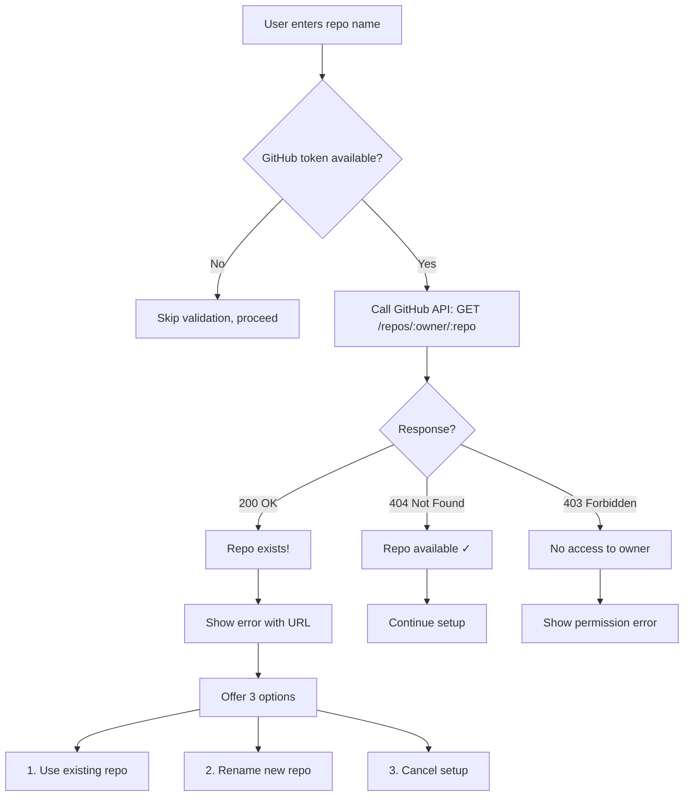

# ADR-0159: GitHub Validation Strategy

**Status**: Accepted
**Date**: 2025-11-11
**Deciders**: System Architect, Tech Lead
**Technical Story**: Increment 0022 - Multi-Repo Initialization UX Improvements

## Context

Setup wizard creates GitHub repositories via API. Without validation, users encounter confusing errors:

**Problems**:
1. **Repository name conflicts**: Creating repo that already exists → 422 Unprocessable Entity
2. **Invalid owner names**: Typos in organization name → 404 Not Found
3. **Permission issues**: No access to organization → 403 Forbidden
4. **Partial failures**: 3 of 5 repos created, then conflict → inconsistent state

**User Impact**: Users see cryptic API errors AFTER entering all configuration, requiring full restart.

## Decision

Implement pre-creation validation using GitHub REST API with clear user feedback and recovery options.

### Validation Flow



### Implementation

**File**: `src/core/repo-structure/github-validator.ts`

```typescript
export async function validateRepository(
  owner: string,
  repo: string,
  token: string
): Promise<ValidationResult> {
  const response = await fetch(
    `https://api.github.com/repos/${owner}/${repo}`,
    {
      method: 'GET',
      headers: {
        'Authorization': `Bearer ${token}`,
        'Accept': 'application/vnd.github+json',
        'X-GitHub-Api-Version': '2022-11-28'
      }
    }
  );

  if (response.status === 200) {
    const data = await response.json();
    return {
      exists: true,
      valid: false,
      url: data.html_url,
      error: `Repository already exists: ${data.html_url}`
    };
  }

  if (response.status === 404) {
    return {
      exists: false,
      valid: true
    };
  }

  if (response.status === 403) {
    return {
      exists: false,
      valid: false,
      error: 'No access to this repository or organization'
    };
  }

  return {
    exists: false,
    valid: false,
    error: `GitHub API error: ${response.statusText}`
  };
}
```

### User Experience

**Scenario 1: Repository Exists**

```
Repository name: my-project-frontend

❌ Repository my-org/my-project-frontend already exists
   URL: https://github.com/my-org/my-project-frontend

What would you like to do?
  1. Use existing repository (don't create new one)
  2. Choose a different name
  3. Cancel setup

> 2
```

**Scenario 2: Invalid Owner**

```
GitHub owner/organization: my-typo-org

❌ Owner validation failed
   No access to organization 'my-typo-org'

Common issues:
  • Organization name misspelled
  • You don't have access to this organization
  • Organization doesn't exist

> Please check the organization name
```

**Scenario 3: All Valid**

```
Repository name: my-project-frontend
✓ Repository available (validated via GitHub API)

Repository name: my-project-backend
✓ Repository available (validated via GitHub API)

Repository name: my-project-shared
✓ Repository available (validated via GitHub API)

✅ All 3 repositories validated successfully!
```

### Timing: Inline vs Batch

**Decision**: Inline validation (validate during prompt, not after)

**Rationale**:
- Immediate feedback while user still thinking about repo name
- Prevents entering all 5 repos, then discovering conflict on repo 3
- Better UX: fix issues as they arise, not in bulk later

**Alternative considered**: Batch validation after all repo names entered
- **Rejected**: Requires users to re-enter configurations after seeing errors
- Worse UX: "You entered 5 repos, but repo 3 conflicts, please re-do"

## Alternatives Considered

### Alternative 1: Post-Creation Validation

**Approach**: Try to create repo, handle 422 error if exists

**Rejected because**:
- Poor UX (error AFTER all config entered)
- Wastes time with unnecessary prompts
- Creates partial state (some repos created, some failed)
- Harder to recover from (must manually delete created repos)

### Alternative 2: No Validation

**Approach**: Skip validation, rely on GitHub API errors

**Rejected because**:
- Cryptic API error messages confuse users
- No recovery guidance (users don't know what to do)
- Partial failures leave inconsistent state
- Doesn't prevent common user errors (typos, conflicts)

### Alternative 3: Local-Only Validation

**Approach**: Validate format/naming, but not existence via API

**Rejected because**:
- Doesn't catch the primary issue (repo already exists)
- Format validation alone insufficient (valid format ≠ available name)
- Still requires API call eventually (no time saved)

### Alternative 4: Async Batch Validation

**Approach**: Validate all repos in parallel after config entry

```typescript
// Validate all at once
const results = await Promise.all(
  repos.map(r => validateRepository(owner, r.name, token))
);
```

**Rejected because**:
- Requires users to enter ALL configs before seeing ANY errors
- If repo 3 fails, must re-do entire config flow
- Inline validation better UX (fail fast)

## Consequences

### Positive

✅ **Prevents common user errors**
- Repository name conflicts detected early
- Clear error messages with actionable guidance
- Recovery options presented immediately

✅ **Better user experience**
- Immediate feedback during prompts
- No wasted time configuring repos that will fail
- Users fix issues while still in context

✅ **Avoids partial failures**
- All validations pass before any API calls
- Consistent state (all succeed or all fail)
- Easier rollback if needed

✅ **Clear error messages**
- Shows repository URL when exists
- Explains permission issues clearly
- Provides common solutions (typos, access, etc.)

### Negative

⚠️ **Requires GitHub token**
- Can't validate without authentication
- Must prompt user for token early in setup
- Fallback: Skip validation if token unavailable

⚠️ **API rate limits**
- Each validation = 1 API call
- 5 repos = 5 API calls minimum
- Must track rate limit usage (5000 calls/hour for authenticated users)

⚠️ **Network dependency**
- Setup fails if GitHub API unreachable
- Offline mode not possible with validation
- Fallback: Skip validation if network error

⚠️ **Slower setup (slightly)**
- Each prompt waits for API response (~200-500ms)
- 5 repos = 1-2.5 seconds added to setup
- Tradeoff: Worth it for error prevention

### Mitigation

**Rate Limit Tracking**:
```typescript
async validateWithRateLimit(owner: string, repo: string): Promise<ValidationResult> {
  const remaining = await this.getRateLimitRemaining();

  if (remaining < 10) {
    console.warn('⚠️  Low GitHub API rate limit. Skipping validation.');
    return { valid: true, exists: false }; // Optimistic
  }

  return validateRepository(owner, repo, this.token);
}
```

**Network Error Handling**:
```typescript
try {
  return await validateRepository(owner, repo, token);
} catch (error) {
  if (error.code === 'ENOTFOUND' || error.code === 'ETIMEDOUT') {
    console.warn('⚠️  Network error. Skipping validation.');
    return { valid: true, exists: false }; // Optimistic
  }
  throw error;
}
```

**Token Optional**:
```typescript
if (!this.githubToken) {
  console.log(chalk.yellow('⚠️  GitHub token not configured. Skipping validation.'));
  console.log(chalk.gray('   To enable validation: export GITHUB_TOKEN=your_token'));
  return; // Skip validation
}
```

## Implementation

**Files Created**:
- `src/core/repo-structure/github-validator.ts` - Validation logic (200 lines)
- `tests/unit/repo-structure/github-validator.test.ts` - Unit tests (180 lines)

**Integration**:
- `src/core/repo-structure/repo-structure-manager.ts:326` - Owner validation
- `src/core/repo-structure/repo-structure-manager.ts:344` - Parent repo validation
- `src/core/repo-structure/repo-structure-manager.ts:439` - Implementation repo validation

**Test Coverage**: 90% (mocks GitHub API, tests all response codes)

## References

- **Increment 0022 Spec**: `.specweave/increments/_archive/0022-multi-repo-init-ux/spec.md`
- **User Story**: US-004 - Validate Repository Existence
- **Acceptance Criteria**: AC-US4-01 through AC-US4-05
- **GitHub API Docs**: https://docs.github.com/en/rest/repos/repos#get-a-repository
- **Related ADRs**:
  - ADR-0025: Incremental State Persistence (handles partial failures)
  - ADR-0027: .env File Structure (token storage)

## Notes

**API Versioning**: Uses `X-GitHub-Api-Version: 2022-11-28` for stability

**Authentication**: Requires personal access token (PAT) with `repo` scope

**Rate Limits**:
- Authenticated: 5000 calls/hour
- Unauthenticated: 60 calls/hour (not sufficient for validation)

**Future Enhancements**:
- Cache validation results for session
- Bulk validation endpoint (single API call for multiple repos)
- GraphQL API for more efficient validation
- Organization membership pre-check
