# ADR-0170-02: Test Isolation Enforcement (Eliminate process.cwd())

**Date**: 2025-11-18
**Status**: Accepted
**Epic**: FS-25-11-18
**Increment**: 0042-test-infrastructure-cleanup
**Priority**: CRITICAL (Safety)

---

## Context

### Historical Incident: Catastrophic Deletion (2025-11-17)

**What Happened**: Test using `process.cwd()` accidentally deleted 1,200+ files from project `.specweave/` directory during cleanup.

**Root Cause**:
```typescript
// ❌ DANGEROUS PATTERN (actual code from incident)
const projectRoot = process.cwd(); // Returns project root!
const testPath = path.join(projectRoot, '.specweave', 'increments');

// Cleanup runs at test end:
await fs.rm(testPath, { recursive: true }); // DELETES PROJECT .specweave/!
```

**Impact**:
- 1,200+ files deleted from project `.specweave/`
- All increments, docs, and history lost
- Recovery required `git restore` (fortunately project was clean)
- 4 hours wasted on recovery + investigation

**Recovery**: `.specweave/increments/_archive/0037/reports/DELETION-ROOT-CAUSE-2025-11-17.md`

### Current Audit Results

**Test Data Consistency Analysis** (2025-11-18):
- **Total process.cwd() usages**: 213 instances
- **Safe patterns** (with isolation): 90 (42%)
- **Unsafe patterns** (direct usage): 123 (58%)
- **Tests with directory deletion**: ~30 (HIGH RISK)

**Risk Assessment**:
- **CRITICAL**: 30 tests delete directories (catastrophic if using project root)
- **HIGH**: 93 tests create directories in project root (pollution)
- **MEDIUM**: 90 tests use isolation (safe, but no prevention)

### Why process.cwd() is Dangerous in Tests

1. **Returns project root**: Tests execute from project root, so `process.cwd()` = `/path/to/specweave`
2. **Cleanup deletes project files**: `fs.rm(path.join(process.cwd(), '.specweave'), { recursive: true })` deletes the real `.specweave/`
3. **Test pollution**: Tests create files in project root (not cleaned up)
4. **Shared state**: Tests interfere with each other (not isolated)

---

## Decision

**ELIMINATE ALL 213 process.cwd() usages** and enforce safe isolation patterns.

**Approved Patterns**:

### Pattern 1: createIsolatedTestDir() (RECOMMENDED)

```typescript
import { createIsolatedTestDir } from '../test-utils/isolated-test-dir';

test('my test', async () => {
  const { testDir, cleanup } = await createIsolatedTestDir('my-test');

  try {
    const incrementPath = path.join(testDir, '.specweave', 'increments', '0001');
    await fs.mkdir(incrementPath, { recursive: true });

    // Test code here - NEVER touches project .specweave/

  } finally {
    await cleanup(); // ALWAYS cleanup
  }
});
```

**Why Recommended**:
- ✅ Uses `os.tmpdir()` (guaranteed safe)
- ✅ Unique directory per test (no collisions)
- ✅ Automatic cleanup (finally block)
- ✅ Type-safe (TypeScript interface)
- ✅ Existing utility (no new dependencies)

### Pattern 2: os.tmpdir() (ACCEPTABLE)

```typescript
import * as os from 'os';
import * as path from 'path';

test('my test', async () => {
  const testRoot = path.join(os.tmpdir(), 'test-name-' + Date.now());

  try {
    const incrementPath = path.join(testRoot, '.specweave', 'increments', '0001');
    await fs.mkdir(incrementPath, { recursive: true });

    // Test code here

  } finally {
    await fs.rm(testRoot, { recursive: true });
  }
});
```

**Why Acceptable**:
- ✅ Uses `os.tmpdir()` (safe)
- ✅ Unique directory (timestamp)
- ⚠️ Manual cleanup (must remember finally block)
- ⚠️ Verbose (more boilerplate)

### Pattern 3: __dirname with Relative Paths (DISCOURAGED)

```typescript
// ⚠️ DISCOURAGED (but not blocked)
const testPath = path.join(__dirname, '..', '..', '.test-fixtures');
```

**Why Discouraged**:
- ⚠️ Creates files in project root (pollution)
- ⚠️ Manual cleanup required
- ⚠️ Can interfere with other tests

**Use Case**: Only for tests that genuinely need project root (e.g., testing CLI from project root)

---

## Alternatives Considered

### Alternative 1: Allow process.cwd() with Linter Warning

**Approach**: Warn developers but don't block

**Pros**:
- ✅ Flexible (allows legitimate use cases)
- ✅ Less disruptive

**Cons**:
- ❌ Warnings ignored (developers become blind)
- ❌ No enforcement (catastrophic risk remains)
- ❌ Requires manual code review

**Why Not Chosen**: Historical incident proves warnings are insufficient. Catastrophic deletion risk is unacceptable.

### Alternative 2: Test Root Environment Variable

**Approach**: Set `TEST_ROOT=/tmp/specweave-tests` environment variable

**Pros**:
- ✅ Central configuration
- ✅ All tests use same pattern

**Cons**:
- ❌ Global state (tests can still interfere)
- ❌ Requires remembering to set ENV
- ❌ Doesn't prevent process.cwd() usage

**Why Not Chosen**: Doesn't solve root cause. Tests can still use `process.cwd()` and ignore `TEST_ROOT`.

### Alternative 3: Sandbox Tests in Docker

**Approach**: Run all tests in isolated Docker containers

**Pros**:
- ✅ Complete isolation
- ✅ Can delete anything (container is ephemeral)

**Cons**:
- ❌ Slow (container startup overhead)
- ❌ Complex (Docker setup for all contributors)
- ❌ Overkill (simpler solution exists)

**Why Not Chosen**: `createIsolatedTestDir()` provides sufficient isolation with zero Docker overhead.

---

## Consequences

### Positive

- ✅ **ZERO risk of project .specweave/ deletion**
- ✅ **100% test isolation** (no shared state)
- ✅ **No test pollution** (project root stays clean)
- ✅ **Faster tests** (parallel execution safe)
- ✅ **Easier debugging** (tests don't interfere)
- ✅ **Multi-layer prevention** (eslint + pre-commit + CI)

### Negative

- ❌ **123 test files to migrate** (8-10 hours effort)
- ❌ **Requires updating all contributors** (new pattern)
- ❌ **Eslint rule may have false positives** (legitimate process.cwd() use cases)

### Risks & Mitigations

**Risk 1: Breaking tests during migration**
- **Probability**: MEDIUM
- **Impact**: MEDIUM (temporary breakage)
- **Mitigation 1**: Migrate top 10 most dangerous tests first (highest risk)
- **Mitigation 2**: Test each migration individually
- **Mitigation 3**: Run full test suite before committing
- **Contingency**: Git revert if tests fail

**Risk 2: Eslint rule blocks legitimate process.cwd() usage**
- **Probability**: LOW
- **Impact**: LOW (developer must bypass)
- **Mitigation 1**: Test eslint rule with known safe/unsafe patterns
- **Mitigation 2**: Allow eslint-disable comments with justification
- **Mitigation 3**: Document exceptions in CONTRIBUTING.md
- **Contingency**: `// eslint-disable-next-line no-restricted-syntax -- legitimate use case`

**Risk 3: Contributors forget to use isolation**
- **Probability**: MEDIUM (without enforcement)
- **Impact**: HIGH (regression to unsafe patterns)
- **Mitigation 1**: Eslint rule blocks process.cwd() (development time)
- **Mitigation 2**: Pre-commit hook blocks unsafe commits
- **Mitigation 3**: CI validates test patterns (merge time)
- **Mitigation 4**: Documentation in CLAUDE.md + CONTRIBUTING.md
- **Contingency**: Multi-layer enforcement (4 layers of prevention)

---

## Implementation Strategy

### Phase 1: Audit (1-2 hours)

```bash
# Generate audit report
grep -rn "process.cwd()" tests/integration tests/e2e tests/unit \
  --include="*.test.ts" --include="*.spec.ts" > process-cwd-audit.txt

# Categorize usages:
# - SAFE: Wrapped in createIsolatedTestDir ✅
# - UNSAFE: Direct usage ❌

# Expected: 213 total (90 safe, 123 unsafe)
```

### Phase 2: Fix Top 10 Most Dangerous (4-6 hours)

**Priority**: Tests that delete directories

```bash
# Find tests that delete directories (HIGHEST RISK)
grep -B5 -A5 "fs.rm.*recursive" tests/ -r --include="*.test.ts" > dangerous-tests.txt

# For each:
# 1. Import createIsolatedTestDir
# 2. Replace process.cwd() with testDir
# 3. Add cleanup in finally block
# 4. Test individually
```

**Example Migration**:

```typescript
// BEFORE (DANGEROUS):
test('increment lifecycle', async () => {
  const projectRoot = process.cwd();
  const incrementPath = path.join(projectRoot, '.specweave', 'increments', '0001');
  await fs.mkdir(incrementPath, { recursive: true });

  // Test code

  await fs.rm(incrementPath, { recursive: true }); // DELETES PROJECT .specweave/!
});

// AFTER (SAFE):
import { createIsolatedTestDir } from '../test-utils/isolated-test-dir';

test('increment lifecycle', async () => {
  const { testDir, cleanup } = await createIsolatedTestDir('increment-lifecycle');

  try {
    const incrementPath = path.join(testDir, '.specweave', 'increments', '0001');
    await fs.mkdir(incrementPath, { recursive: true });

    // Test code (SAME - just uses testDir instead of process.cwd())

  } finally {
    await cleanup(); // Cleans up /tmp/... NOT project .specweave/!
  }
});
```

### Phase 3: Batch Migrate Remaining (4-6 hours)

**Process**:
1. Group tests by similar patterns (file creation, directory creation, etc.)
2. Migrate in batches of 10-20 tests
3. Run tests after each batch
4. Fix any failures before next batch

**Automation** (optional):
```bash
# Create migration script for repetitive patterns
# Example: Replace all `path.join(process.cwd(), ...)` with `path.join(testDir, ...)`
```

### Phase 4: Enforcement (1 hour)

**Eslint Rule**:
```javascript
// .eslintrc.js
rules: {
  'no-restricted-syntax': [
    'error',
    {
      selector: 'CallExpression[callee.object.name="process"][callee.property.name="cwd"]',
      message: 'Use createIsolatedTestDir() instead of process.cwd() in tests. See CLAUDE.md → Test Isolation (CRITICAL)',
    },
  ],
}
```

**Pre-commit Hook**:
```bash
# .git/hooks/pre-commit
if git diff --cached --name-only | grep -E "tests/.*\.test\.ts$" | xargs grep -l "process.cwd()" 2>/dev/null; then
  echo "❌ ERROR: Tests cannot use process.cwd() - use createIsolatedTestDir() instead"
  echo "   See: CLAUDE.md → Test Isolation (CRITICAL)"
  exit 1
fi
```

**CI Check**:
```yaml
# .github/workflows/test.yml
- name: Check for unsafe test patterns
  run: |
    if grep -r "process.cwd()" tests/ --include="*.test.ts"; then
      echo "ERROR: Tests using process.cwd() found"
      exit 1
    fi
```

---

## Validation Criteria

### Success Metrics

- ✅ process.cwd() usages: 213 → 0 (100% elimination)
- ✅ Safe test patterns: 90 → 213 (100% migration)
- ✅ Unsafe test patterns: 123 → 0 (100% elimination)
- ✅ All tests passing: 100% success rate
- ✅ Eslint rule active: Blocks new violations
- ✅ Pre-commit hook active: Blocks unsafe commits
- ✅ CI check active: Blocks unsafe PRs

### Acceptance Tests

```bash
# 1. Verify zero process.cwd() in tests
grep -r "process.cwd()" tests/ --include="*.test.ts" | wc -l
# Expected: 0

# 2. Verify all tests use isolation
grep -r "createIsolatedTestDir" tests/ --include="*.test.ts" | wc -l
# Expected: 213+ (all migrated tests)

# 3. Verify eslint rule blocks violations
echo "const x = process.cwd();" > tests/test-violation.test.ts
npx eslint tests/test-violation.test.ts
# Expected: ERROR (blocked by eslint)
rm tests/test-violation.test.ts

# 4. Verify all tests pass
npm run test:all
# Expected: 100% success rate
```

---

## Multi-Layer Prevention Architecture

```mermaid
graph TD
    A[Developer writes test] --> B{Uses process.cwd?}
    B -->|Yes| C[Eslint catches at dev time]
    C --> D[Developer fixes code]

    B -->|Bypasses eslint| E[Pre-commit hook catches]
    E --> F[Commit blocked]

    E -->|Bypasses hook| G[CI check catches]
    G --> H[PR blocked]

    B -->|No| I[Test uses createIsolatedTestDir]
    I --> J[✅ Safe test]
```



**Layer 1: Development Time (Eslint)**
- Immediate feedback in IDE
- Red squiggly underline
- Error message with solution

**Layer 2: Commit Time (Pre-commit Hook)**
- Blocks git commit
- Forces fix before commit
- Can bypass with `--no-verify` (emergency)

**Layer 3: Merge Time (CI Check)**
- Runs on all PRs
- Blocks merge if violations found
- Final safety net

**Layer 4: Documentation (CLAUDE.md + CONTRIBUTING.md)**
- Educates new contributors
- Provides safe patterns
- Explains why it matters

**Redundancy**: If any layer fails, others catch it.

---

## Documentation Updates

### CLAUDE.md (Already Updated)

```markdown
## Test Isolation (CRITICAL - Prevents .specweave/ Deletion!)

**🚨 MANDATORY FOR ALL TESTS creating .specweave/ structures:**

**✅ CORRECT PATTERN** (ALWAYS use this):
```typescript
import { createIsolatedTestDir } from '../test-utils/isolated-test-dir';

const { testDir, cleanup } = await createIsolatedTestDir('test-name');
try {
  // Test code - NEVER touches project .specweave/
} finally {
  await cleanup();
}
```

**❌ DANGEROUS PATTERN** (NEVER use this):
```typescript
const testPath = path.join(process.cwd(), '.specweave'); // ❌ DANGER!
```
```

### CONTRIBUTING.md (To Update)

```markdown
## Test Best Practices

### Test Isolation (MANDATORY)

**ALL tests creating files MUST use isolated directories**:

```typescript
import { createIsolatedTestDir } from '../test-utils/isolated-test-dir';

test('my test', async () => {
  const { testDir, cleanup } = await createIsolatedTestDir('my-test');

  try {
    // Test code using testDir
  } finally {
    await cleanup();
  }
});
```

**NEVER use `process.cwd()` in tests** - Eslint will block it.

**Why?** Historical incident (2025-11-17): Test deleted 1,200+ files from project `.specweave/`
```

---

## Related Decisions

- **ADR-0042-01**: Test Structure Standardization (delete flat duplicates)
- **ADR-0042-03**: Fixture Architecture (shared test data)
- **ADR-0042-04**: Naming Convention (.test.ts only)

---

## References

- **Historical Incident**: `.specweave/increments/_archive/0037/reports/DELETION-ROOT-CAUSE-2025-11-17.md`
- **Recovery Report**: `.specweave/increments/_archive/0039/reports/ACCIDENTAL-DELETION-RECOVERY-2025-11-17.md`
- **Analysis**: `.specweave/increments/_archive/0041/reports/TEST-DATA-CONSISTENCY-ANALYSIS.md`
- **Test Utilities**: `tests/test-utils/isolated-test-dir.ts`

---

**Decision Made**: 2025-11-18
**Decision Maker**: Architect Agent (Increment 0042)
**Review Status**: Approved (CRITICAL safety decision)
**Implementation Status**: Planned
