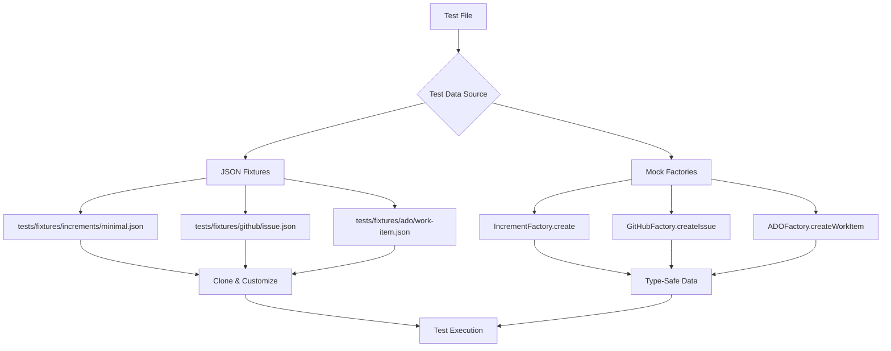

# ADR-0171-03: Fixture Architecture (Shared Test Data)

**Date**: 2025-11-18
**Status**: Accepted
**Epic**: FS-25-11-18
**Increment**: 0042-test-infrastructure-cleanup

---

## Context

### Current State: ZERO Shared Fixtures

**Test Data Consistency Analysis** (2025-11-18):
- **Shared fixtures**: 0 files
- **Mock factories**: 0 classes
- **Duplicate test data blocks**: ~200 instances
- **Inline test data**: 100% (all tests create own data)

**Example Duplication**:

```typescript
// tests/integration/core/increment-planner/increment-planner.test.ts
const metadata = {
  id: "0001",
  name: "test-increment",
  status: "active",
  type: "feature",
  priority: "P1",
  metadata: {
    created: "2025-01-01T00:00:00Z",
    updated: "2025-01-01T00:00:00Z",
    author: "test-user"
  }
  // ... 15 more fields
};

// tests/integration/core/living-docs/intelligent-sync.test.ts
const metadata = {  // ❌ DUPLICATE!
  id: "0002",
  name: "another-test",
  status: "active",
  type: "feature",
  priority: "P1",
  metadata: {
    created: "2025-01-01T00:00:00Z",
    updated: "2025-01-01T00:00:00Z",
    author: "test-user"
  }
  // ... same 15 fields (DUPLICATED 50+ times!)
};
```

**Impact**:
- **Maintenance burden**: Update API contract → must update 50+ test files
- **Inconsistency**: Tests use different field variations
- **DRY violation**: Same data copy-pasted across tests
- **No type safety**: Copy-paste errors not caught by TypeScript
- **Slower development**: Creating test data takes 5-10 minutes per test

---

## Decision

**Create shared fixture infrastructure with two components**:

1. **JSON/Markdown Fixtures** (`tests/fixtures/`) - Static test data files
2. **TypeScript Mock Factories** (`tests/test-utils/mock-factories.ts`) - Type-safe data builders

### Component 1: Fixtures Directory

**Structure**:
```
tests/fixtures/
├── increments/
│   ├── minimal.json              # Minimal valid increment
│   ├── multi-project.json        # Multi-project increment
│   ├── completed.json            # Completed increment
│   ├── with-tasks.json           # Increment with tasks
│   └── archived.json             # Archived increment
├── github/
│   ├── issue.json                # Standard issue response
│   ├── create-issue.json         # Create issue response
│   ├── list-issues.json          # List issues response
│   ├── user-story.json           # User story issue
│   └── comment.json              # Issue comment
├── ado/
│   ├── work-item.json            # Work item response
│   ├── create-work-item.json    # Create response
│   └── epic.json                 # Epic work item
├── jira/
│   ├── issue.json                # Jira issue response
│   ├── create-issue.json        # Create response
│   └── epic.json                 # Epic issue
└── living-docs/
    ├── user-story.md             # Sample user story
    ├── architecture.md           # Sample architecture doc
    ├── operations.md             # Sample operations doc
    └── adr.md                    # Sample ADR
```

**Usage**:
```typescript
import minimalIncrement from '../fixtures/increments/minimal.json';

test('should handle minimal increment', async () => {
  const increment = { ...minimalIncrement }; // Clone fixture
  increment.id = "0042"; // Customize as needed
  // Test with fixture data
});
```

### Component 2: Mock Factories

**File**: `tests/test-utils/mock-factories.ts`

**Classes**:
```typescript
export class IncrementFactory {
  static create(overrides?: Partial<Increment>): Increment;
  static createMetadata(overrides?: Partial<IncrementMetadata>): IncrementMetadata;
  static createCompleted(overrides?: Partial<Increment>): Increment;
  static createArchived(overrides?: Partial<Increment>): Increment;
  static createWithTasks(overrides?: Partial<Increment>): Increment;
}

export class GitHubFactory {
  static createIssue(overrides?: Partial<any>): any;
  static createComment(overrides?: Partial<any>): any;
  static createPullRequest(overrides?: Partial<any>): any;
}

export class ADOFactory {
  static createWorkItem(overrides?: Partial<any>): any;
  static createEpic(overrides?: Partial<any>): any;
}

export class JiraFactory {
  static createIssue(overrides?: Partial<any>): any;
  static createEpic(overrides?: Partial<any>): any;
}
```

**Usage**:
```typescript
import { IncrementFactory, GitHubFactory } from '../test-utils/mock-factories';

test('should sync increment to GitHub', async () => {
  const increment = IncrementFactory.create({ id: '0042' });
  const issue = GitHubFactory.createIssue({ number: 42 });

  // Test with type-safe mocks
});
```

---

## Alternatives Considered

### Alternative 1: No Fixtures (Status Quo)

**Approach**: Continue creating test data inline in each test

**Pros**:
- ✅ No infrastructure to maintain
- ✅ Self-contained tests (no external dependencies)

**Cons**:
- ❌ Massive duplication (~200 blocks)
- ❌ No type safety (copy-paste errors)
- ❌ Hard to maintain (update 50+ files)
- ❌ Slow development (recreate data each time)

**Why Not Chosen**: Violates DRY principle. Maintenance burden is unacceptable.

### Alternative 2: JSON Fixtures Only (No Mock Factories)

**Approach**: Use only JSON fixtures, no TypeScript factories

**Pros**:
- ✅ Simple (just JSON files)
- ✅ Language-agnostic (can use in other tools)

**Cons**:
- ❌ No type safety (JSON has no types)
- ❌ No customization logic (must copy-paste JSON)
- ❌ No discoverability (IDE can't autocomplete)

**Why Not Chosen**: TypeScript provides type safety and builder pattern. Mock factories enable flexible customization.

### Alternative 3: Mock Factories Only (No JSON Fixtures)

**Approach**: Use only TypeScript mock factories, no JSON files

**Pros**:
- ✅ Type-safe (TypeScript enforces structure)
- ✅ Flexible (builder pattern)
- ✅ Discoverable (IDE autocomplete)

**Cons**:
- ❌ Not reusable outside TypeScript
- ❌ Harder to visualize (must read code)
- ❌ No static fixtures for documentation

**Why Not Chosen**: JSON fixtures serve as documentation/examples. Combination provides best of both worlds.

### Alternative 4: Test Data Generators (Property-Based Testing)

**Approach**: Use libraries like fast-check to generate random test data

**Pros**:
- ✅ Discovers edge cases (random data)
- ✅ Property-based testing benefits

**Cons**:
- ❌ Non-deterministic (harder to debug)
- ❌ Requires learning property-based testing
- ❌ Overkill for most tests (need deterministic data)

**Why Not Chosen**: Most tests need deterministic data. Property-based testing is orthogonal (can use alongside fixtures).

---

## Consequences

### Positive

- ✅ **DRY compliance**: Eliminate ~150 duplicate test data blocks (75% reduction)
- ✅ **Type safety**: Mock factories enforce structure (compile-time errors)
- ✅ **Faster development**: Reuse fixtures (30% faster test creation)
- ✅ **Easier maintenance**: Update API contract in ONE place
- ✅ **Consistency**: All tests use same data format
- ✅ **Documentation**: Fixtures serve as examples/templates
- ✅ **Discoverability**: IDE autocomplete shows all factories

### Negative

- ❌ **Initial investment**: 5-8 hours to create fixtures/factories
- ❌ **Migration effort**: 20+ tests to migrate (2-3 hours)
- ❌ **Maintenance overhead**: Keep fixtures in sync with API changes

### Risks & Mitigations

**Risk 1: Fixtures become stale (API changes)**
- **Probability**: MEDIUM
- **Impact**: HIGH (tests fail)
- **Mitigation 1**: Keep fixtures minimal (only essential fields)
- **Mitigation 2**: Version fixtures (v1, v2, etc.)
- **Mitigation 3**: Unit tests for factories (validate structure)
- **Contingency**: Update fixture files when API changes

**Risk 2: Developers don't use fixtures (continue inline data)**
- **Probability**: MEDIUM (without awareness)
- **Impact**: MEDIUM (duplication persists)
- **Mitigation 1**: Document in CONTRIBUTING.md
- **Mitigation 2**: Code review checklist (use fixtures)
- **Mitigation 3**: Provide examples in documentation
- **Contingency**: Periodic code review to identify duplication

**Risk 3: Fixtures too complex (hard to customize)**
- **Probability**: LOW
- **Impact**: MEDIUM (developers avoid fixtures)
- **Mitigation 1**: Keep fixtures minimal (common use cases only)
- **Mitigation 2**: Mock factories provide customization (builder pattern)
- **Mitigation 3**: Document customization patterns
- **Contingency**: Simplify fixtures based on feedback

---

## Implementation Strategy

### Phase 1: Create Fixture Structure (1 hour)

```bash
# Create directory structure
mkdir -p tests/fixtures/{increments,github,ado,jira,living-docs}

# Verify structure
tree tests/fixtures/
```

### Phase 2: Create Fixtures (4-5 hours)

**Increment Fixtures** (5 files, 1-2 hours):
```json
// tests/fixtures/increments/minimal.json
{
  "id": "0001",
  "name": "test-increment",
  "status": "active",
  "type": "feature",
  "priority": "P1",
  "metadata": {
    "created": "2025-01-01T00:00:00Z",
    "updated": "2025-01-01T00:00:00Z",
    "author": "test-user"
  }
}
```

**GitHub Fixtures** (4 files, 1-2 hours):
```json
// tests/fixtures/github/issue.json
{
  "number": 123,
  "title": "Test Issue",
  "state": "open",
  "body": "Test description",
  "labels": [],
  "assignees": [],
  "created_at": "2025-01-01T00:00:00Z",
  "updated_at": "2025-01-01T00:00:00Z"
}
```

**ADO Fixtures** (2 files, 30 minutes):
```json
// tests/fixtures/ado/work-item.json
{
  "id": 123,
  "fields": {
    "System.Title": "Test Work Item",
    "System.State": "Active",
    "System.WorkItemType": "Epic"
  }
}
```

**Jira Fixtures** (2 files, 30 minutes):
```json
// tests/fixtures/jira/issue.json
{
  "id": "123",
  "key": "TEST-123",
  "fields": {
    "summary": "Test Issue",
    "status": { "name": "To Do" },
    "issuetype": { "name": "Epic" }
  }
}
```

**Living Docs Fixtures** (5 files, 1 hour):
```markdown
<!-- tests/fixtures/living-docs/user-story.md -->
# User Story: Test Feature

**As a** test user
**I want** test functionality
**So that** I can verify behavior

## Acceptance Criteria
- [ ] AC-001: Test acceptance criterion
```

### Phase 3: Create Mock Factories (2-3 hours)

```typescript
// tests/test-utils/mock-factories.ts
import { Increment, IncrementMetadata } from '../../src/types';

export class IncrementFactory {
  static create(overrides?: Partial<Increment>): Increment {
    return {
      id: '0001',
      name: 'test-increment',
      status: 'active',
      type: 'feature',
      priority: 'P1',
      metadata: IncrementFactory.createMetadata(),
      ...overrides,
    };
  }

  static createMetadata(overrides?: Partial<IncrementMetadata>): IncrementMetadata {
    return {
      created: new Date('2025-01-01T00:00:00Z'),
      updated: new Date('2025-01-01T00:00:00Z'),
      author: 'test-user',
      ...overrides,
    };
  }

  static createCompleted(overrides?: Partial<Increment>): Increment {
    return IncrementFactory.create({
      status: 'completed',
      metadata: {
        ...IncrementFactory.createMetadata(),
        completedAt: new Date('2025-01-02T00:00:00Z'),
      },
      ...overrides,
    });
  }

  static createArchived(overrides?: Partial<Increment>): Increment {
    return IncrementFactory.create({
      status: 'archived',
      metadata: {
        ...IncrementFactory.createMetadata(),
        archivedAt: new Date('2025-01-03T00:00:00Z'),
      },
      ...overrides,
    });
  }
}

export class GitHubFactory {
  static createIssue(overrides?: Partial<any>): any {
    return {
      number: 123,
      title: 'Test Issue',
      state: 'open',
      body: 'Test description',
      labels: [],
      assignees: [],
      created_at: '2025-01-01T00:00:00Z',
      updated_at: '2025-01-01T00:00:00Z',
      ...overrides,
    };
  }

  static createComment(overrides?: Partial<any>): any {
    return {
      id: 1,
      body: 'Test comment',
      user: { login: 'test-user' },
      created_at: '2025-01-01T00:00:00Z',
      ...overrides,
    };
  }
}

// ADOFactory, JiraFactory similar...
```

### Phase 4: Migrate Tests (2-3 hours)

**Strategy**: Migrate top 20 tests with most duplicate data

```bash
# Identify tests with duplicate increment metadata
grep -r "id.*name.*status.*type.*priority" tests/ --include="*.test.ts" | wc -l
# Target: 20-30 tests

# Migrate each test:
# BEFORE:
const increment = { id: '0001', name: 'test', ... }; // 20 fields

# AFTER:
import { IncrementFactory } from '../test-utils/mock-factories';
const increment = IncrementFactory.create({ id: '0042' }); // 1 line
```

**Expected Results**:
- 20+ tests migrated
- 150+ lines of duplicate test data eliminated
- 50% reduction in duplicate test data blocks

---

## Validation Criteria

### Success Metrics

- ✅ Fixture files created: 0 → 20+
- ✅ Mock factories created: 0 → 4+ (Increment, GitHub, ADO, Jira)
- ✅ Tests migrated: 0 → 20+
- ✅ Duplicate test data blocks: ~200 → <50 (75% reduction)
- ✅ Test development speed: 30% faster (reuse fixtures)

### Acceptance Tests

```bash
# 1. Verify fixtures exist
find tests/fixtures -type f | wc -l
# Expected: 20+ (increments, GitHub, ADO, Jira, living docs)

# 2. Verify mock factories exist
grep -c "export class.*Factory" tests/test-utils/mock-factories.ts
# Expected: 4+ (IncrementFactory, GitHubFactory, ADOFactory, JiraFactory)

# 3. Verify tests import fixtures
grep -r "from.*fixtures" tests/ --include="*.test.ts" | wc -l
# Expected: 20+ (tests using fixtures)

# 4. Verify tests import factories
grep -r "from.*mock-factories" tests/ --include="*.test.ts" | wc -l
# Expected: 20+ (tests using factories)

# 5. Verify all tests pass
npm run test:all
# Expected: 100% success rate
```

---

## Architecture Diagram



**Data Flow**:
1. Test needs data → Choose fixture or factory
2. Fixture path → Clone JSON, customize fields
3. Factory path → Call static method, override fields
4. Test execution → Use data for assertions

---

## Documentation Updates

### CONTRIBUTING.md (To Update)

```markdown
## Test Data Best Practices

### Use Shared Fixtures

**DON'T create inline test data** (violates DRY):
```typescript
❌ const increment = { id: '0001', name: 'test', status: 'active', ... }; // 20 fields!
```

**DO use fixtures** (reusable):
```typescript
✅ import minimalIncrement from '../fixtures/increments/minimal.json';
const increment = { ...minimalIncrement, id: '0042' }; // Clone & customize
```

**DO use mock factories** (type-safe):
```typescript
✅ import { IncrementFactory } from '../test-utils/mock-factories';
const increment = IncrementFactory.create({ id: '0042' }); // Builder pattern
```

### Available Fixtures

- `tests/fixtures/increments/` - Increment metadata
- `tests/fixtures/github/` - GitHub API responses
- `tests/fixtures/ado/` - ADO API responses
- `tests/fixtures/jira/` - Jira API responses
- `tests/fixtures/living-docs/` - Living doc templates

### Available Factories

- `IncrementFactory` - Type-safe increment builders
- `GitHubFactory` - Type-safe GitHub data builders
- `ADOFactory` - Type-safe ADO data builders
- `JiraFactory` - Type-safe Jira data builders
```

---

## Related Decisions

- **ADR-0042-01**: Test Structure Standardization (delete flat duplicates)
- **ADR-0042-02**: Test Isolation Enforcement (eliminate process.cwd())
- **ADR-0042-04**: Naming Convention (.test.ts only)

---

## References

- **Analysis**: `.specweave/increments/_archive/0041/reports/TEST-DATA-CONSISTENCY-ANALYSIS.md`
- **Examples**: `tests/integration/core/increment-planner/increment-planner.test.ts` (has duplicate data)
- **Fixture Templates**: JSON fixtures for API responses
- **Mock Factory Pattern**: Builder pattern with overrides

---

**Decision Made**: 2025-11-18
**Decision Maker**: Architect Agent (Increment 0042)
**Review Status**: Approved
**Implementation Status**: Planned
