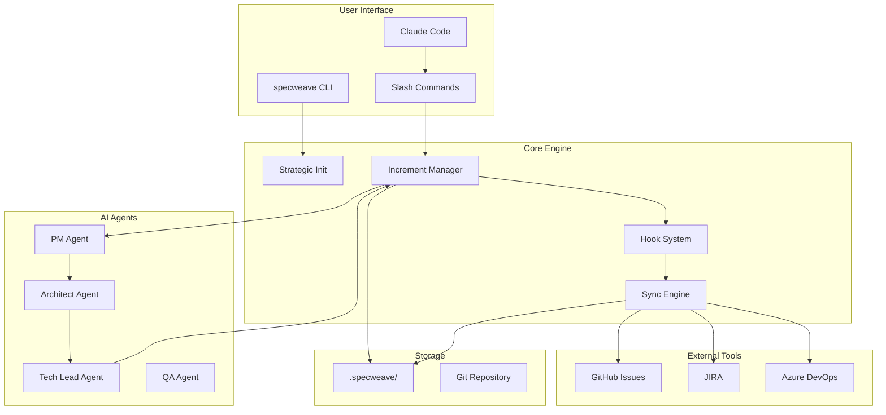
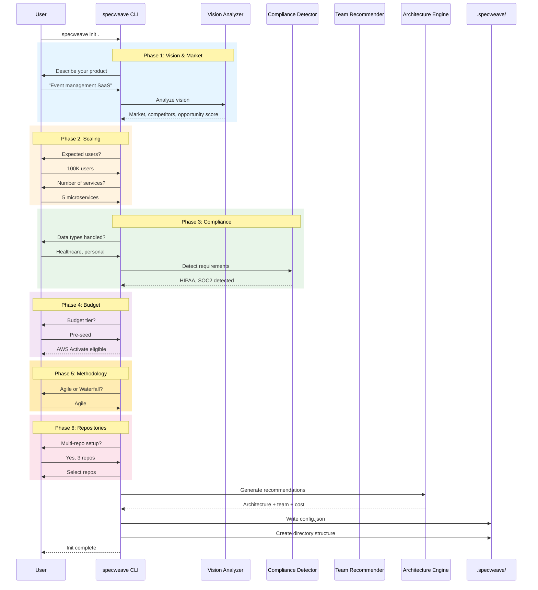
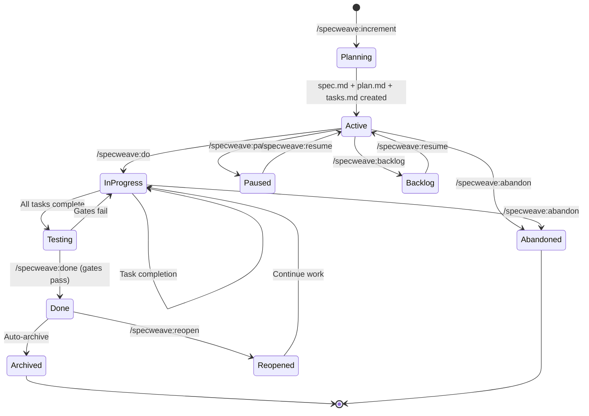
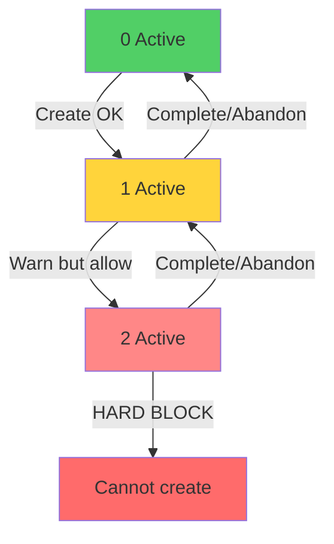
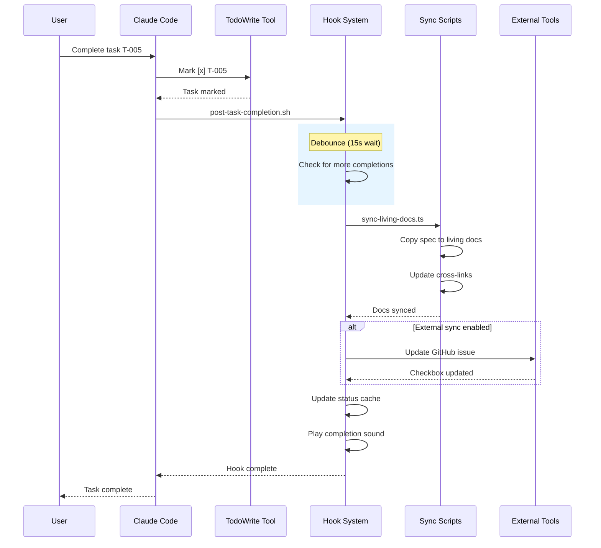
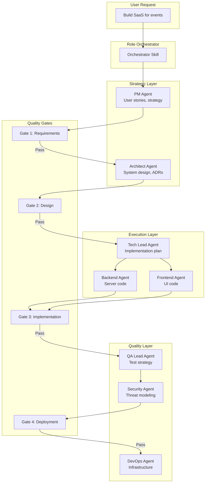
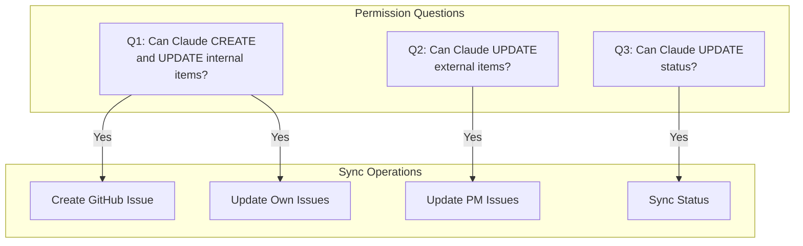
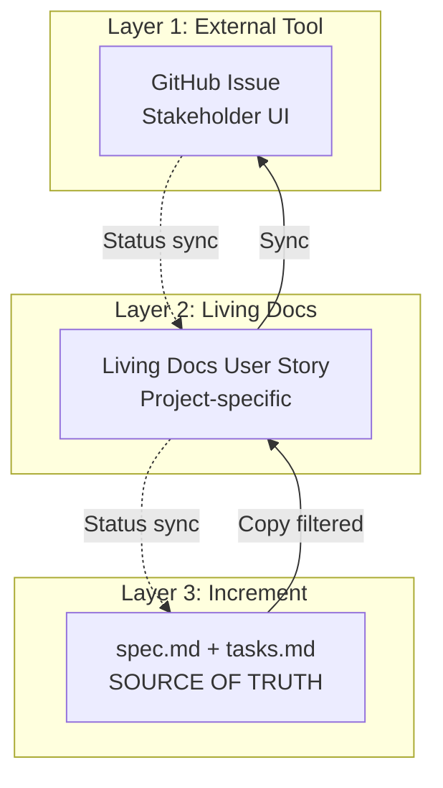
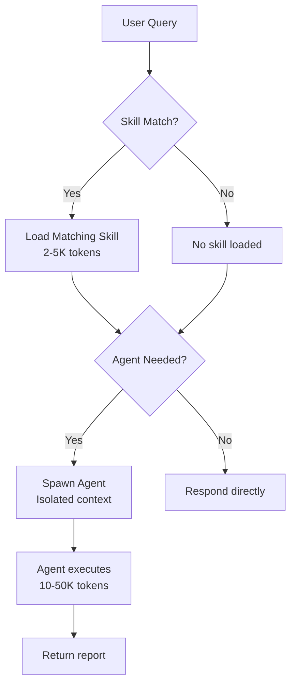

# SpecWeave Architecture Overview

**Version**: 0.26.x
**Last Updated**: 2025-11-24

This document provides a comprehensive architectural overview of SpecWeave, including all major subsystems, flows, and integrations.

---

## Table of Contents

1. [System Overview](#1-system-overview)
2. [Init Flow (Strategic Init)](#2-init-flow-strategic-init)
3. [Increment Lifecycle](#3-increment-lifecycle)
4. [Hook System](#4-hook-system)
5. [Agent Orchestration](#5-agent-orchestration)
6. [External Tool Sync](#6-external-tool-sync)
7. [Plugin Architecture](#7-plugin-architecture)
8. [Directory Structure](#8-directory-structure)

---

## 1. System Overview



---

## 2. Init Flow (Strategic Init)

The `specweave init` command runs a 6-phase research flow to configure projects optimally.

### 2.1 Phase Diagram



### 2.2 Components

| Component | Location | Purpose |
|-----------|----------|---------|
| VisionAnalyzer | `src/init/research/VisionAnalyzer.ts` | Market research, competitor analysis |
| ComplianceDetector | `src/init/compliance/ComplianceDetector.ts` | Auto-detect 30+ standards |
| TeamRecommender | `src/init/team/TeamRecommender.ts` | Team sizing recommendations |
| ArchitectureDecisionEngine | `src/init/architecture/ArchitectureDecisionEngine.ts` | Tech stack decisions |
| RepositorySelector | `src/init/repo/RepositorySelector.ts` | Multi-repo selection |

### 2.3 Output Structure

```
.specweave/
├── config.json           # Generated configuration
├── .env                  # Secrets (gitignored)
├── increments/           # Work packages
├── docs/
│   ├── internal/         # Living documentation
│   └── public/           # Published docs
├── state/                # Runtime state
├── cache/                # Temporary cache (24h TTL)
└── metrics/              # DORA metrics
```

---

## 3. Increment Lifecycle

### 3.1 State Machine



### 3.2 Three-File Structure

```
.specweave/increments/_archive/0001-user-authentication/
├── spec.md       # WHAT: User stories, acceptance criteria
├── plan.md       # HOW: Architecture, implementation approach
├── tasks.md      # DO: Task checklist with embedded tests
└── metadata.json # State: Status, sync info, timestamps
```

### 3.3 WIP Limits



---

## 4. Hook System

### 4.1 Hook Execution Flow



### 4.2 Available Hooks

| Hook | Trigger | Actions |
|------|---------|---------|
| `post-increment-planning` | `/specweave:increment` | Translate files, create GitHub issue |
| `post-task-completion` | Task marked complete | Sync docs, update external, play sound |
| `post-increment-done` | `/specweave:done` | Final sync, close issue, archive |
| `pre-implementation` | `/specweave:do` | Validate environment |

### 4.3 Hook Configuration

```json
{
  "hooks": {
    "post_task_completion": {
      "sync_living_docs": true,
      "sync_tasks_md": true,
      "external_tracker_sync": true
    },
    "post_increment_planning": {
      "auto_create_github_issue": true
    },
    "post_increment_done": {
      "close_github_issue": true,
      "update_living_docs_first": true
    }
  }
}
```

---

## 5. Agent Orchestration

### 5.1 Orchestrator Pattern



### 5.2 Skills vs Agents

```mermaid
graph LR
    subgraph "Skills (Auto-activate)"
        S1[increment-planner]
        S2[brownfield-analyzer]
        S3[tdd-workflow]
    end

    subgraph "Agents (Explicit Task)"
        A1[PM Agent]
        A2[Architect Agent]
        A3[Tech Lead Agent]
    end

    U[User Query] -->|Keywords match| S1
    U -->|Keywords match| S2

    CMD[/specweave:increment] -->|Spawns| A1
    A1 -->|Complete| A2
    A2 -->|Complete| A3
```

---

## 6. External Tool Sync

### 6.1 Three-Permission Architecture (v0.24.0+)



### 6.2 Three-Layer Sync



### 6.3 Supported Platforms

| Platform | Status | Features |
|----------|--------|----------|
| GitHub Issues | Production | Full sync, multi-repo, profiles |
| JIRA | Production | Epic/Story hierarchy, sprints |
| Azure DevOps | Production | Work items, area paths |
| Linear | Q1 2026 | Planned |

---

## 7. Plugin Architecture

### 7.1 Plugin Structure

```
plugins/
├── specweave/                 # Core plugin (always loaded)
│   ├── .claude-plugin/
│   │   └── plugin.json
│   ├── skills/                # Auto-activating
│   ├── agents/                # Explicit Task()
│   ├── commands/              # Slash commands
│   └── hooks/                 # Lifecycle hooks
│
├── specweave-github/          # GitHub integration
├── specweave-jira/            # JIRA integration
├── specweave-ado/             # Azure DevOps
├── specweave-ml/              # Machine learning
├── specweave-infrastructure/  # DevOps/SRE
├── specweave-kafka/           # Kafka streaming
├── specweave-release/         # Release management
└── ...                        # 19+ plugins total
```

### 7.2 Context Loading



---

## 8. Directory Structure

### 8.1 Project Root

```
your-project/
├── .specweave/                # SpecWeave data (gitignored selectively)
├── .claude-plugin/            # Plugin marketplace link
├── CLAUDE.md                  # Claude Code instructions
├── src/                       # Your source code
└── ...
```

### 8.2 .specweave Directory

```
.specweave/
├── config.json                # Configuration (committed)
├── .env                       # Secrets (gitignored)
│
├── increments/                # Work packages
│   ├── 0001-feature-name/
│   │   ├── spec.md
│   │   ├── plan.md
│   │   ├── tasks.md
│   │   └── metadata.json
│   ├── _archive/              # Completed increments
│   └── README.md
│
├── docs/
│   ├── internal/              # Living documentation
│   │   ├── architecture/
│   │   │   └── adr/           # Decision records
│   │   ├── specs/
│   │   │   ├── backend/
│   │   │   ├── frontend/
│   │   │   └── mobile/
│   │   ├── operations/
│   │   ├── delivery/
│   │   └── governance/
│   └── public/                # Published docs
│       └── glossary/
│
├── state/                     # Runtime state
│   ├── status-cache.json
│   └── .hook-*
│
├── cache/                     # Temporary (24h TTL)
└── metrics/                   # DORA metrics
    ├── dora-latest.json
    └── dora-report.md
```

---

## Summary

SpecWeave's architecture is built around:

1. **Strategic Init** - 6-phase research-driven project setup
2. **Increment Lifecycle** - Disciplined spec → plan → tasks → done workflow
3. **Hook System** - Automatic sync at lifecycle events
4. **Agent Orchestration** - Multi-agent coordination with quality gates
5. **Three-Permission Sync** - Granular control over external tool integration
6. **Plugin Architecture** - Modular, context-efficient loading

All components work together to transform AI-assisted coding into spec-driven, documented, enterprise-grade development.

---

## Navigation

- [Glossary](/docs/glossary/)
- [ADRs](./adr/)
- [Comprehensive Diagrams](./diagrams/COMPREHENSIVE-DIAGRAMS)
