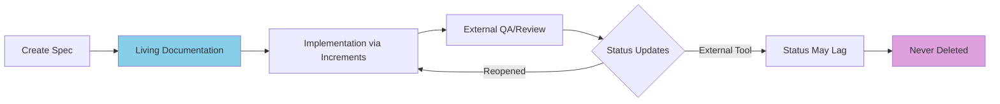

# Increment vs Spec Lifecycle: Critical Architectural Distinction

**Version**: 1.0.0
**Date**: 2025-11-11
**Status**: ARCHITECTURAL PRINCIPLE

## Executive Summary

SpecWeave maintains two distinct lifecycles that serve different purposes:
1. **Increment Lifecycle** - Temporary implementation tracking with STRICT completion requirements
2. **Spec Lifecycle** - Permanent feature documentation with FLEXIBLE status that can lag behind implementation

Understanding this distinction is critical for proper system usage.

## The Two Lifecycles

### Increment Lifecycle (Temporary, Strict)

```mermaid
graph LR
    A[Create Increment] --> B[Implementation]
    B --> C{All Tasks Done?}
    C -->|No| B
    C -->|Yes| D{All Tests Pass?}
    D -->|No| B
    D -->|Yes| E[/specweave:done]
    E --> F[Increment CLOSED]
    F --> G[Can Delete]

    style F fill:#90EE90
    style G fill:#FFE4B5
```

**Characteristics**:
- **Purpose**: Track specific implementation work
- **Lifespan**: Days to weeks (temporary)
- **Completion**: MUST be 100% complete to close
- **Validation**: Strict (`/specweave:done` enforces all tasks complete, tests pass)
- **Location**: `.specweave/increments/####-name/`
- **Deletion**: Can be deleted after completion
- **Scope**: Subset of user stories (3-5 typically)

### Spec Lifecycle (Permanent, Flexible)



**Characteristics**:
- **Purpose**: Permanent feature documentation and history
- **Lifespan**: Forever (permanent knowledge base)
- **Completion**: Can have various states independent of increments
- **Validation**: Flexible (syncs with external tools)
- **Location**: `.specweave/docs/internal/specs/`
- **Deletion**: NEVER deleted
- **Scope**: Complete feature (10-50 user stories)

## Critical Differences

| Aspect | Increment | Spec |
|--------|-----------|------|
| **Purpose** | Implementation tracking | Feature documentation |
| **Lifecycle** | Temporary | Permanent |
| **Completion** | Strict (100% required) | Flexible (can lag) |
| **Status Authority** | Internal (`tasks.md`) | External tool (ADO/JIRA) |
| **Deletion** | Can delete after done | Never delete |
| **Scope** | Subset of work | Complete feature |
| **Validation** | `/specweave:done` strict | External tool sync |
| **Location** | `increments/####/` | `docs/internal/specs/` |

## Real-World Scenarios

### Scenario 1: Normal Development Flow

```yaml
Day 1: Start Development
  Increment 0010: status: in-progress
  Spec SPEC-001: status: in-progress
  ADO: Active

Day 3: Code Complete
  Increment 0010: status: closing (all tasks done)
  /specweave:done → status: CLOSED ✅
  Spec SPEC-001: status: implemented (pushed to ADO)
  ADO: Resolved

Day 5: QA Testing
  Increment 0010: STILL CLOSED ✅ (correct!)
  Spec SPEC-001: status: in-qa (from ADO)
  ADO: In QA

Day 7: QA Approved
  Increment 0010: STILL CLOSED ✅
  Spec SPEC-001: status: complete (from ADO)
  ADO: Closed

Key Insight: Increment closed on Day 3, Spec status continued evolving
```

### Scenario 2: Bug Found After Completion

```yaml
Initial State:
  Increment 0010: CLOSED
  Spec SPEC-001: complete
  ADO: Closed

Bug Discovered:
  QA Reopens ADO: Active
  Spec SPEC-001: in-progress (synced from ADO) ✅
  Increment 0010: STILL CLOSED ✅ (correct!)

Fix Implementation:
  NEW Increment 0011: created for bug fix
  Increment 0011: in-progress
  Spec SPEC-001: in-progress (tracking fix)

Fix Complete:
  Increment 0011: CLOSED
  Spec SPEC-001: implemented
  ADO: Resolved

Final QA:
  Both Increments: CLOSED
  Spec SPEC-001: complete
  ADO: Closed

Key Insight: Original increment stays closed, new increment for fix
```

### Scenario 3: Long QA Cycle

```yaml
Week 1: Development
  Increment 0015: in-progress → CLOSED
  Spec SPEC-003: in-progress → implemented

Week 2-3: QA Testing
  Increment 0015: CLOSED (no change)
  Spec SPEC-003: in-qa (from external)
  Note: This lag is NORMAL and EXPECTED

Week 4: Performance Testing
  Increment 0015: CLOSED (no change)
  Spec SPEC-003: in-qa (still testing)

Week 5: Stakeholder Review
  Increment 0015: CLOSED (no change)
  Spec SPEC-003: in-review (from external)

Week 6: Final Approval
  Increment 0015: CLOSED (no change)
  Spec SPEC-003: complete (from external)

Key Insight: Increment closed in Week 1, Spec status evolved for 5 more weeks
```

## Status Synchronization Rules

### Rule 1: Increments Use Internal Status

```typescript
// Increment status is determined by tasks.md
function getIncrementStatus(incrementId: string): Status {
  const tasks = loadTasks(incrementId);
  const completedTasks = tasks.filter(t => t.completed);

  if (completedTasks.length === tasks.length) {
    return 'ready-to-close'; // Can run /specweave:done
  } else {
    return 'in-progress';
  }
}
```

### Rule 2: Specs Use External Status

```typescript
// Spec status comes from external tool
function getSpecStatus(specId: string): Status {
  const externalStatus = fetchFromADO(specId);

  // CRITICAL: External wins
  return mapExternalToLocal(externalStatus);
}
```

### Rule 3: External Always Wins Conflicts

```typescript
// During sync, external tool status takes precedence
function resolveStatusConflict(local: Status, external: Status): Status {
  if (local !== external) {
    console.log(`Conflict: Local="${local}," External="${external}`);"
    console.log(`Resolution: EXTERNAL WINS - ${external}`);
    return external; // ALWAYS return external
  }
  return external;
}
```

## Why This Architecture?

### 1. Separation of Concerns

- **Increments** = Developer concern (implementation tracking)
- **Specs** = Stakeholder concern (feature status)

### 2. Realistic Workflows

- QA testing takes time after code completion
- Stakeholder reviews happen asynchronously
- Performance testing may reveal issues weeks later
- Regulatory approval processes can be lengthy

### 3. Clean History

- Each increment represents a discrete unit of work
- Specs accumulate the complete feature history
- No need to reopen closed increments (create new ones)

### 4. External Authority

- Stakeholders use external tools (ADO/JIRA)
- Their decisions (priority, status) are authoritative
- SpecWeave respects external tool as source of truth

## Common Misconceptions

### Misconception 1: "Spec status must match increment status"

**❌ WRONG**: They serve different purposes

**✅ CORRECT**: Increment can be closed while spec is still in-qa

### Misconception 2: "Reopen increment when bug found"

**❌ WRONG**: Closed increments stay closed

**✅ CORRECT**: Create new increment for the fix

### Misconception 3: "Local status should win if more recent"

**❌ WRONG**: Recency doesn't matter

**✅ CORRECT**: External ALWAYS wins for status

### Misconception 4: "Specs should close when increment closes"

**❌ WRONG**: Specs have independent lifecycle

**✅ CORRECT**: Specs close when external tool says complete

## Implementation Guidelines

### For Developers

1. **Focus on increment completion**:
   - Get all tasks done
   - Ensure tests pass
   - Run `/specweave:done`
   - Move to next increment

2. **Don't worry about spec status lag**:
   - It's normal for specs to be "in-qa" while you've moved on
   - External QA/stakeholders control spec status
   - Trust the sync process

### For PM/Stakeholders

1. **Use external tool for status**:
   - Update ADO/JIRA when QA complete
   - Set priority in external tool
   - SpecWeave will sync automatically

2. **View specs for complete history**:
   - See all increments that contributed
   - Track feature evolution
   - Understand implementation decisions

### For System Integrators

1. **Configure sync properly**:
   ```bash
   # .env configuration
   AZURE_DEVOPS_SYNC=bidirectional
   SYNC_CONFLICT_RESOLUTION=external_wins
   ```

2. **Set up webhooks**:
   - ADO → SpecWeave webhook for status changes
   - Polling fallback every 5 minutes

3. **Monitor sync health**:
   ```bash
   /specweave-ado:sync-status
   ```

## Testing the Distinction

### Test 1: Increment Completion Strictness

```bash
# Create increment with incomplete tasks
echo "- [ ] Task 1" >> tasks.md
echo "- [x] Task 2" >> tasks.md

# Try to close (should fail)
/specweave:done 0010
# Expected: "ERROR: Cannot close - 1 task incomplete"
```

### Test 2: Spec Status Flexibility

```bash
# Close increment
/specweave:done 0010  # SUCCESS

# Check spec status
cat .specweave/docs/internal/specs/spec-001.md | grep status
# Output: "status: in-qa"  # Different from increment - CORRECT!
```

### Test 3: External Wins Conflict

```bash
# Local spec has status: implemented
# ADO has status: In QA

# Run sync
/specweave-ado:sync-spec spec-001

# Check resolution
cat sync-report.md
# Output: "Resolution: EXTERNAL WINS - in-qa"
```

## Summary

### Key Principles

1. **Increments are temporary** - Close when implementation done
2. **Specs are permanent** - Status tracks external tool
3. **External wins conflicts** - ADO/JIRA is authority
4. **Status can diverge** - This is normal and expected
5. **Create new increments** - Don't reopen closed ones

### Mental Model

Think of it like software releases:

- **Increment** = Sprint/iteration (closes when done)
- **Spec** = Feature/product (evolves through multiple increments)
- **External Tool** = Production status (truth for stakeholders)

### Success Criteria

You understand this correctly if:

- ✅ You close increments when code/tests complete
- ✅ You let spec status lag without concern
- ✅ You trust external tool status over local
- ✅ You create new increments for fixes
- ✅ You never try to force spec-increment status alignment

---

**Architecture Decision Record**: ADR-0023-increment-spec-lifecycle-separation
**Related Documentation**:
- [Living Docs Sync Architecture](./living-docs-sync-architecture)
- [Conflict Resolution Guide](../adr/0162-conflict-resolution-approach.md)
**Implementation**: See `conflict-resolver.ts` and `post-living-docs-update.sh`