# SpecWeave Architecture Diagrams

**Date**: 2026-01-08
**Status**: Expanded with C4 Model diagrams

---

## Overview

This folder contains comprehensive Mermaid diagrams for SpecWeave architecture. Organized into:
- **C4 Model Diagrams**: System context, container, component, deployment
- **Flow Diagrams**: Sequence diagrams for key workflows
- **State Diagrams**: State machines for lifecycle management
- **Legacy Diagrams**: Original workflow and plugin detection diagrams

**Change Log**:
- **2026-01-08**: Added C4 Model diagrams (8 new diagrams), organized into subfolders
- **2025-12-03**: Command syntax audit - all commands now use full `/specweave:` prefix (no shortcuts!)
- **2025-11-10**: Major consolidation - removed redundant delivery guide diagrams, renamed brownfield workflow for clarity
- **2025-10-31**: Plugin architecture diagrams (product v0.4.0)
- **Initial**: First diagram set

---

## C4 Model Diagrams (NEW)

### System Level (C4-1 & C4-2)

| Diagram | Description | Location |
|---------|-------------|----------|
| **System Context** | SpecWeave in ecosystem with external systems | `system-context.mmd` |
| **Container** | Major components: CLI, Core, Plugins, Sync, Hooks | `system-container.mmd` |

### Component Level (C4-3)

| Diagram | Description | Location |
|---------|-------------|----------|
| **Core Framework** | MetadataManager, ConfigManager, LivingDocsSync | `core/component-core-framework.mmd` |
| **Plugin System** | PluginLoader, registries, hook system | `plugins/component-plugin-system.mmd` |

### Deployment (C4-4)

| Diagram | Description | Location |
|---------|-------------|----------|
| **Deployment Overview** | Dev machine, npm, GitHub, cloud services | `deployment/deployment-overview.mmd` |

### Flow Diagrams (Sequence)

| Diagram | Description | Location |
|---------|-------------|----------|
| **Increment Creation** | /sw:increment command flow with agents | `flows/increment-creation-flow.mmd` |
| **Task Completion** | Event-driven AC sync and status transitions | `flows/task-completion-flow.mmd` |
| **Auto Mode** | Stop hook feedback loop pattern | `flows/auto-mode-flow.mmd` |

### State Diagrams

| Diagram | Description | Location |
|---------|-------------|----------|
| **Increment Lifecycle** | Status transitions: PLANNING to COMPLETED | `state/increment-lifecycle.mmd` |

---

## Legacy Diagrams (Original)

---

## Essential Diagrams (7)

### 1. Main Flow (`1-main-flow.mmd`)

**Description**: Complete SpecWeave lifecycle from initialization to increment completion

**Includes**:
- Greenfield vs brownfield paths
- 4-phase plugin detection (integrated)
- Decision gates (user control)
- Multi-agent planning (PM, Architect, test-aware-planner, Quality Judge)
- Test-aware planning (v0.7.0+)
- Smart status management (pause/resume/abandon)
- Execution with hooks
- Quality gates
- Living docs sync

**Use for**:
- ✅ Complete workflow explanation (10 min)
- ✅ Architecture documentation
- ✅ Technical onboarding
- ✅ Understanding increment lifecycle

**Complexity**: High (comprehensive)
**Lines**: ~185

---

### 2. 4-Phase Plugin Detection (`3-plugin-detection-4phase.mmd`)

**Description**: Intelligent plugin detection system across 4 lifecycle phases

**Shows**:
- **Phase 1 (Init-time)**: Scan project structure, suggest plugins immediately
- **Phase 2 (Pre-spec)**: Analyze increment description, suggest before spec creation
- **Phase 3 (Pre-task)**: Scan task description, non-blocking suggestions
- **Phase 4 (Post-increment)**: Git diff analysis, suggest for next increment

**Use for**:
- ✅ Explain plugin intelligence (3 min)
- ✅ Architecture deep dive
- ✅ Plugin developer docs
- ✅ Context efficiency explanation

**Complexity**: Medium (detailed phases)

---

### 3. Context Efficiency (`4-context-efficiency.mmd`)

**Description**: Before/after comparison showing 75%+ context reduction

**Shows**:
- **Before v0.4.0**: Monolithic (50K tokens, all skills/agents loaded)
- **After v0.4.0**: Modular (12K-17K tokens, selective plugin loading)
- **Examples**: React app, K8s project, GitHub project

**Use for**:
- ✅ Performance benefits (1 min)
- ✅ Marketing materials
- ✅ Sales presentations
- ✅ README.md
- ✅ Value proposition

**Complexity**: Low (side-by-side comparison)

---

### 4. Living Docs Sync (`5-living-docs-sync.mmd`)

**Description**: Sequence diagram showing automated doc sync via hooks

**Shows**:
- Task completion → hook fires
- Automated sync (spec.md, plan.md, ADRs)
- Auto vs manual paths
- Final sync after all tasks

**Use for**:
- ✅ Explain automation advantage (2 min)
- ✅ Hook documentation
- ✅ Living docs concept
- ✅ Differentiation from competitors

**Complexity**: Low (linear sequence)

---

### 5. Documentation Flow (`documentation-flow.mmd`)

**Description**: SpecWeave documentation hierarchy and relationships

**Shows**:
- 6 core documentation folders (Strategy, Specs, Architecture, Delivery, Operations, Governance)
- Document flow: PRD → Spec → Architecture → Delivery → Operations
- Cross-folder relationships
- Governance guardrails

**Use for**:
- ✅ Understanding doc organization (2 min)
- ✅ Onboarding new contributors
- ✅ Documentation structure explanation
- ✅ Internal docs training

**Complexity**: Medium (hierarchy with relationships)
**Lines**: ~61

---

### 6. Meta-Capability (`meta-capability.mmd`)

**Description**: SpecWeave's recursive capability - agents building agents

**Shows**:
- Layer 1: SpecWeave Framework (20 core agents, 24 core skills)
- Layer 2: User Projects (using SpecWeave for their own work)
- Layer 3: Custom Extensions (agents build custom agents/skills)
- Recursive relationships (framework uses itself to improve itself)

**Use for**:
- ✅ Explaining meta-capability concept (3 min)
- ✅ Advanced architecture discussions
- ✅ Philosophy/vision presentations
- ✅ Differentiation ("SpecWeave builds SpecWeave")

**Complexity**: Medium (layered architecture)
**Lines**: ~58

---

### 7. Brownfield Onboarding Strategy (`brownfield-onboarding-strategy.mmd`)

**Description**: Decision tree for onboarding existing codebases

**Shows**:
- Project size assessment (Small, Medium, Large, Very Large)
- Two approaches:
  - **Comprehensive Upfront**: Full documentation (1-4 weeks) for small projects
  - **Quick Start**: Core concepts only (1-3 hours), document as you go for large projects
- Incremental documentation workflow

**Use for**:
- ✅ Brownfield migration guidance (2 min)
- ✅ Onboarding existing projects
- ✅ Setting expectations for legacy codebases
- ✅ Sales presentations (time-to-value)

**Complexity**: Low (simple decision tree)
**Lines**: ~34

---

## Usage Guide

### For Documentation Site

Use **individual diagrams** based on page:

- **Landing page**: #3 (Context Efficiency) - Quick value prop
- **Architecture**: #1 (Main Flow) + #2 (Plugin Detection)
- **Features**: #4 (Living Docs) + #5 (Documentation Flow)
- **Brownfield**: #7 (Brownfield Onboarding)
- **Philosophy**: #6 (Meta-Capability)

---

### For README.md

Use **1-2 diagrams**:
- Quick intro: #3 (Context Efficiency) - shows value prop
- Architecture: #1 (Main Flow) - complete overview

---

### For Presentations

**Technical audience** (engineers):
- #1 (Main Flow) - Complete lifecycle
- #2 (Plugin Detection) - How it works
- #4 (Living Docs) - Automation
- #6 (Meta-Capability) - Advanced concepts

**Business audience** (PMs, leads):
- #3 (Context Efficiency) - ROI/performance
- #7 (Brownfield Onboarding) - Migration strategy
- #4 (Living Docs) - Automation value

---

## Generating SVGs

```bash
# From project root
bash scripts/generate-diagram-svgs.sh

# Or manually with Mermaid CLI
npx @mermaid-js/mermaid-cli -i 1-main-flow.mmd -o 1-main-flow.svg
npx @mermaid-js/mermaid-cli -i 3-plugin-detection-4phase.mmd -o 3-plugin-detection-4phase.svg
# ... etc for all 7 diagrams
```

---

## File Naming Convention

**Pattern**: `{number}-{name}.mmd` or `{descriptive-name}.mmd`

**Examples**:
- ✅ `1-main-flow.mmd` (sortable, clear purpose)
- ✅ `brownfield-onboarding-strategy.mmd` (self-documenting)
- ❌ `flow.mmd` (ambiguous)
- ❌ `diagram1.mmd` (not descriptive)

**Numbers**: Correspond to importance/usage order (1 = most critical)

---

## Embedding in Documentation

### Markdown

```markdown

```

### MDX (with dark mode)

```mdx
import ThemedImage from '@theme/ThemedImage';

<ThemedImage
  alt="Main Flow"
  sources={{
    light: './1-main-flow.svg',
    dark: './1-main-flow-dark.svg',
  }}
/>
```

### HTML

```html

```

---

## Modification Guide

### To Update a Diagram

1. **Edit source**: `vim 1-main-flow.mmd`
2. **Test rendering**: Use Mermaid Live Editor (https://mermaid.live/)
3. **Generate SVG**: `bash scripts/generate-diagram-svgs.sh`
4. **Verify**: Open SVG in browser
5. **Commit**:
   ```bash
   git add 1-main-flow.mmd 1-main-flow.svg
   git commit -m "docs: update main flow diagram"
   ```

---

### To Add a New Diagram

1. **Create file**: `8-new-diagram.mmd` or `descriptive-name.mmd`
2. **Follow naming**: `{number}-{descriptive-name}.mmd` or self-documenting name
3. **Document here**: Add section above with description, usage, complexity
4. **Generate SVG**: `bash scripts/generate-diagram-svgs.sh`
5. **Test**: Verify rendering

---

## Color Scheme

**Consistent across all diagrams**:

| Element | Color | Purpose |
|---------|-------|---------|
| Decision nodes | `#FFF4E6` (Peach) | User choices, questions |
| Process nodes | `#E3F2FD` (Light Blue) | Automated processes, actions |
| Hook nodes | `#E8F5E9` (Light Green) | Automation triggers, lifecycle events |
| Plugin nodes | `#F3E5F5` (Plum) | Plugin-related components |
| Quality nodes | `#FCE4EC` (Pink) | Quality gates, validation |
| Status nodes | `#FFF9C4` (Yellow) | Status checks, state management |

**Why consistent**: Easier to understand across multiple diagrams, professional appearance

---

## Consolidation History (v3.0)

**Removed (2024-11-10)**:
- ❌ `delivery-branch-strategy-0.mmd` - Too simple (10 lines), basic git flow better explained in text
- ❌ `delivery-guides-diagram-conventions-comprehensive-0.mmd` - Misleading (6 lines), trivial example, not comprehensive

**Renamed (2024-11-10)**:
- 🔄 `delivery-guides-development-workflow-0.mmd` → `brownfield-onboarding-strategy.mmd` - More accurate description of content

**Result**: 9 diagrams → 7 essential diagrams (22% reduction, 100% accuracy improvement)

---

## Maintenance

**Update frequency**:
- Major releases (v0.8.0, v1.0.0): Review all diagrams
- Minor releases (v0.7.1, v0.7.2): Update only if architecture changes
- Bug fixes: No diagram updates needed

**Ownership**: Architecture team

**Review process**:
1. Architecture changes → Update relevant diagrams
2. Generate SVGs
3. Visual QA (check rendering)
4. Update docs that reference diagrams

---

## Related Documentation

- [Architecture Overview](../) - Parent architecture folder
- [Diagram Conventions](../../../../CLAUDE.md#diagram-conventions) - Mermaid style guide
- [SVG Generation Script](../../../../scripts/generate-diagram-svgs.sh) - Automation
- [ADRs](../adr/) - Architecture Decision Records

---

**Maintained By**: SpecWeave Architecture Team
**Last Updated**: 2025-12-03 (command syntax audit - all /specweave: commands use full prefix)
