# SpecWeave Comprehensive Diagrams & Visual Reference

**Version**: 0.30.12+
**Last Updated**: 2025-12-03
**Purpose**: Complete visual reference for SpecWeave architecture, workflows, and concepts

---

## Table of Contents

1. [Increment Lifecycle](#increment-lifecycle)
2. [Living Docs Sync Flow](#living-docs-sync-flow)
3. [Intelligent Living Docs Sync](#intelligent-living-docs-sync)
4. [Profile-Based Multi-Project Sync](#profile-based-multi-project-sync)
5. [Bidirectional Sync Architecture](#bidirectional-sync-architecture)
6. [Source of Truth Hub-and-Spoke](#source-of-truth-hub-and-spoke)
7. [Content Classification Decision Tree](#content-classification-decision-tree)
8. [Project Detection Scoring](#project-detection-scoring)
9. [Cross-Linking Relationships](#cross-linking-relationships)
10. [WIP Limits Enforcement](#wip-limits-enforcement)
11. [AC-ID Traceability](#ac-id-traceability)
12. [TDD Red-Green-Refactor](#tdd-red-green-refactor)
13. [Multi-Repo Architecture](#multi-repo-architecture)
14. [Hook System](#hook-system)
15. [Plugin Architecture](#plugin-architecture)

---

## 1. Increment Lifecycle

**Purpose**: Show the complete lifecycle of an increment from planning to completion

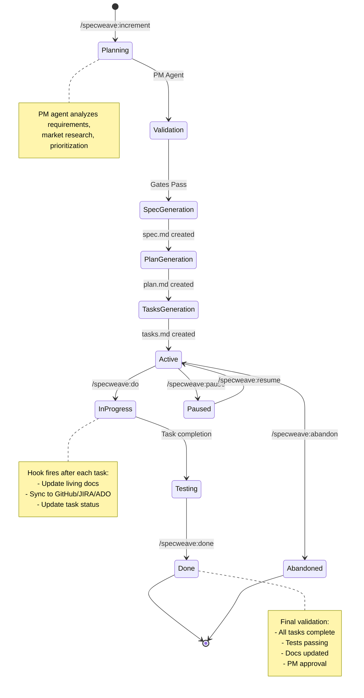

**Key States**:
- **Planning**: PM agent analyzing requirements
- **Active**: Ready for implementation
- **InProgress**: Development happening
- **Testing**: Running tests, validating
- **Done**: Completed with all gates passing
- **Paused**: Temporarily blocked
- **Abandoned**: Requirements changed


---

## 2. Living Docs Sync Flow

**Purpose**: Show how living docs are automatically updated after task completion

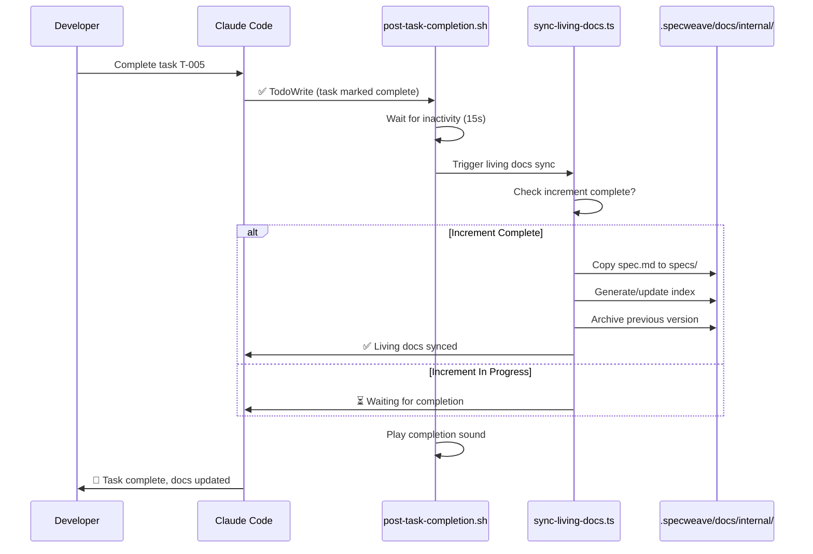

**Sync Triggers**:
1. **Post-Task-Completion Hook**: After every task marked complete (via TodoWrite)
2. **Manual**: `/specweave:sync-docs`
3. **Post-Done**: When increment marked complete via `/specweave:done`

**What Gets Synced**:
- ✅ spec.md → .specweave/docs/internal/specs/spec-{id}.md
- ✅ Archive previous version (if exists)
- ✅ Generate README/index (if needed)
- ✅ Update last_updated timestamp


---

## 3. Intelligent Living Docs Sync

**Purpose**: Show how intelligent mode parses, classifies, and distributes content (v0.18.0+)

```mermaid
graph TD
    A[spec.md] -->|Parse| B[Hierarchical Sections]
    B -->|Classify| C{Content Classifier}

    C -->|US-XXX pattern| D1[User Story]
    C -->|NFR-XXX pattern| D2[NFR]
    C -->|ADR-XXX pattern| D3[ADR]
    C -->|Architecture keywords| D4[Architecture]
    C -->|Operations keywords| D5[Operations]
    C -->|Delivery keywords| D6[Delivery]
    C -->|Strategy keywords| D7[Strategy]
    C -->|Governance keywords| D8[Governance]
    C -->|Summary/Overview| D9[Overview]

    D1 -->|Detect Project| E[Project Detector]
    D2 -->|Detect Project| E
    D3 -->|Detect Project| E
    D4 -->|Detect Project| E
    D5 -->|Detect Project| E
    D6 -->|Detect Project| E
    D7 -->|Detect Project| E
    D8 -->|Detect Project| E
    D9 -->|Detect Project| E

    E -->|frontend| F1[specs/frontend/]
    E -->|backend| F2[specs/backend/]
    E -->|mobile| F3[specs/mobile/]
    E -->|default| F4[specs/default/]

    F1 --> G[Content Distributor]
    F2 --> G
    F3 --> G
    F4 --> G

    G -->|Generate Frontmatter| H[Docusaurus YAML]
    G -->|Create Files| I[specs/, architecture/, operations/]
    G -->|Archive Original| J[specs/{project}/_archive/]

    I --> K[Cross-Linker]
    K -->|Generate Links| L[Related Documents Section]

    style A fill:#e3f2fd
    style C fill:#fff3e0
    style E fill:#f3e5f5
    style G fill:#e8f5e9
    style K fill:#fce4ec
```

**Workflow Steps**:

1. **Parse** (ContentParser):
   - Extract hierarchical sections
   - Parse frontmatter (YAML)
   - Handle code blocks, lists, images
   - Track line numbers

2. **Classify** (ContentClassifier):
   - 9-category system
   - Pattern matching (US-XXX, NFR-XXX, ADR-XXX)
   - Keyword detection
   - Confidence scoring (0.6-0.9)

3. **Detect Project** (ProjectDetector):
   - Frontmatter `project:` field (+20 points)
   - Increment ID (0016-backend-auth) (+10 points)
   - Team name match (+5 points)
   - Keywords (+3 each)
   - Tech stack (+2 each)
   - Auto-select if confidence > 0.7

4. **Distribute** (ContentDistributor):
   - Place sections in appropriate folders
   - Generate Docusaurus frontmatter
   - Archive original spec
   - Create README/index

5. **Cross-Link** (CrossLinker):
   - Detect relationships (Implements, References, DefinedIn, RelatedTo)
   - Generate bidirectional links
   - Add "Related Documents" section

**Example Output**:
```
Before (Simple Mode):
.specweave/docs/internal/specs/spec-0016-authentication.md (5,000 lines, mixed)

After (Intelligent Mode):
.specweave/docs/internal/
├── specs/backend/
│   ├── us-001-backend-api-auth.md (User Story + Frontmatter)
│   ├── us-002-session-management.md (User Story + Cross-links)
│   └── _archive/spec-0016-authentication.md (Original)
├── architecture/
│   ├── authentication-flow.md (HLD)
│   └── adr/0001-oauth-vs-jwt.md (ADR)
├── operations/
│   ├── runbook-auth-service.md (Runbook)
│   └── slo-auth-availability.md (SLO)
└── delivery/
    └── test-strategy-authentication.md (Test Strategy)
```


---

## 4. Profile-Based Multi-Project Sync

**Purpose**: Show how one SpecWeave project syncs to multiple external repos/tools

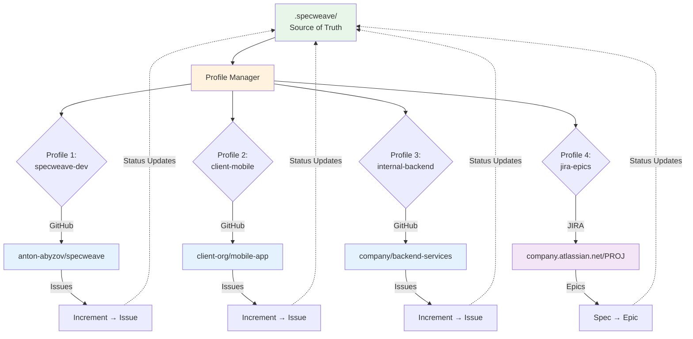

**Profile Configuration** (.specweave/config.json):
```json
{
  "sync": {
    "activeProfile": "specweave-dev",
    "profiles": {
      "specweave-dev": {
        "provider": "github",
        "displayName": "SpecWeave Development",
        "config": {
          "owner": "anton-abyzov",
          "repo": "specweave"
        },
        "timeRange": {
          "default": "1M",
          "max": "6M"
        }
      },
      "client-mobile": {
        "provider": "github",
        "displayName": "Client Mobile App",
        "config": {
          "owner": "client-org",
          "repo": "mobile-app"
        }
      },
      "internal-backend": {
        "provider": "github",
        "config": {
          "owner": "company",
          "repo": "backend-services"
        }
      },
      "jira-epics": {
        "provider": "jira",
        "config": {
          "domain": "company.atlassian.net",
          "project": "PROJ"
        }
      }
    }
  }
}
```

**Key Features**:
- ✅ Unlimited profiles per provider
- ✅ Per-increment profile selection
- ✅ Time range filtering (1W, 1M, 3M, 6M, ALL)
- ✅ Rate limiting protection
- ✅ Pre-flight validation

**Commands**:
```bash
# Sync to active profile
/specweave-github:sync 0016

# Sync to specific profile
/specweave-github:sync 0016 --profile client-mobile

# Sync with time range
/specweave-github:sync 0016 --time-range 1M
```


---

## 5. Bidirectional Sync Architecture

**Purpose**: Show split source of truth (content from SpecWeave, status from external)

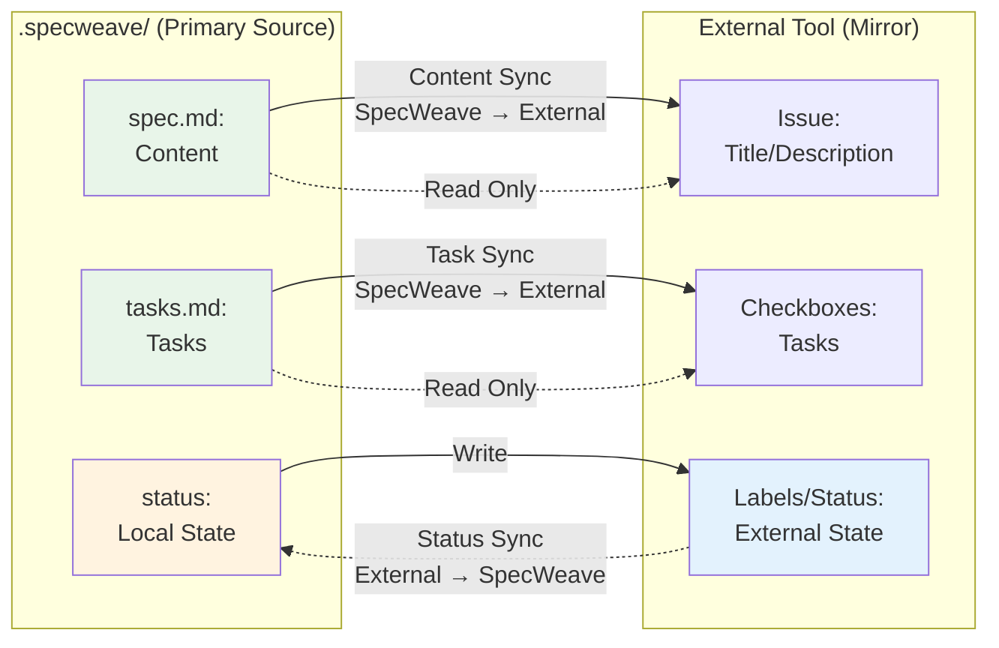

**Sync Direction Rules**:

| Data Type | Direction | Who Wins | Why |
|-----------|-----------|----------|-----|
| **Content** (Title, Description, User Stories) | SpecWeave → External | SpecWeave | Spec is source of truth |
| **Tasks** (Task list, checklist) | SpecWeave → External | SpecWeave | tasks.md is authoritative |
| **Status** (Open/Closed, In Progress) | External → SpecWeave | External | Team manages status externally |
| **Labels/Tags** | External → SpecWeave | External | Team manages externally |
| **Comments** | External only | External | Collaboration happens externally |

**Example Flow**:

**User completes task T-005**:
1. Mark task complete in tasks.md (SpecWeave)
2. Hook fires: post-task-completion.sh
3. Sync to GitHub: Update checkbox in issue
4. GitHub issue shows: ☑ T-005 (completed)

**Team closes GitHub issue**:
1. Issue status changes: Open → Closed
2. Next sync: Pull status from GitHub
3. Update metadata.json: status = "completed"
4. SpecWeave knows: Increment is done externally

**Conflict Resolution**:
- Content conflicts: SpecWeave wins (force push)
- Status conflicts: External wins (accept and merge)
- Task conflicts: SpecWeave wins (tasks.md is source)


---

## 6. Source of Truth Hub-and-Spoke

**Purpose**: Show SpecWeave as central hub with external tools as spokes

```mermaid
graph TD
    SW[".specweave/\n📁 Source of Truth"] --> |Sync Content| GH[GitHub Issues\n🔗 Mirror]
    SW --> |Sync Content| JIRA[JIRA Epics\n🔗 Mirror]
    SW --> |Sync Content| ADO[Azure DevOps\n🔗 Mirror]
    SW --> |Sync Content| NOTION[Notion Pages\n🔗 Mirror]

    GH -.->|Pull Status| SW
    JIRA -.->|Pull Status| SW
    ADO -.->|Pull Status| SW
    NOTION -.->|Pull Status| SW

    GH x-.x|❌ NO!| JIRA
    GH x-.x|❌ NO!| ADO
    JIRA x-.x|❌ NO!| ADO

    style SW fill:#4caf50,stroke:#2e7d32,stroke-width:4px,color:#fff
    style GH fill:#e3f2fd
    style JIRA fill:#f3e5f5
    style ADO fill:#fff3e0
    style NOTION fill:#fce4ec
```

**Key Principles**:

1. **Single Source of Truth** ✅
   - SpecWeave (.specweave/) is the ONLY source of truth
   - All content originates here
   - External tools are read-only mirrors (for content)

2. **Hub-and-Spoke Pattern** ✅
   - SpecWeave = Hub (center)
   - External tools = Spokes (satellites)
   - No spoke-to-spoke sync (GitHub → JIRA ❌)

3. **Split Ownership** ✅
   - SpecWeave owns: Content (specs, tasks, plans)
   - External owns: Status (open/closed, labels, comments)
   - Clear responsibility boundaries

4. **Anti-Pattern: External-to-External Sync** ❌
   ```
   ❌ WRONG:
   GitHub PRs → JIRA Features (External-to-External)
   GitHub Issues → Azure DevOps Items (External-to-External)

   ✅ CORRECT:
   .specweave/specs/ → GitHub Issues (Local-to-External)
   .specweave/specs/ → JIRA Epics (Local-to-External)
   ```

**Benefits**:
- ✅ No confusion (one source of truth)
- ✅ No sync loops (hub-and-spoke prevents)
- ✅ Clear ownership (content vs status)
- ✅ Easy rollback (source is local)


---

## 7. Content Classification Decision Tree

**Purpose**: Show how content is classified into 9 categories

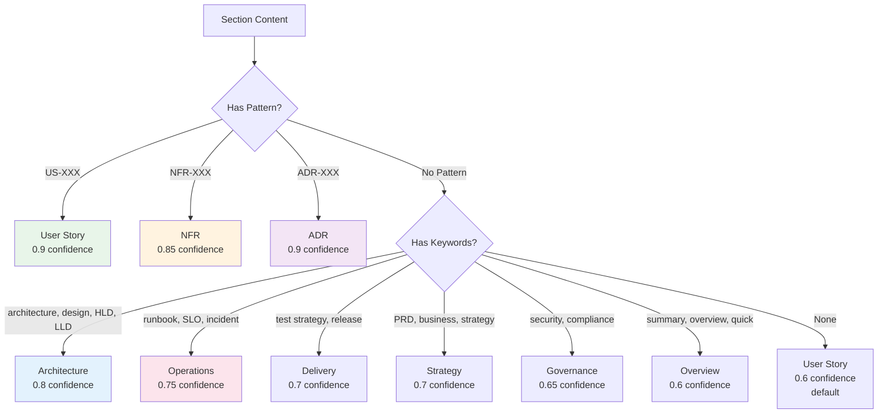

**Classification Rules**:

| Category | Pattern | Keywords | Confidence | Goes To |
|----------|---------|----------|------------|---------|
| **User Story** | `US-XXX`, "As a..." | user, story, feature | 0.9 | `specs/{project}/` |
| **NFR** | `NFR-XXX` | performance, scalability, SLA | 0.85 | `specs/{project}/nfr/` |
| **ADR** | `ADR-XXX` | decision, alternative, rationale | 0.9 | `architecture/adr/` |
| **Architecture** | - | HLD, LLD, design, architecture | 0.8 | `architecture/` |
| **Operations** | - | runbook, SLO, incident, monitoring | 0.75 | `operations/` |
| **Delivery** | - | test strategy, release, deployment | 0.7 | `delivery/` |
| **Strategy** | - | PRD, business, vision, roadmap | 0.7 | `strategy/` |
| **Governance** | - | security, compliance, policy | 0.65 | `governance/` |
| **Overview** | - | summary, quick, overview, intro | 0.6 | `specs/{project}/` |

**Threshold**: 0.6 (60% confidence minimum)

**Example**:
```
Input: "## US-001: User Login"
Pattern Match: US-XXX → Confidence 0.9
Classification: User Story
Output Path: specs/backend/us-001-user-login.md
```


---

## 8. Project Detection Scoring

**Purpose**: Show how projects are detected from increment content

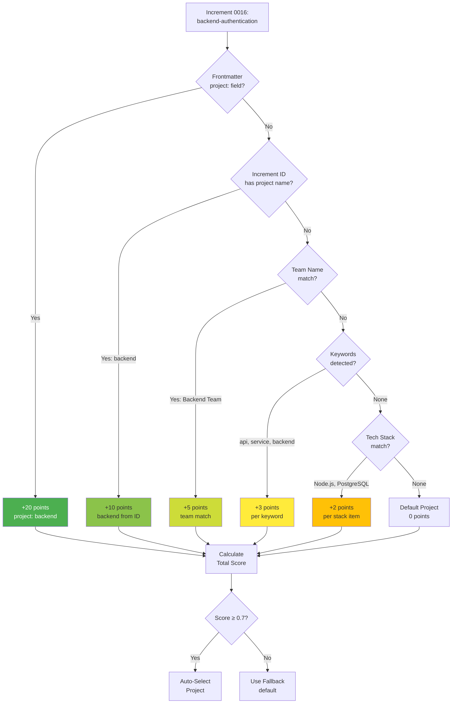

**Scoring System**:

| Signal | Points | Example | Max |
|--------|--------|---------|-----|
| **Frontmatter `project:` field** | +20 | `project: "backend"` | 20 |
| **Increment ID match** | +10 | `0016-backend-auth` → backend | 10 |
| **Team name match** | +5 | `team: "Backend Team"` | 5 |
| **Keywords (each)** | +3 | "api", "backend", "service" | 15 |
| **Tech stack (each)** | +2 | "Node.js", "PostgreSQL" | 10 |

**Total Possible**: 60 points
**Threshold**: 0.7 (42 points for 60-point max)
**Normalized**: Score / Max → 0.0-1.0

**Example Calculation**:

```yaml
---
title: User Authentication
project: backend  # ← Explicit project (20 points)
team: Backend Team  # (not used if explicit)
---

# Increment 0016: Backend Authentication

Quick overview: Implement OAuth for **backend services** using Node.js...
Keywords detected: backend (3), api (3), service (3) = 9 points
Tech stack detected: Node.js (2), PostgreSQL (2) = 4 points

Total: 20 (frontmatter) + 9 (keywords) + 4 (tech stack) = 33 points
Normalized: 33 / 60 = 0.55
Result: Below threshold (0.7) BUT frontmatter is authoritative → Use "backend"
```

**Rule**: Frontmatter `project:` field is **always authoritative** (100% confidence) regardless of score.


---

## 9. Cross-Linking Relationships

**Purpose**: Show 4 types of bidirectional document links

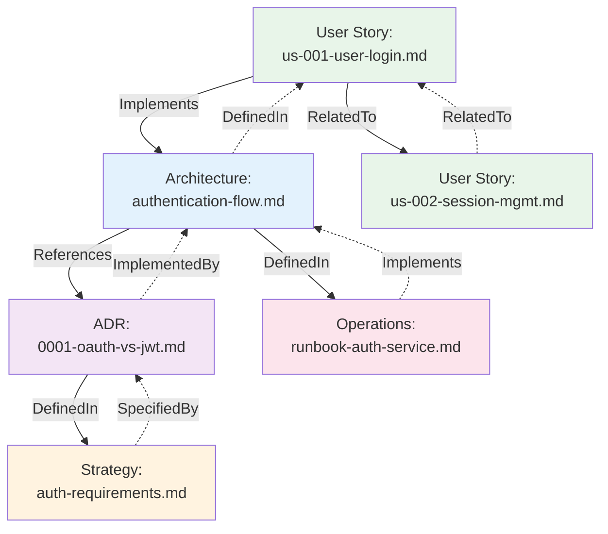

**Link Types**:

| Link Type | Direction | Description | Example |
|-----------|-----------|-------------|---------|
| **Implements** | Forward | Child implements parent concept | User Story → Architecture |
| **DefinedIn** | Backward | Reverse of Implements | Architecture → User Story |
| **References** | Forward | Links to supporting docs | Architecture → ADR |
| **RelatedTo** | Bidirectional | General relationship | User Story ↔ User Story |

**Generated Markdown**:

```markdown
# us-001-user-login.md

## User Story: User Login

[Content...]

---

## Related Documents

### Implements
- [Authentication Flow](../../architecture/authentication-flow.md)

### References
- [ADR-001: OAuth vs JWT](../../architecture/adr/0001-oauth-vs-jwt.md)

### Related To
- [US-002: Session Management](./us-002-session-management)

---

**Source**: [Increment 0016-authentication](../../../increments/_archive/0016-authentication/spec.md)
**Project**: Backend
**Last Updated**: 2025-11-12
```

**Relationship Detection**:
- User Stories mention architecture concepts → Implements link
- Architecture docs reference ADRs → References link
- ADRs explain decisions for strategies → DefinedIn link
- Similar user stories → RelatedTo link


---

## 10. WIP Limits Enforcement

**Purpose**: Show how SpecWeave enforces focus with WIP limits

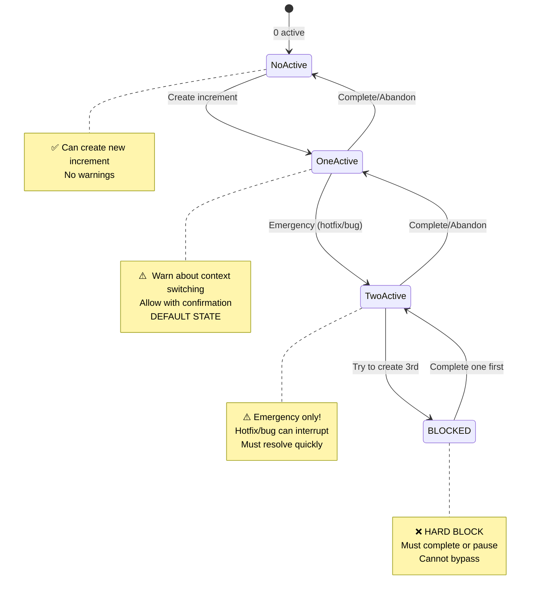

**WIP Limit Configuration** (.specweave/config.json):
```json
{
  "limits": {
    "maxActiveIncrements": 1,  // Default: Focus on one
    "hardCap": 2,               // Emergency ceiling
    "allowEmergencyInterrupt": true,  // hotfix/bug can interrupt
    "typeBehaviors": {
      "canInterrupt": ["hotfix", "bug"],
      "autoAbandonDays": {
        "experiment": 14  // Auto-abandon stale experiments
      }
    }
  }
}
```

**Enforcement Points**:

**0 Active** → **1 Active**:
- ✅ Allowed (no warnings)
- Prompt: "Create increment [increment-id]?"

**1 Active** → **2 Active**:
- ⚠️  Warning: "You have 1 active increment. Creating another will split focus."
- Prompt: "Continue? (y/n)"
- Exception: If type is `hotfix` or `bug`, allow without warning

**2 Active** → **3 Active** (BLOCKED):
```
❌ Cannot create new increment!

You have 2 active increments:
- 0016-authentication (85% complete)
- 0017-hotfix-security (15% complete)

Please complete or pause one before starting a new increment.

Commands:
  /specweave:done 0016      # Mark complete
  /specweave:pause 0017     # Pause temporarily
  /specweave:abandon 0017   # Abandon (with reason)

--force flag NOT supported for WIP limits.
```

**Why 1 Active?**
- 1 task = 100% productivity
- 2 tasks = 20% slower (context switching)
- 3+ tasks = 40% slower + more bugs


---

## 11. AC-ID Traceability

**Purpose**: Show how AC-IDs enable complete traceability from spec → tasks → tests

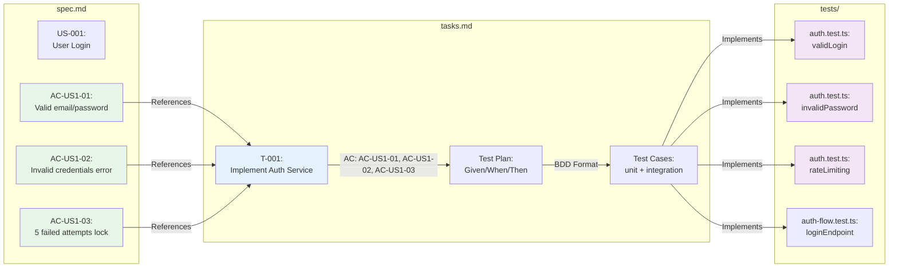

**AC-ID Format**: `AC-US{story}-{number}`
- `AC` = Acceptance Criteria
- `US{story}` = User Story number (US1, US2, US3, ...)
- `{number}` = Sequential number (01, 02, 03, ...)

**Example Flow**:

**Step 1: spec.md** (Define acceptance criteria with AC-IDs)
```markdown
### US-001: User Login

**Acceptance Criteria**:
- [ ] **AC-US1-01**: User can log in with valid email/password (P1, testable)
- [ ] **AC-US1-02**: Invalid credentials show error message (P1, testable)
- [ ] **AC-US1-03**: 5 failed attempts lock account for 15min (P2, testable)
```

**Step 2: tasks.md** (Reference AC-IDs in tasks)
```markdown
## T-001: Implement Authentication Service

**AC**: AC-US1-01, AC-US1-02, AC-US1-03

**Test Plan** (BDD format):
- **Given** user with valid credentials → **When** login → **Then** receive JWT

**Test Cases**:
- Unit (`auth.test.ts`): validLogin, invalidPassword, rateLimiting → 90%
- Integration (`auth-flow.test.ts`): loginEndpoint → 85%
```

**Step 3: tests/** (Implement tests covering AC-IDs)
```typescript
// tests/unit/services/auth.test.ts
describe('AuthService', () => {
  // Covers AC-US1-01
  test('should allow login with valid credentials', async () => {
    const result = await authService.login('user@example.com', 'password123');
    expect(result.token).toBeDefined();
    expect(result.user.email).toBe('user@example.com');
  });

  // Covers AC-US1-02
  test('should reject login with invalid password', async () => {
    await expect(
      authService.login('user@example.com', 'wrongpassword')
    ).rejects.toThrow('Invalid credentials');
  });

  // Covers AC-US1-03
  test('should lock account after 5 failed attempts', async () => {
    // Simulate 5 failed login attempts
    for (let i = 0; i < 5; i++) {
      await authService.login('user@example.com', 'wrong').catch(() => {});
    }

    // 6th attempt should be locked
    await expect(
      authService.login('user@example.com', 'password123')
    ).rejects.toThrow('Account locked');
  });
});
```

**Validation** (`/specweave:check-tests 0016`):
```
✅ AC Coverage Report

AC-US1-01: ✅ Covered (auth.test.ts: validLogin)
AC-US1-02: ✅ Covered (auth.test.ts: invalidPassword)
AC-US1-03: ✅ Covered (auth.test.ts: rateLimiting)

Overall: 3/3 AC-IDs covered (100%)
Coverage: 87% (target: 85%)
```

**Benefits**:
- ✅ Complete traceability (spec → tasks → tests)
- ✅ Validation tool can check coverage
- ✅ Easy to find which test covers which AC
- ✅ Clear test intent (AC-US1-01 = "valid login")


---

## 12. TDD Red-Green-Refactor

**Purpose**: Show Test-Driven Development cycle supported by SpecWeave

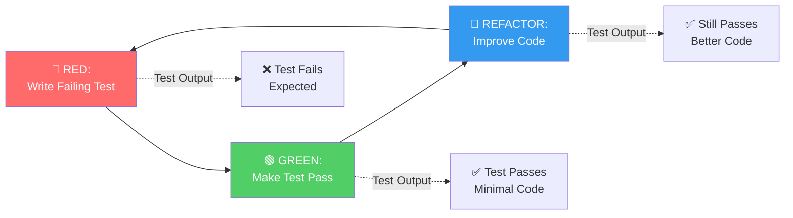

**Example Cycle**:

**1. RED - Write Failing Test**:
```typescript
// tests/unit/services/auth.test.ts
describe('AuthService', () => {
  test('should hash password before storing', async () => {
    const authService = new AuthService();
    const result = await authService.register('user@example.com', 'password123');

    // Test will fail - register() doesn't exist yet
    expect(result.password).not.toBe('password123');
    expect(result.password).toMatch(/^\$2[aby]\$\d+\$/); // bcrypt format
  });
});
```

**Run**: `npm test` → ❌ Test fails (expected - no implementation yet)

**2. GREEN - Make Test Pass**:
```typescript
// src/services/AuthService.ts
import bcrypt from 'bcrypt';

export class AuthService {
  async register(email: string, password: string) {
    const hashedPassword = await bcrypt.hash(password, 10);
    return {
      email,
      password: hashedPassword
    };
  }
}
```

**Run**: `npm test` → ✅ Test passes (minimal code works)

**3. REFACTOR - Improve Code**:
```typescript
// src/services/AuthService.ts
import bcrypt from 'bcrypt';

export class AuthService {
  private readonly SALT_ROUNDS = 10;

  async register(email: string, password: string) {
    this.validatePassword(password);
    const hashedPassword = await this.hashPassword(password);

    return {
      email,
      password: hashedPassword
    };
  }

  private validatePassword(password: string): void {
    if (password.length < 8) {
      throw new Error('Password must be at least 8 characters');
    }
  }

  private async hashPassword(password: string): Promise<string> {
    return bcrypt.hash(password, this.SALT_ROUNDS);
  }
}
```

**Run**: `npm test` → ✅ Tests still pass (refactoring successful)

**TDD Mode in SpecWeave** (tasks.md):
```yaml
---
increment: 0016-authentication
total_tasks: 5
test_mode: TDD     # ← Enable TDD workflow
coverage_target: 85%
---
```

**Commands**:
```bash
/specweave:tdd-cycle      # Full TDD cycle
/specweave:tdd-red        # Write failing test
/specweave:tdd-green      # Implement minimal code
/specweave:tdd-refactor   # Improve code
```


---

## 13. Multi-Repo Architecture

**Purpose**: Show how SpecWeave organizes multi-repo projects with single source of truth

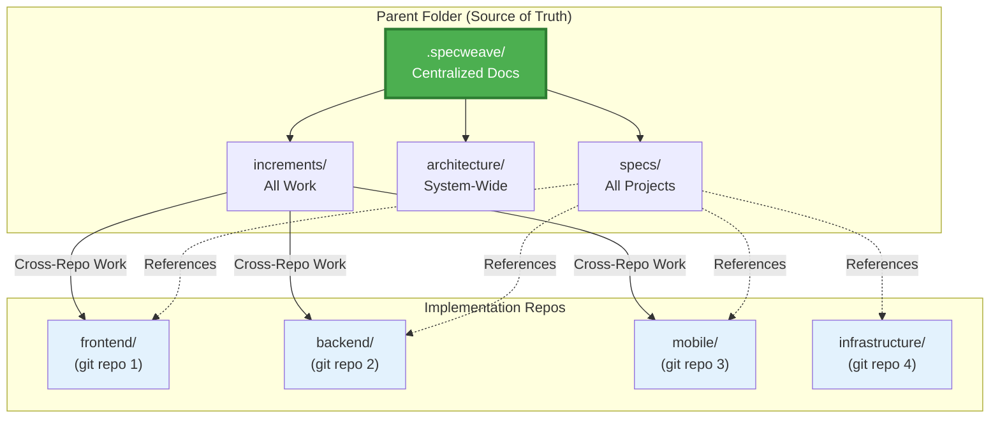

**Directory Structure**:
```
microservices-project/       # ← Parent folder (git init here)
├── .specweave/              # ← ONE source of truth
│   ├── increments/
│   │   ├── 0001-add-service-mesh/      # Cross-cutting
│   │   ├── 0002-user-svc-v2/           # Single service
│   │   └── 0003-checkout-flow/         # Multi-service
│   ├── docs/
│   │   ├── internal/
│   │   │   ├── specs/
│   │   │   │   ├── frontend/           # Frontend specs
│   │   │   │   ├── backend/            # Backend specs
│   │   │   │   └── mobile/             # Mobile specs
│   │   │   └── architecture/
│   │   │       ├── service-mesh.md     # System-wide
│   │   │       └── adr/
│   │   └── public/
│   └── logs/
│
├── services/
│   ├── user-service/        # ← Separate git repos
│   ├── order-service/       # ← OR monorepo subdirs
│   ├── payment-service/
│   └── notification-service/
│
├── frontend/                # ← Separate git repo
├── mobile/                  # ← Separate git repo
└── infrastructure/          # ← Separate git repo
```

**Setup**:
```bash
# Parent folder
mkdir microservices-project && cd microservices-project
git init
specweave init .  # Creates .specweave/ structure

# Clone implementation repos
git clone https://github.com/myorg/user-service.git services/user-service
git clone https://github.com/myorg/frontend.git frontend
git clone https://github.com/myorg/mobile-app.git mobile
```

**Benefits**:
- ✅ One .specweave/ for entire system (no duplication)
- ✅ Each repo maintains own git history
- ✅ Cross-service increments natural (checkout flow spans frontend + backend)
- ✅ System-wide architecture docs in one place
- ✅ Living docs cover all services


---

## 14. Hook System

**Purpose**: Show how hooks automate workflow at lifecycle events

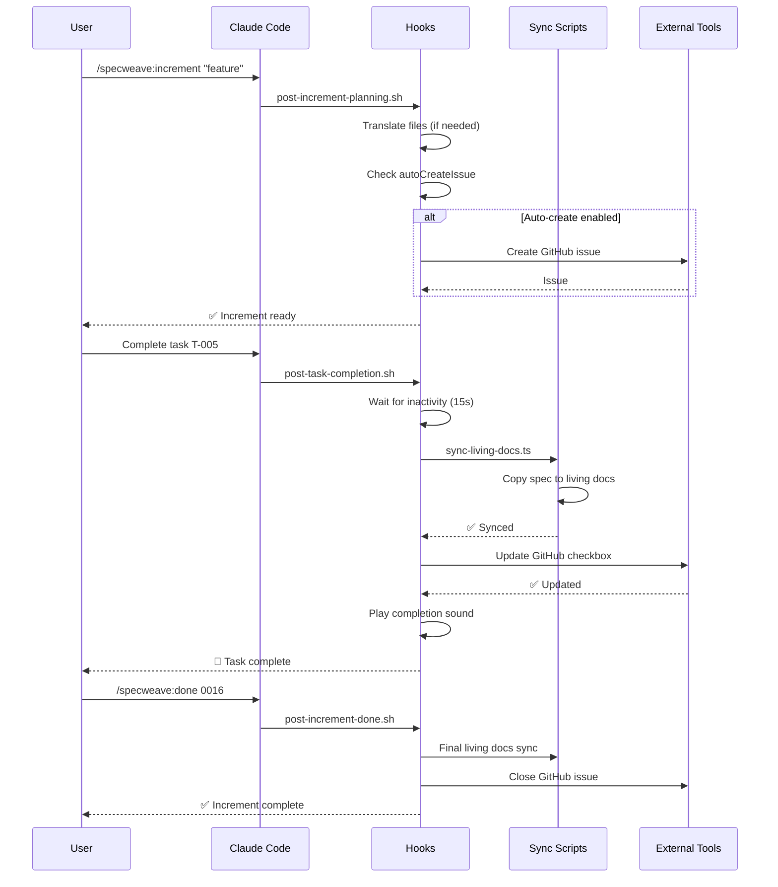

**Available Hooks**:

| Hook | Event | Purpose | Files Affected |
|------|-------|---------|----------------|
| **post-increment-planning** | After `/specweave:increment` | Translate files, auto-create GitHub issue, sync spec | spec.md, metadata.json |
| **post-task-completion** | After task marked complete (TodoWrite) | Sync living docs, update external tools, play sound | living docs, GitHub/JIRA/ADO |
| **post-increment-done** | After `/specweave:done` | Final sync, close external issues, update completion report | living docs, metadata.json |
| **pre-implementation** | Before `/specweave:do` | Validate environment, check dependencies | - |

**Configuration** (.specweave/config.json):
```json
{
  "hooks": {
    "post_task_completion": {
      "sync_living_docs": true,        // Auto-sync to living docs
      "sync_tasks_md": true,           // Update tasks.md
      "external_tracker_sync": true    // Sync to GitHub/JIRA/ADO
    },
    "post_increment_planning": {
      "auto_create_github_issue": true // Auto-create on planning
    },
    "post_increment_done": {
      "sync_to_github_project": true,  // Sync to GitHub Projects
      "close_github_issue": true,      // Close linked issue
      "update_living_docs_first": true // Ensure docs current
    }
  }
}
```

**Hook Location**: `plugins/specweave/hooks/`
```
plugins/specweave/hooks/
├── post-increment-planning.sh
├── post-task-completion.sh
├── post-increment-done.sh
├── pre-implementation.sh
└── lib/
    ├── sync-living-docs.ts
    ├── sync-spec-content.sh
    └── translate-file.ts
```

**Links**: Hook documentation in CLAUDE.md sections 2397-2583

---

## 15. Plugin Architecture

**Purpose**: Show how SpecWeave uses Claude Code's native plugin system

```mermaid
graph TD
    Core["specweave\nCore Plugin\n(Always Loaded)"] --> Skills1["9 Skills"]
    Core --> Agents1["22 Agents"]
    Core --> Commands1["22 Commands"]
    Core --> Hooks1["8 Hooks"]

    GH["specweave-github\nGitHub Integration"] --> Skills2["2 Skills"]
    GH --> Agents2["1 Agent"]
    GH --> Commands2["7 Commands"]

    JIRA["specweave-jira\nJIRA Integration"] --> Skills3["1 Skill"]
    JIRA --> Agents3["1 Agent"]
    JIRA --> Commands3["2 Commands"]

    ADO["specweave-ado\nAzure DevOps"] --> Skills4["1 Skill"]
    ADO --> Agents4["1 Agent"]
    ADO --> Commands4["5 Commands"]

    ML["specweave-ml\nMachine Learning"] --> Skills5["3 Skills"]
    ML --> Agents5["3 Agents"]
    ML --> Commands5["4 Commands"]

    style Core fill:#4caf50,color:#fff
    style GH fill:#e3f2fd
    style JIRA fill:#f3e5f5
    style ADO fill:#fff3e0
    style ML fill:#fce4ec
```

**Plugin Structure**:
```
plugins/specweave/              # Core plugin
├── .claude-plugin/
│   └── plugin.json             # Claude native manifest
├── skills/                     # Auto-activating skills
│   ├── increment-planner/
│   │   └── SKILL.md
│   ├── spec-generator/
│   │   └── SKILL.md
│   └── ...
├── agents/                     # Specialized AI agents
│   ├── pm/
│   │   └── AGENT.md
│   ├── architect/
│   │   └── AGENT.md
│   └── ...
├── commands/                   # Slash commands
│   ├── increment.md
│   ├── do.md
│   └── ...
├── hooks/                      # Lifecycle hooks
│   ├── hooks.json              # Hook registration
│   ├── post-task-completion.sh
│   └── ...
└── lib/                        # TypeScript utilities
    └── ...
```

**Installation**:
```bash
# Initialize project (installs ALL plugins automatically)
specweave init .

# Result: 19+ plugins installed via marketplace
claude plugin list --installed | grep specweave
# specweave
# specweave-github
# specweave-jira
# specweave-ado
# specweave-ml
# ... (15 more)
```

**Marketplace** (`.claude-plugin/marketplace.json`):
```json
{
  "name": "specweave",
  "description": "SpecWeave Plugin Marketplace",
  "plugins": [
    {
      "name": "specweave",
      "description": "Core framework (PM, Architect, 22 agents)",
      "source": "../plugins/specweave"
    },
    {
      "name": "specweave-github",
      "description": "GitHub Issues integration",
      "source": "../plugins/specweave-github"
    }
    // ... 17 more plugins
  ]
}
```

**Context Efficiency**:
- Core plugin: ~12K tokens (always loaded)
- Optional plugins: Load only when relevant
- Skills auto-activate based on keywords
- Result: 75%+ context reduction

**Links**: Plugin Architecture section in CLAUDE.md (lines 1013-1187)

---

## Summary

This comprehensive diagrams document provides visual references for all major SpecWeave concepts:

✅ **15 diagrams created** covering:
- Increment lifecycle and workflow
- Living docs sync (simple + intelligent)
- Multi-project profile-based sync
- Bidirectional sync architecture
- Content classification and project detection
- Cross-linking and traceability
- WIP limits and TDD workflows
- Hook system and plugin architecture

**Usage**:
- Reference these diagrams when explaining SpecWeave concepts
- Link to specific sections from other documentation
- Use as visual aids in presentations
- Include in onboarding materials

**Maintenance**:
- Update diagrams when architecture changes
- Add new diagrams for new features
- Keep examples current with latest code
- Verify all glossary links are valid

---

**Navigation**:
- [Glossary Overview](../../../public/glossary/README.md)
- [SpecWeave-Specific Terms](../../../public/glossary/README.md#specweave-specific-terms)
- [Internal Architecture Docs](./)
- [CLAUDE.md](../../../../../CLAUDE.md)
