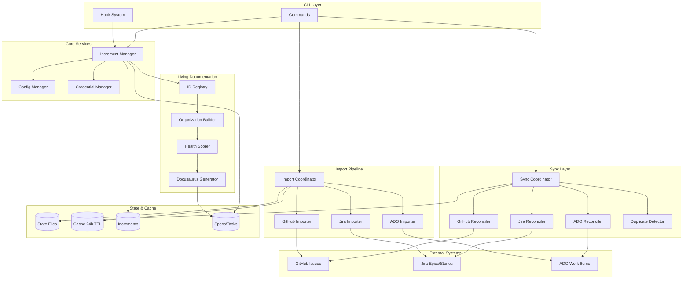

# Data Flow Diagram

*Auto-generated by Intelligent Analyzer*

```mermaid
flowchart TD
    subgraph External["External Systems"]
        GH[GitHub Issues]
        JR[Jira Epics/Stories]
        AD[ADO Work Items]
    end

    subgraph CLI["CLI Layer"]
        CMD[Commands]
        HOOKS[Hook System]
    end

    subgraph Core["Core Services"]
        INC[Increment Manager]
        CFG[Config Manager]
        CRED[Credential Manager]
    end

    subgraph Sync["Sync Layer"]
        COORD[Sync Coordinator]
        GHR[GitHub Reconciler]
        JRR[Jira Reconciler]
        ADR[ADO Reconciler]
        DUP[Duplicate Detector]
    end

    subgraph Import["Import Pipeline"]
        IMP[Import Coordinator]
        GHI[GitHub Importer]
        JRI[Jira Importer]
        ADI[ADO Importer]
    end

    subgraph Docs["Living Documentation"]
        IDR[ID Registry]
        ORG[Organization Builder]
        HEALTH[Health Scorer]
        DOC[Docusaurus Generator]
    end

    subgraph Storage["State & Cache"]
        STATE[(State Files)]
        CACHE[(Cache 24h TTL)]
        INCR[(Increments)]
        SPECS[(Specs/Tasks)]
    end

    CMD --> INC
    CMD --> COORD
    CMD --> IMP
    HOOKS --> INC

    INC --> CFG
    INC --> CRED
    INC --> INCR
    INC --> SPECS

    COORD --> GHR
    COORD --> JRR
    COORD --> ADR
    COORD --> DUP
    GHR --> GH
    JRR --> JR
    ADR --> AD

    IMP --> GHI
    IMP --> JRI
    IMP --> ADI
    GHI --> GH
    JRI --> JR
    ADI --> AD
    IMP --> CACHE

    INC --> IDR
    IDR --> ORG
    ORG --> HEALTH
    HEALTH --> DOC
    DOC --> SPECS

    COORD --> STATE
    IMP --> STATE
```