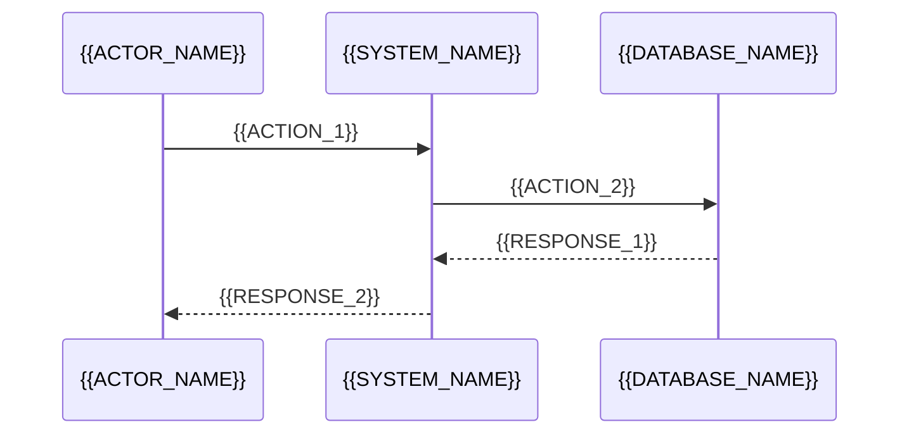

# HLD: Diagram Generation System

**Version**: 1.0
**Date**: 2025-10-26
**Status**: Implemented
**Increment**: [0002-core-enhancements](../../../../increments/_archive/0002-core-enhancements/)

---

## Overview

Two-component diagram generation system enabling natural language diagram creation following C4 Model and SpecWeave conventions.

**Target**: Enable automated diagram generation from natural language requests with zero manual Mermaid syntax knowledge required.

---

## System Architecture

```
┌──────────────────────────────────────────────────────────────┐
│                      User Request                            │
│         "Create C4 context diagram for auth"                 │
└────────────────────┬─────────────────────────────────────────┘
                     │
          ┌──────────▼──────────┐
          │  diagrams-generator │
          │   Skill (Coordinator)│
          └──────────┬──────────┘
                     │
                     │ 1. Detect diagram type (C4 context)
                     │ 2. Validate request
                     │ 3. Determine file location
                     │
          ┌──────────▼──────────┐
          │ diagrams-architect  │
          │  Agent (Tool)       │
          └──────────┬──────────┘
                     │
                     │ 1. Select template (c4-context-template.mmd)
                     │ 2. Apply C4 Level 1 conventions
                     │ 3. Generate Mermaid syntax
                     │ 4. Return diagram content
                     │
          ┌──────────▼──────────┐
          │  diagrams-generator │
          │   Skill (Save)      │
          └──────────┬──────────┘
                     │
                     │ 1. Generate file name (auth.c4-context.mmd)
                     │ 2. Save to architecture/diagrams/
                     │ 3. Confirm to user
                     │
                     ▼
      ✅ Diagram saved: auth.c4-context.mmd
```

---

## System Context

```
┌──────────────────────────────────────────────────────────────┐
│               Agent Types (ROLE vs TOOL)                     │
│                                                              │
│  ROLE Agents: PM, Architect, DevOps (consultative)          │
│  TOOL Agents: diagrams-architect (artifact generation)      │
└──────────────────────────────────────────────────────────────┘
                     │
                     │ Agent classification
                     │
                     ▼
┌──────────────────────────────────────────────────────────────┐
│            Skills as Coordinators Pattern                    │
│                                                              │
│  User Request → Skill (Detect) → Tool Agent (Generate)      │
│                → Skill (Save) → User Confirmation            │
└──────────────────────────────────────────────────────────────┘
                     │
                     │ Coordination pattern
                     │
                     ▼
┌──────────────────────────────────────────────────────────────┐
│                    Diagram System                            │
│                                                              │
│  diagrams-generator skill + diagrams-architect agent         │
└──────────────────────────────────────────────────────────────┘
```

---

## Component Design

### 1. diagrams-generator Skill (Coordinator)

**Purpose**: Detect diagram requests, coordinate with agent, handle file operations

**Activation Keywords**:
```
- "create diagram", "draw diagram", "generate diagram", "visualize"
- "C4 diagram", "C4 context", "C4 container", "C4 component"
- "context diagram", "container diagram", "component diagram"
- "sequence diagram", "sequence flow", "interaction diagram"
- "ER diagram", "entity relationship", "data model"
- "deployment diagram", "infrastructure diagram"
- "architecture diagram", "system diagram"
```

**Key Methods**:
```typescript
class DiagramsGeneratorSkill {
  // Detect diagram type from user request
  detectDiagramType(request: string): DiagramType;

  // Determine file location based on diagram type
  getFileLocation(type: DiagramType): string;

  // Generate file name following conventions
  generateFileName(pageName: string, type: DiagramType): string;

  // Invoke diagrams-architect agent
  async generateDiagram(request: string, type: DiagramType): Promise<string>;

  // Save diagram to correct location
  async saveDiagram(content: string, filePath: string): Promise<void>;
}
```

**Diagram Type Detection**:
```typescript
function detectDiagramType(request: string): DiagramType {
  const keywords = {
    'c4-context': ['C4 context', 'system context', 'Level 1'],
    'c4-container': ['C4 container', 'component diagram', 'Level 2'],
    'c4-component': ['C4 component', 'internal structure', 'Level 3'],
    'sequence': ['sequence', 'interaction', 'flow'],
    'entity': ['ER', 'entity relationship', 'data model'],
    'deployment': ['deployment', 'infrastructure'],
  };

  for (const [type, patterns] of Object.entries(keywords)) {
    if (patterns.some(p => request.toLowerCase().includes(p.toLowerCase()))) {
      return type as DiagramType;
    }
  }

  return 'c4-context'; // Default
}
```

**File Placement Rules**:
```typescript
function getFileLocation(type: DiagramType): string {
  const locations = {
    'c4-context': '.specweave/docs/internal/architecture/diagrams/',
    'c4-container': '.specweave/docs/internal/architecture/diagrams/',
    'c4-component': '.specweave/docs/internal/architecture/diagrams/{module}/',
    'sequence': '.specweave/docs/internal/architecture/diagrams/flows/',
    'entity': '.specweave/docs/internal/architecture/diagrams/',
    'deployment': '.specweave/docs/internal/architecture/diagrams/',
  };

  return locations[type];
}
```

**File Naming**:
```typescript
function generateFileName(pageName: string, type: DiagramType): string {
  // Pattern: <page>.<type>.mmd
  return `${pageName}.${type}.mmd`;

  // Examples:
  // - auth.c4-context.mmd
  // - auth.c4-container.mmd
  // - login-flow.sequence.mmd
  // - user-order.entity.mmd
}
```

---

### 2. diagrams-architect Agent (Tool)

**Purpose**: Generate Mermaid diagrams following C4 Model and SpecWeave conventions

**Expertise**:

1. **C4 Model (4 levels)**:
   - Level 1 (Context): System boundaries, external actors
   - Level 2 (Container): Applications, services, databases
   - Level 3 (Component): Internal structure of containers
   - Level 4 (Code): Classes, methods (optional)

2. **Mermaid Syntax**:
   - `graph TB` / `graph LR` for C4 diagrams
   - `sequenceDiagram` for sequence diagrams
   - `erDiagram` for entity-relationship diagrams
   - `flowchart TB` for process flows
   - `stateDiagram-v2` for state machines

3. **SpecWeave Conventions**:
   - File naming: `<page>.<type>.mmd`
   - Co-location: Keep diagrams next to markdown
   - Placement: HLD diagrams in `architecture/diagrams/`, LLD in `architecture/diagrams/{module}/`

**Key Methods**:
```typescript
class DiagramsArchitectAgent {
  // Generate diagram from request and type
  async generate(request: string, type: DiagramType): Promise<string>;

  // Select appropriate template
  selectTemplate(type: DiagramType): string;

  // Apply template with customization
  applyTemplate(template: string, placeholders: Record<string, string>): string;

  // Validate Mermaid syntax
  validateSyntax(diagram: string): boolean;
}
```

**Templates**:

Located in `src/agents/diagrams-architect/templates/`

**C4 Context Template** (`c4-context-template.mmd`):
```mermaid
graph TB
    %% C4 Level 1: System Context Diagram
    %% Shows: System boundary, external actors, external systems
    %% Omits: Internal implementation details

    User(({{USER_ROLE}}<br/>End User))
    Admin((Administrator))

    System[{{SYSTEM_NAME}}]

    ExternalService[{{EXTERNAL_SERVICE_1}}<br/>External System]

    User -->|{{USER_ACTION}}| System
    Admin -->|Manage| System
    System -->|{{INTEGRATION_DESCRIPTION}}| ExternalService
```

**C4 Container Template** (`c4-container-template.mmd`):
```mermaid
graph TB
    %% C4 Level 2: Container Diagram
    %% Shows: Applications, services, databases within system
    %% Omits: Internal component structure

    User(({{USER_ROLE}}))

    subgraph "{{SYSTEM_NAME}}"
        WebApp[Web Application<br/>{{WEB_TECH}}]
        API[API Server<br/>{{API_TECH}}]
        DB[(Database<br/>{{DB_TECH}})]
    end

    ExternalService[{{EXTERNAL_SERVICE}}<br/>External System]

    User -->|HTTPS| WebApp
    WebApp -->|API Calls| API
    API -->|Read/Write| DB
    API -->|{{INTEGRATION}}| ExternalService
```

**Sequence Diagram Template** (`sequence-template.mmd`):


**ER Diagram Template** (`er-diagram-template.mmd`):
```mermaid
erDiagram
    %% Entity Relationship Diagram: {{MODEL_NAME}}
    %% Shows: Data model and relationships

    {{ENTITY_1}} ||--o{ {{ENTITY_2}} : "{{RELATIONSHIP}}"
    {{ENTITY_2}} }o--|| {{ENTITY_3}} : "{{RELATIONSHIP_2}}"

    {{ENTITY_1}} {
        {{TYPE}} {{FIELD_1}}
        {{TYPE}} {{FIELD_2}}
    }

    {{ENTITY_2}} {
        {{TYPE}} {{FIELD_1}}
        {{TYPE}} {{FIELD_2}}
    }
```

---

### 3. Template Customization Engine

**Purpose**: Replace placeholders with actual values

**Placeholders**:
```typescript
interface TemplatePlaceholders {
  // Common
  SYSTEM_NAME: string;

  // Users/Actors
  USER_ROLE: string;
  ACTOR_NAME: string;

  // Actions
  USER_ACTION: string;
  ACTION_1: string;
  ACTION_2: string;

  // Technologies
  WEB_TECH: string;
  API_TECH: string;
  DB_TECH: string;

  // External Services
  EXTERNAL_SERVICE: string;
  EXTERNAL_SERVICE_1: string;

  // Integration
  INTEGRATION_DESCRIPTION: string;

  // Relationships
  RELATIONSHIP: string;

  // Entities/Fields
  ENTITY_1: string;
  ENTITY_2: string;
  FIELD_1: string;
  TYPE: string;
}
```

**Customization Algorithm**:
```typescript
function applyTemplate(template: string, request: string): string {
  // 1. Parse user request
  const entities = extractEntities(request);

  // 2. Identify placeholders in template
  const placeholders = template.match(/{{([^}]+)}}/g);

  // 3. Map entities to placeholders
  const replacements = mapEntitiesToPlaceholders(entities, placeholders);

  // 4. Replace placeholders
  let result = template;
  for (const [placeholder, value] of Object.entries(replacements)) {
    result = result.replace(new RegExp(`{{${placeholder}}}`, 'g'), value);
  }

  return result;
}
```

---

### 4. Syntax Validator

**Purpose**: Validate Mermaid syntax before saving

**Validation Rules**:
```typescript
class MermaidValidator {
  // Validate diagram type matches syntax
  validateDiagramType(diagram: string, type: DiagramType): boolean {
    const syntaxMap = {
      'c4-context': /^graph (TB|LR)/,
      'c4-container': /^graph (TB|LR)/,
      'c4-component': /^graph (TB|LR)/,
      'sequence': /^sequenceDiagram/,
      'entity': /^erDiagram/,
      'deployment': /^graph (TB|LR)/,
    };

    return syntaxMap[type].test(diagram);
  }

  // Validate required elements present
  validateElements(diagram: string, type: DiagramType): boolean {
    // C4 diagrams must have nodes and edges
    // Sequence diagrams must have participants and interactions
    // ER diagrams must have entities and relationships
  }

  // Validate Mermaid syntax (basic checks)
  validateSyntax(diagram: string): boolean {
    // Check for balanced brackets/parentheses
    // Check for valid node syntax
    // Check for valid edge syntax
  }
}
```

---

## Data Flow

### Request Flow (Diagram Generation)

```
1. User: "Create C4 context diagram for authentication"
   ↓
2. diagrams-generator Skill:
   - Activates (keywords match)
   - Detects type: c4-context
   - Validates request
   ↓
3. diagrams-generator Skill:
   - Determines location: .specweave/docs/internal/architecture/diagrams/
   - Generates file name: auth.c4-context.mmd
   ↓
4. diagrams-generator Skill → diagrams-architect Agent (via Task tool):
   - Passes: request, type: c4-context
   ↓
5. diagrams-architect Agent:
   - Selects template: c4-context-template.mmd
   - Extracts entities from request:
     * System: Authentication
     * Actors: User, Admin
     * External: OAuth Provider
   - Replaces placeholders:
     * {{SYSTEM_NAME}} → Authentication
     * {{USER_ROLE}} → User
     * {{EXTERNAL_SERVICE_1}} → OAuth Provider
   - Validates syntax
   - Returns Mermaid diagram
   ↓
6. diagrams-generator Skill:
   - Receives diagram content
   - Saves to: .specweave/docs/internal/architecture/diagrams/auth.c4-context.mmd
   - Confirms to user
   ↓
7. User sees: "✅ Diagram saved to .specweave/docs/internal/architecture/diagrams/auth.c4-context.mmd"
```

---

## Configuration

### File Naming Conventions

```yaml
pattern: "<page>.<type>.mmd"

types:
  - c4-context    # C4 Level 1
  - c4-container  # C4 Level 2
  - c4-component  # C4 Level 3
  - sequence      # Sequence diagram
  - entity        # ER diagram
  - deployment    # Deployment diagram
  - flow          # Process flow
  - state         # State machine

examples:
  - auth.c4-context.mmd
  - auth.c4-container.mmd
  - login-flow.sequence.mmd
  - user-order.entity.mmd
```

### File Placement Rules

```yaml
locations:
  hld_diagrams: .specweave/docs/internal/architecture/diagrams/
  lld_diagrams: .specweave/docs/internal/architecture/diagrams/{module}/
  flows: .specweave/docs/internal/architecture/diagrams/flows/
  data_models: .specweave/docs/internal/architecture/diagrams/

placement_by_type:
  c4-context: hld_diagrams
  c4-container: hld_diagrams
  c4-component: lld_diagrams
  sequence: flows
  entity: data_models
  deployment: hld_diagrams
```

---

## Performance Optimizations

### Template Caching

**Problem**: Loading templates from disk for every request is slow

**Solution**: Cache templates in memory
```typescript
class TemplateCache {
  private cache: Map<DiagramType, string> = new Map();

  async getTemplate(type: DiagramType): Promise<string> {
    if (this.cache.has(type)) {
      return this.cache.get(type)!;
    }

    const template = await loadTemplateFromDisk(type);
    this.cache.set(type, template);
    return template;
  }
}
```

**Performance**: 10-50ms → &lt;1ms (50x faster)

---

### Async File Operations

**Problem**: Saving files blocks main conversation

**Solution**: Save asynchronously
```typescript
async function saveDiagram(content: string, filePath: string): Promise<void> {
  await fs.promises.writeFile(filePath, content, 'utf-8');
}
```

**Performance**: Non-blocking (user sees confirmation immediately)

---

## Security & Privacy

### No Sensitive Data in Diagrams

**Validation**:
- Agent prompt includes: "Do not include sensitive data (passwords, tokens, IPs, etc.)"
- Skill validates diagram content before saving
- Warning if potential sensitive data detected

### Local Storage Only

- All diagrams stay on user's machine
- No cloud API calls for diagram generation
- No telemetry

---

## Integration Points

### CLAUDE.md Updates

**Sections updated**:
1. Agents Development (added diagrams-architect)
2. Skills Development (added diagrams-generator)
3. C4 Diagram Conventions (reference to agent)
4. New section: "Diagram Generation Workflow"

### .specweave/docs/README.md

**Added section**:
- Diagram Generation overview
- Usage examples
- Links to conventions

### Install Scripts

**No changes needed** - scripts already generic:
```bash
bin/install-agents.sh   # Handles any agent in src/agents/
bin/install-skills.sh   # Handles any skill in src/skills/
```

---

## Future Enhancements (Out of Scope for v1)

1. **Diagram Editing**: Edit existing diagrams via natural language
2. **Multi-Diagram Generation**: Generate multiple related diagrams at once
3. **Diagram Validation**: Advanced syntax validation with error messages
4. **Diagram Rendering**: Automatic SVG/PNG generation via CI/CD
5. **Diagram Versioning**: Track diagram changes over time
6. **Interactive Diagrams**: Support for clickable/zoomable diagrams

---

## References

### Architecture Decision Records
- [ADR-0002-001: Agent Types - Roles vs Tools](../adr/0002-agent-types-roles-vs-tools.md)
- [ADR-0002-002: Skills as Coordinators](../adr/0144-skills-as-coordinators.md)

### Increment Documentation
- [Increment 0002](../../../../increments/_archive/0002-core-enhancements/)
- [Spec](../../../../increments/_archive/0002-core-enhancements/spec.md)
- [Plan](../../../../increments/_archive/0002-core-enhancements/plan.md)

### Related Documentation
- [DIAGRAM-CONVENTIONS.md](../../delivery/guides/diagram-conventions-comprehensive.md) (simplified reference)
- C4 Model Specification (external reference)
- Mermaid Syntax Guide (external reference)

---

**Last Updated**: 2025-10-26
**Version**: 1.0
**Status**: Implemented
