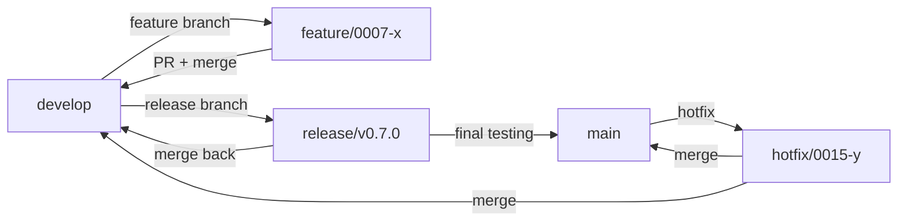

# Branching Strategy - Git Workflow

**Purpose**: Define how we use Git branches for feature development, releases, and hotfixes.

**Last Updated**: 2025-11-04
**Owner**: Engineering Team

---

## Strategy: Trunk-Based Development (Modified)

**Core Principle**: Developers work on short-lived feature branches, merged to `develop` frequently (< 3 days). Releases cut from `develop` → `main`.

**Why This Strategy?**
- ✅ Fast integration (reduces merge conflicts)
- ✅ Continuous delivery ready (always releasable)
- ✅ Simple mental model (less branch complexity)
- ✅ Supports feature flags (gradual rollouts)

**NOT using**: GitFlow (too heavyweight for fast iteration)

---

## Branch Types

| Branch Type | Naming | Lifetime | Purpose | Merged To |
|-------------|--------|----------|---------|-----------|
| **Main** | `main` | Permanent | Production code | N/A (only receives merges) |
| **Develop** | `develop` | Permanent | Integration branch | `main` (releases) |
| **Feature** | `feature/###-short-name` | Short-lived (1-3 days) | New features, enhancements | `develop` |
| **Bugfix** | `bugfix/###-short-name` | Short-lived (< 1 day) | Non-critical bug fixes | `develop` |
| **Hotfix** | `hotfix/###-short-name` | Short-lived (< 4 hours) | Critical production fixes | `main` + `develop` |
| **Release** | `release/v1.2.0` | Short-lived (< 1 day) | Release prep, final QA | `main` + `develop` |
| **Experiment** | `experiment/###-spike-name` | Time-boxed (< 7 days) | Prototypes, POCs | `develop` (if successful) or deleted |

---

## Branch Naming Convention

**Format**: `<type>/<increment-id>-<short-description>`

**Examples**:
- ✅ `feature/0007-smart-discipline`
- ✅ `bugfix/0012-fix-auth-token`
- ✅ `hotfix/0015-payment-crash`
- ✅ `release/v0.7.0`
- ✅ `experiment/0020-graphql-spike`

**Rules**:
- Use lowercase, kebab-case
- Include increment ID (traceability to `.specweave/increments/`)
- Max 50 characters
- No special characters except `-`

---

## Workflow Diagram



---

## Feature Development Workflow

### 1. Create Feature Branch
```bash
# Always branch from develop
git checkout develop
git pull origin develop
git checkout -b feature/0007-smart-discipline
```

### 2. Work on Feature
```bash
# Make commits frequently (small, logical chunks)
git add .
git commit -m "feat: add pause command"
git push origin feature/0007-smart-discipline
```

**Commit Message Format**: See [Commit Standards](#commit-message-standards)

### 3. Keep Branch Updated
```bash
# Merge develop frequently (avoid long-lived branches)
git checkout develop
git pull origin develop
git checkout feature/0007-smart-discipline
git merge develop
```

**Rebase vs. Merge**: Use **merge** (preserves history, safer for shared branches)

### 4. Open Pull Request
```bash
# Via GitHub CLI or web UI
gh pr create --base develop --title "feat: smart increment discipline" --body "Closes #123"
```

**PR Requirements**:
- ✅ All tests pass (CI/CD green)
- ✅ Code review approved (1+ reviewer)
- ✅ No merge conflicts
- ✅ Increment docs updated (spec.md, tasks.md)

### 5. Merge to Develop
```bash
# Squash merge (keeps develop history clean)
gh pr merge --squash --delete-branch
```

**Merge Strategy**: **Squash merge** (feature branches → develop)

---

## Release Workflow

### 1. Create Release Branch
```bash
# Branch from develop when ready to release
git checkout develop
git pull origin develop
git checkout -b release/v0.7.0
```

### 2. Finalize Release
```bash
# Update version numbers
npm version minor  # or patch/major

# Update CHANGELOG.md
vim CHANGELOG.md

# Commit changes
git commit -am "chore: prepare release v0.7.0"
git push origin release/v0.7.0
```

### 3. Final Testing
- Run full test suite (unit, integration, E2E)
- Manual smoke testing (critical paths)
- Security scan (OWASP, dependency check)

### 4. Merge to Main
```bash
# Create PR to main
gh pr create --base main --title "Release v0.7.0" --body "Release notes..."

# Merge (use merge commit, not squash)
gh pr merge --merge --no-delete-branch
```

**Merge Strategy**: **Merge commit** (release → main, preserves history)

### 5. Tag Release
```bash
# Tag main with version
git checkout main
git pull origin main
git tag -a v0.7.0 -m "Release v0.7.0"
git push origin v0.7.0
```

### 6. Merge Back to Develop
```bash
# Ensure develop gets release changes
git checkout develop
git merge release/v0.7.0
git push origin develop

# Delete release branch
git branch -d release/v0.7.0
git push origin --delete release/v0.7.0
```

---

## Hotfix Workflow

**Use Case**: Critical production bug requiring immediate fix (can't wait for next release).

### 1. Create Hotfix Branch
```bash
# Branch from main (production)
git checkout main
git pull origin main
git checkout -b hotfix/0015-payment-crash
```

### 2. Fix Issue
```bash
# Make minimal changes (only the fix, no extras)
git add .
git commit -m "hotfix: fix payment processing crash"
git push origin hotfix/0015-payment-crash
```

### 3. Test Hotfix
- Run tests locally
- Deploy to staging environment
- Verify fix works

### 4. Merge to Main
```bash
# Create PR to main (expedited review)
gh pr create --base main --title "Hotfix: payment crash" --body "Fixes #456"

# Merge (fast-track approval)
gh pr merge --squash
```

### 5. Merge to Develop
```bash
# Ensure develop gets the hotfix
git checkout develop
git merge hotfix/0015-payment-crash
git push origin develop

# Delete hotfix branch
git branch -d hotfix/0015-payment-crash
git push origin --delete hotfix/0015-payment-crash
```

### 6. Tag Hotfix Release
```bash
# Tag main with patch version
git checkout main
git pull origin main
git tag -a v0.6.1 -m "Hotfix v0.6.1"
git push origin v0.6.1
```

---

## Commit Message Standards

**Format**: `<type>(<scope>): <subject>`

**Types**:
- `feat`: New feature
- `fix`: Bug fix
- `hotfix`: Critical production fix
- `refactor`: Code refactoring (no behavior change)
- `test`: Add/update tests
- `docs`: Documentation changes
- `chore`: Build, tooling, dependencies

**Examples**:
- ✅ `feat(inc): add pause command for blocked increments`
- ✅ `fix(auth): resolve token expiration bug`
- ✅ `hotfix(payment): fix stripe webhook processing crash`
- ✅ `refactor(core): extract plugin loader to separate module`
- ✅ `test(e2e): add playwright test for increment creation`
- ✅ `docs(spec): update spec-0007 with implementation notes`
- ✅ `chore(deps): bump @anthropic-ai/sdk to 0.12.0`

**Subject Rules**:
- Lowercase, imperative mood ("add" not "added")
- Max 72 characters
- No period at end

---

## Branch Protection Rules

### Main Branch
- ✅ Require PR reviews (1+ approvals)
- ✅ Require status checks (CI/CD green)
- ✅ Require up-to-date branch (no stale merges)
- ✅ Require linear history (no merge commits from features)
- ✅ Restrict force push (admins only)
- ✅ Restrict deletion (admins only)

### Develop Branch
- ✅ Require PR reviews (1+ approvals)
- ✅ Require status checks (CI/CD green)
- ✅ Restrict force push (admins only)

### Feature Branches
- No restrictions (developers have full control)
- Force push allowed (for rebasing, amending commits)

---

## Best Practices

1. **Keep branches short-lived** (<  3 days) - Reduces merge conflicts
2. **Merge develop frequently** (daily) - Stay up-to-date
3. **Small commits** (logical chunks) - Easier to review, revert
4. **Descriptive branch names** (include increment ID) - Traceability
5. **Delete merged branches** - Keep repo clean
6. **No direct commits to main/develop** - Always use PRs
7. **Use feature flags for WIP features** - Merge early, enable later
8. **Squash merge feature branches** - Clean develop history
9. **Merge commit for releases** - Preserve release history

---

## Common Scenarios

### Scenario 1: Feature Branch Conflicts with Develop
```bash
# Merge develop into feature branch
git checkout feature/0007-smart-discipline
git merge develop
# Resolve conflicts
git add .
git commit -m "merge: resolve conflicts with develop"
git push origin feature/0007-smart-discipline
```

### Scenario 2: Accidental Commit to Develop
```bash
# Revert commit (if not pushed yet)
git checkout develop
git reset --soft HEAD~1

# Move changes to feature branch
git stash
git checkout -b feature/0008-accidental-work
git stash pop
git add .
git commit -m "feat: accidental work moved to feature branch"
```

### Scenario 3: Need to Delete Remote Branch
```bash
# Delete local branch
git branch -d feature/0007-smart-discipline

# Delete remote branch
git push origin --delete feature/0007-smart-discipline
```

---

## Tools

- **GitHub CLI**: `gh pr create`, `gh pr merge`, etc.
- **Git aliases**: Set up shortcuts for common commands
- **Pre-commit hooks**: Run linters, tests before commit (see `.claude/hooks/`)
- **Branch cleanup**: `git remote prune origin` (remove stale references)

---

## Related Documentation

- [DORA Metrics](./dora-metrics) - Links to deployment frequency, lead time
- [Code Review Standards](./code-review-standards) - PR review guidelines
- [Release Process](./release-process) - Full release checklist
- **CI/CD Pipeline** - *Coming soon* - Automated testing, deployment strategy

---

## References

- [Trunk-Based Development](https://trunkbaseddevelopment.com/) - Strategy background
- [Conventional Commits](https://www.conventionalcommits.org/) - Commit message format
- [GitHub Flow](https://docs.github.com/en/get-started/quickstart/github-flow) - Similar workflow
