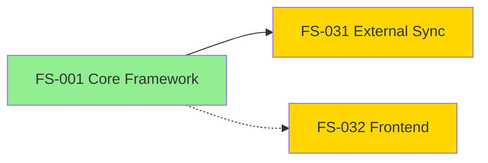

# Q4 2026 Platform Modernization

## Metadata

**Timeline**: Oct 1 - Dec 31, 2026
**Status**: 🚧 In Progress
**Teams**: Platform Team (3 engineers), Frontend Team (2 engineers)
**Epics**: FS-001 (✅ Complete), FS-031 (🚧 In Progress), FS-032 (🚧 In Progress)

**External Tool Links**:
- **Azure DevOps**: [Q4 2026 Platform Plan](https://dev.azure.com/org/project/_plans/planId=123)
- **JIRA**: [2026 Product Roadmap](https://company.atlassian.net/jira/plans/456)
- **GitHub**: [Platform Modernization](https://github.com/orgs/company/projects/10)

---

## Overview

**Goal**: Modernize the platform infrastructure and establish bidirectional sync with external project management tools (ADO, JIRA, GitHub).

**Business Value**:
- Enable enterprise teams to track work in existing tools (ADO/JIRA/GitHub)
- Improve cross-team coordination with visual delivery planning
- Establish foundation for living documentation system

**Success Metrics**:
- All 3 epics shipped by Dec 31, 2026
- 100% bidirectional sync working (local ↔ external tools)
- Zero regressions in existing functionality

---

## Timeline

### October-November: Foundation (Weeks 1-8)

#### FS-001: Core Framework Architecture ✅ COMPLETE
- **Status**: ✅ Completed (Nov 15, 2026)
- **Team**: Platform Team
- **Delivered**:
  - Increment lifecycle enforcement (WIP limits, smart transitions)
  - Living docs sync automation (specs → internal docs)
  - Status line with &lt;1ms render
- **Increments**: 0001-0021 (foundation work)

### October-December: Parallel Track (Weeks 1-12)

#### FS-032: Frontend Component Library 🚧 IN PROGRESS
- **Status**: 🚧 In Progress (60% complete)
- **Team**: Frontend Team
- **Timeline**: Oct 15 - Dec 15, 2026
- **Dependencies**: None (independent track)
- **Delivered**:
  - React component library with Storybook
  - Design system tokens
  - Accessibility audit (WCAG 2.1 AA)

### December: Integration (Weeks 9-13)

#### FS-031: External Tool Status Sync 🚧 IN PROGRESS
- **Status**: 🚧 In Progress (planning phase)
- **Team**: Platform Team
- **Timeline**: Dec 1 - Dec 31, 2026
- **Dependencies**: FS-001 (COMPLETE ✅)
- **Deliverables**:
  - Bidirectional status sync (local ↔ ADO/JIRA/GitHub)
  - Rich issue content mapping
  - Task-level granularity
  - Conflict resolution
- **Current Increment**: 0031-external-tool-status-sync

---

## Dependencies

**Legend**:
- 🟢 Green = Completed
- 🟡 Yellow = In Progress
- Solid arrow = Hard dependency (blocks)
- Dotted arrow = Soft dependency (enhances)

---

## External Tool Links

### Azure DevOps Delivery Plan
🔗 [Q4 2026 Platform Plan](https://dev.azure.com/org/project/_plans/planId=123)

**What It Shows**:
- Epic timeline across sprints
- Team capacity and allocation
- Dependencies visualization

### JIRA Roadmap
🔗 [2026 Product Roadmap](https://company.atlassian.net/jira/plans/456)

**What It Shows**:
- Strategic initiative timeline
- Release version grouping
- Cross-project dependencies

### GitHub Project
🔗 [Platform Modernization](https://github.com/orgs/company/projects/10)

**What It Shows**:
- Kanban board for all epics
- Milestone tracking
- Issue status across repos

---

## Team Allocation

### Platform Team (3 engineers)
- **Focus**: Core framework + External tool integration
- **Q4 Workload**:
  - Oct-Nov: FS-001 (100% allocation)
  - Dec: FS-031 (100% allocation)
- **Status**: ✅ On track

### Frontend Team (2 engineers)
- **Focus**: Component library + Design system
- **Q4 Workload**:
  - Oct-Dec: FS-032 (100% allocation)
- **Status**: ✅ On track (60% complete)

---

## Risks & Mitigations

### 🔴 HIGH RISK: FS-031 Timeline Aggressive
- **Risk**: External tool sync has complex conflict resolution
- **Probability**: Medium (50%)
- **Impact**: High (blocks enterprise adoption)
- **Mitigation**:
  - Start with ADO-only (simplest API)
  - Phase 2: JIRA, Phase 3: GitHub
  - Have fallback: Manual sync command

### 🟡 MEDIUM RISK: Frontend Team Capacity
- **Risk**: 2 engineers for large component library
- **Probability**: Low (30%)
- **Impact**: Medium (delays Q1 features)
- **Mitigation**:
  - Focus on P1 components only (buttons, forms, tables)
  - Defer P2 components to Q1 2027
  - Have design system tokens ready early

### 🟢 LOW RISK: FS-001 Dependency Chain
- **Risk**: FS-031 depends on FS-001 completion
- **Probability**: Low (10%)
- **Impact**: Low (FS-001 already complete)
- **Status**: ✅ Mitigated (FS-001 shipped Nov 15)

---

## Retrospective (End of Quarter)

**What Went Well**:
- TBD (fill in after Dec 31)

**What Could Be Improved**:
- TBD (fill in after Dec 31)

**Action Items for Q1 2027**:
- TBD (fill in after Dec 31)

---

## Related Documents

### Strategic Context
- [PRD: External Tool Integration](../../strategy/prd-external-tool-integration.md)
- [PRD: Frontend Component System](../../strategy/prd-frontend-components.md)

### Technical Details
- [FS-001: Core Framework](../../specs/default/FS-001-core-framework/README.md)
- [FS-031: External Tool Status Sync](../../specs/default/FS-031-external-tool-status-sync/README.md)
- [FS-032: Frontend Components](../../specs/default/FS-032-frontend-components/README.md)

### Implementation
- [Increment 0031](../../../increments/_archive/0031-external-tool-status-sync/spec.md)
- [Increment 0032](../../../increments/_archive/0032-frontend-components/spec.md)

---

**Last Updated**: 2026-01-02 (reviewed during increment 0031 planning)
**Next Review**: 2026-12-01 (mid-quarter check-in)
