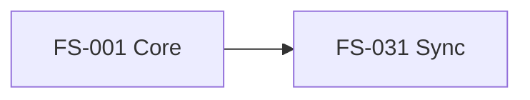
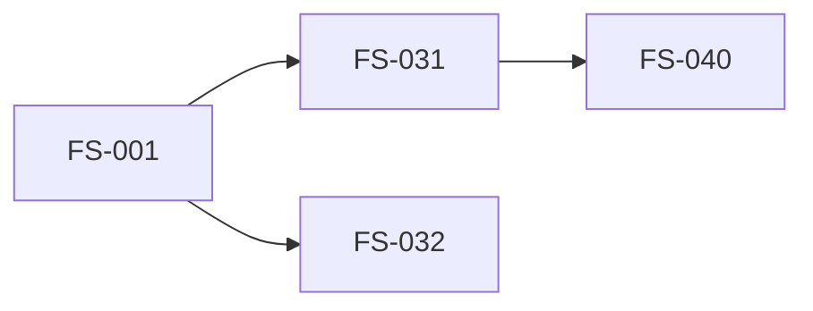

# Delivery Plans

**Purpose**: Coordinate **WHEN** and **HOW** features ship across teams, sprints, and quarters.

**Scope**: Cross-project release planning and timeline coordination.

---

## What Are Delivery Plans?

Delivery plans connect **business strategy** to **execution timeline**:

- **Strategic layer** (3-12 months): Which epics ship when?
- **Tactical layer** (1-3 months): Sprint planning, dependencies
- **Operational layer** (1-4 weeks): Day-to-day increment execution

**Key Questions Answered**:
- When does Epic X ship?
- What are the dependencies between epics?
- Which teams are working on what?
- What's our quarterly roadmap?

---

## Relationship to Other Docs

| Folder | Focus | Example |
|--------|-------|---------|
| **strategy/** | WHY? (Business case) | PRDs, market research |
| **specs/** | WHAT? (Feature details) | Epics (FS-*), User Stories (US-*) |
| **architecture/** | HOW? (Technical design) | HLDs, ADRs |
| **delivery/plans/** | **WHEN? (Timeline)** | **Quarterly roadmaps, sprint plans** |
| **operations/** | RUN? (Production) | Runbooks, incidents |

**Flow**: `strategy → specs → architecture → delivery/plans → operations`

---

## File Format

**Naming**: `{year}-{quarter}-{theme}.md` or `{year}-{month}-{theme}.md`

**Examples**:
- `2026-q4-platform.md` - Q4 2026 platform modernization
- `2027-q1-features.md` - Q1 2027 feature releases
- `2026-11-sprint-23.md` - Sprint 23 (November 2026)

**Template**:

```yaml
---
id: delivery-2026-q4
title: "Q4 2026 Platform Modernization"
timeline: "Oct 1 - Dec 31, 2026"
status: "in-progress"
external_tools:
  ado_plan:
    name: "Q4 2026 Platform"
    url: "https://dev.azure.com/org/project/_plans/planId=123"
  jira_roadmap:
    name: "2026 Product Roadmap"
    url: "https://company.atlassian.net/jira/plans/456"
  github_project:
    name: "Platform Modernization"
    url: "https://github.com/orgs/company/projects/10"
epics:
  - id: FS-001
    title: "Core Framework Architecture"
    timeline: "Oct 1 - Nov 15"
    status: "completed"
  - id: FS-031
    title: "External Tool Status Sync"
    timeline: "Dec 1 - Dec 31"
    status: "in-progress"
    depends_on: [FS-001]
teams:
  - name: "Platform Team"
    capacity: 3 engineers
    focus: [FS-001, FS-031]
---

# Q4 2026 Platform Modernization

## Overview
Strategic goals for Q4 2026...

## Timeline

### October-November: Foundation
- **FS-001**: Core Framework Architecture
  - Status: ✅ Completed (Nov 15)
  - Delivered: Increment lifecycle, living docs sync

### December: Integration
- **FS-031**: External Tool Status Sync
  - Status: 🚧 In Progress
  - Depends on: FS-001
  - Target: Dec 31, 2026

## External Plans
- [ADO Delivery Plan](https://dev.azure.com/org/project/_plans/planId=123)
- [JIRA Roadmap](https://company.atlassian.net/jira/plans/456)
- [GitHub Project](https://github.com/orgs/company/projects/10)

## Dependencies


## Risks
- FS-031 depends on FS-001 completion
- ADO API rate limits may impact sync performance

## Team Allocation
- **Platform Team**: FS-001, FS-031
- **Frontend Team**: (blocked on FS-001)
```

---

## Linking Strategy

### From Epic to Delivery Plan

**Epic frontmatter** references delivery plan:

```yaml
# .specweave/docs/internal/specs/default/FS-031/README.md
---
id: FS-031
title: "External Tool Status Sync"
delivery:
  plan: "delivery-2026-q4"
  plan_file: "../../delivery/plans/2026-q4-platform.md"
  timeline: "Dec 1-31, 2026"
external_tools:
  ado:
    plan_url: "https://dev.azure.com/.../plans/456"
---
```

### From Delivery Plan to Epics

**Delivery plan** lists epics:

```yaml
# .specweave/docs/internal/delivery/plans/2026-q4-platform.md
epics:
  - id: FS-031
    title: "External Tool Status Sync"
    timeline: "Dec 2026"
    depends_on: [FS-001]
```

**Result**: Bidirectional linking for full traceability!

---

## External Tool Integration

### Azure DevOps Delivery Plans

**Mapping**:
- SpecWeave delivery plan → ADO Delivery Plan
- SpecWeave epic (FS-*) → ADO Epic
- Timeline visualization in ADO

**Sync** (future):
```bash
/specweave-ado:link-plan FS-031 --plan-id 456
```

### JIRA Roadmaps

**Mapping**:
- SpecWeave delivery plan → JIRA Advanced Roadmap
- SpecWeave epic (FS-*) → JIRA Epic
- Dependencies visualization

**Sync** (future):
```bash
/specweave-jira:link-roadmap FS-031 --roadmap-id 789
```

### GitHub Projects

**Mapping**:
- SpecWeave delivery plan → GitHub Project (v2)
- SpecWeave epic (FS-*) → GitHub Milestone
- Kanban + roadmap views

**Sync** (future):
```bash
/specweave-github:link-project FS-031 --project-id 20
```

---

## When to Create Delivery Plans

### Solo Developers
**Optional** - Delivery plans are overkill for solo projects. Just use:
- Increment specs (`spec.md`, `plan.md`, `tasks.md`)
- Epic folders (FS-*) for long-term features

### Small Teams (2-5)
**Quarterly plans** - One delivery plan per quarter:
- `2026-q4-platform.md` - Q4 goals
- Link epics to plan
- Update monthly

### Enterprise Teams (5+)
**Quarterly + Sprint plans** - Two-level planning:
- **Quarterly**: `2026-q4-platform.md` (strategic)
- **Sprint**: `2026-11-sprint-23.md` (tactical)
- Sync with ADO/JIRA/GitHub tools

---

## Best Practices

### 1. Keep Plans Lightweight
- **Summary + links** (not full data duplication)
- External tool = source of truth
- SpecWeave plan = coordination layer

### 2. Update Regularly
- **After each sprint**: Update epic statuses
- **After epic completion**: Mark complete, link deliverables
- **Quarterly**: Review dependencies, adjust timeline

### 3. Link Bidirectionally
- Epic → Delivery plan (frontmatter)
- Delivery plan → Epics (list)
- External tool → Both (URLs)

### 4. Visualize Dependencies
Use Mermaid diagrams:


---

## Migration from Specs

**If you have delivery plans in `specs/`**, move them here:

```bash
# Move release-management (example)
mv .specweave/docs/internal/specs/default/release-management \
   .specweave/docs/internal/delivery/release-management

# Update any references in epic frontmatter
```

**Why?** Delivery plans are about **WHEN/HOW we ship**, not **WHAT we're building**.

---

## See Also

- [Delivery README](../README.md) - Overview of delivery docs
- [DORA Metrics](../dora-metrics.md) - How we measure shipping velocity
- [Release Process](../release-process.md) - How we version and publish
- [Branch Strategy](../branch-strategy.md) - How we manage code
