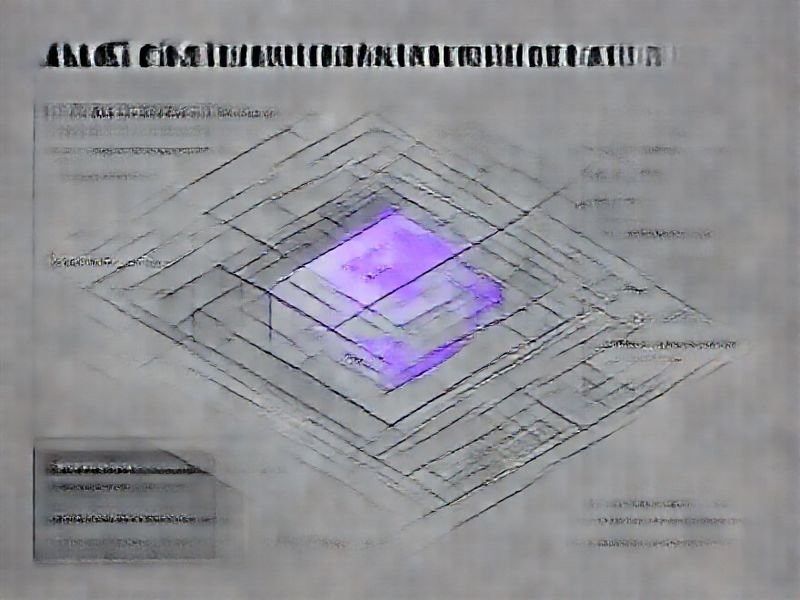

# Wire AC Completion to GitHub Comments & Fix Bidirectional Multi-Repo Sync

## TL;DR

**What**: A comprehensive grill of the external tool integration revealed the "last mile" is missing from the sync chain.
**Status**: completed | **Priority**: P1
**User Stories**: 5

## Overview

A comprehensive grill of the external tool integration revealed the "last mile" is missing from the sync chain. The hook architecture is production-grade (dispatchers, circuit breakers, file locking, error isolation), but AC completion events never reach GitHub. The chain stops at spec.md. Additionally, bidirectional sync only works for push direction in multi-repo setups. 0% test coverage exists on the critical AC-to-GitHub path across 666 test cases.

## Implementation History

| Increment | Status | Completion Date |
|-----------|--------|----------------|
| [0193-github-sync-ac-comment-wiring](../../../../increments/0193-github-sync-ac-comment-wiring/spec.md) | ✅ completed | 2026-02-07T00:00:00.000Z |

## User Stories

- [US-001: AC Completion Triggers GitHub Progress Comment (P1)](./us-001-ac-completion-triggers-github-progress-comment-p1-.md)
- [US-002: AC Completion Updates Issue Body Checkboxes (P1)](./us-002-ac-completion-updates-issue-body-checkboxes-p1-.md)
- [US-003: Auto-Close Issue When All ACs Done (P2)](./us-003-auto-close-issue-when-all-acs-done-p2-.md)
- [US-004: Multi-Repo Pull Sync with All-Repos-Must-Agree (P2)](./us-004-multi-repo-pull-sync-with-all-repos-must-agree-p2-.md)
- [US-005: Test Coverage for Critical AC-to-GitHub Path (P1)](./us-005-test-coverage-for-critical-ac-to-github-path-p1-.md)
