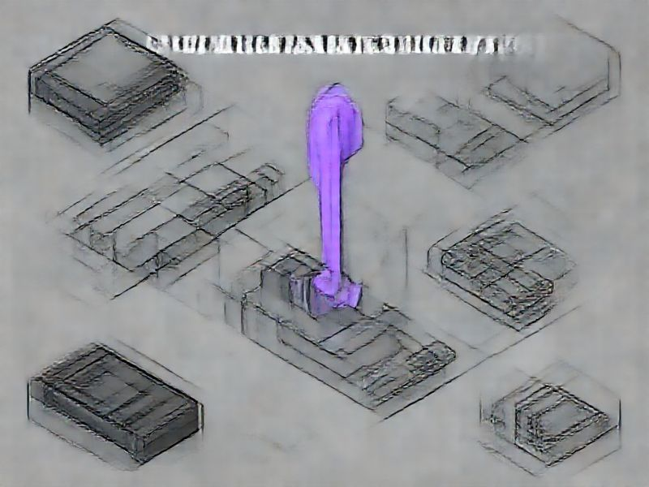

# 0196 - Auto Mode v5 - Stop Hook Simplification

## TL;DR

**What**: The auto mode stop hook (`plugins/specweave/hooks/stop-auto.
**Status**: completed | **Priority**: P1
**User Stories**: 4

## Overview

The auto mode stop hook (`plugins/specweave/hooks/stop-auto.sh`) has grown to 1320 lines despite ADR-0225 targeting ~118 lines. Critical issues found during code review:

## Implementation History

| Increment | Status | Completion Date |
|-----------|--------|----------------|
| [0196-auto-mode-v5-stop-hook](../../../../increments/0196-auto-mode-v5-stop-hook/spec.md) | ✅ completed | 2026-02-10 |

## User Stories

- [US-001: Reliable Auto Mode Blocking](./us-001-reliable-auto-mode-blocking.md)
- [US-002: Safety Mechanisms](./us-002-safety-mechanisms.md)
- [US-003: Honest Documentation](./us-003-honest-documentation.md)
- [US-004: Tested Infrastructure](./us-004-tested-infrastructure.md)
