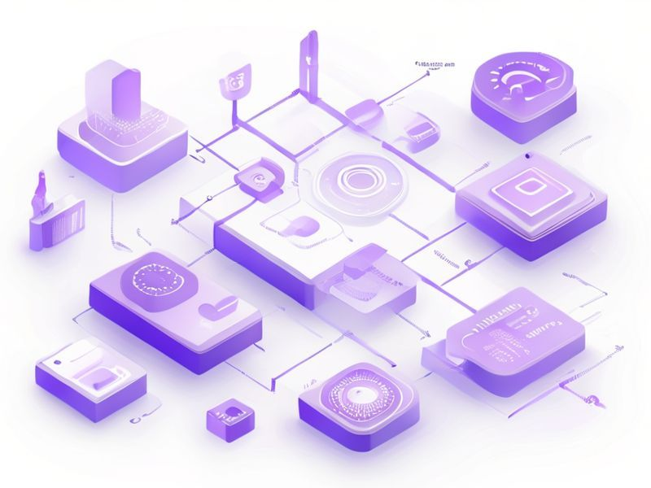

# Router Brain Orchestrator

## TL;DR

**What**: Transform the SpecWeave router into a true "brain" that orchestrates every user prompt through intelligent skill routing, plugin management, and workflow guidance.
**Status**: active | **Priority**: P1
**User Stories**: 4

## Overview

Transform the SpecWeave router into a true "brain" that orchestrates every user prompt through intelligent skill routing, plugin management, and workflow guidance.

## Implementation History

| Increment | Status | Completion Date |
|-----------|--------|----------------|
| [0174-router-brain-orchestrator](../../../../increments/0174-router-brain-orchestrator/spec.md) | ⏳ active | 2025-01-23 |

## User Stories

- [US-001: Skill Routing Detection](./us-001-skill-routing-detection.md)
- [US-002: Workflow Sequencing](./us-002-workflow-sequencing.md)
- [US-003: Multi-Skill Coordination](./us-003-multi-skill-coordination.md)
- [US-004: Brain Message Injection](./us-004-brain-message-injection.md)
