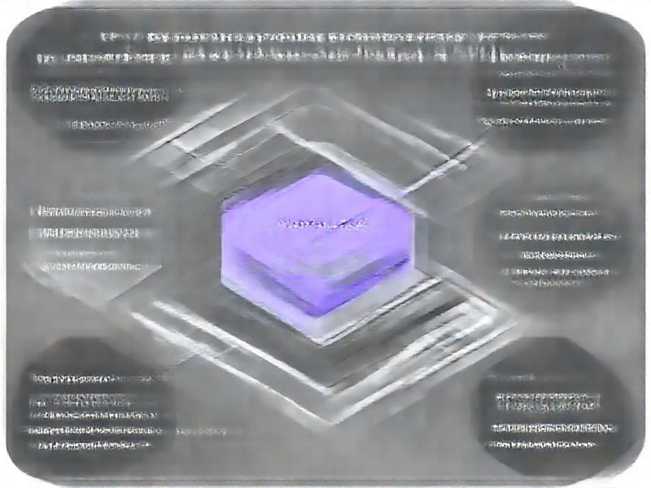

# Multi-Language LSP Warm-up & Configurable Timeouts

## TL;DR

**What**: The current SpecWeave LSP implementation has critical limitations for non-TypeScript projects:
1.
**Status**: completed | **Priority**: P1
**User Stories**: 8

## Overview

The current SpecWeave LSP implementation has critical limitations for non-TypeScript projects:
1. **TypeScript-only warm-up**: Warm-up logic only searches for TypeScript files, causing "No files found" for C#/Go/Python projects
2. **Fixed 60s timeout**: Insufficient for C# (csharp-ls needs 30-90s for solution indexing on medium projects)
3. **No project file awareness**: C# LSP servers need .sln file path for proper multi-project loading
4. **No server recommendations**: Users must manually research and configure LSP servers

## Implementation History

| Increment | Status | Completion Date |
|-----------|--------|----------------|
| [0183-multi-language-lsp](../../../../increments/0183-multi-language-lsp/spec.md) | ✅ completed | 2026-02-04T00:00:00.000Z |

## User Stories

- [US-001: Language-Aware Warm-up (P1)](./us-001-language-aware-warm-up-p1-.md)
- [US-002: Configurable Timeouts (P1)](./us-002-configurable-timeouts-p1-.md)
- [US-003: LSP Server Recommendations (P1)](./us-003-lsp-server-recommendations-p1-.md)
- [US-004: Custom LSP Server Registration (P2)](./us-004-custom-lsp-server-registration-p2-.md)
- [US-005: Progress Feedback & Diagnostics (P1)](./us-005-progress-feedback-diagnostics-p1-.md)
- [US-006: Symbol Caching (P2)](./us-006-symbol-caching-p2-.md)
- [US-007: Error Handling & Fallback (P1)](./us-007-error-handling-fallback-p1-.md)
- [US-008: Modular Code Architecture (P2)](./us-008-modular-code-architecture-p2-.md)
