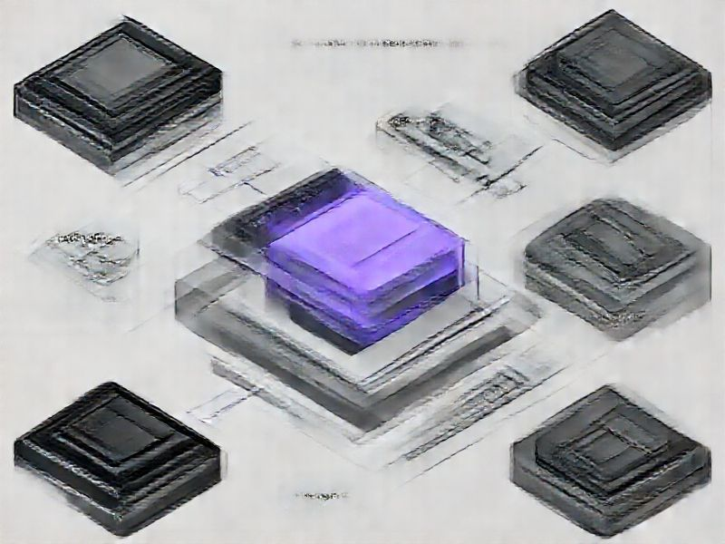

# Sync Architecture Redesign

## TL;DR

**What**: SpecWeave's external sync system (GitHub, JIRA, A.
**Status**: completed | **Priority**: P0
**User Stories**: 12

## Overview

SpecWeave's external sync system (GitHub, JIRA, A

## Implementation History

| Increment | Status | Completion Date |
|-----------|--------|----------------|
| [0190-sync-architecture-redesign](../../../../increments/0190-sync-architecture-redesign/spec.md) | ✅ completed | 2026-02-06T00:00:00.000Z |

## User Stories

- [US-001: Platform Suffix ID Convention (P0)](./us-001-platform-suffix-id-convention-p0-.md)
- [US-002: Increment Folder Platform Suffix (P0)](./us-002-increment-folder-platform-suffix-p0-.md)
- [US-003: E-to-Platform Suffix Migration (P1)](./us-003-e-to-platform-suffix-migration-p1-.md)
- [US-004: Clean Issue Title Format (P0)](./us-004-clean-issue-title-format-p0-.md)
- [US-005: Flexible Hierarchy Mapping (P0)](./us-005-flexible-hierarchy-mapping-p0-.md)
- [US-006: Provider-Based Module Consolidation (P1)](./us-006-provider-based-module-consolidation-p1-.md)
- [US-007: Permission Presets (P1)](./us-007-permission-presets-p1-.md)
- [US-008: Fix Broken Label Generation (P0)](./us-008-fix-broken-label-generation-p0-.md)
- [US-009: GitHub Projects v2 Integration (P1)](./us-009-github-projects-v2-integration-p1-.md)
- [US-010: Sync Setup Skill (P1)](./us-010-sync-setup-skill-p1-.md)
- [US-011: Config Consistency and Self-Healing (P0)](./us-011-config-consistency-and-self-healing-p0-.md)
- [US-012: Full E2E Test Suite Per Provider (P1)](./us-012-full-e2e-test-suite-per-provider-p1-.md)
