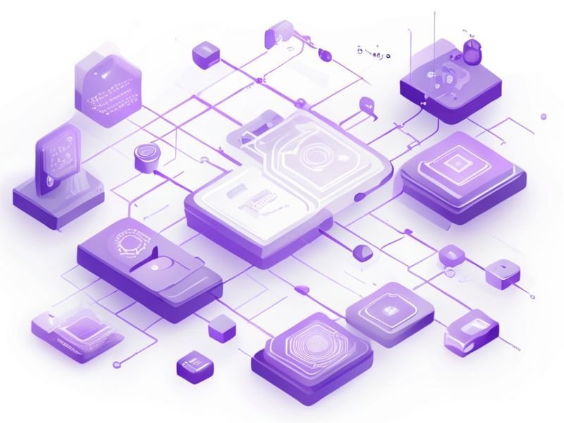

# Pull-based SAST scanning

## TL;DR

**What**: External SAST scans (semgrep, njsscan, trufflehog) are currently dispatched via push: the platform's `dispatchExternalScans()` does an HTTP POST to Het.
**Status**: completed | **Priority**: P1
**User Stories**: 6

## Overview

External SAST scans (semgrep, njsscan, trufflehog) are currently dispatched via push: the platform's `dispatchExternalScans()` does an HTTP POST to Het

## Implementation History

| Increment | Status | Completion Date |
|-----------|--------|----------------|
| [0396-pull-based-sast-scanner](../../../../../increments/0396-pull-based-sast-scanner/spec.md) | ✅ completed | 2026-03-02T00:00:00.000Z |

## User Stories

- [US-001: Platform API for Pending SAST Scans (P1)](./us-001-platform-api-for-pending-sast-scans-p1.md)
- [US-002: Atomic Claim Endpoint for SAST Scans (P1)](./us-002-atomic-claim-endpoint-for-sast-scans-p1.md)
- [US-003: Schema Migration for Claim Tracking (P1)](./us-003-schema-migration-for-claim-tracking-p1.md)
- [US-004: Crawl-Worker SAST Scanner Source (P1)](./us-004-crawl-worker-sast-scanner-source-p1.md)
- [US-005: Lightweight Enqueue (Feature-Flagged Push Bypass) (P1)](./us-005-lightweight-enqueue-feature-flagged-push-bypass-p1.md)
- [US-006: Scheduler Integration and VM Deployment (P2)](./us-006-scheduler-integration-and-vm-deployment-p2.md)
