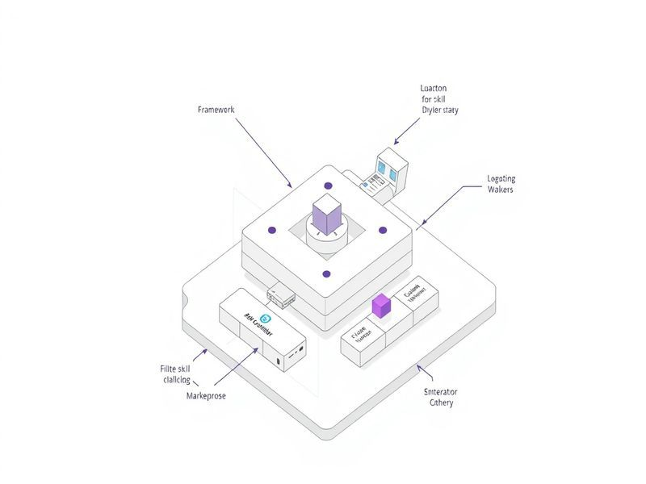

# Filter Framework Plugin Skills from Marketplace

## TL;DR

**What**: The vskill-platform scanner discovers SKILL.md files from `anton-aby.
**Status**: completed | **Priority**: P0
**User Stories**: 6

## Overview

The vskill-platform scanner discovers SKILL.md files from `anton-aby

## Implementation History

| Increment | Status | Completion Date |
|-----------|--------|----------------|
| [0444-filter-framework-plugin-skills](../../../../../increments/0444-filter-framework-plugin-skills/spec.md) | ✅ completed | 2026-03-07T00:00:00.000Z |

## User Stories

- [US-001: Framework Plugin Path Filter (P0)](./us-001-framework-plugin-path-filter-p0.md)
- [US-002: Unified Rejection Wrapper (P0)](./us-002-unified-rejection-wrapper-p0.md)
- [US-003: Migrate TypeScript Call Sites (P0)](./us-003-migrate-typescript-call-sites-p0.md)
- [US-004: Update Crawl-Worker JS Copies (P0)](./us-004-update-crawl-worker-js-copies-p0.md)
- [US-005: Clean Up Existing Misclassified DB Entries (P1)](./us-005-clean-up-existing-misclassified-db-entries-p1.md)
- [US-006: Update Existing Tests (P1)](./us-006-update-existing-tests-p1.md)
