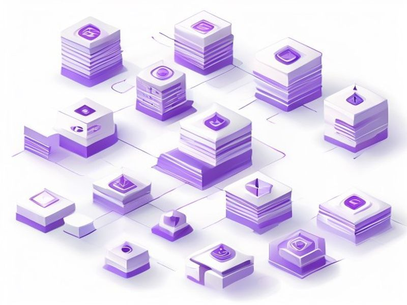

# Rescan Published Skills for Trust Elevation

## TL;DR

**What**: 41% of published skills (34,342 out of 84,779) remain at trustTier T2 ("maybe") because they were fast-approved via Tier 1 regex scan only, without Tier 2 LLM analysis.
**Status**: completed | **Priority**: P1
**User Stories**: 2

## Overview

41% of published skills (34,342 out of 84,779) remain at trustTier T2 ("maybe") because they were fast-approved via Tier 1 regex scan only, without Tier 2 LLM analysis. These skills need full re-scanning to elevate to T3 ("verified"), improving overall trust quality across the registry.

## Implementation History

| Increment | Status | Completion Date |
|-----------|--------|----------------|
| [0462-rescan-published-trust-elevation](../../../../../increments/0462-rescan-published-trust-elevation/spec.md) | ✅ completed | 2026-03-09 |

## User Stories

- [US-001: Rescan Published Skills Endpoint (P1)](./us-001-rescan-published-skills-endpoint-p1.md)
- [US-002: Batched Pagination and Observability (P1)](./us-002-batched-pagination-and-observability-p1.md)
