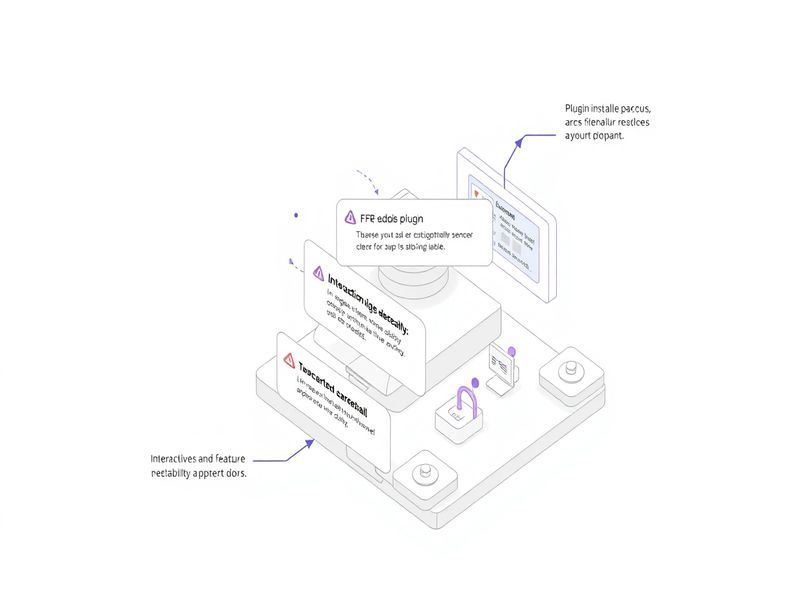

# Plugin install reliability: temp dirs, interactive selection, error messages

## TL;DR

**What**: `vskill install` fails with confusing errors when installing marketplace plugins.
**Status**: completed | **Priority**: P2
**User Stories**: 3

## Overview

`vskill install` fails with confusing errors when installing marketplace plugins. Three root causes have been identified:

## Implementation History

| Increment | Status | Completion Date |
|-----------|--------|----------------|
| [0428-plugin-install-reliability](../../../../../increments/0428-plugin-install-reliability/spec.md) | ✅ completed | 2026-03-05T00:00:00.000Z |

## User Stories

- [US-001: Reliable marketplace registration](./us-001-reliable-marketplace-registration.md)
- [US-002: Interactive plugin selection](./us-002-interactive-plugin-selection.md)
- [US-003: Clear error messages](./us-003-clear-error-messages.md)
