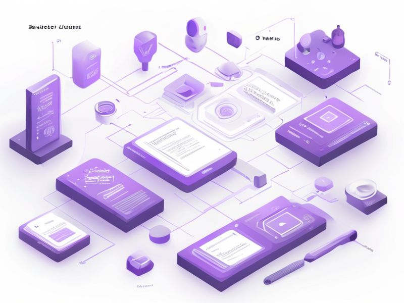

# Fix skill display names after hierarchical URL migration

## TL;DR

**What**: Increment 0447 introduced hierarchical skill URLs (`owner/repo/skillSlug`) and stored the full hierarchical string in the `name` field.
**Status**: completed | **Priority**: P1
**User Stories**: 1

## Overview

Increment 0447 introduced hierarchical skill URLs (`owner/repo/skillSlug`) and stored the full hierarchical string in the `name` field. Frontend components and CLI that previously displayed `name` as a short label now show duplicated or garbled text:

## Implementation History

| Increment | Status | Completion Date |
|-----------|--------|----------------|
| [0449-fix-skill-display-names](../../../../../increments/0449-fix-skill-display-names/spec.md) | ✅ completed | 2026-03-07T00:00:00.000Z |

## User Stories

- [US-002: CLI Display Fix (P1)](./us-002-cli-display-fix-p1.md)

## Related Projects

This feature spans multiple projects:

- [vskill-platform](../../vskill-platform/FS-449/)
