# Strategy Documentation - The "Why"

**Purpose**: Define the business rationale, vision, and success metrics for features and initiatives.

## Documentation Flow

Strategy docs are the **starting point** for all features. They flow through the system like this:



**Flow Explained**:
1. **Strategy** - Define WHY we're building something (PRD, Vision, OKRs)
2. **Specs** - Define WHAT we're building (User Stories, Acceptance Criteria)
3. **Architecture** - Define HOW we design it (HLD, ADRs, Diagrams)
4. **Delivery** - Define HOW we build it (Plan, Tasks, Roadmap)
5. **Operations** - Define HOW we run it (Runbooks, SLOs)
6. **Governance** - Define the guardrails (Security, Standards, Compliance)

## What Goes Here

- **PRD (Product Requirements Document)** - Problem, target users, success metrics, scope
- **Vision Documents** - Long-term product vision
- **OKRs** - Objectives and Key Results
- **Business Cases** - ROI analysis, cost-benefit
- **Stakeholder Maps** - Who cares about what

## Document Structure

### PRD (Product Requirements Document)

**Template**: See `templates/docs/prd-template.md`

**Sections**:
- **Problem** - What problem are we solving?
- **Target Users** - Who is this for?
- **Desired Outcomes / Success Metrics** - How do we measure success?
- **Scope (In / Out)** - What's included and excluded?
- **Assumptions & Risks** - What could go wrong?
- **Alternatives Considered** - What else did we consider?
- **Milestones & Release Criteria** - When are we done?

**Naming Convention**: `prd-{feature-name}.md`

**Example**: `prd-booking-system.md`, `prd-stripe-integration.md`

## Creating a New PRD

1. Copy template: `cp templates/docs/prd-template.md docs/internal/strategy/prd-{feature}.md`
2. Fill in all sections
3. Create PR for review
4. Tag stakeholders and product team
5. Once approved, reference in HLD and Spec

## Index of Strategy Documents

### PRDs

**To create a new PRD**, use the template:

```bash
# Copy template
cp templates/docs/prd-template.md .specweave/docs/internal/strategy/prd-{feature}.md

# Or use the command (future)
/specweave:create-prd "Feature Name"
```

**Current PRDs:**
- *Coming soon* - Convert existing increments to PRDs:
  - Plugin Architecture (Increment 0004)
  - GitHub Sync (specweave-github plugin)
  - Intelligent Model Selection (Increment 0003)

### Vision Documents

**Vision docs define long-term product direction** (3-12 months)

**Current Vision Docs:**
- [Product Vision](./product-vision) - SpecWeave's mission and core value proposition
- [Core Features](./core-features) - Feature set and differentiation

### OKRs

**OKRs track quarterly objectives** with measurable key results

**To create OKRs:**
- Use format: `okr-{year}-q{quarter}.md` (e.g., `okr-2026-q1.md`)
- Track: Adoption metrics, performance KPIs, developer experience scores

**Current OKRs:**
- *Coming soon* - First OKRs will track: NPM downloads, GitHub stars, context reduction metrics

## Related Documentation

- [Architecture Documentation](../architecture/README) - Links PRDs to HLD/ADR/Spec
- [Delivery Documentation](../delivery/README) - Links PRDs to roadmap
- **PRD Template** - Template for creating PRDs (see `src/templates/docs/prd-template.md` in repository)
