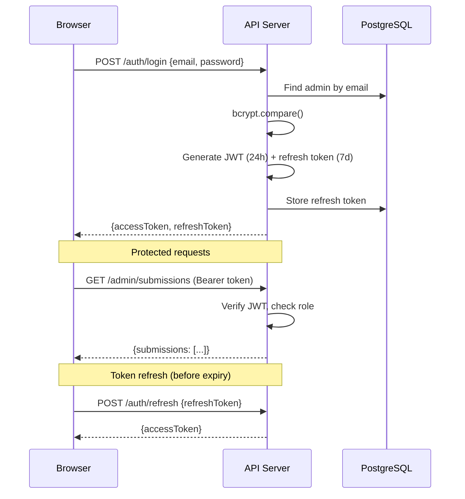

# Admin Dashboard Design Document

**Status**: COMPLETE
**Type**: Internal Strategy Document
**Date**: 2026-02-15
**Increment**: 0217-skill-security-extensibility-standard
**Source**: T-032, T-033, T-039

---

## 1. Overview

The admin dashboard for verified-skill.com enables platform administrators to manage skill submissions, review flagged skills, and monitor platform health. Built with Next.js App Router, shadcn/ui components, and TanStack React Query for data fetching.

---

## 2. Authentication Flow



### Token Configuration
| Parameter | Value |
|-----------|-------|
| Access token TTL | 24 hours |
| Refresh token TTL | 7 days |
| Algorithm | HS256 |
| Password hashing | bcrypt (12 rounds) |

---

## 3. Role Matrix

| Action | SUPER_ADMIN | REVIEWER |
|--------|:-:|:-:|
| View submission queue | Yes | Yes |
| View scan results | Yes | Yes |
| Approve submission | Yes | Yes |
| Reject submission (with reason) | Yes | Yes |
| Escalate to Tier 3 | Yes | No |
| View platform stats | Yes | Yes |
| Manage admins | Yes | No |
| Revoke vendor trust | Yes | No |
| Configuration changes | Yes | No |

---

## 4. Component Architecture

```
AdminLayout
├── Sidebar (navigation)
├── Header (breadcrumbs, search, user menu)
└── Pages
    ├── DashboardOverview
    │   ├── StatsGrid (4 metric cards)
    │   ├── RecentSubmissions (list)
    │   └── TierDistribution (chart)
    ├── SubmissionQueue
    │   ├── StatusTabs (filter by state)
    │   ├── SubmissionTable (sortable)
    │   └── Pagination
    ├── SubmissionDetail
    │   ├── ScanResultsPanel
    │   ├── StateTimeline
    │   ├── SkillContentPreview
    │   └── ActionBar (approve/reject/escalate)
    ├── SkillRegistry
    │   ├── SkillTable
    │   └── SkillDetail
    │       ├── VersionHistory
    │       └── AgentCompatibility
    └── StatsOverview
        ├── SubmissionMetrics (chart)
        ├── ApprovalFunnel
        └── TopCategories
```

---

## 5. Key Workflows

### 5.1 Review a Flagged Submission

```
1. Admin opens Submission Queue
2. Filters by "Needs Review" tab
3. Clicks on submission row
4. Reviews:
   - Tier 1 findings table
   - Tier 2 judge verdict, score, and concerns
   - SKILL.md content preview
   - State transition timeline
5. Actions:
   - Approve → skill published as v1.0.0
   - Reject → enters reason text → submitter notified
   - Escalate → moves to Tier 3 review queue (SUPER_ADMIN only)
```

### 5.2 Monitor Platform Health

```
1. Admin opens Dashboard Overview
2. Views 4 stat cards:
   - Total skills in registry
   - Submissions pending review
   - Approval rate (%)
   - Average scan score
3. Reviews submission trend chart (week/month)
4. Checks tier distribution (scanned/verified/certified)
```

### 5.3 View Skill Version History

```
1. Admin opens Skill Registry
2. Finds skill by name or search
3. Opens skill detail
4. Views version history table:
   - Version number
   - Certification tier + score per version
   - Diff summary from previous version
   - Date verified
5. Each version has its own badge status
```

---

## 6. Data Flow

### Technology
| Layer | Technology |
|-------|-----------|
| Data fetching | TanStack React Query v5 |
| Tables | TanStack Table v8 |
| Charts | Recharts |
| Forms | React Hook Form + Zod |
| UI components | shadcn/ui + Tailwind CSS |
| Routing | Next.js App Router (/admin group) |

### React Query Patterns
- Submission list: refetch every 30s
- Stats: refetch every 60s
- Optimistic updates for approve/reject
- Query key invalidation after mutations

---

## 7. Action Flows

### Approve
```typescript
// Click "Approve" → confirmation dialog → API call → update UI
async function approveSubmission(id: string, notes?: string) {
  await apiClient(`/admin/submissions/${id}/approve`, {
    method: 'PATCH',
    body: JSON.stringify({ notes }),
  });
  // Optimistic: move from queue → approved
  queryClient.invalidateQueries({ queryKey: ['submissions'] });
}
```

### Reject
```typescript
// Click "Reject" → reason textarea → API call → update UI
async function rejectSubmission(id: string, reason: string) {
  await apiClient(`/admin/submissions/${id}/reject`, {
    method: 'PATCH',
    body: JSON.stringify({ reason }),
  });
  // Submitter receives rejection email with reason
  queryClient.invalidateQueries({ queryKey: ['submissions'] });
}
```

### Escalate (SUPER_ADMIN only)
```typescript
// Click "Escalate" → optional reason → API call → update UI
async function escalateSubmission(id: string, reason?: string) {
  await apiClient(`/admin/submissions/${id}/escalate`, {
    method: 'POST',
    body: JSON.stringify({ reason }),
  });
  // Moves to Tier 3 review queue
  queryClient.invalidateQueries({ queryKey: ['submissions'] });
}
```

---

## 8. Security Considerations

| Concern | Mitigation |
|---------|-----------|
| Unauthorized access | JWT verification on every request |
| Role escalation | Role checked in middleware, not client-side |
| CSRF | SameSite=Strict cookies + origin check |
| Brute force | 5 login attempts per 15 min per IP |
| Session management | Refresh token rotation, inactive admin lockout |
| Audit trail | All admin actions logged immutably |

---

## 9. Future Enhancements

| Phase | Feature |
|-------|---------|
| Phase 2 | GitHub OAuth login |
| Phase 2 | Bulk operations (approve/reject multiple) |
| Phase 2 | Real-time updates via WebSocket |
| Phase 3 | Audit log UI (view all admin actions) |
| Phase 3 | Custom dashboard widgets |
| Phase 3 | SSO/SAML for enterprise |

---

## 10. References

- [Admin Auth Design](../../increments/0217-skill-security-extensibility-standard/research/admin-auth-design.md)
- [Admin Dashboard Architecture](../../increments/0217-skill-security-extensibility-standard/research/admin-dashboard-design.md)
- [Submission API Design](../../increments/0217-skill-security-extensibility-standard/research/submission-api-design.md)
