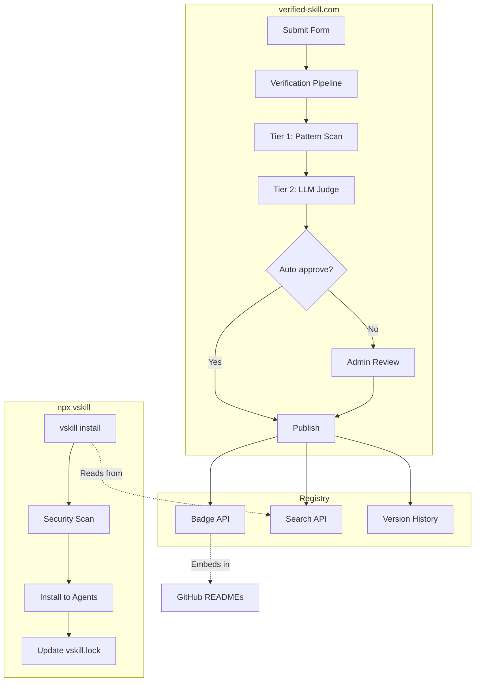

# verified-skill.com — Product Requirements Document

**Status**: COMPLETE
**Type**: Internal Strategy Document
**Date**: 2026-02-15
**Increment**: 0217-skill-security-extensibility-standard
**Source**: T-015, T-022

---

## 1. Executive Summary

verified-skill.com is the authoritative registry for security-verified AI agent skills. It fills a critical gap in the AI agent ecosystem: no existing platform combines deep security scanning, version-pinned verification, and a curated directory. The product serves developers who need to trust the skills they install, skill authors who want discoverability and trust badges, and enterprises that require audit trails and compliance.

---

## 2. Problem

- **36.82%** of AI skills have security flaws (Snyk ToxicSkills, Feb 2026)
- **76** confirmed malicious payloads in the wild
- **Zero versioning** on Skills.sh — upstream pushes silently change all agents
- Existing scanners produce false negatives or are themselves malicious
- No platform combines scanning depth with directory breadth

---

## 3. Solution Architecture



---

## 4. Three-Tier Verification

| Tier | Name | Method | Cost | Latency |
|------|------|--------|------|---------|
| 1 | Scanned | 37 regex patterns + structural checks | Free | < 500ms |
| 2 | Verified | Tier 1 + LLM judge (Workers AI Llama 3.1 70B) | ~$0.003* | 5-15s |
| 3 | Certified | Tier 1 + 2 + human review + sandbox | Free (volunteer) | 1-5 days |

*Workers AI cost per scan: ~2K input + 1K output tokens at $0.293/M input, $2.253/M output = ~$0.003/scan. Free tier covers ~10K neurons/day.

**Vendor Auto-Verification**: Skills from anthropics/, openai/, google/, vercel-labs/, supabase/, microsoft/ get automatic `verified` status.

Reference: [three-tier-certification.md](../../increments/0217-skill-security-extensibility-standard/research/three-tier-certification.md)

---

## 5. Tech Stack

| Layer | Technology |
|-------|-----------|
| Framework | Next.js 15+ App Router |
| Hosting | Cloudflare Workers (via @opennextjs/cloudflare) |
| Database | PostgreSQL (Neon) |
| ORM | Prisma (client engine, @prisma/adapter-neon) |
| Job Queue | Cloudflare Queues |
| LLM (Tier 2) | Cloudflare Workers AI (@cf/meta/llama-3.1-70b-instruct) |
| Email | Resend |
| Auth | JWT (Phase 1) → NextAuth (Phase 2) |
| CLI | TypeScript, commander, simple-git |

**Repository**: Turborepo monorepo with `packages/cli`, `packages/web`, `packages/scanner`

---

## 6. Key Features

### 6.1 For Developers
- Security scan before every install
- Version pinning via `vskill.lock` with SHA-256 hashes
- Diff scanning on updates — see what changed
- 39-agent support (Claude, Cursor, Windsurf, Codex, etc.)
- Badge downgrade alerts for compromised skills

### 6.2 For Skill Authors
- Submit for verification via web form or CLI
- Embeddable SVG badges for GitHub READMEs
- Popularity signals (stars, installs, trending score)
- Semantic versioning with automatic bump classification

### 6.3 For Enterprise
- Admin dashboard for internal skill governance
- Role-based access (super_admin, reviewer)
- Audit trail for all state transitions
- Configurable trusted org whitelist

---

## 7. Website Architecture

```mermaid
flowchart LR
    subgraph Pages
        HOME[/ Landing]
        SKILLS[/skills Listing]
        DETAIL[/skills/:name Detail]
        SUBMIT[/submit Form]
        STATUS[/submit/:id Status]
        AGENTS[/agents Registry]
        LEADER[/leaderboard Rankings]
        TREND[/trending Hot Skills]
    end

    subgraph Admin
        LOGIN[/admin/login]
        QUEUE[/admin/submissions Queue]
        DETAIL_ADMIN[/admin/submissions/:id]
        STATS[/admin/stats]
    end

    subgraph API
        BADGE[/api/v1/badges/:name.svg]
        SUBMIT_API[POST /api/v1/submissions]
        SKILLS_API[GET /api/v1/skills]
    end
```

---

## 8. Landing Page

### 8.1 Hero Section
Headline: "Trust the skills your AI agents use."
Subheadline: "Every skill verified. Every version pinned. Every agent supported."

### 8.2 Onboarding Flow (4 Steps)
1. **Init** — `npx vskill init` detects agents
2. **Find** — Browse registry or CLI search
3. **Install & Verify** — Security scan before install
4. **Update** — Diff scan highlights changes

### 8.3 Agent Registry Grid
Card/grid layout showing all 39 supported agents with universal/non-universal badges.

---

## 9. UI Design Direction

- **Philosophy**: Verification-first, trust visible, minimalistic
- **Color palette**: Royal Blue primary, Violet accent, Emerald success, Amber warning
- **Typography**: Inter (headings/body), JetBrains Mono (code)
- **Light mode default** with dark mode toggle
- **No gratuitous animations** — subtle transitions only
- **Iconography**: Lucide icons throughout

---

## 10. Popularity & Trending

### 10.1 Signals
GitHub stars (25%), GitHub forks (10%), npm downloads (20%), vskill installs (30%), commit recency (15%)

### 10.2 Trending Algorithm
Weighted composite: install velocity (40%) + stars growth (25%) + recency (20%) + tier bonus (15%)
Time windows: 7d (homepage) and 30d (trending page)

### 10.3 Leaderboard
Sortable by category with filters for tier, popularity, recency, and labels.

---

## 11. Licensing

**MIT License** — fully open source and free.

| Feature | Cost |
|---------|------|
| All tiers (1-3) | Free |
| Badge API | Free |
| CLI (npx vskill) | Free |
| Self-hosting | Free |

Infrastructure cost at 500 scans/day: ~$45/month (Workers AI). Cloudflare Queues and PostgreSQL stay within free tier.

---

## 12. Success Metrics

**Month 1**: 500+ skills, 1000+ scans, 100+ badge embeds
**Month 6**: 5000+ skills, 2000+ monthly active CLI users, 100+ community contributors

---

## 13. References

- [Full PRD](../../increments/0217-skill-security-extensibility-standard/research/verified-skill-com-prd.md)
- [Three-Tier Certification](../../increments/0217-skill-security-extensibility-standard/research/three-tier-certification.md)
- [Trust Labels & Badges](../../increments/0217-skill-security-extensibility-standard/research/trust-labels-badges.md)
- [vskill CLI Design](../../increments/0217-skill-security-extensibility-standard/research/vskill-cli-design.md)
- [Competitive Analysis](../../increments/0217-skill-security-extensibility-standard/research/competitive-analysis.md)
