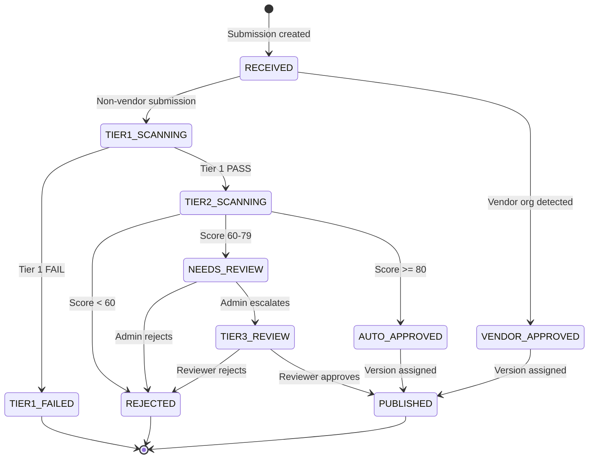
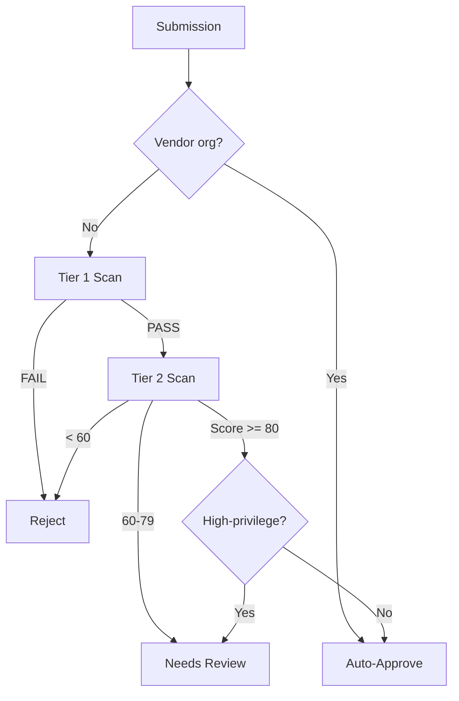
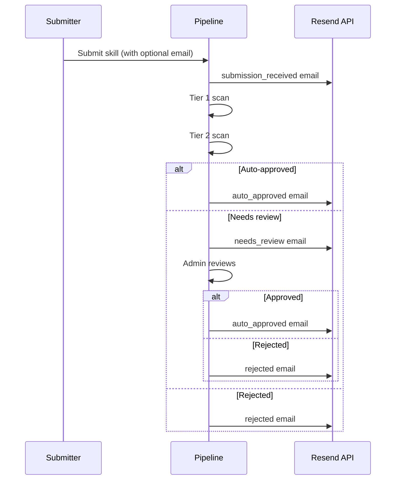

# Submission System Design Document

**Status**: COMPLETE
**Type**: Internal Strategy Document
**Date**: 2026-02-15
**Increment**: 0217-skill-security-extensibility-standard
**Source**: T-029, T-031, T-034, T-036, T-038

---

## 1. Overview

The submission system processes skill verification requests through a deterministic state machine backed by Cloudflare Queues. It combines automated scanning (Tiers 1-2), decision logic (auto-approve vs manual review), admin actions, and email notifications into a transparent pipeline.

---

## 2. Web Submission Form

The `/submit` page accepts skill verification requests via a web form.

### Form Fields

| Field | Type | Required | Validation |
|-------|------|----------|------------|
| GitHub Repo URL | URL input | Yes | Must match `github.com/{owner}/{repo}` pattern |
| Skill Name | Text input | Yes | 2-64 chars, alphanumeric + hyphens |
| Email | Email input | No | Valid email format; enables status notifications |
| Category | Select | No | Predefined: security, coding, writing, devops, testing, other |

### UX Flow
1. User enters GitHub repo URL → auto-extracts owner/repo
2. If repo contains `SKILL.md` at root, preview shown inline
3. User confirms skill name (auto-suggested from repo name)
4. Optional email for notifications
5. Submit → immediate feedback: "Scanning started" with tracking link
6. Redirect to status page: `/submissions/{id}`

### Validation Rules
- Repo must be public and accessible
- Repo must contain a `SKILL.md` file
- Same repo+skill combo cannot be resubmitted while a submission is in progress
- Rate limit: 5 submissions per hour per IP

---

## 3. State Machine



### States
| State | Description | Terminal? |
|-------|-------------|-----------|
| RECEIVED | Submission created | No |
| TIER1_SCANNING | Pattern scan running | No |
| TIER1_FAILED | Pattern scan failed | Yes |
| TIER2_SCANNING | LLM judge running | No |
| AUTO_APPROVED | Both tiers passed | No |
| NEEDS_REVIEW | Flagged for admin | No |
| TIER3_REVIEW | Human review in progress | No |
| PUBLISHED | Live on registry | Yes |
| REJECTED | Failed verification | Yes |
| VENDOR_APPROVED | Trusted org bypass | No |

---

## 4. API Specification Summary

### Public Endpoints

| Method | Path | Description |
|--------|------|-------------|
| POST | `/api/v1/submissions` | Submit a skill |
| GET | `/api/v1/submissions/:id` | Check status |
| GET | `/api/v1/skills` | Browse registry |
| GET | `/api/v1/skills/:name` | Skill detail |
| GET | `/api/v1/skills/:name/badge` | SVG badge |

### Admin Endpoints (JWT required)

| Method | Path | Description | Role |
|--------|------|-------------|------|
| POST | `/api/v1/auth/login` | Admin login | — |
| POST | `/api/v1/auth/refresh` | Refresh token | — |
| GET | `/api/v1/admin/submissions` | Submission queue | REVIEWER+ |
| PATCH | `/api/v1/admin/submissions/:id/approve` | Approve | REVIEWER+ |
| PATCH | `/api/v1/admin/submissions/:id/reject` | Reject | REVIEWER+ |
| POST | `/api/v1/admin/submissions/:id/escalate` | Escalate to Tier 3 | SUPER_ADMIN |
| GET | `/api/v1/admin/stats` | Platform stats | REVIEWER+ |

---

## 5. Decision Logic



### Thresholds (Configurable)
| Parameter | Default | Description |
|-----------|---------|-------------|
| Auto-approve minimum | 80 | Tier 2 score for auto-approval |
| Concerns minimum | 60 | Below this = reject |
| High-privilege check | enabled | Flag Bash(*), system dirs, env vars |

### Edge Cases
- Score 75-79: NEEDS_REVIEW, low urgency
- Vendor org + security report: Per-skill trust revocation
- Score 85 but has eval(): NEEDS_REVIEW (high-privilege flag)

---

## 6. Worker Architecture

**Cloudflare Queues** for job distribution (push-based, no polling). PostgreSQL for result storage only.

```
submission-pipeline queue
  ├── tier1-scan messages
  ├── tier2-scan messages
  └── publish messages
```

- **Delivery**: Push-based, at-least-once via Cloudflare Queues
- **Retry**: 3 attempts with exponential backoff (managed by Queues)
- **Dead letter**: Failed messages after 3 retries go to `submission-dlq` queue
- **Batch processing**: Up to 10 messages per batch, 30s timeout
- **Cost**: Free tier covers 10K ops/day (~3,333 messages/day)

---

## 7. Email Notification Flow



### Triggers
| Event | Template | When |
|-------|----------|------|
| Submission received | Welcome + tracking link | Immediate |
| Auto-approved | Badge URL + README embed code | On publish |
| Needs review | Concerns list + timeline | On flag |
| Rejected | Reason + fix suggestions + resubmit link | On rejection |
| Version published | Version diff + updated badge URL | On new version |

### Service: Resend
- 100 emails/day free tier
- React Email templates in `packages/web/src/emails/`
- Email is opt-in — no email = check status via API

---

## 8. Audit Trail

Every state transition creates an immutable `SubmissionStateEvent`:

```typescript
{
  fromState: 'TIER2_SCANNING',
  toState: 'AUTO_APPROVED',
  trigger: 'tier2-pass',
  actor: 'worker',
  metadata: { score: 92, model: '@cf/meta/llama-3.1-70b-instruct' },
  createdAt: '2026-02-15T18:00:15Z'
}
```

---

## 9. SLA Targets

| Stage | Target | P95 |
|-------|--------|-----|
| Tier 1 scan | < 500ms | < 1s |
| Tier 2 scan | < 15s | < 30s |
| End-to-end (no review) | < 30s | < 60s |
| Human review | < 5 business days | < 10 days |

---

## 10. References

- [Submission State Machine](../../increments/0217-skill-security-extensibility-standard/research/submission-state-machine.md)
- [API Design](../../increments/0217-skill-security-extensibility-standard/research/submission-api-design.md)
- [Auto-Approve Logic](../../increments/0217-skill-security-extensibility-standard/research/auto-approve-logic.md)
- [Email Notifications](../../increments/0217-skill-security-extensibility-standard/research/email-notification-design.md)
- [Database Schema](../../increments/0217-skill-security-extensibility-standard/research/database-schema.md)
