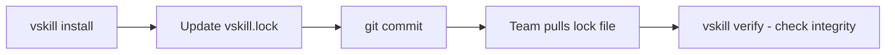
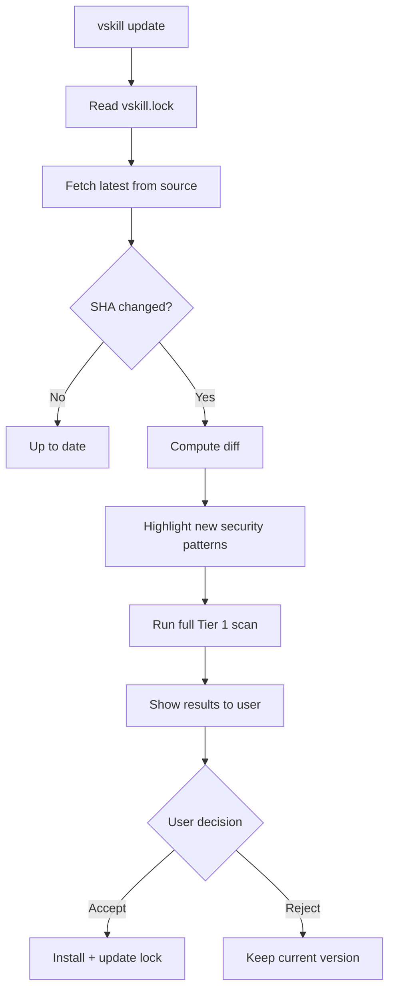

# Versioning Mechanism Design Document

**Status**: COMPLETE
**Type**: Internal Strategy Document
**Date**: 2026-02-15
**Increment**: 0217-skill-security-extensibility-standard
**Source**: T-035, T-015c, T-040

---

## 1. Overview

The versioning mechanism solves the update poisoning problem: a skill passes verification at v1.0, then silently injects malware at v1.2. Every version is independently verified and assigned a semantic version number based on diff analysis. Badges are per-version, lock files pin exact content hashes, and continuous monitoring detects suspicious updates.

---

## 2. Core Principles

1. **Verification is per-version**: Badge = "verified at v1.3.0", not just "verified"
2. **Content integrity**: SHA-256 hash + git SHA recorded per version
3. **Semantic versioning**: Automated bump classification (major/minor/patch)
4. **Diff transparency**: Users see exactly what changed before accepting updates
5. **Continuous monitoring**: Badge downgrade on suspicious updates

---

## 3. Version Assignment

### First Submission
Always `1.0.0`. No exceptions.

### Subsequent Submissions
Diff analysis classifies changes → automatic version bump:

| Bump | Trigger | Examples |
|------|---------|---------|
| **MAJOR** (x.0.0) | Scope expansion, new permissions, security profile change | Adding `Bash(*)`, new destructive commands, removing security-notes |
| **MINOR** (0.x.0) | New capabilities without security impact | New instruction section, behavior change, new tags |
| **PATCH** (0.0.x) | Cosmetic, no behavioral change | Typo fix, formatting, link update |

---

## 4. Diff Analysis

### Section Parsing
SKILL.md files are parsed into sections by markdown headers. Each section gets a SHA-256 hash for fast comparison.

### Comparison Algorithm

```
1. Parse old + new SKILL.md into sections
2. Compute:
   - Sections added (in new, not in old)
   - Sections removed (in old, not in new)
   - Sections modified (same name, different hash)
   - Frontmatter changes (fields added/removed/modified)
3. Classify changes:
   - MAJOR patterns? → major bump
   - Structural changes? → minor bump
   - Cosmetic only? → patch bump
```

### MAJOR Detection Rules
```
- New permission patterns: Bash(*), Write, eval(), exec()
- Scope expansion: new file patterns, new directories
- Security-notes section removed or weakened
- Destructive commands added: rm -rf, drop table
- Agent restriction changes
```

### Content Similarity
Jaccard similarity on word tokens. Modified sections with < 80% similarity trigger a MINOR bump.

---

## 5. Content Hashing

### Per-Version Hash
```
SHA-256 of normalized SKILL.md content:
  1. Trim whitespace
  2. Normalize line endings (CRLF → LF)
  3. Normalize tabs to spaces
  4. Compute sha256 hex digest
  5. Format: "sha256:{hex}"
```

### Git SHA Recording
Each version records the git commit SHA (40-char hex) for:
- Provenance tracking (which exact commit was verified)
- Tamper detection (content must match commit)
- Reproducible verification (re-verify same content)

---

## 6. Lock File (`vskill.lock`)

Committed to the project repository for team-wide consistency.



### Key Fields per Skill
| Field | Purpose |
|-------|---------|
| `version` | Semantic version |
| `gitSha` | Git commit at install time |
| `contentHash` | SHA-256 of SKILL.md content |
| `scan.tier` | Verification tier achieved |
| `scan.findings` | Finding counts by severity |
| `labels` | Trust labels at install time |
| `agents` | Which agents the skill was installed to |

---

## 7. Update Flow



### Diff Scan Output
```
Security diff:
  NEW  HIGH  eval() usage added (line 89) — REVIEW REQUIRED
  Existing: 2 medium findings unchanged
  Removed: 1 info finding no longer present
```

### Update Risk Classification
| Risk | Criteria | Action |
|------|----------|--------|
| Low | No new findings, patch changes | Auto-accept with `--yes` |
| Medium | New medium/low findings | Prompt user |
| High | New high findings | Require explicit confirmation |
| Critical | New critical findings | Block update |

---

## 8. Continuous Monitoring

verified-skill.com crawls registered skills on a schedule:

| Tier | Frequency |
|------|-----------|
| Certified | Every 6 hours |
| Verified | Every 24 hours |
| Scanned | Every 72 hours |

### Badge Downgrade Rules
| Condition | From → To | Trigger |
|-----------|-----------|---------|
| New critical finding | Verified → Scanned | Auto re-scan |
| Certification expired | Certified → Verified | 6-month expiry |
| Content hash mismatch | Any → Scanned | Tamper detection |
| Org trust revoked | Vendor Verified → Scanned | Admin action |

### CLI Warnings
```
$ npx vskill list

  ⚠ BADGE ALERTS
  bun-package-manager: DOWNGRADED
    Was: VERIFIED → Now: SCANNED
    Reason: New critical finding in v1.1.0
```

---

## 9. Version Display

### Badge Format
```
[verified | v1.3.0]     — Always includes version
```

### Badge API
```
GET /api/v1/badges/{name}.svg          — Latest verified version
GET /api/v1/badges/{name}/{ver}.svg    — Specific version
```

### Version History
```
v2.2.0  VERIFIED   Score: 94   0 findings   Feb 15, 2026
v2.1.0  VERIFIED   Score: 92   0 findings   Feb 01, 2026
v2.0.0  VERIFIED   Score: 88   1 info       Jan 15, 2026
v1.0.0  SCANNED    —           2 low        Nov 01, 2025
```

---

## 10. References

- [Version-Pinned Verification](../../increments/0217-skill-security-extensibility-standard/research/version-pinned-verification.md)
- [Semantic Versioning Engine](../../increments/0217-skill-security-extensibility-standard/research/semantic-versioning-engine.md)
- [Three-Tier Certification](../../increments/0217-skill-security-extensibility-standard/research/three-tier-certification.md)
- [vskill CLI Design](../../increments/0217-skill-security-extensibility-standard/research/vskill-cli-design.md)
