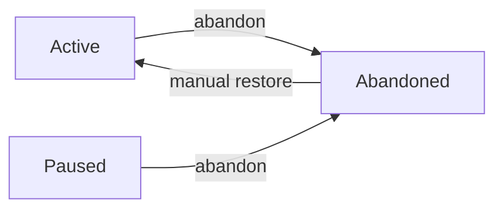

# abandon

Permanently abandon an increment when requirements change or work becomes obsolete.

## Synopsis

```bash
specweave abandon <increment-id> [options]
```

## Description

The `abandon` command permanently cancels work on an increment by moving it to the `_archive/` folder. This preserves all work for reference while freeing up your WIP limit.

**Use abandon when**:
- 🔄 Requirements changed (feature no longer needed)
- ❌ Approach was wrong (discovered better solution)
- 🔀 Superseded (replaced by different increment)
- 🧪 Experiment failed (spike didn't pan out)

:::warning Permanent Action
Abandon is **permanent** and moves the increment to `_archive/`. Unlike pause, abandoned increments require manual restoration.
:::

## Options

### `<increment-id>` (required)

The increment to abandon (e.g., `0008-old-feature`).

```bash
specweave abandon 0008-old-feature
```

### `--reason <text>` or `-r <text>`

Reason for abandoning (highly recommended).

```bash
specweave abandon 0008 --reason "Requirements changed - feature no longer needed"
```

:::warning Always Provide a Reason
While optional, **always provide a reason**. It documents why work was stopped for future reference and retrospectives.
:::

### `--force` or `-f`

Skip confirmation prompt.

```bash
specweave abandon 0008 --reason "Obsolete" --force
```

## Examples

### Example 1: Abandon with Reason

```bash
# Requirements changed, feature no longer needed
specweave abandon 0008-social-features \
  --reason "Requirements changed - pivoting to enterprise focus"

# Output:
⚠️  This will move increment 0008-social-features to _archive/
   Reason: Requirements changed - pivoting to enterprise focus

Continue? [y/N]: y

✅ Increment 0008-social-features abandoned
📦 Moved to: .specweave/increments/_archive/0008-social-features/
📝 Reason: Requirements changed - pivoting to enterprise focus
💾 All work preserved for reference

💡 To un-abandon: Manually move back to increments/ folder
```

**What happened**:
- ✅ Increment moved to `_archive/` folder
- ✅ Metadata updated (status: abandoned, timestamp)
- ✅ WIP limit freed (can start other work)
- ✅ All files preserved for reference

### Example 2: Abandon Without Reason (Interactive)

```bash
specweave abandon 0009-experiment

# Output:
❓ Why are you abandoning this increment?
   1. Requirements changed
   2. Approach was wrong
   3. Superseded by different work
   4. Experiment failed
   5. Other (type reason)

> 4

⚠️  This will move increment 0009-experiment to _archive/
   Reason: Experiment failed

Continue? [y/N]: y

✅ Increment 0009-experiment abandoned
📦 Moved to: .specweave/increments/_archive/0009-experiment/
```

### Example 3: Force Abandon (Skip Confirmation)

```bash
# Skip confirmation with --force
specweave abandon 0010 --reason "Obsolete" --force

# Output:
✅ Increment 0010 abandoned (forced)
📦 Moved to: .specweave/increments/_archive/0010/
📝 Reason: Obsolete
```

### Example 4: Abandon During Pivot

```bash
# Business pivot scenario
specweave status
▶️  Active (2):
  ● 0008-consumer-features
  ● 0009-social-integration

# Abandon both consumer-focused features
specweave abandon 0008 --reason "Pivot to enterprise - consumer features postponed"
specweave abandon 0009 --reason "Pivot to enterprise - social features postponed"

# Start new enterprise features
specweave inc "0010-enterprise-sso"
```

## Behavior

### Status Transitions



**Valid transitions**:
- `active` → `abandoned` ✅
- `paused` → `abandoned` ✅

**Invalid transitions**:
- `completed` → `abandoned` ❌ (completed work cannot be abandoned)
- `abandoned` → `abandoned` ℹ️ (already abandoned, no-op)

### Metadata Changes

```json
// Before abandon
{
  "id": "0008-social-features",
  "status": "active",
  "type": "feature",
  "created": "2025-11-01T10:00:00Z",
  "lastActivity": "2025-11-04T09:00:00Z"
}

// After abandon
{
  "id": "0008-social-features",
  "status": "abandoned",                        // ← Changed
  "type": "feature",
  "created": "2025-11-01T10:00:00Z",
  "lastActivity": "2025-11-04T10:00:00Z",
  "abandonedReason": "Pivot to enterprise",     // ← Added
  "abandonedAt": "2025-11-04T10:00:00Z"         // ← Added
}
```

### Folder Structure

```bash
# Before abandon
.specweave/increments/
├── 0007-feature-x/
├── 0008-social-features/    # ← Active
└── 0009-feature-z/

# After abandon
.specweave/increments/
├── 0007-feature-x/
├── 0009-feature-z/
└── _archive/
    └── 0008-social-features/  # ← Moved here
        ├── spec.md
        ├── plan.md
        ├── tasks.md
        └── metadata.json (status: abandoned)
```

### WIP Limit Impact

```bash
# Before abandon
$ specweave status
▶️  Active (2): 0008-social-features, 0009-feature-z
📈 WIP Limit: ⚠️  2/1 (EXCEEDS LIMIT!)

# Abandon one increment
$ specweave abandon 0008 --reason "No longer needed"

# After abandon
$ specweave status
▶️  Active (1): 0009-feature-z
📈 WIP Limit: ✅ 1/1

💡 WIP limit freed - can start new work
```

## Error Handling

### Cannot Abandon Completed

```bash
$ specweave abandon 0001
❌ Cannot abandon increment 0001
   Status: completed
   Completed increments cannot be abandoned
```

**Solution**: Increment is done. No need to abandon.

### Already Abandoned

```bash
$ specweave abandon 0008
⚠️  Increment 0008 is already abandoned
   Location: .specweave/increments/_archive/0008-old-feature/
   Reason: Requirements changed
   Abandoned: 5 days ago

No action needed.
```

**Solution**: Already in `_archive/` folder.

### Increment Not Found

```bash
$ specweave abandon 9999
❌ Increment not found: 9999
💡 Check available increments: specweave status
```

**Solution**: Check increment ID with `specweave status`.

### Cancelled Abandonment

```bash
$ specweave abandon 0008 --reason "Not needed"

⚠️  This will move increment 0008 to _archive/
   Reason: Not needed

Continue? [y/N]: n

❌ Abandonment cancelled
   Increment 0008 remains active
```

## Best Practices

### 1. Always Document Why

```bash
# ❌ Bad - no reason
specweave abandon 0008

# ✅ Good - clear reason
specweave abandon 0008 --reason "Requirements changed - feature no longer aligns with product strategy"
```

**Why**:
- Future you won't remember the context
- Team needs to understand why work stopped
- Retrospectives benefit from clear documentation
- Patterns emerge (are we over-committing?)

### 2. Document Learnings Before Abandoning

```bash
# 1. Add retrospective notes to spec.md
vim .specweave/increments/0008-feature/spec.md
# Add section: "## Why Abandoned" with learnings

# 2. Then abandon
specweave abandon 0008 --reason "Experiment failed - complexity too high"
```

**Good Retrospective Notes**:
- What went wrong?
- What would we do differently?
- What did we learn?
- Any salvageable parts?

### 3. Extract Reusable Parts First

```bash
# Before abandoning, extract useful work
cp .specweave/increments/0008-feature/reports/analysis.md \
   .specweave/increments/_backlog/ideas/

# Then abandon
specweave abandon 0008 --reason "Approach wrong, but analysis useful"
```

### 4. Pause vs Abandon Decision Tree

```
Is this increment...
├─ Temporarily blocked? → Use 'pause' (can resume)
├─ Permanently obsolete? → Use 'abandon'
└─ Uncertain? → Pause first, abandon later if still not relevant
```

## Common Scenarios

### Scenario 1: Requirements Changed

```bash
# Product pivot - consumer to enterprise
specweave abandon 0008-consumer-onboarding \
  --reason "Pivot to enterprise - consumer features postponed indefinitely"

specweave abandon 0009-social-features \
  --reason "Pivot to enterprise - social integration not in roadmap"

# Start enterprise work
specweave inc "0010-enterprise-sso"
```

### Scenario 2: Experiment Failed

```bash
# Tried new tech stack, didn't work out
specweave abandon 0007-graphql-migration \
  --reason "Experiment failed - complexity too high, sticking with REST"

# Document learnings
vim .specweave/increments/_archive/0007-graphql-migration/spec.md
# Add: "## Learnings: GraphQL adds 3x complexity, REST is sufficient"
```

### Scenario 3: Superseded by Better Approach

```bash
# Discovered better solution mid-way
specweave abandon 0006-custom-auth \
  --reason "Superseded by 0011-auth0-integration (simpler, more secure)"

specweave inc "0011-auth0-integration"
```

### Scenario 4: Clean Up Old Work

```bash
# Review paused increments
specweave status --paused

⏸️  Paused (3):
  ⏸ 0005-kubernetes (paused 45 days)
  ⏸ 0007-refactor (paused 30 days)
  ⏸ 0008-experiment (paused 60 days)

# Abandon stale work
specweave abandon 0005 --reason "Postponed indefinitely, cloud provider changed"
specweave abandon 0008 --reason "Too old, requirements likely changed"

# Resume relevant work
specweave resume 0007
```

## Auto-Abandonment (Experiments)

**Experiments (type: experiment) auto-abandon after 14 days of inactivity**:

```bash
# Create experiment
specweave inc "0010-try-graphql" --type=experiment

# ... 15 days pass with no activity ...

# Automatic abandonment
$ specweave status

📊 Auto-Abandoned (1):
  🧪 0010-try-graphql [experiment]
     Abandoned: automatically (14+ days inactive)
     Reason: Auto-abandoned due to inactivity
     Last activity: 15 days ago

💡 Experiments auto-abandon after 14 days to prevent accumulation
   To prevent: Update lastActivity via 'specweave do' or manual touch
```

**Configuration** (`.specweave/config.json`):
```json
{
  "limits": {
    "experimentAutoAbandonDays": 14  // Configurable
  }
}
```

## Un-Abandoning (Restoration)

To restore an abandoned increment:

```bash
# 1. Manually move back to increments/
mv .specweave/increments/_archive/0008-feature \
   .specweave/increments/0008-feature

# 2. Resume via command
specweave resume 0008

# Output:
✅ Increment 0008-feature resumed
⚠️  Note: Was abandoned 10 days ago
   Reason: Requirements changed
💡 Review spec.md to ensure still relevant
```

:::tip Review Before Resuming
Always review the spec before resuming abandoned work. Requirements may have evolved further.
:::

## Integration with Other Commands

### abandon → status

```bash
$ specweave abandon 0008 --reason "Obsolete"
$ specweave status

❌ Abandoned (1):
  0008-old-feature (Obsolete)  # ← Shown in abandoned section
```

### pause → abandon

```bash
$ specweave pause 0007 --reason "Waiting for decision"
# ... decision is "don't do this" ...
$ specweave abandon 0007 --reason "Decision: feature not needed"
```

### abandon → retrospective

```bash
$ specweave abandon 0008 --reason "Experiment failed"

# Later: Review for learnings
$ specweave status --abandoned
❌ Abandoned (3):
  0008-graphql (Experiment failed)
  0009-custom-auth (Superseded)
  0010-old-ui (Requirements changed)

# Pattern: High experiment failure rate → improve spike process
```

## Statistics

View abandonment statistics:

```bash
specweave status

✅ Completed (4):
  0001-core-framework
  0002-core-enhancements
  0003-model-selection
  0004-plugin-architecture

❌ Abandoned (3):
  0008-old-approach (Requirements changed)
  0009-failed-experiment (Experiment failed)
  0010-superseded (Replaced by 0011)

📊 Summary:
  - Success rate: 57% (4/7 completed)
  - Abandonment rate: 43% (3/7 abandoned)
  - Common reasons: Requirements changed (2), Experiment failed (1)
```

## Learning from Abandoned Work

**Abandoned increments are valuable for learning**:

### Retrospective Analysis

```bash
# Review abandoned folder quarterly
ls .specweave/increments/_archive/

# Common patterns?
# - Requirements changing too often? → Improve planning
# - High experiment failure? → Better spike process
# - Many superseded? → Too much parallel work
```

### Extract Best Practices

```markdown
## Learnings from Abandoned Work (2025 Q1)

### 0008-custom-auth (Abandoned: Complexity too high)
- **Learning**: Authentication is complex, use proven solutions
- **Action**: Add Auth0/Okta to default stack

### 0009-graphql-migration (Abandoned: Experiment failed)
- **Learning**: GraphQL adds 3x complexity for our use case
- **Action**: Document REST patterns, stick with what works

### 0010-big-refactor (Abandoned: Scope too large)
- **Learning**: Large refactors fail, break into small increments
- **Action**: Max 2 weeks per increment, split larger work
```

## See Also

- `pause` - Temporarily pause work (reversible)
- `resume` - Resume paused/abandoned work
- [`status`](/docs/glossary/terms/status) - View all increment statuses
- [Status Management Guide](/docs/glossary/terms/status-management) - Complete workflow guide

## Summary

**Key Points**:
- ✅ Use `abandon` for **permanent** cancellation
- ✅ Always provide clear reason
- ✅ Work moved to `_archive/` (preserved)
- ✅ Frees WIP limit
- ✅ Cannot abandon completed increments
- ✅ Experiments auto-abandon after 14 days

**Command**:
```bash
specweave abandon <increment-id> --reason "<clear explanation>"
```

**Philosophy**:
> Abandoning isn't failure—it's learning. Document why, extract learnings, move forward.
