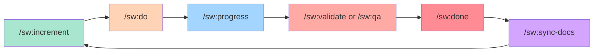

# Commands Overview

SpecWeave provides slash commands for every stage of your development workflow. This page covers the **main workflow commands** you'll use daily.

:::info Command Prefix
All SpecWeave commands use the `/sw:*` namespace prefix. For example: `/sw:increment`, `/sw:do`, `/sw:auto`.
:::

## The Core Workflow



---

## 1. Planning Commands

### `/sw:increment` - Create New Increment

**Most frequently used command** - Start every new feature here.

```bash
/sw:increment "User authentication with JWT"
/sw:increment "Payment processing with Stripe"
/sw:increment "Real-time notifications"
```

**What it does**:
- 🔍 Detects tech stack automatically
- 📋 PM-led planning (market research, spec.md, plan)
- ✅ Auto-generates tasks.md from plan
- 🧪 Creates test strategy
- 👥 Strategic agent review (Architect, Security, QA, Tech Lead)

**See**: [ADR](/docs/glossary/terms/adr) (Architecture Decision Records) for design decisions made during planning.

---

## 2. Implementation Commands

### `/sw:do` - Execute Tasks

**Smart auto-resume** - Continue from where you left off.

```bash
/sw:do           # Auto-finds active increment
/sw:do 0007      # Specific increment
```

**What it does**:
- 🎯 Resumes from last incomplete task
- 🔊 Plays sound after each task (via hooks)
- 📝 Updates docs inline (CLAUDE.md, README.md, CHANGELOG)
- 🔗 Syncs to GitHub (if plugin enabled)
- 🧪 Runs tests continuously

**Key Features**:
- **Cost optimization**: Uses Haiku for simple tasks (3x faster, 20x cheaper)
- **Automatic hooks**: Runs after EVERY task completion
- **Living docs sync**: Updates `.specweave/docs/` after all tasks complete

**See**: [/sw:do Documentation](./do)

---

### `/sw:auto` - Autonomous Execution ⭐ NEW

**Full autonomous mode** - Work until all tasks complete.

```bash
/sw:auto                        # Current increment
/sw:auto 0001 0002 0003         # Multiple increments
/sw:auto --max-iterations 50    # With limits
/sw:auto --all-backlog          # All backlog items
```

**What it does**:
- 🤖 Continuous execution until all tasks complete
- 🔄 Stop hook prevents exit (feedback loop pattern)
- 🧪 Self-healing test loop (max 3 attempts)
- 📊 Self-assessment scoring (pauses on low confidence)
- ⚡ Auto-execute with credentials (no manual steps)

**Safety Features**:
- Max iterations limit (default: 100)
- Max hours limit (optional)
- Human gates for sensitive operations
- Circuit breakers for external services
- Low confidence score pauses for review

**See**: [/sw:auto Documentation](./auto)

---

### `/sw:auto-status` - Session Status

Check auto session progress.

```bash
/sw:auto-status           # Full status
/sw:auto-status --json    # JSON output
```

**See**: [/sw:auto-status Documentation](./auto-status)

---

### `/sw:cancel-auto` - Cancel Session

Cancel running auto session.

```bash
/sw:cancel-auto                                    # Interactive
/sw:cancel-auto --force                            # No confirmation
/sw:cancel-auto --reason "Switching to bug fix"    # With reason
```

**See**: [/sw:cancel-auto Documentation](./cancel-auto)

---

## 3. Quality Assurance Commands

### `/sw:validate` - Rule-Based Validation

**120+ checks** - Fast, free validation.

```bash
/sw:validate 0007
/sw:validate 0007 --quality        # Include AI assessment
/sw:validate 0007 --export         # Export suggestions to tasks.md
```

**What it validates**:
- ✅ Consistency (spec → plan → tasks)
- ✅ Completeness (all required sections)
- ✅ Quality (testable criteria, actionable tasks)
- ✅ Traceability (AC-IDs, ADR references)

---

### `/sw:qa` - Quality Assessment with Risk Scoring

**Comprehensive quality gate** - AI-powered assessment with BMAD risk scoring.

```bash
/sw:qa 0007                    # Quick mode (default)
/sw:qa 0007 --pre             # Before starting work
/sw:qa 0007 --gate            # Before closing increment
/sw:qa 0007 --export          # Export blockers to tasks.md
```

**7 Quality Dimensions**:
1. Clarity (18% weight)
2. Testability (22% weight)
3. Completeness (18% weight)
4. Feasibility (13% weight)
5. Maintainability (9% weight)
6. Edge Cases (9% weight)
7. **Risk Assessment** (11% weight)

**Quality Gate Decisions**:
- 🟢 **PASS** - Ready to proceed
- 🟡 **CONCERNS** - Should fix before release
- 🔴 **FAIL** - Must fix before proceeding

---

### `/sw:check-tests` - Test Coverage Check

```bash
/sw:check-tests 0007
```

**What it checks**:
- 📊 Per-task coverage (unit, integration, [E2E](/docs/glossary/terms/e2e))
- ✅ AC-ID coverage (all acceptance criteria tested)
- 🎯 Overall coverage vs target (80-90%)
- 📝 Missing tests and recommendations

---

## 4. Completion Commands

### `/sw:done` - Close Increment

**PM validation before closing** - Ensures quality gates pass.

```bash
/sw:done 0007
```

**What it does**:
- ✅ Validates all tasks complete
- ✅ Runs `/sw:qa --gate` (quality gate check)
- ✅ PM agent validates completion
- ✅ Creates completion report
- 🔗 Closes GitHub issues (if plugin enabled)

---

### `/sw:sync-docs` - Synchronize Living Documentation

**Bidirectional sync** - Keep strategic docs and implementation in sync.

```bash
/sw:sync-docs review          # Before implementation (review strategic docs)
/sw:sync-docs update          # After implementation (update with learnings)
```

**What it syncs**:
- 📚 [ADRs](/docs/glossary/terms/adr) (Proposed → Accepted)
- 🏗️ Architecture diagrams (planned → actual)
- 📖 [API](/docs/glossary/terms/api) documentation (contracts → endpoints)
- 📋 Feature lists (planned → completed)

---

## 5. Monitoring Commands

### `/sw:progress` - Check Increment Progress

```bash
/sw:progress
/sw:progress 0007
```

**What it shows**:
- 📊 Task completion (15/42 tasks, 36%)
- ⏱️ Time tracking (1.2 weeks elapsed, 2.1 weeks remaining)
- 🎯 Current phase and next phase
- ✅ Recent completions
- 📝 Upcoming tasks

---

### `/sw:jobs` - Background Jobs Monitor

Monitor long-running operations that continue even after closing Claude.

```bash
/sw:jobs                    # Show active jobs
/sw:jobs --follow ae362dfe  # Follow progress live
/sw:jobs --logs ae362dfe    # View worker logs
/sw:jobs --kill ae362dfe    # Stop running job
/sw:jobs --resume ae362dfe  # Resume paused job
```

**Job types**:
- `clone-repos` - Multi-repo cloning (5-30 min)
- `import-issues` - Large issue imports (10-60 min)
- `sync-external` - Bidirectional sync (1-10 min)

**See**: [Full /sw:jobs Documentation](./jobs) | [Background Jobs Concepts](/docs/guides/core-concepts/background-jobs)

---

## 6. Status Management Commands

### `/sw:pause` - Pause Increment

```bash
/sw:pause 0007
/sw:pause 0007 --reason "Blocked by external API"
```

**See**: [/sw:pause Documentation](./pause)

---

### `/sw:resume` - Resume Increment

```bash
/sw:resume 0007
```

**See**: [/sw:resume Documentation](./resume)

---

### `/sw:abandon` - Abandon Increment

```bash
/sw:abandon 0007
/sw:abandon 0007 --reason "Requirements changed"
```

**See**: [/sw:abandon Documentation](./abandon)

---

## All Available Commands

### Essential Workflow (Use These!)

| Command | Purpose | Priority |
|---------|---------|----------|
| `/sw:increment` | Plan new increment | ⭐ **START HERE** |
| `/sw:do` | Execute tasks | ⭐ **MAIN WORK** |
| `/sw:auto` | Autonomous execution | ⭐ **HANDS-FREE** |
| `/sw:progress` | Check status | ⭐ **VISIBILITY** |
| `/sw:jobs` | Monitor background jobs | ⭐ **LONG OPS** |
| `/sw:validate` | Quick validation | ⭐ **PRE-CHECK** |
| `/sw:qa` | Quality assessment | ⭐ **QUALITY GATE** |
| `/sw:check-tests` | Test coverage check | ⭐ **TEST VALIDATION** |
| `/sw:done` | Close increment | ⭐ **FINISH** |
| `/sw:sync-docs` | Synchronize living docs | ⭐ **KEEP CURRENT** |

### Auto Mode Commands

| Command | Purpose |
|---------|---------|
| `/sw:auto` | Start autonomous execution |
| `/sw:auto-status` | Check session status |
| `/sw:cancel-auto` | Cancel running session |

### Status Management

| Command | Purpose |
|---------|---------|
| `/sw:pause` | Pause increment (blocked/deprioritized) |
| `/sw:resume` | Resume paused increment |
| `/sw:abandon` | Abandon incomplete increment |
| `/sw:status` | Show increment status overview |

---

## Workflow Example: Standard Feature Development

```bash
# 1. Plan new feature
/sw:increment "User authentication"
# → Creates: spec.md, plan.md, tasks.md

# 2. Review docs (optional)
/sw:sync-docs review
# → Review strategic docs before starting

# 3. Pre-check quality (optional)
/sw:qa 0007 --pre
# → Pre-implementation quality check

# 4. Implement tasks (choose one)
/sw:do 0007                 # Manual execution
/sw:auto 0007               # Autonomous execution

# 5. Check progress
/sw:progress 0007
# → See completion status

# 6. Validate quality
/sw:qa 0007 --gate
# → Comprehensive quality gate check

# 7. Check test coverage
/sw:check-tests 0007
# → Validate all AC-IDs are tested

# 8. Close increment
/sw:done 0007
# → PM validates and closes

# 9. Update living docs
/sw:sync-docs update
# → Sync learnings to strategic docs
```

---

## Workflow Example: Autonomous Execution

```bash
# 1. Plan feature
/sw:increment "Payment processing"

# 2. Start autonomous execution
/sw:auto 0008 --max-hours 8
# → Works until all tasks complete (max 8 hours)

# 3. Check status anytime
/sw:auto-status
# → See iteration, progress, any gates pending

# 4. Cancel if needed
/sw:cancel-auto --reason "Need to pivot"
# → Generates summary, preserves progress

# 5. Resume work anytime
/sw:do
# → Continues from where auto left off
```

---

## Integration with External Tools

### GitHub Issues (via sw-github plugin)

```bash
# Sync increment to GitHub
/sw-github:sync 0007

# View sync status
/sw-github:reconcile
```

**Automatic sync**: When GitHub plugin enabled, `/sw:do` and `/sw:done` automatically sync to GitHub.

### JIRA Integration (via sw-jira plugin)

```bash
# Sync to JIRA
/sw-jira:sync 0007
```

### Azure DevOps (via sw-ado plugin)

```bash
# Sync to Azure DevOps
/sw-ado:sync 0007
```

---

## Best Practices

### 1. Follow the Core Flow

Always use the standard workflow for best results:
1. `/sw:increment` - Plan (START HERE)
2. `/sw:do` or `/sw:auto` - Implement (MAIN WORK)
3. `/sw:progress` - Check status (VISIBILITY)
4. `/sw:qa` - Validate quality (QUALITY GATE)
5. `/sw:done` - Close (FINISH)
6. `/sw:sync-docs` - Update docs (KEEP CURRENT)

### 2. Use Auto Mode for Larger Increments

For increments with 10+ tasks, `/sw:auto` is more efficient:
- No need to keep checking progress
- Self-healing test loops fix issues automatically
- Human gates still require approval

### 3. Validate Early and Often

```bash
# Before starting work
/sw:qa 0007 --pre

# Before closing
/sw:qa 0007 --gate
```

### 4. Check Test Coverage

```bash
# Always validate tests before closing
/sw:check-tests 0007
```

### 5. Keep Living Docs Current

```bash
# After completing increment
/sw:sync-docs update
```

---

## Configuration

All commands respect `.specweave/config.json`:

```json
{
  "limits": {
    "maxActiveIncrements": 1,
    "hardCap": 2
  },
  "auto": {
    "enabled": true,
    "maxIterations": 100,
    "maxHours": 24,
    "testCommand": "npm test",
    "coverageThreshold": 80,
    "humanGated": {
      "patterns": ["deploy", "migrate", "publish"],
      "timeout": 1800
    }
  },
  "validation": {
    "quality_judge": {
      "enabled": true,
      "always_run": false
    }
  }
}
```

---

## Glossary Links

Understanding SpecWeave terminology:

- **[ADR](/docs/glossary/terms/adr)** - Architecture Decision Records
- **[RFC](/docs/glossary/terms/rfc)** - Request for Comments (specification format)
- **[API](/docs/glossary/terms/api)** - Application Programming Interface
- **[E2E](/docs/glossary/terms/e2e)** - End-to-End Testing
- **[Node.js](/docs/glossary/terms/nodejs)** - JavaScript runtime
- **[REST](/docs/glossary/terms/rest)** - RESTful API pattern
- **[GraphQL](/docs/glossary/terms/graphql)** - Query language for APIs
- **[Microservices](/docs/glossary/terms/microservices)** - Distributed architecture pattern
- **[IaC](/docs/glossary/terms/iac)** - Infrastructure as Code

[View full glossary →](/docs/glossary)

---

## Next Steps

- **Getting Started**: [Quick Start Guide](/docs/guides/getting-started)
- **Workflow Guide**: [Complete Development Workflow](/docs/guides/workflow)
- **Quality Gates**: [Quality Assurance Guide](/docs/guides/quality-gates)
- **Auto Mode**: [/sw:auto Documentation](./auto)
- **GitHub Integration**: [GitHub Sync Guide](/docs/guides/github-sync)

---

**Philosophy**:
> SpecWeave commands are designed for **intelligent automation**. The system detects intent, suggests actions, and handles workflow management - you focus on building.
