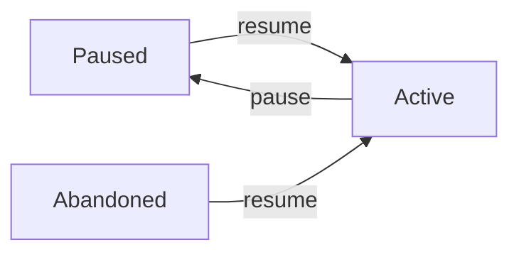

# resume

System command used by SpecWeave to resume paused increments when blockages are resolved.

## Synopsis

```bash
specweave resume <increment-id> [options]
```

:::warning System Command
This is primarily a **system command** used by SpecWeave internally. SpecWeave **automatically resumes** work when it detects blockages are resolved. You typically don't need to call this manually.
:::

## Description

The `resume` command restarts work on a paused or abandoned increment. SpecWeave calls this automatically when it detects dependencies are available.

**SpecWeave automatically resumes when**:
- ✅ API keys/credentials become available
- ✅ External services respond or approve
- ✅ Build/test issues are fixed
- ✅ Environmental dependencies are resolved

**Manual resume only for**:
- Restarting explicitly abandoned work
- Cases where SpecWeave hasn't detected resolution

## Options

### `<increment-id>` (required)

The increment to resume (e.g., `0007-payment-integration`).

```bash
specweave resume 0007-payment-integration
```

### `--force` or `-f`

Bypass WIP limit checks (emergency use only).

```bash
specweave resume 0007 --force
```

:::warning Use --force Sparingly
Only bypass limits for emergencies (production down, critical deadline). Document why you used it.
:::

## Examples

### Example 1: Automatic Resume (Typical)

```bash
# Earlier: SpecWeave automatically paused due to missing API keys
# (Work paused 2 days ago, waiting for IT ticket #1234)

# API keys arrive - SpecWeave detects this
🤖 SpecWeave: Great news! Stripe API keys are now available

   Shall I resume increment 0007-payment-integration? (y/n)

$ y

# SpecWeave automatically runs:
# specweave resume 0007-payment-integration

▶️  Resuming increment 0007-payment-integration...

✅ Increment 0007-payment-integration resumed
▶️  Now counts as active
📝 Was paused for: Waiting for Stripe API keys (IT ticket #1234)
▶️  Continuing from task T-005: Integrate Stripe payment flow

# SpecWeave continues implementation automatically
```

**What SpecWeave did**:
- ✅ Monitored IT ticket and API key availability
- ✅ Detected keys are now available
- ✅ Asked for confirmation to resume
- ✅ Automatically resumed work
- ✅ Continued from exact point where paused

### Example 2: WIP Limit Prevents Resume

```bash
$ specweave status
▶️  Active (1): 0008-feature-y
⏸️  Paused (1): 0007-feature-x

$ specweave resume 0007

# Output:
▶️  Resuming increment 0007...

⚠️  WARNING: WIP Limit Reached
   Current active: 1
   Limit: 1
   Resuming will exceed limit

   Complete or pause another increment first
   Or use --force to bypass this warning
```

**Solution**:
```bash
# Option 1: Pause other increment
$ specweave pause 0008 --reason "Pausing for 0007"
$ specweave resume 0007  # ✅ Works now

# Option 2: Force (emergency only)
$ specweave resume 0007 --force
```

### Example 3: Manual Resume (Restart Abandoned Work)

```bash
# Earlier: abandoned due to requirements change
$ specweave abandon 0005 --reason "Requirements changed"

# Later: requirements changed back, need to restart
$ specweave resume 0005

▶️  Resuming increment 0005...

✅ Increment 0005 resumed
📝 Was abandoned for: Requirements changed
▶️  Ready to continue implementation

💡 Continue work with: specweave do
```

**When to manually resume**:
- Restarting explicitly abandoned work
- Business decision to reprioritize
- Cases where SpecWeave can't detect the business context

### Example 4: Resume with Force

```bash
# Already at limit
$ specweave status
▶️  Active (1): 0008-feature

# Need to work on both (emergency)
$ specweave resume 0007 --force

✅ Increment 0007 resumed (forced)
⚠️  WARNING: WIP limit exceeded (2/1 active)
📝 Document why you used --force in your next standup/PR
```

## Behavior

### Status Transitions



**Valid transitions**:
- `paused` → `active` ✅
- `abandoned` → `active` ✅

**Invalid transitions**:
- `active` → `active` (already active) ℹ️
- `completed` → `active` ❌

### Metadata Changes

```json
// Before resume (paused)
{
  "id": "0007-payment-integration",
  "status": "paused",
  "pausedReason": "Waiting for API keys",
  "pausedAt": "2025-11-04T10:00:00Z",
  "lastActivity": "2025-11-04T10:00:00Z"
}

// After resume
{
  "id": "0007-payment-integration",
  "status": "active",                        // ← Changed
  "pausedReason": "Waiting for API keys",    // ← Preserved (history)
  "pausedAt": "2025-11-04T10:00:00Z",        // ← Preserved (history)
  "lastActivity": "2025-11-05T14:30:00Z"     // ← Updated
}
```

### WIP Limit Validation

```typescript
// Pseudo-code
if (activeCount >= limit && !force) {
  show_warning();
  exit(1);
}

// Allow resume
update_status(increment, 'active');
```

## Error Handling

### Already Active

```bash
$ specweave resume 0007
⚠️  Increment 0007 is already active
   Nothing to resume
```

**Solution**: It's already active. Continue working on it.

### Cannot Resume Completed

```bash
$ specweave resume 0001
❌ Cannot resume increment 0001
   Status: completed
   Completed increments cannot be resumed
```

**Solution**: Increment is done. Start a new one if needed.

### WIP Limit Reached

```bash
$ specweave resume 0007
⚠️  WARNING: WIP Limit Reached
   Current active: 1
   Limit: 1
   Resuming will exceed limit
```

**Solutions**:
```bash
# 1. Complete current work (best)
$ specweave do

# 2. Pause current work
$ specweave pause 0008 --reason "..."

# 3. Force (emergency only)
$ specweave resume 0007 --force
```

## Best Practices

### 1. Check Status Before Resume

```bash
# ❌ Bad - blind resume
specweave resume 0007

# ✅ Good - check first
$ specweave status
▶️  Active (1): 0008-feature
⏸️  Paused (1): 0007-feature

$ specweave pause 0008 --reason "..."
$ specweave resume 0007
```

### 2. Document Force Usage

If you use `--force`, document why:

```bash
$ specweave resume 0007 --force

# Then in git commit or standup:
"Used --force to resume 0007 because production was down and we needed both hotfixes running in parallel"
```

### 3. Clean Resume Flow

**Good pattern**:
```bash
# 1. Check what's paused
$ specweave status

# 2. Verify blockage resolved
# (check email, IT ticket, etc.)

# 3. Resume
$ specweave resume <id>

# 4. Continue work
$ specweave do
```

### 4. Review Paused Before Resume

```bash
# Don't resume blindly
$ specweave status
⏸️  Paused (5):  # Lots of paused work!

# Review each one
# - Still relevant? Resume
# - No longer needed? Abandon
# - Still blocked? Keep paused, update reason
```

## Common Scenarios

### Scenario 1: Dependency Resolved

```bash
# Day 1: Blocked
$ specweave pause 0007 --reason "Waiting for API keys (IT#1234)"

# Day 3: Keys arrived
$ specweave resume 0007
$ specweave do
```

### Scenario 2: Priority Shift

```bash
# Week 1: Regular feature, but hotfix needed
$ specweave pause 0007 --reason "Pausing for hotfix 0009"
$ specweave inc "0009-critical-fix"
$ specweave do

# Week 2: Hotfix done, resume feature
$ specweave resume 0007
$ specweave do
```

### Scenario 3: Multiple Paused, Selective Resume

```bash
$ specweave status
⏸️  Paused (3):
  ⏸ 0005 (30 days ago)
  ⏸ 0007 (7 days ago)
  ⏸ 0008 (2 days ago)

# Resume most recent
$ specweave resume 0008  # Most fresh in memory

# Abandon old ones
$ specweave abandon 0005 --reason "Too old, requirements likely changed"
```

## Integration with Other Commands

### status → resume

```bash
$ specweave status
⏸️  Paused (1): 0007-payment
$ specweave resume 0007
```

### pause → resume

```bash
$ specweave pause 0007 --reason "Blocked"
# ... blockage resolved ...
$ specweave resume 0007
```

### resume → do

```bash
$ specweave resume 0007
$ specweave do  # Continue work
```

## See Also

- `pause` - Pause active work
- [`abandon`](/docs/glossary/terms/abandon) - Cancel work permanently
- [`status`](/docs/glossary/terms/status) - Check current status
- [Status Management Guide](/docs/glossary/terms/status-management) - Complete workflow guide

## Summary

**Key Points**:
- ✅ **System command**: SpecWeave automatically resumes when blockages resolved
- ✅ **Automatic detection**: Monitors dependencies, detects availability
- ✅ **Manual use**: Only for restarting abandoned work or business decisions
- ✅ **WIP limits enforced**: Can't exceed focus capacity
- ✅ **Preserved history**: Full context of why paused and when resumed

**Command** (primarily used by SpecWeave):
```bash
specweave resume <increment-id> [--force]
```

**Philosophy**:
> **SpecWeave monitors, detects, and resumes automatically. You focus on building.**
