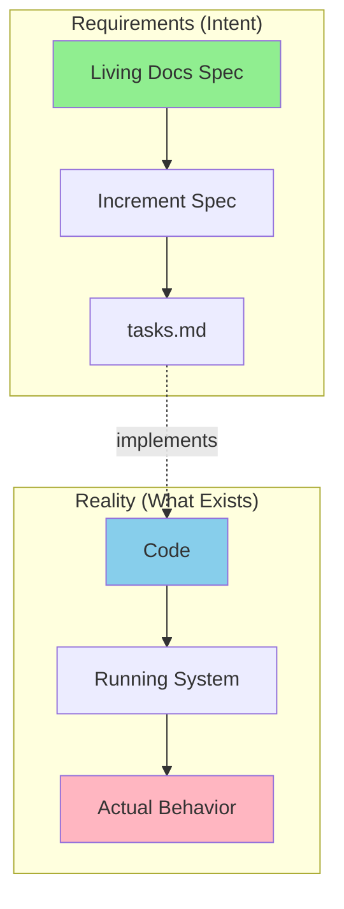
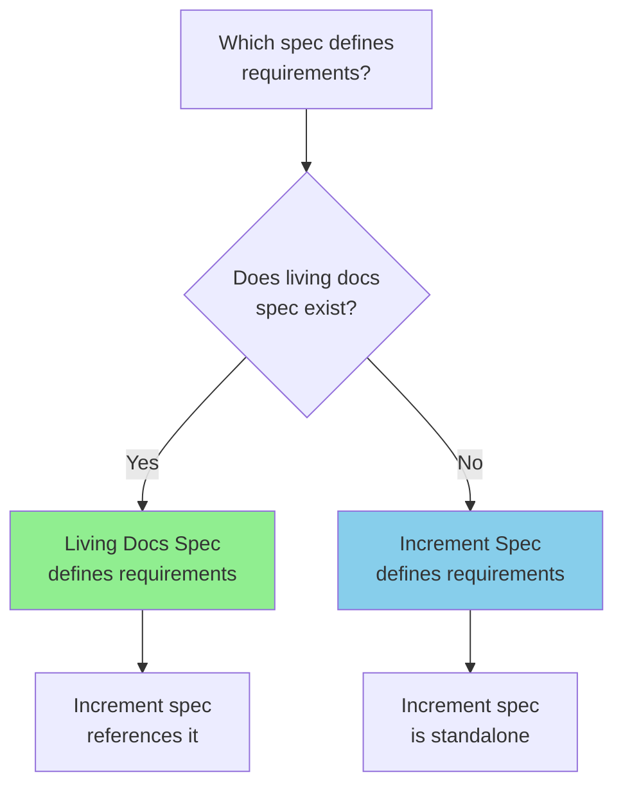
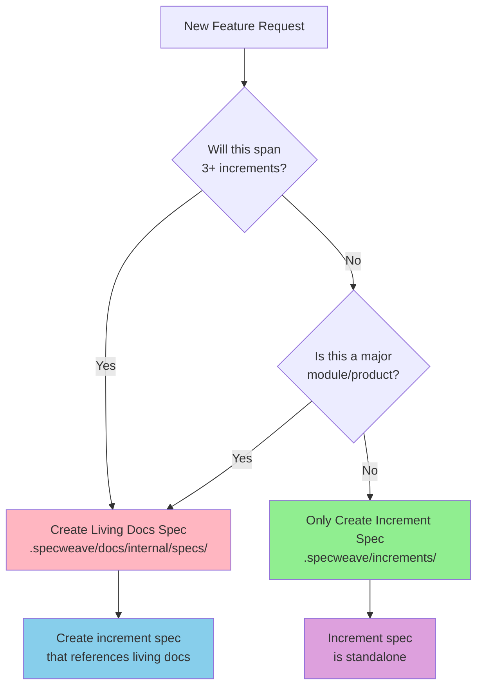
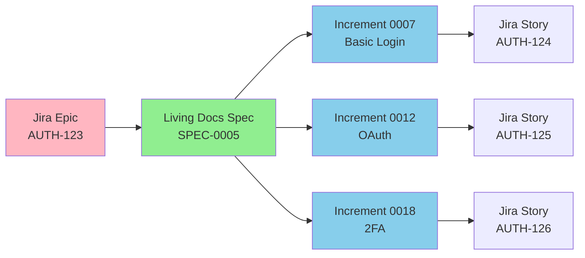

# Frequently Asked Questions (FAQ)

## Two-Spec Architecture

### Why do I have specs in two places?

**Short Answer**: You might not! Most features only need increment specs. Living docs specs are OPTIONAL for major features spanning 3+ increments.

**The Two Types**:

1. **Living Docs Spec** (`.specweave/docs/internal/specs/spec-####-name/spec.md`)
   - **Optional** - Only for major features (3+ increments)
   - **Permanent** - Never deleted, evolves over time
   - **Complete** - Contains ALL user stories, requirements, acceptance criteria
   - **PM Tool Link** - Can be linked to Jira epic, ADO feature, GitHub milestone

2. **Increment Spec** (`.specweave/increments/####-name/spec.md`)
   - **Always created** - Every increment has one
   - **Focused** - Contains subset of work for THIS increment only
   - **Temporary** - Can be deleted after completion (optional)
   - **References** - May reference living docs spec: "See SPEC-0005 for complete requirements"

**Real-World Example**:

```
Authentication Feature (spans 3 increments):

Living Docs Spec (permanent):
.specweave/docs/internal/specs/spec-0005-authentication/spec.md
├── ALL 20 user stories (US-001 through US-020)
├── ALL acceptance criteria (AC-US1-01 through AC-US20-05)
├── Complete requirements (FR-001 through FR-030)
└── Linked to Jira epic AUTH-123

Increment 1: Basic Login
.specweave/increments/0007-basic-login/spec.md
├── References: "See SPEC-0005"
├── Implements: US-001, US-002, US-003 only
└── Out of scope: OAuth (US-010), 2FA (US-018)

Increment 2: OAuth Integration
.specweave/increments/0012-oauth-integration/spec.md
├── References: "See SPEC-0005"
├── Implements: US-010, US-011, US-012 only
└── Dependencies: Requires increment 0007 (basic login)

Increment 3: Two-Factor Auth
.specweave/increments/0018-two-factor-auth/spec.md
├── References: "See SPEC-0005"
├── Implements: US-018, US-019, US-020 only
└── Dependencies: Requires increment 0007, 0012
```

After all 3 increments complete:
- ✅ Living docs spec REMAINS (permanent knowledge base)
- ⏳ Increment specs can be deleted (optional)

---

### Which one is the source of truth?

**Important Distinction**: There are TWO different "source of truth" concepts:

1. **Requirements Truth**: What SHOULD be built (specs)
2. **Reality Truth**: What ACTUALLY exists (code)



**For Requirements** (what should we build?):
- **Living Docs Spec** = Source of truth (if it exists)
- Otherwise → Increment Spec is source of truth

**For Reality** (what actually works?):
- **Code** = Source of truth (always)
- Tests verify code matches requirements
- When specs and code disagree → you have either a **bug** (code wrong) or **spec drift** (spec outdated)

**Decision Tree for Spec Selection**:



**Practical Examples**:

| Scenario | Requirements Truth | Reality Truth |
|----------|-------------------|---------------|
| New feature planning | Living Docs / Increment Spec | N/A (not built yet) |
| During implementation | Spec defines expected behavior | Code defines current state |
| Bug found | Spec says X, code does Y → fix code | Code is wrong |
| Spec outdated | Code does Z (correctly), spec says X → update spec | Code is right |

**With Living Docs Spec** (major feature):
- **Requirements Truth**: `.specweave/docs/internal/specs/spec-0005-authentication/spec.md`
- **Increment Reference**: "See SPEC-0005 for complete requirements"
- **Relationship**: Living docs = complete requirements, increment = current scope

**Without Living Docs Spec** (simple feature):
- **Requirements Truth**: `.specweave/increments/0009-add-dark-mode/spec.md`
- **No Reference**: Standalone specification
- **Relationship**: Increment spec = complete requirements

**Key Insight**: Specs define INTENT, code defines REALITY. Both matter, but for different questions.

---

### Do I need both for every feature?

**No!** Most features only need increment specs.

**Decision Flowchart**:



**When to Create Living Docs Spec**:
- ✅ Feature spans 3+ increments (authentication, payment processing, messaging system)
- ✅ Major module/product (new product line, major refactor affecting multiple areas)
- ✅ Need PM tool link (Jira epic, ADO feature, GitHub milestone spanning months)
- ✅ Want permanent historical record (how did we build authentication? Check SPEC-0005)

**When to Skip Living Docs Spec** (just use increment spec):
- ✅ Feature completes in 1 increment (add dark mode toggle)
- ✅ Feature completes in 2 increments (refactor [API](/docs/glossary/terms/api) client)
- ✅ Bug fix, hotfix, experiment (temporary work)
- ✅ Small enhancement (add CSV export button)

**Rule of Thumb**: If you're unsure, start with increment spec only. You can always create living docs spec later if the feature grows.

---

### Can I delete increment specs after completion?

**Yes!** Increment specs are temporary references.

**What You Can Delete**:
- ✅ `.specweave/increments/0007-basic-login/spec.md` (after increment complete)
- ✅ `.specweave/increments/0007-basic-login/plan.md` (after increment complete)
- ✅ Entire increment folder (if you want clean history)

**What You Should NEVER Delete**:
- ❌ `.specweave/docs/internal/specs/` (permanent knowledge base)
- ❌ `.specweave/docs/internal/architecture/adr/` (architecture decisions)
- ❌ `.specweave/docs/internal/strategy/` (business context)

**Typical Workflow**:

```
Day 1: Create increment 0007 (basic login)
├── spec.md (references SPEC-0005)
├── plan.md
└── tasks.md

Day 30: Complete increment 0007
├── All tasks done ✅
├── Tests passing ✅
└── Code merged ✅

Day 31: Optional cleanup
├── Delete 0007/spec.md (not needed anymore)
├── Delete 0007/plan.md (not needed anymore)
└── Keep SPEC-0005 (permanent reference)

Day 60: Start increment 0012 (OAuth)
└── Create new spec.md that references SPEC-0005
    (SPEC-0005 still there, providing complete context!)
```

**Why Delete Increment Specs?**
- **Reduce clutter**: Keep increment folders minimal
- **Focus on living docs**: One permanent spec vs many temporary ones
- **Historical traceability**: [Git](/docs/glossary/terms/git) history shows what was implemented when

**Why Keep Increment Specs?**
- **Historical snapshot**: What did we plan THEN vs where are we NOW?
- **Audit trail**: Track how scope evolved across increments
- **Learning**: Understand how features were broken down

**Recommendation**: Keep increment specs if you need historical traceability. Delete if you prefer cleaner folders (living docs remain either way).

---

### What about [brownfield](/docs/glossary/terms/brownfield) projects (existing code)?

**Living Docs Specs integrate with existing project docs!**

**Pattern**:

```
your-existing-project/
├── docs/
│   ├── api-design.md             ← Existing docs (keep them!)
│   ├── database-schema.md        ← Existing docs (keep them!)
│   └── authentication-design.md  ← Existing docs (keep them!)
│
└── .specweave/                   ← SpecWeave overlay (non-invasive)
    ├── docs/internal/specs/
    │   └── spec-0005-authentication/
    │       └── spec.md           ← Links to existing docs!
    │           └── "See: /docs/authentication-design.md (existing system)"
    │
    └── increments/
        └── 0007-enhance-auth/
            └── spec.md           ← "Enhancing existing system (see SPEC-0005)"
```

**Living Docs Spec for [Brownfield](/docs/glossary/terms/brownfield)**:

```markdown
# SPEC-0005: Authentication Enhancements

## Brownfield Context

**Existing System**:
- See: `/docs/authentication-design.md` (current JWT implementation)
- See: `/docs/api-design.md#auth-endpoints` (existing endpoints)
- Current state: Basic JWT auth, no OAuth, no 2FA

## Enhancement Goals

This spec ENHANCES the existing system with:
- OAuth2 integration (US-010)
- Two-factor authentication (US-018)
- Session management improvements (US-020)

**What We're NOT Changing**:
- JWT implementation (keep existing)
- User database schema (keep existing)
- Existing endpoints (backward compatible)
```

**Benefits for [Brownfield](/docs/glossary/terms/brownfield)**:
- ✅ Living docs REFERENCE existing docs (don't duplicate)
- ✅ Clear "what exists" vs "what we're adding"
- ✅ Increment specs focus on NEW work only
- ✅ Existing docs remain authoritative for legacy code

---

### What about small features (1 increment)?

**Use increment spec only! No living docs spec needed.**

**Example: Add Dark Mode Toggle** (1 increment)

```
.specweave/increments/0015-dark-mode-toggle/
├── spec.md                    ← Complete specification (no living docs reference)
│   ├── US-001: Toggle in settings
│   ├── US-002: Persist preference
│   ├── US-003: CSS variable switching
│   └── Success criteria
├── plan.md                    ← Implementation approach
└── tasks.md                   ← 5 tasks, 1 week

NO living docs spec needed!
Increment spec is complete and standalone.
```

**When Small Features Grow**:

```
Iteration 1 (Increment 0015): Dark mode toggle
└── spec.md (3 user stories)

User feedback: "Can we have scheduled dark mode?"

Iteration 2 (Increment 0022): Scheduled dark mode
└── spec.md (2 more user stories)

User feedback: "Can we have per-app dark mode?"

Iteration 3 (Increment 0030): Per-app dark mode
└── spec.md (3 more user stories)

At this point: Consider creating living docs spec!
├── SPEC-0020: Dark Mode System
│   └── ALL 8 user stories (complete)
└── Future increments reference SPEC-0020
```

**Rule**: Start simple (increment spec only). Promote to living docs spec if feature grows beyond 2 increments.

---

### How do PM tools (Jira/GitHub/ADO) fit in?

**Living Docs Specs link to PM tools!**

**Integration Pattern**:



**Living Docs Spec with Jira Epic**:

```markdown
# SPEC-0005: Authentication System

**External PM Tool**:
- **Jira Epic**: AUTH-123
- **URL**: https://jira.company.com/browse/AUTH-123
- **Stakeholder**: VP Engineering
- **Business Case**: See `.specweave/docs/internal/strategy/authentication/business-case.md`

## User Stories

### US-001: Basic Login (Jira: AUTH-124)
...

### US-010: OAuth Integration (Jira: AUTH-125)
...

### US-018: Two-Factor Auth (Jira: AUTH-126)
...
```

**Benefits**:
- ✅ Living docs spec = single source of truth (linked to Jira epic)
- ✅ Each increment = Jira story (subset of epic)
- ✅ Stakeholders track epic in Jira, engineers use SpecWeave
- ✅ No duplication (living docs references Jira, Jira references SpecWeave)

**For GitHub** (SpecWeave native integration):
- ✅ Auto-create GitHub Issues for increments
- ✅ Auto-sync progress after each task
- ✅ Auto-close issues when increments complete
- ✅ See: [GitHub Sync Guide](./guides/github-sync)

---

### What if my project doesn't match this structure?

**SpecWeave is flexible! You can adapt the structure.**

**Common Adaptations**:

**1. Monorepo with Multiple Apps**:
```
monorepo/
├── apps/
│   ├── web/
│   ├── mobile/
│   └── admin/
└── .specweave/                    ← One SpecWeave root for entire monorepo
    ├── docs/internal/specs/
    │   ├── spec-0001-web-auth/    ← Specs can be app-specific
    │   └── spec-0002-mobile-auth/
    └── increments/
        ├── 0007-web-basic-login/  ← Increments can target specific apps
        └── 0008-mobile-basic-login/
```

**2. [Microservices](/docs/glossary/terms/microservices) (Multiple Repos)**:
```
parent-folder/                     ← Create parent folder
├── .specweave/                    ← One SpecWeave for entire system
│   ├── docs/internal/specs/
│   │   └── spec-0005-auth/        ← System-wide authentication
│   └── increments/
│       ├── 0007-user-svc-auth/    ← Auth for user-service
│       └── 0008-order-svc-auth/   ← Auth for order-service
├── user-service/                  ← Separate git repo (or submodule)
├── order-service/                 ← Separate git repo (or submodule)
└── notification-service/
```

**3. Small Project (No Living Docs)**:
```
small-project/
└── .specweave/
    ├── docs/internal/
    │   ├── architecture/          ← Keep architecture docs
    │   └── strategy/              ← Optional: high-level strategy
    └── increments/
        ├── 0001-setup/
        ├── 0002-feature-a/        ← No living docs specs
        └── 0003-feature-b/        ← Increment specs only

Every feature = 1 increment = standalone spec
No living docs specs needed!
```

**4. Enterprise (Heavy PM Integration)**:
```
enterprise-project/
└── .specweave/
    ├── docs/internal/specs/
    │   ├── spec-0001-auth/        ← Links to Jira epic AUTH-123
    │   ├── spec-0002-billing/     ← Links to ADO feature FEA-456
    │   └── spec-0003-reporting/   ← Links to GitHub milestone v2.0
    └── increments/
        └── (increments reference living docs specs)
```

**Key Principle**: SpecWeave provides structure but doesn't enforce rigidity. Adapt to your project's needs!

---

## Getting Started

### I'm new to SpecWeave. Where do I start?

**Quick Start** (5 minutes):

```bash
# 1. Install SpecWeave
npm install -g specweave

# 2. Initialize your project
cd my-project
specweave init

# 3. Create your first increment
/specweave:increment "Add user registration"

# Result: spec.md, plan.md, tasks.md created
# No living docs spec needed for first feature!
```

**When to Add Living Docs Spec**:
- After 2-3 increments → If you realize the feature is growing
- Before starting large feature → If you know it will span 3+ increments
- For major modules → If you're building a new product/subsystem

---

### How do I decide: Living Docs Spec vs Increment Spec only?

**Use this checklist**:

**Create Living Docs Spec if ANY of these are true**:
- [ ] Feature will span 3+ increments (3+ months of work)
- [ ] Feature is a major module (authentication, payments, messaging)
- [ ] Need PM tool link (Jira epic, ADO feature, GitHub milestone)
- [ ] Want permanent historical record (how did we build X?)
- [ ] [Brownfield](/docs/glossary/terms/brownfield): Enhancing major existing system
- [ ] Multiple teams working on different parts

**Skip Living Docs Spec (use increment spec only) if ALL of these are true**:
- [ ] Feature completes in 1-2 increments (less than 1 month)
- [ ] Feature is small/focused (add button, fix bug, refactor file)
- [ ] No PM tool needed (local tracking only)
- [ ] No long-term documentation value
- [ ] Solo developer or small team

**When in doubt**: Start with increment spec only. Promote to living docs spec later if needed.

---

### Can I migrate existing specs to SpecWeave?

**Yes! SpecWeave is [brownfield](/docs/glossary/terms/brownfield)-friendly.**

**Migration Pattern**:

```bash
# Step 1: Initialize SpecWeave (non-invasive)
cd your-existing-project
specweave init

# Step 2: Create living docs specs that REFERENCE existing docs
# Don't duplicate - link to existing documentation!

# Step 3: Create increments for NEW work
/specweave:increment "Enhance authentication"

# Your existing docs remain unchanged
# SpecWeave overlays on top
```

**Example Migration**:

```markdown
# SPEC-0001: Authentication Enhancements

## Existing System (Brownfield)
- **Current Docs**: `/docs/auth-design.md` (keep as-is)
- **Current Implementation**: `/src/auth/` (JWT-based)
- **Gaps Identified**: No OAuth, no 2FA, session issues

## Enhancement Plan
This spec documents ONLY the enhancements:
- US-001: Add OAuth2 (NEW)
- US-002: Add 2FA (NEW)
- US-003: Fix session management (ENHANCEMENT)

See `/docs/auth-design.md` for existing system details.
```

---

## Technical Details

### What's the file structure exactly?

**Complete Structure**:

```
.specweave/
├── docs/
│   ├── internal/                          # Internal docs (not published)
│   │   ├── specs/                         # Living docs specs (OPTIONAL)
│   │   │   └── spec-####-name/
│   │   │       └── spec.md                # Complete specification (permanent)
│   │   ├── strategy/                      # Business context (OPTIONAL)
│   │   │   └── module-name/
│   │   │       ├── overview.md            # High-level vision
│   │   │       └── business-case.md       # ROI, market analysis
│   │   ├── architecture/                  # Technical design (MANDATORY)
│   │   │   ├── adr/                       # [Architecture Decision Records](/docs/glossary/terms/adr)
│   │   │   └── diagrams/                  # System diagrams
│   │   ├── delivery/                      # Build & release
│   │   ├── operations/                    # Runbooks, SLOs
│   │   └── governance/                    # Policies, standards
│   │
│   └── public/                            # User-facing docs (can publish)
│       ├── guides/
│       └── api/
│
└── increments/                            # Implementation work
    ├── 0001-setup/
    ├── 0002-feature-a/
    │   ├── spec.md                        # WHAT & WHY (always present)
    │   ├── plan.md                        # HOW (always present)
    │   ├── tasks.md                       # STEPS (always present, with embedded tests)
    │   ├── metadata.json                  # Status tracking
    │   ├── reports/                       # Session reports, analyses
    │   ├── scripts/                       # Helper scripts
    │   └── logs/                          # Execution logs
    └── 0003-feature-b/
```

**Key Folders**:
- **`specs/`**: OPTIONAL living docs specs (permanent)
- **`increments/`**: MANDATORY work tracking (spec, plan, tasks for each)
- **`architecture/`**: MANDATORY technical decisions
- **`strategy/`**: OPTIONAL business context

---

### How does SpecWeave compare to other approaches?

**Comparison Table**:

| Aspect | SpecWeave | Traditional Docs | Jira/ADO Only | Code Comments Only |
|--------|-----------|------------------|---------------|-------------------|
| **Source of Truth** | Living docs + increment specs | Wiki (often stale) | PM tool (high-level only) | Code (no vision) |
| **Permanent Record** | ✅ Yes (living docs) | ⚠️ If maintained | ❌ Issues closed = lost | ❌ Code changes = lost |
| **Implementation Tracking** | ✅ Yes (increments) | ❌ Manual | ✅ Yes (issues) | ❌ No |
| **[Brownfield](/docs/glossary/terms/brownfield) Friendly** | ✅ Yes (references existing) | ⚠️ Duplicate effort | ⚠️ Separate system | ✅ Yes |
| **PM Tool Integration** | ✅ Yes (links to Jira/ADO/GitHub) | ❌ Manual sync | ✅ Native | ❌ No |
| **Test Integration** | ✅ Yes (tasks.md with embedded tests) | ❌ Separate test docs | ❌ No | ⚠️ Unit tests only |

**When to Use SpecWeave**:
- ✅ Spec-driven development (plan before implementing)
- ✅ Long-term projects (need permanent documentation)
- ✅ Team collaboration (clear source of truth)
- ✅ Brownfield projects (integrate with existing docs)

**When NOT to Use SpecWeave**:
- ❌ Prototyping (just code it)
- ❌ Throwaway projects (no long-term value)
- ❌ Solo tiny projects (overhead not worth it)

---

## Still Have Questions?

**Resources**:
- **User Guide**: [Getting Started](./guides/getting-started)
- **GitHub Sync**: [GitHub Integration](./guides/github-sync)
- **Architecture**: [System Architecture](./architecture/overview)
- **GitHub Issues**: [Ask a Question](https://github.com/anton-abyzov/specweave/issues/new)
- **Discord**: [Join Community](https://discord.gg/specweave) *(coming soon)*

**Common Follow-Ups**:
- "How do I sync with Jira?" → See [Jira Plugin](./plugins/jira-sync)
- "Can I use SpecWeave with Cursor?" → See [Tool Support](./guides/tool-support)
- "What's the increment lifecycle?" → See [Increment Guide](./guides/increment-lifecycle)

---

**Last Updated**: 2025-12-24 (v1.0.46)
