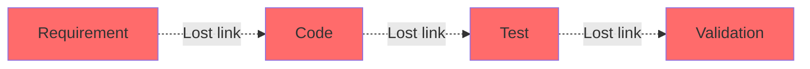
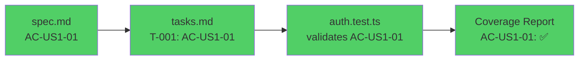
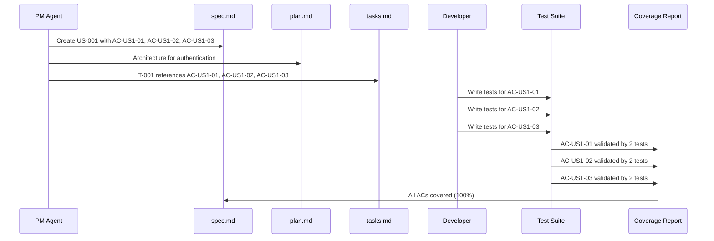

# AC-ID (Acceptance Criteria Identifier)

**AC-ID** is a unique identifier for acceptance criteria that enables complete traceability from specifications through implementation to tests. The format `AC-US{story}-{number}` creates an unbroken chain of accountability ensuring every requirement is implemented and tested.

---

## Format

**Structure**: `AC-US{story}-{number}`

**Components**:
- **AC** = Acceptance Criteria prefix
- **US** = User Story
- **{story}** = User story number (1, 2, 3, ..., no zero-padding for brevity)
- **-** = Separator
- **{number}** = Sequential AC number within story (01, 02, 03, ..., zero-padded for sorting)

**Examples**:
- ✅ `AC-US1-01` (First AC for User Story 1)
- ✅ `AC-US1-02` (Second AC for User Story 1)
- ✅ `AC-US12-05` (Fifth AC for User Story 12)
- ✅ `AC-US105-10` (Tenth AC for User Story 105)
- ❌ `AC-001` (missing user story link)
- ❌ `AC-US-01-01` (extra hyphen)
- ❌ `AC-US1-1` (AC number not zero-padded)
- ❌ `ACUS101` (missing hyphens)

---

## Why AC-IDs Matter

### The Problem Without AC-IDs

Traditional development without traceability:



**Problems**:
- ❌ Can't trace requirement → code → test
- ❌ Requirements get lost or forgotten
- ❌ Tests don't validate actual requirements
- ❌ No way to measure coverage
- ❌ Audits fail (no proof of implementation)

### The Solution With AC-IDs

SpecWeave with complete traceability:



**Benefits**:
- ✅ Complete traceability (spec → task → test)
- ✅ Every requirement tracked
- ✅ Tests validate actual requirements
- ✅ Automated coverage measurement
- ✅ Audit-ready (proof of implementation)

---

## Complete Traceability Flow

### Phase 1: Specification (spec.md)

**Define requirements with AC-IDs**:

```markdown
### US-001: Basic Login Flow

**As a** user
**I want** to log in with my email and password
**So that** I can access my personalized dashboard

**Acceptance Criteria**:
- [ ] **AC-US1-01**: User can log in with valid credentials (P1, testable)
- [ ] **AC-US1-02**: Invalid credentials show error message (P1, testable)
- [ ] **AC-US1-03**: 5 failed attempts lock account for 15 minutes (P2, testable)
```

### Phase 2: Planning (tasks.md)

**Link tasks to AC-IDs**:

```markdown
## T-001: Implement Authentication Service

**AC**: AC-US1-01, AC-US1-02, AC-US1-03

**Test Plan** (BDD format):
- **Given** user with valid credentials → **When** login → **Then** receive JWT token (AC-US1-01)
- **Given** invalid credentials → **When** login → **Then** error message (AC-US1-02)
- **Given** 5 failed attempts → **When** 6th attempt → **Then** account locked (AC-US1-03)

**Test Cases**:
- Unit (`auth.test.ts`):
  - validLogin → Validates AC-US1-01
  - invalidPassword → Validates AC-US1-02
  - rateLimiting → Validates AC-US1-03
  - **Overall: 90% coverage**

**Implementation**:
1. Create AuthService.ts class
2. Implement login method (AC-US1-01)
3. Add validation (AC-US1-02)
4. Add rate limiting (AC-US1-03)
5. Write unit tests for all ACs
```

### Phase 3: Implementation (auth.test.ts)

**Write tests referencing AC-IDs**:

```typescript
describe('AuthService', () => {
  describe('AC-US1-01: Valid login', () => {
    test('should authenticate user with valid credentials', async () => {
      const result = await authService.login('user@example.com', 'password123');

      expect(result.token).toBeDefined();
      expect(result.user.email).toBe('user@example.com');
    });

    test('should return user data on successful login', async () => {
      const result = await authService.login('user@example.com', 'password123');

      expect(result.user).toMatchObject({
        id: expect.any(String),
        email: 'user@example.com',
        name: 'Test User'
      });
    });
  });

  describe('AC-US1-02: Invalid credentials', () => {
    test('should reject login with wrong password', async () => {
      await expect(
        authService.login('user@example.com', 'wrongpassword')
      ).rejects.toThrow('Invalid email or password');
    });

    test('should reject login with non-existent email', async () => {
      await expect(
        authService.login('nonexistent@example.com', 'password123')
      ).rejects.toThrow('Invalid email or password');
    });
  });

  describe('AC-US1-03: Account lockout', () => {
    test('should lock account after 5 failed attempts', async () => {
      // Simulate 5 failed attempts
      for (let i = 0; i < 5; i++) {
        await expect(
          authService.login('user@example.com', 'wrongpassword')
        ).rejects.toThrow();
      }

      // 6th attempt should show "Account locked" error
      await expect(
        authService.login('user@example.com', 'correctpassword')
      ).rejects.toThrow('Account locked for 15 minutes');
    });

    test('should unlock account after 15 minutes', async () => {
      // Lock account
      for (let i = 0; i < 5; i++) {
        await authService.login('user@example.com', 'wrongpassword').catch(() => {});
      }

      // Fast-forward time 15 minutes
      jest.advanceTimersByTime(15 * 60 * 1000);

      // Should be able to login again
      const result = await authService.login('user@example.com', 'password123');
      expect(result.token).toBeDefined();
    });
  });
});
```

### Phase 4: Validation (Coverage Report)

**Automated coverage report links AC-IDs to tests**:

```bash
/specweave:check-tests 0008

# Output:
## AC Coverage Report

### US-001: Basic Login Flow

- ✅ **AC-US1-01**: User can log in with valid credentials (P1)
  - Covered by 2 tests:
    - `auth.test.ts::should authenticate user with valid credentials`
    - `auth.test.ts::should return user data on successful login`
  - Coverage: 95% (19/20 lines)

- ✅ **AC-US1-02**: Invalid credentials show error message (P1)
  - Covered by 2 tests:
    - `auth.test.ts::should reject login with wrong password`
    - `auth.test.ts::should reject login with non-existent email`
  - Coverage: 90% (18/20 lines)

- ✅ **AC-US1-03**: 5 failed attempts lock account for 15 minutes (P2)
  - Covered by 2 tests:
    - `auth.test.ts::should lock account after 5 failed attempts`
    - `auth.test.ts::should unlock account after 15 minutes`
  - Coverage: 88% (22/25 lines)

**Overall Coverage**: 3/3 ACs covered (100%) ✅
**Code Coverage**: 90% (59/65 lines)
**Status**: PASS ✅
```

---

## Traceability Diagram



---

## AC-ID Numbering Rules

### Within User Story

ACs are numbered **sequentially** starting from 01:

```markdown
### US-001: Basic Login Flow
- AC-US1-01  # First AC
- AC-US1-02  # Second AC
- AC-US1-03  # Third AC

### US-002: Session Management
- AC-US2-01  # Restarts at 01 for new user story
- AC-US2-02
- AC-US2-03
- AC-US2-04
- AC-US2-05
```

### User Story Numbering

**User story number is NOT zero-padded** (for brevity):

```markdown
# ✅ Correct (story number not padded, AC number padded)
AC-US1-01
AC-US2-01
AC-US12-01
AC-US105-01

# ❌ Wrong (story number padded)
AC-US001-01
AC-US002-01
AC-US012-01
AC-US105-01
```

**Rationale**: User stories rarely exceed 3 digits (US-105), so padding is unnecessary. AC numbers are padded for sorting (AC-US1-01, AC-US1-02, ..., AC-US1-10).

### Uniqueness

AC-IDs are **unique within a spec** through the US prefix:

```markdown
# SPEC-001: Authentication
US-001: AC-US1-01, AC-US1-02  # Unique within SPEC-001
US-002: AC-US2-01, AC-US2-02  # Unique within SPEC-001

# SPEC-002: User Profile
US-001: AC-US1-01, AC-US1-02  # Same AC-US1-01, but different spec (context makes it unique)
```

**Global Uniqueness**: When referencing across specs, include spec ID:
- `SPEC-001::AC-US1-01` (Authentication spec, US-001, AC-01)
- `SPEC-002::AC-US1-01` (User Profile spec, US-001, AC-01)

---

## Practical Examples

### Example 1: Simple Feature

**Spec**:
```markdown
### US-005: Upload Profile Avatar

**Acceptance Criteria**:
- [ ] **AC-US5-01**: User can select image file (JPG, PNG) (P1, testable)
- [ ] **AC-US5-02**: Image is resized to 200x200px (P1, testable)
- [ ] **AC-US5-03**: Image is uploaded to CDN (P1, testable)
- [ ] **AC-US5-04**: Profile shows new avatar immediately (P2, testable)
```

**Task**:
```markdown
## T-008: Implement Avatar Upload

**AC**: AC-US5-01, AC-US5-02, AC-US5-03, AC-US5-04

**Test Cases**:
- Unit (`avatar.test.ts`): imageResize (AC-US5-02), cdnUpload (AC-US5-03) → 90%
- E2E (`avatar-upload.spec.ts`): completeUploadFlow (all ACs) → 100%
```

**Test**:
```typescript
test('should resize image to 200x200px (AC-US5-02)', async () => {
  const result = await avatarService.uploadAvatar(largeImage);
  expect(result.dimensions).toEqual({ width: 200, height: 200 });
});
```

### Example 2: Complex Feature with Many ACs

**Spec**:
```markdown
### US-012: Advanced Search

**Acceptance Criteria**:
- [ ] **AC-US12-01**: Search by keyword in title (P1, testable)
- [ ] **AC-US12-02**: Search by keyword in content (P1, testable)
- [ ] **AC-US12-03**: Filter by date range (P2, testable)
- [ ] **AC-US12-04**: Filter by category (P2, testable)
- [ ] **AC-US12-05**: Filter by author (P2, testable)
- [ ] **AC-US12-06**: Sort by relevance (default) (P1, testable)
- [ ] **AC-US12-07**: Sort by date (newest first) (P2, testable)
- [ ] **AC-US12-08**: Pagination (20 results per page) (P1, testable)
- [ ] **AC-US12-09**: Search completes in &lt;300ms (p95) (P1, testable)
- [ ] **AC-US12-10**: No results shows helpful message (P2, testable)
```

**Tasks** (Split into Multiple):
```markdown
## T-015: Implement Core Search (AC-US12-01, AC-US12-02, AC-US12-06)
## T-016: Add Search Filters (AC-US12-03, AC-US12-04, AC-US12-05)
## T-017: Add Sorting and Pagination (AC-US12-07, AC-US12-08)
## T-018: Optimize Search Performance (AC-US12-09)
## T-019: Add Empty State (AC-US12-10)
```

---

## Benefits of AC-IDs

### 1. Complete Traceability

```
Requirement (AC-US1-01) → Task (T-001) → Test (auth.test.ts) → Report (✅)
```

**Result**: Every requirement has a clear path from spec to validation.

### 2. Automated Coverage Measurement

```bash
/specweave:check-tests 0008

# Automatically reports:
# - Which ACs are tested (✅)
# - Which ACs are missing tests (❌)
# - Which tests cover which ACs
# - Overall coverage percentage
```

### 3. Audit Trail

```markdown
## Audit Report: Feature Implementation

### SPEC-001: Authentication

**US-001: Basic Login Flow**
- AC-US1-01: ✅ Implemented in T-001, tested in auth.test.ts (95% coverage)
- AC-US1-02: ✅ Implemented in T-001, tested in auth.test.ts (90% coverage)
- AC-US1-03: ✅ Implemented in T-001, tested in auth.test.ts (88% coverage)

**Overall**: 3/3 ACs implemented and tested (100%) ✅

**Compliance**: Meets SOC 2 requirements for traceability ✅
```

### 4. Gap Detection

```bash
# Missing AC detection:
❌ AC-US3-05: Reset link can only be used once
   - NOT FOUND in tasks.md
   - NOT FOUND in test suite
   - **Action**: Implement and test this requirement

❌ AC-US3-06: Rate limiting prevents abuse
   - FOUND in tasks.md (T-004)
   - NOT FOUND in test suite
   - **Action**: Add test for rate limiting
```

### 5. Change Impact Analysis

```bash
# When requirement changes:
AC-US1-03: Changed from "3 failed attempts" to "5 failed attempts"

# Impact analysis:
- spec.md: Update AC-US1-03 description ✅
- tasks.md: Update T-001 test plan ✅
- auth.test.ts: Update test expectations ✅
- rate-limit.test.ts: Update rate limit config ✅

# All references found and updated ✅
```

---

## AC-ID Best Practices

### 1. Reference AC-IDs in Commits

```bash
git commit -m "feat: implement login validation (AC-US1-02)

- Add email/password validation
- Return 401 for invalid credentials
- Add unit tests for AC-US1-02

Validates: AC-US1-02"
```

### 2. Reference AC-IDs in PR Descriptions

```markdown
## PR #123: Implement Authentication Service

### Acceptance Criteria Covered

- ✅ **AC-US1-01**: Valid login returns JWT token
- ✅ **AC-US1-02**: Invalid credentials show error
- ✅ **AC-US1-03**: Rate limiting after 5 failed attempts

### Test Coverage

- Unit tests: 90% (27/30 lines)
- Integration tests: 85% (17/20 lines)
- Overall: 88% (44/50 lines)

### Validation

All ACs covered by automated tests. See test report in CI.
```

### 3. Reference AC-IDs in Test Names

```typescript
// ✅ Good: Test name references AC-ID
test('should authenticate valid credentials (AC-US1-01)', async () => {
  // ...
});

// ❌ Bad: No AC-ID reference
test('should authenticate user', async () => {
  // ...
});
```

---

## AC-ID Anti-Patterns

### 1. No AC-IDs

```markdown
# ❌ Bad: No traceability
- User can log in with valid credentials
- Invalid credentials show error

# ✅ Good: With AC-IDs
- [ ] **AC-US1-01**: User can log in with valid credentials (P1, testable)
- [ ] **AC-US1-02**: Invalid credentials show error message (P1, testable)
```

### 2. Inconsistent Format

```markdown
# ❌ Bad: Inconsistent formats
- AC-001: Login works
- ACUS1-02: Logout works
- AC_US1_03: Reset works

# ✅ Good: Consistent format
- AC-US1-01: Login works
- AC-US1-02: Logout works
- AC-US1-03: Reset works
```

### 3. No AC-IDs in Tests

```typescript
// ❌ Bad: Can't trace test back to requirement
test('should authenticate user', async () => {
  // Which AC does this validate?
});

// ✅ Good: Clear traceability
test('should authenticate user with valid credentials (AC-US1-01)', async () => {
  // Validates AC-US1-01
});
```

---

## Related Terms

- [Acceptance Criteria](/docs/glossary/terms/acceptance-criteria) - Testable conditions for user stories
- [User Stories](/docs/glossary/terms/user-stories) - User-focused requirements
- [Test Coverage](/docs/glossary/terms/test-coverage) - Measuring AC coverage
- [TDD](/docs/glossary/terms/tdd) - Test-driven development with ACs
- [BDD](/docs/glossary/terms/bdd) - Behavior-driven development format
- [Specs](/docs/glossary/terms/specs) - Specifications containing AC-IDs

---

## Summary

**AC-ID** enables complete traceability in SpecWeave:
- **Format**: `AC-US{story}-{number}` (e.g., AC-US1-01, AC-US12-05)
- **Traceability**: spec.md → tasks.md → tests → coverage report
- **Validation**: Automated AC coverage checking (`/specweave:check-tests`)
- **Audit**: Clear proof of requirement → implementation → validation
- **Benefits**: Complete traceability, automated coverage, audit trail, gap detection

**Key Insight**: AC-IDs create an **unbroken chain of accountability** from requirements to tests, ensuring nothing falls through the cracks.
