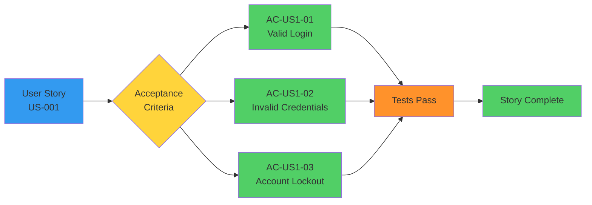
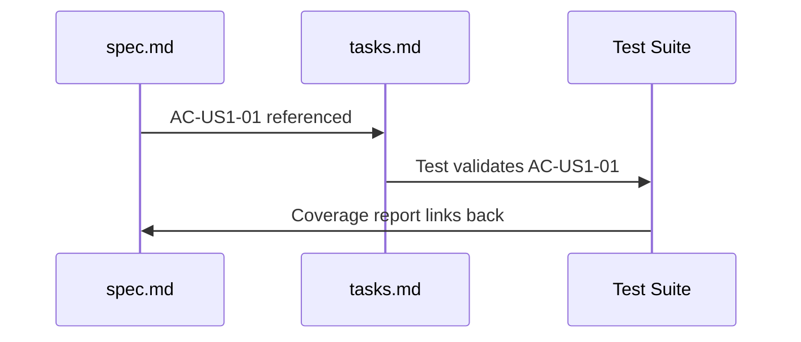

# Acceptance Criteria (AC)

**Acceptance Criteria (AC)** are specific, testable conditions that define when a user story is considered complete. Each criterion must be measurable, unambiguous, and verifiable through testing. In SpecWeave, acceptance criteria use AC-IDs for complete traceability from requirements through implementation to tests.

---

## What Are Acceptance Criteria?

Acceptance criteria define the **boundaries of a user story**:
- What MUST be true for the story to be done
- How we'll know it works correctly
- What edge cases must be handled
- What success looks like



---

## AC Format in SpecWeave

### Standard Template

```markdown
- [ ] **AC-US{story}-{number}**: [Specific, testable condition] (P{priority}, testable)
```

### Example

```markdown
### US-001: Basic Login Flow

**As a** user
**I want** to log in with my email and password
**So that** I can access my personalized dashboard

**Acceptance Criteria**:
- [ ] **AC-US1-01**: User can log in with valid credentials (P1, testable)
- [ ] **AC-US1-02**: Invalid credentials show error message (P1, testable)
- [ ] **AC-US1-03**: 5 failed attempts lock account for 15 minutes (P2, testable)
- [ ] **AC-US1-04**: Locked account shows "Account locked" message (P2, testable)
- [ ] **AC-US1-05**: Successful login redirects to dashboard (P1, testable)
```

---

## AC-ID Format

### Structure

**Format**: `AC-US{story}-{number}`

**Components**:
- **AC** = Acceptance Criteria prefix
- **US** = User Story
- **{story}** = User story number (1, 2, 3, ..., no zero-padding for brevity)
- **{number}** = Sequential AC number within story (01, 02, 03, ..., zero-padded)

**Examples**:
- ✅ `AC-US1-01` (First AC for User Story 1)
- ✅ `AC-US1-02` (Second AC for User Story 1)
- ✅ `AC-US12-05` (Fifth AC for User Story 12)
- ❌ `AC-001` (missing user story link)
- ❌ `AC-US-01-01` (too many hyphens)
- ❌ `AC-US1-1` (AC number not zero-padded)

### Numbering Rules

**Within User Story**: ACs are numbered sequentially starting from 01:

```markdown
### US-001: Basic Login Flow
- AC-US1-01  # First AC
- AC-US1-02  # Second AC
- AC-US1-03  # Third AC

### US-002: Session Management
- AC-US2-01  # Restarts at 01 for new user story
- AC-US2-02
- AC-US2-03
- AC-US2-04
```

**Across Feature Area**: AC-IDs are unique globally through the US prefix:

```markdown
# SPEC-001: Authentication
US-001: AC-US1-01, AC-US1-02, AC-US1-03
US-002: AC-US2-01, AC-US2-02, AC-US2-03

# SPEC-002: User Profile
US-001: AC-US1-01, AC-US1-02  # ← Same AC-US1-01, but different spec (context makes it unique)
```

---

## Priority Levels

Each AC has a **priority** (P1, P2, P3):

| Priority | Meaning | Example |
|----------|---------|---------|
| **P1** | Critical | Core functionality, must have |
| **P2** | High | Important feature, should have |
| **P3** | Normal | Nice to have, can be deferred |

### Priority Examples

```markdown
### US-001: Basic Login Flow

**Acceptance Criteria**:
- [ ] **AC-US1-01**: User can log in with valid credentials (P1, testable)
  # P1 = Core functionality, can't skip

- [ ] **AC-US1-02**: Invalid credentials show error message (P1, testable)
  # P1 = Security requirement, must validate

- [ ] **AC-US1-03**: 5 failed attempts lock account for 15 minutes (P2, testable)
  # P2 = Security feature, important but can defer

- [ ] **AC-US1-04**: Login form has "Remember Me" checkbox (P3, testable)
  # P3 = UX enhancement, nice to have
```

---

## Testability Requirement

**EVERY AC must be testable** - If you can't test it, it's not an AC.

### Testable vs Non-Testable

```markdown
# ❌ Bad: Not testable (vague)
- [ ] **AC-US1-01**: Login should be fast

# ✅ Good: Testable (specific, measurable)
- [ ] **AC-US1-01**: Login completes in &lt;200ms (p99) (P1, testable)

# ❌ Bad: Not testable (subjective)
- [ ] **AC-US2-01**: Dashboard looks good

# ✅ Good: Testable (objective criteria)
- [ ] **AC-US2-01**: Dashboard displays user name and avatar (P1, testable)

# ❌ Bad: Not testable (implementation detail)
- [ ] **AC-US3-01**: Use bcrypt for password hashing

# ✅ Good: Testable (behavior-focused)
- [ ] **AC-US3-01**: Stored password is hashed (not plaintext) (P1, testable)
```

---

## AC Traceability

SpecWeave maintains **complete traceability** through AC-IDs:



### Example Traceability Flow

**1. Specification (spec.md)**:
```markdown
### US-001: Basic Login Flow

**Acceptance Criteria**:
- [ ] **AC-US1-01**: User can log in with valid credentials (P1, testable)
- [ ] **AC-US1-02**: Invalid credentials show error message (P1, testable)
```

**2. Task (tasks.md)**:
```markdown
## T-001: Implement Authentication Service

**AC**: AC-US1-01, AC-US1-02, AC-US1-03

**Test Plan** (BDD format):
- **Given** user with valid credentials → **When** login → **Then** receive JWT token
- **Given** invalid credentials → **When** login → **Then** error message shown

**Test Cases**:
- Unit (`auth.test.ts`): validLogin (AC-US1-01), invalidPassword (AC-US1-02) → 90% coverage
```

**3. Test Code (auth.test.ts)**:
```typescript
describe('AuthService', () => {
  // Validates AC-US1-01
  test('should authenticate user with valid credentials (AC-US1-01)', async () => {
    const result = await authService.login('user@example.com', 'password123');
    expect(result.token).toBeDefined();
    expect(result.user.email).toBe('user@example.com');
  });

  // Validates AC-US1-02
  test('should reject invalid credentials (AC-US1-02)', async () => {
    await expect(
      authService.login('user@example.com', 'wrongpassword')
    ).rejects.toThrow('Invalid email or password');
  });
});
```

**4. Coverage Report**:
```markdown
## Test Coverage Report

### US-001: Basic Login Flow
- ✅ AC-US1-01: Covered by `auth.test.ts::should authenticate user`
- ✅ AC-US1-02: Covered by `auth.test.ts::should reject invalid credentials`
- ✅ AC-US1-03: Covered by `rate-limit.test.ts::should lock account after 5 attempts`

**Overall**: 3/3 ACs covered (100%)
```

**Result**: Complete traceability from requirement → implementation → test → validation.

---

## BDD Format (Given/When/Then)

AC can be written in **BDD (Behavior-Driven Development)** format for clarity:

### Format

```
Given [initial context]
When [action]
Then [expected outcome]
```

### Example

```markdown
### US-004: OAuth Google Login

**Acceptance Criteria**:

- [ ] **AC-US4-01**: User can initiate Google OAuth flow (P1, testable)
  - **Given** user is on login page
  - **When** user clicks "Sign in with Google"
  - **Then** Google OAuth consent page opens in new window

- [ ] **AC-US4-02**: User can complete OAuth flow (P1, testable)
  - **Given** user approves Google OAuth consent
  - **When** Google redirects back to app with auth code
  - **Then** user is logged in with Google profile data (email, name, avatar)

- [ ] **AC-US4-03**: OAuth failure shows error message (P2, testable)
  - **Given** user denies Google OAuth consent
  - **When** Google redirects back with error
  - **Then** app shows "Google login cancelled" message
```

---

## Complete AC Example

### US-003: Password Reset

```markdown
### US-003: Password Reset

**As a** user who forgot my password
**I want** to reset my password via email
**So that** I can regain access to my account

**Acceptance Criteria**:

- [ ] **AC-US3-01**: User can request password reset email (P1, testable)
  - **Given** user is on login page
  - **When** user clicks "Forgot password?" and enters email
  - **Then** system sends reset email to that address (if email exists)
  - **Edge case**: Non-existent email shows same success message (security)

- [ ] **AC-US3-02**: Email contains valid reset link (P1, testable)
  - **Given** user requested password reset
  - **When** user opens reset email
  - **Then** email contains clickable link with unique token
  - **Edge case**: Link expires after 24 hours

- [ ] **AC-US3-03**: User can set new password via link (P1, testable)
  - **Given** user clicks reset link
  - **When** user enters new password (min 8 chars)
  - **Then** password is updated in database (hashed)
  - **Edge case**: Expired link shows "Link expired" error

- [ ] **AC-US3-04**: Old password no longer works after reset (P1, testable)
  - **Given** user reset their password
  - **When** user tries to login with old password
  - **Then** login fails with "Invalid credentials" error

- [ ] **AC-US3-05**: Reset link can only be used once (P2, testable)
  - **Given** user successfully reset password
  - **When** user tries to use same reset link again
  - **Then** system shows "Link already used" error

- [ ] **AC-US3-06**: Rate limiting prevents abuse (P2, testable)
  - **Given** user requested 3 password resets in 1 hour
  - **When** user tries to request 4th reset
  - **Then** system shows "Too many requests, try again in 1 hour" error

**Priority**: P1 (Security and user recovery requirement)
**Estimated Effort**: 12 hours
```

---

## AC Coverage Validation

SpecWeave validates AC coverage automatically:

### Validation Command

```bash
/specweave:check-tests 0008

# Output:
## AC Coverage Report

### US-001: Basic Login Flow
- ✅ AC-US1-01: Covered by 2 tests
  - `auth.test.ts::should authenticate user with valid credentials`
  - `login-endpoint.test.ts::POST /api/auth/login returns 200 for valid creds`
- ✅ AC-US1-02: Covered by 2 tests
  - `auth.test.ts::should reject invalid credentials`
  - `login-endpoint.test.ts::POST /api/auth/login returns 401 for invalid creds`
- ✅ AC-US1-03: Covered by 1 test
  - `rate-limit.test.ts::should lock account after 5 failed attempts`

**Overall Coverage**: 3/3 ACs covered (100%) ✅
```

### Missing AC Detection

```bash
# If ACs are not covered:
## AC Coverage Report

### US-003: Password Reset
- ✅ AC-US3-01: Covered
- ✅ AC-US3-02: Covered
- ✅ AC-US3-03: Covered
- ❌ AC-US3-04: NOT COVERED (old password still works)
- ❌ AC-US3-05: NOT COVERED (reset link can be reused)
- ⚠️  AC-US3-06: PARTIAL (no rate limiting test)

**Overall Coverage**: 3/6 ACs covered (50%) ❌
**Recommendation**: Add tests for AC-US3-04, AC-US3-05, AC-US3-06
```

---

## How Many ACs per User Story?

**Guideline**: **3-10 acceptance criteria** per user story

### Too Few (< 3)

```markdown
# ❌ Bad: Insufficient ACs
### US-001: Basic Login Flow

**Acceptance Criteria**:
- [ ] **AC-US1-01**: User can log in (P1, testable)

# Missing: Invalid credentials, rate limiting, edge cases
```

### Good (3-10)

```markdown
# ✅ Good: Comprehensive ACs
### US-001: Basic Login Flow

**Acceptance Criteria**:
- [ ] **AC-US1-01**: Valid login works (P1, testable)
- [ ] **AC-US1-02**: Invalid credentials rejected (P1, testable)
- [ ] **AC-US1-03**: 5 failed attempts lock account (P2, testable)
- [ ] **AC-US1-04**: Locked account shows error (P2, testable)
- [ ] **AC-US1-05**: Successful login redirects (P1, testable)
```

### Too Many (> 10)

```markdown
# ❌ Bad: Too many ACs (user story too large)
### US-001: Complete Authentication System

**Acceptance Criteria**:
- [ ] AC-US1-01: Login works
- [ ] AC-US1-02: Logout works
- [ ] AC-US1-03: Password reset works
- [ ] AC-US1-04: OAuth Google works
- [ ] AC-US1-05: OAuth GitHub works
- [ ] AC-US1-06: 2FA works
- [ ] AC-US1-07: Session management works
- [ ] AC-US1-08: Rate limiting works
... (15 total ACs)

# Solution: Split into multiple user stories
# US-001: Basic Login (3 ACs)
# US-002: Session Management (4 ACs)
# US-003: Password Reset (6 ACs)
# US-004: OAuth Google (3 ACs)
# US-005: OAuth GitHub (3 ACs)
# US-006: Two-Factor Auth (5 ACs)
```

---

## AC Anti-Patterns

### 1. Implementation Details

```markdown
# ❌ Bad: Prescribes implementation
- [ ] **AC-US1-01**: Use bcrypt with salt rounds = 10 for password hashing

# ✅ Good: Focuses on behavior
- [ ] **AC-US1-01**: Stored password is hashed (not plaintext) (P1, testable)
```

### 2. Vague Requirements

```markdown
# ❌ Bad: Vague and not testable
- [ ] **AC-US2-01**: Dashboard loads quickly

# ✅ Good: Specific and measurable
- [ ] **AC-US2-01**: Dashboard loads in &lt;500ms (p95) (P1, testable)
```

### 3. Multiple Conditions in One AC

```markdown
# ❌ Bad: Multiple conditions (hard to test atomically)
- [ ] **AC-US3-01**: User can reset password via email, link expires in 24h, and old password stops working

# ✅ Good: One condition per AC
- [ ] **AC-US3-01**: User can request password reset email (P1, testable)
- [ ] **AC-US3-02**: Reset link expires after 24 hours (P1, testable)
- [ ] **AC-US3-03**: Old password no longer works after reset (P1, testable)
```

### 4. No Priority

```markdown
# ❌ Bad: No priority (can't defer P3 if needed)
- [ ] **AC-US4-01**: OAuth Google login works (testable)

# ✅ Good: Has priority
- [ ] **AC-US4-01**: OAuth Google login works (P1, testable)
```

---

## AC Best Practices

### 1. Use SMART Criteria

- **S**pecific: Exact condition to verify
- **M**easurable: Can be quantified
- **A**chievable: Technically feasible
- **R**elevant: Adds value to user story
- **T**estable: Can write a test for it

### 2. Cover Happy Path + Edge Cases

```markdown
### US-001: Basic Login Flow

**Acceptance Criteria**:
# Happy path
- [ ] **AC-US1-01**: User can log in with valid credentials (P1, testable)
- [ ] **AC-US1-05**: Successful login redirects to dashboard (P1, testable)

# Edge cases
- [ ] **AC-US1-02**: Invalid password shows error (P1, testable)
- [ ] **AC-US1-03**: Non-existent email shows same error (security) (P1, testable)
- [ ] **AC-US1-04**: Empty fields show validation error (P2, testable)
- [ ] **AC-US1-06**: 5 failed attempts lock account (P2, testable)
```

### 3. Include Performance Requirements

```markdown
### US-002: Search Functionality

**Acceptance Criteria**:
# Functional
- [ ] **AC-US2-01**: User can search by keyword (P1, testable)
- [ ] **AC-US2-02**: Results sorted by relevance (P1, testable)

# Non-functional (performance)
- [ ] **AC-US2-03**: Search returns results in &lt;300ms (p95) (P1, testable)
- [ ] **AC-US2-04**: Search handles 1000 concurrent requests (P2, testable)
```

### 4. Link to Tests

```markdown
### US-003: Password Reset

**Acceptance Criteria**:
- [ ] **AC-US3-01**: User can request password reset email (P1, testable)
  - Test: `password-reset.test.ts::should send reset email`
  - Test: `password-reset-e2e.spec.ts::complete password reset flow`

- [ ] **AC-US3-02**: Reset link expires after 24 hours (P1, testable)
  - Test: `password-reset.test.ts::should reject expired reset token`
```

---

## AC in SpecWeave Workflow

### Creation (PM Agent)

```bash
/specweave:increment "user authentication"

# PM Agent generates spec.md with:
# - User stories (US-001, US-002, US-003)
# - Acceptance criteria (AC-US1-01, AC-US1-02, ...)
# - Each AC has priority and testability marker
```

### Implementation (Developer)

```bash
/specweave:do

# Developer implements tasks:
# T-001: Implement AuthService
#   - AC: AC-US1-01, AC-US1-02, AC-US1-03
#   - Tests validate each AC
```

### Validation (QA)

```bash
/specweave:check-tests 0008

# Validates:
# ✅ All AC-IDs have tests?
# ✅ Test coverage meets targets (85-90%)?
# ✅ Tests actually validate the ACs (not just pass)?
```

---

## Related Terms

- [User Stories](/docs/glossary/terms/user-stories) - High-level requirements
- [AC-ID](/docs/glossary/terms/ac-id) - AC identifier format for traceability
- [BDD](/docs/glossary/terms/bdd) - Behavior-driven development (Given/When/Then)
- [Test Coverage](/docs/glossary/terms/test-coverage) - Measuring AC coverage
- [TDD](/docs/glossary/terms/tdd) - Test-driven development workflow
- [Specs](/docs/glossary/terms/specs) - Specifications containing ACs

---

## Summary

**Acceptance Criteria (AC)** define when a user story is complete:
- **Format**: `AC-US{story}-{number}` (e.g., AC-US1-01, AC-US12-05)
- **Testability**: EVERY AC must be testable (if you can't test it, it's not an AC)
- **Priority**: P1 (critical), P2 (high), P3 (normal)
- **Count**: 3-10 ACs per user story (split if more)
- **Traceability**: Spec → Task → Test (complete traceability through AC-IDs)
- **Coverage**: SpecWeave validates all ACs are tested

**Key Insight**: Good ACs are **specific**, **measurable**, and **testable** - they define clear boundaries for "done".
