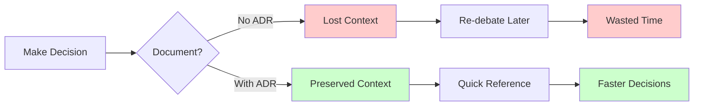
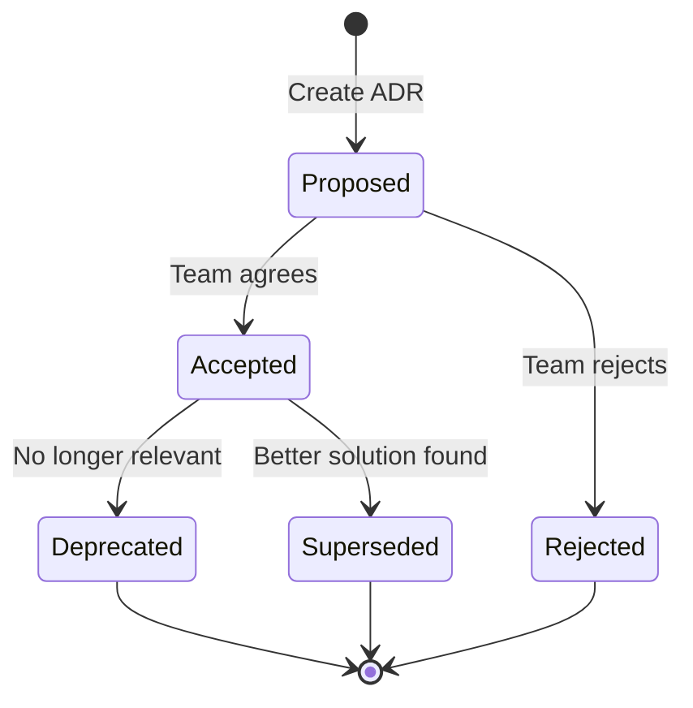
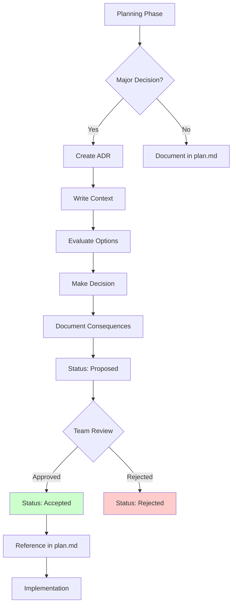

# Architecture Decision Record (ADR)

## Definition

An **Architecture Decision Record (ADR)** is a document that captures an important architectural decision made during software development, along with its context and consequences.

Think of it as **"meeting minutes for architecture decisions"** - preserving WHY choices were made, not just WHAT was built.

## What Problem Does It Solve?

### The Problem: Lost Context

**6 months ago**: Your team chose PostgreSQL over MongoDB after careful analysis.

**Today**: New developer asks "Why PostgreSQL? MongoDB would be better for this feature!"

**Without ADR**: No one remembers the reasons. Time wasted re-debating old decisions.

**With ADR**: Read ADR-001, understand the decision rationale, move forward.

### Why ADRs Matter



## How It Works

### ADR Structure

Every ADR follows a standard format:

```markdown
# ADR-NNN: Decision Title (Short Noun Phrase)

## Status
Proposed | Accepted | Deprecated | Superseded by ADR-XXX

## Context
What is the issue we're trying to solve?
- What constraints exist?
- What requirements must be met?
- What options are available?

## Decision
We will [decision statement].

Rationale:
- Reason 1
- Reason 2
- Reason 3

## Consequences

### Positive
✅ What becomes easier
✅ What benefits we gain

### Negative
❌ What becomes harder
❌ What trade-offs we accept

### Neutral
- Other impacts
```

### Lifecycle



## Real-World Example

### Scenario: Database Choice

**Context**: Your team is building a financial transaction system and needs to choose a database.

**ADR-001: Use PostgreSQL for Primary Database**

```markdown
# ADR-001: Use PostgreSQL for Primary Database

## Status
Accepted (2025-10-15)

## Context

We need a database for:
- User account management
- Financial transactions (money transfers)
- Transaction history and reporting
- Audit logs (regulatory requirement)

**Options considered:**

1. **PostgreSQL** (relational, ACID, mature)
2. **MongoDB** (document store, flexible schema, fast)
3. **DynamoDB** (managed NoSQL, serverless)

**Requirements:**
- ACID transactions (critical for money transfers)
- Complex joins for reporting
- Regulatory compliance (audit trails)
- Team has SQL experience

## Decision

**We will use PostgreSQL as our primary database.**

**Rationale:**
1. **ACID Guarantees**: PostgreSQL provides strong ACID compliance, essential for financial transactions. MongoDB's eventual consistency is too risky.

2. **Complex Queries**: Our reporting needs require complex JOINs across users, accounts, and transactions. PostgreSQL excels here. MongoDB would require multiple queries and application-level joins.

3. **Team Experience**: Our team has 5+ years PostgreSQL experience, 0 years MongoDB. Training would delay project 2-3 months.

4. **Compliance**: Regulatory audits require strict data integrity. PostgreSQL's transaction logs and point-in-time recovery meet compliance needs.

5. **Ecosystem**: Mature tools (pgAdmin, pg_dump, Flyway migrations) vs emerging MongoDB tools.

**Why NOT MongoDB:**
- Eventual consistency risk for financial data
- Limited JOIN support requires application logic
- Team has no experience (training cost)
- Flexible schema not needed (stable data model)

**Why NOT DynamoDB:**
- Vendor lock-in (AWS only)
- Complex JOIN queries require multiple requests
- Higher cost for our access patterns

## Consequences

### Positive
✅ **Data Integrity**: ACID guarantees prevent money loss
✅ **Reporting**: Complex queries run efficiently
✅ **Team Velocity**: No learning curve, start building immediately
✅ **Compliance**: Audit logs meet regulatory requirements
✅ **Maturity**: 30+ year track record, battle-tested

### Negative
❌ **Schema Migrations**: Changes require planned migrations (Flyway)
❌ **Horizontal Scaling**: More complex than NoSQL (but manageable with read replicas)
❌ **JSON Flexibility**: Less flexible than MongoDB for nested documents (acceptable trade-off)

### Neutral
- **Cost**: Similar hosting costs (AWS RDS vs DocumentDB)
- **Performance**: PostgreSQL 15+ has excellent JSON support if needed later
```

**Result**: 6 months later, new developer reads ADR-001, understands WHY PostgreSQL was chosen, suggests improvements within that choice instead of re-debating the decision.

## How SpecWeave Uses ADRs

### Storage Location

```
.specweave/docs/internal/architecture/adr/
├── README.md                    # ADR index
├── 0001-use-typescript.md       # ADR-001
├── 0002-plugin-architecture.md  # ADR-002
├── 0003-claude-code-first.md    # ADR-003
└── template.md                  # Template for new ADRs
```

### Workflow



### When to Create an ADR

✅ **CREATE ADR for:**
- Architecture patterns (microservices vs monolith)
- Technology choices (React vs Angular)
- Database selection (SQL vs NoSQL)
- Deployment strategy (K8s vs serverless)
- Security approaches (JWT vs sessions)
- Major refactoring decisions

❌ **DON'T CREATE ADR for:**
- Minor implementation details
- Obvious choices (use Git for version control)
- Temporary workarounds
- Personal coding style preferences

### SpecWeave Commands

No specific command for ADRs. They're created manually during planning:

```bash
# During increment planning
/specweave:increment "Add payment processing"

# PM agent asks Architect to create ADRs for major decisions
# Architect creates: .specweave/docs/internal/architecture/adr/0015-payment-gateway-choice.md

# ADR is referenced in plan.md
# After implementation, ADR status changes to "Accepted"
```

### Example from SpecWeave

**ADR-003: Claude Code First Approach**

```markdown
# ADR-003: Claude Code First Approach

## Status
Accepted (2025-09-15)

## Context
SpecWeave needs to support AI coding assistants. Options:
1. Multi-tool support (Claude, Cursor, Copilot)
2. Claude Code exclusive
3. Generic approach (Markdown only)

## Decision
Design SpecWeave for Claude Code first, degrade gracefully for others.

**Rationale:**
- Claude Code has native plugin system (best integration)
- Skills auto-activate (best UX)
- Hooks enable living docs automation
- MCP protocol reduces context by 60-80%
- Anthropic sets industry standards

## Consequences

### Positive
✅ Best user experience (Claude Code users)
✅ Automated workflows (hooks)
✅ Lower token costs (MCP + context optimization)

### Negative
❌ Other tools have limited features
❌ More testing surface (multiple adapters)

### Neutral
- Cursor works via AGENTS.md compilation
- Other tools work with manual workflows
```

## Best Practices

### 1. Write Early

**Create ADRs DURING planning**, not after implementation.

❌ Wrong: Build feature → Write ADR later → Forget details
✅ Right: Evaluate options → Write ADR → Implement

### 2. Be Honest About Trade-offs

Every decision has consequences. Document them honestly:

```markdown
## Consequences

### Positive
✅ Fast development (known framework)

### Negative
❌ Vendor lock-in (AWS only)
❌ Higher costs at scale

### Neutral
- Learning curve for new team members
```

### 3. Link Related ADRs

```markdown
## Related ADRs
- Supersedes [ADR-005](/docs/glossary/terms/0005-old-approach)
- Related to [ADR-012](/docs/glossary/terms/0012-deployment)
```

### 4. Keep It Concise

Aim for 1-2 pages. If longer, split into multiple ADRs.

### 5. Use Simple Language

Write for future developers who weren't at the meeting:

❌ "We evaluated the paradigm shift"
✅ "We compared REST vs GraphQL"

## Common Mistakes

### ❌ Mistake 1: Writing ADRs After the Fact

**Problem**: Memory fades, details lost, rationale unclear.

**Solution**: Write ADR BEFORE or DURING implementation.

### ❌ Mistake 2: Missing Trade-offs

**Problem**: Only documenting benefits, hiding costs.

**Solution**: Every decision has negative consequences. Document them honestly.

### ❌ Mistake 3: Too Much Detail

**Problem**: 10-page ADR no one reads.

**Solution**: Keep it 1-2 pages. Link to external docs if needed.

### ❌ Mistake 4: No Status Updates

**Problem**: Old ADRs still marked "Proposed" years later.

**Solution**: Update status when accepted, deprecated, or superseded.

## Related Terms

- **[RFC (Request for Comments)](/docs/glossary/terms/rfc)** - Feature specification (WHAT), ADR is decision (WHY)
- **HLD (High-Level Design)** - System architecture (HOW), ADR is rationale (WHY)
- **[Architecture](/docs/glossary/categories/architecture)** - Category page
- **[Living Documentation](/docs/guides/core-concepts/living-documentation)** - How docs stay current
- **[Increment](/docs/guides/core-concepts/what-is-an-increment)** - SpecWeave's unit of work

## Learn More

- **Architecture Patterns Guide** - Common patterns and when to use ADRs
- **Why Documentation Matters** - The value of preserved context

---

**Category**: Architecture & Design

**Tags**: `#architecture` `#decision` `#documentation` `#design-rationale`
