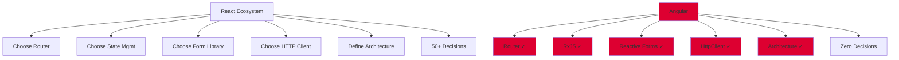
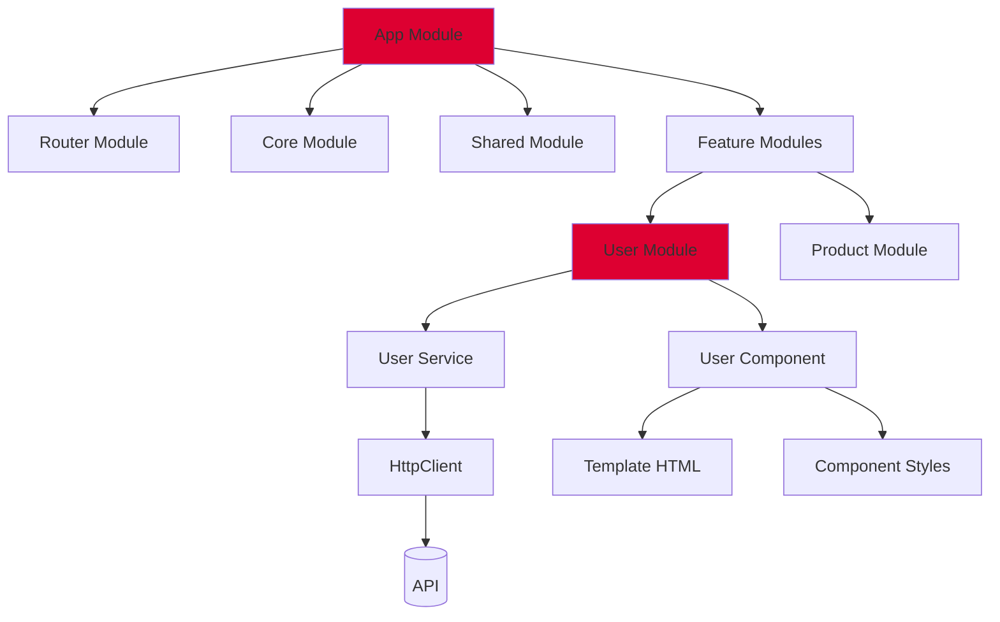
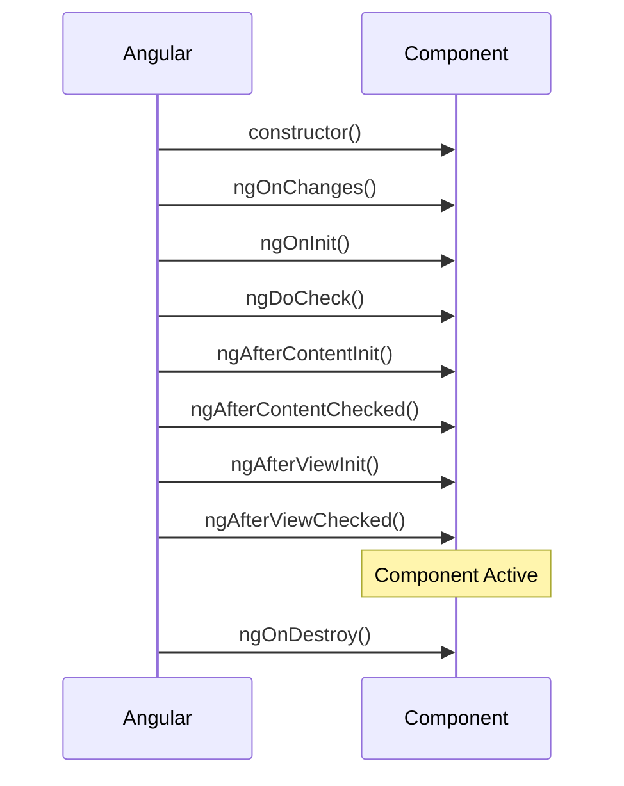

# Angular

## Definition

**Angular** is a comprehensive TypeScript-based framework for building web applications, maintained by Google. It's a full-featured, opinionated framework with everything built-in.

Think of it as **"the Swiss Army knife of web development"** - batteries included, all tools in one place, but with a steeper learning curve.

## What Problem Does It Solve?

### The Problem: Building Large Enterprise Applications

**Scenario**: You're building a complex enterprise application with:
- Multiple teams (20+ developers)
- Strict coding standards
- Long-term maintenance (10+ years)
- Complex forms and validation
- Real-time data updates

**Without Angular**: You pick React, then spend weeks deciding:
- Which router? (React Router, TanStack Router, Reach Router?)
- Which state management? (Redux, Zustand, Jotai, MobX?)
- Which form library? (Formik, React Hook Form, Final Form?)
- Which HTTP client? (Fetch, Axios, React Query?)
- How to structure the app? (Everyone does it differently)

**With Angular**: All decided for you. One way, one architecture, one set of tools.

### Why Angular Matters



## How It Works

### Angular Architecture



## Core Concepts

### 1. Components

**Everything is a component**:

```typescript
// user-profile.component.ts
import { Component, OnInit } from '@angular/core';
import { UserService } from './user.service';

@Component({
  selector: 'app-user-profile',
  templateUrl: './user-profile.component.html',
  styleUrls: ['./user-profile.component.css']
})
export class UserProfileComponent implements OnInit {
  user: User | null = null;
  loading = true;

  constructor(private userService: UserService) {}

  ngOnInit(): void {
    this.userService.getUser().subscribe(user => {
      this.user = user;
      this.loading = false;
    });
  }

  updateProfile(): void {
    this.userService.updateUser(this.user!).subscribe();
  }
}
```

**Template** (`user-profile.component.html`):

```html
<div class="profile-card" *ngIf="!loading; else loadingTemplate">
  
  <h2>{{ user?.name }}</h2>
  <p>{{ user?.email }}</p>
  <button (click)="updateProfile()">Update</button>
</div>

<ng-template #loadingTemplate>
  <div class="loading">Loading...</div>
</ng-template>
```

### 2. Services (Dependency Injection)

**Reusable business logic**:

```typescript
// user.service.ts
import { Injectable } from '@angular/core';
import { HttpClient } from '@angular/common/http';
import { Observable } from 'rxjs';

@Injectable({
  providedIn: 'root' // Singleton service
})
export class UserService {
  private apiUrl = '/api/users';

  constructor(private http: HttpClient) {}

  getUser(): Observable<User> {
    return this.http.get<User>(this.apiUrl);
  }

  updateUser(user: User): Observable<User> {
    return this.http.put<User>(`${this.apiUrl}/${user.id}`, user);
  }

  deleteUser(id: string): Observable<void> {
    return this.http.delete<void>(`${this.apiUrl}/${id}`);
  }
}
```

### 3. Modules

**Organize application into modules**:

```typescript
// user.module.ts
import { NgModule } from '@angular/core';
import { CommonModule } from '@angular/common';
import { RouterModule } from '@angular/router';
import { UserProfileComponent } from './user-profile.component';
import { UserListComponent } from './user-list.component';
import { UserService } from './user.service';

@NgModule({
  declarations: [
    UserProfileComponent,
    UserListComponent
  ],
  imports: [
    CommonModule,
    RouterModule.forChild([
      { path: 'profile', component: UserProfileComponent },
      { path: 'list', component: UserListComponent }
    ])
  ],
  providers: [UserService]
})
export class UserModule {}
```

### 4. Reactive Forms

**Powerful form handling**:

```typescript
// signup.component.ts
import { Component, OnInit } from '@angular/core';
import { FormBuilder, FormGroup, Validators } from '@angular/forms';

@Component({
  selector: 'app-signup',
  templateUrl: './signup.component.html'
})
export class SignupComponent implements OnInit {
  signupForm!: FormGroup;

  constructor(private fb: FormBuilder) {}

  ngOnInit(): void {
    this.signupForm = this.fb.group({
      email: ['', [Validators.required, Validators.email]],
      password: ['', [Validators.required, Validators.minLength(8)]],
      confirmPassword: ['', Validators.required]
    }, {
      validators: this.passwordMatchValidator
    });
  }

  passwordMatchValidator(form: FormGroup): null | { mismatch: boolean } {
    const password = form.get('password')?.value;
    const confirm = form.get('confirmPassword')?.value;
    return password === confirm ? null : { mismatch: true };
  }

  onSubmit(): void {
    if (this.signupForm.valid) {
      console.log(this.signupForm.value);
    }
  }
}
```

**Template**:

```html
<form [formGroup]="signupForm" (ngSubmit)="onSubmit()">
  <div>
    <input formControlName="email" placeholder="Email">
    <div *ngIf="signupForm.get('email')?.invalid && signupForm.get('email')?.touched">
      <span *ngIf="signupForm.get('email')?.errors?.['required']">Email is required</span>
      <span *ngIf="signupForm.get('email')?.errors?.['email']">Invalid email format</span>
    </div>
  </div>

  <div>
    <input type="password" formControlName="password" placeholder="Password">
    <div *ngIf="signupForm.get('password')?.invalid && signupForm.get('password')?.touched">
      <span *ngIf="signupForm.get('password')?.errors?.['minlength']">
        Password must be 8+ characters
      </span>
    </div>
  </div>

  <div>
    <input type="password" formControlName="confirmPassword" placeholder="Confirm Password">
    <div *ngIf="signupForm.errors?.['mismatch'] && signupForm.get('confirmPassword')?.touched">
      <span>Passwords don't match</span>
    </div>
  </div>

  <button type="submit" [disabled]="signupForm.invalid">Sign Up</button>
</form>
```

### 5. RxJS (Reactive Programming)

**Handle async data streams**:

```typescript
// product-search.component.ts
import { Component, OnInit } from '@angular/core';
import { FormControl } from '@angular/forms';
import { debounceTime, distinctUntilChanged, switchMap } from 'rxjs/operators';

@Component({
  selector: 'app-product-search',
  template: `
    <input [formControl]="searchControl" placeholder="Search products...">
    <div *ngFor="let product of products">{{ product.name }}</div>
  `
})
export class ProductSearchComponent implements OnInit {
  searchControl = new FormControl('');
  products: Product[] = [];

  constructor(private productService: ProductService) {}

  ngOnInit(): void {
    this.searchControl.valueChanges.pipe(
      debounceTime(300),           // Wait 300ms after typing
      distinctUntilChanged(),      // Only if value changed
      switchMap(term =>            // Cancel previous requests
        this.productService.search(term || '')
      )
    ).subscribe(products => {
      this.products = products;
    });
  }
}
```

## Real-World Examples

### Example 1: Todo App

```typescript
// todo.component.ts
import { Component } from '@angular/core';

interface Todo {
  id: number;
  text: string;
  done: boolean;
}

@Component({
  selector: 'app-todo',
  template: `
    <div class="todo-app">
      <h1>Todo List</h1>
      <input [(ngModel)]="newTodo" (keyup.enter)="addTodo()" placeholder="What needs to be done?">
      <button (click)="addTodo()">Add</button>

      <ul>
        <li *ngFor="let todo of todos" (click)="toggleTodo(todo)"
            [class.done]="todo.done">
          {{ todo.text }}
        </li>
      </ul>
    </div>
  `,
  styles: [`
    .done { text-decoration: line-through; }
  `]
})
export class TodoComponent {
  todos: Todo[] = [];
  newTodo = '';
  private nextId = 1;

  addTodo(): void {
    if (this.newTodo.trim()) {
      this.todos.push({
        id: this.nextId++,
        text: this.newTodo,
        done: false
      });
      this.newTodo = '';
    }
  }

  toggleTodo(todo: Todo): void {
    todo.done = !todo.done;
  }
}
```

### Example 2: HTTP with Error Handling

```typescript
// post.service.ts
import { Injectable } from '@angular/core';
import { HttpClient, HttpErrorResponse } from '@angular/common/http';
import { Observable, throwError } from 'rxjs';
import { catchError, retry } from 'rxjs/operators';

@Injectable({ providedIn: 'root' })
export class PostService {
  private apiUrl = 'https://api.example.com/posts';

  constructor(private http: HttpClient) {}

  getPosts(): Observable<Post[]> {
    return this.http.get<Post[]>(this.apiUrl).pipe(
      retry(3), // Retry failed requests 3 times
      catchError(this.handleError)
    );
  }

  createPost(post: Post): Observable<Post> {
    return this.http.post<Post>(this.apiUrl, post).pipe(
      catchError(this.handleError)
    );
  }

  private handleError(error: HttpErrorResponse): Observable<never> {
    let errorMessage = 'An unknown error occurred';

    if (error.error instanceof ErrorEvent) {
      // Client-side error
      errorMessage = `Error: ${error.error.message}`;
    } else {
      // Server-side error
      errorMessage = `Error Code: ${error.status}\nMessage: ${error.message}`;
    }

    console.error(errorMessage);
    return throwError(() => new Error(errorMessage));
  }
}
```

### Example 3: Route Guards (Authentication)

```typescript
// auth.guard.ts
import { Injectable } from '@angular/core';
import { CanActivate, Router, ActivatedRouteSnapshot } from '@angular/router';
import { AuthService } from './auth.service';

@Injectable({ providedIn: 'root' })
export class AuthGuard implements CanActivate {
  constructor(
    private authService: AuthService,
    private router: Router
  ) {}

  canActivate(route: ActivatedRouteSnapshot): boolean {
    if (this.authService.isLoggedIn()) {
      return true;
    }

    // Redirect to login
    this.router.navigate(['/login'], {
      queryParams: { returnUrl: route.url }
    });
    return false;
  }
}

// app-routing.module.ts
const routes: Routes = [
  { path: 'login', component: LoginComponent },
  {
    path: 'dashboard',
    component: DashboardComponent,
    canActivate: [AuthGuard] // Protect route
  }
];
```

## Angular vs React

| Aspect | Angular | React |
|--------|---------|-------|
| **Type** | Full framework | Library |
| **Language** | TypeScript (required) | JavaScript/TypeScript |
| **Learning Curve** | Steep | Moderate |
| **Opinionated** | ✅ Very (one way) | ❌ Flexible (many ways) |
| **Bundle Size** | Large (~500KB) | Small (~40KB) |
| **Template Syntax** | HTML + directives | JSX |
| **State Management** | RxJS + Services | Choose your own |
| **Forms** | Reactive Forms (built-in) | Choose your own |
| **HTTP** | HttpClient (built-in) | Choose your own |
| **Best For** | Enterprise, large teams | Startups, flexibility |
| **Job Market** | Smaller (enterprise-focused) | Larger (all sizes) |

**[Learn More: React →](/docs/glossary/terms/react)**

## Angular vs Vue

| Aspect | Angular | Vue |
|--------|---------|-----|
| **Complexity** | High | Low |
| **Enterprise Adoption** | High | Moderate |
| **Template Syntax** | HTML + directives | HTML + directives |
| **Learning Curve** | Steep | Easy |
| **Best For** | Large enterprise | Medium-sized apps |

## How SpecWeave Uses Angular

### 1. Angular Project Structure

```
my-angular-app/
├── .specweave/
│   ├── increments/
│   │   └── 0001-setup-angular/
│   │       ├── spec.md
│   │       ├── plan.md
│   │       └── tasks.md
│   └── docs/
│       └── internal/
│           └── architecture/
│               ├── module-structure.md
│               └── adr/
│                   └── 0001-angular-architecture.md
├── src/
│   ├── app/
│   │   ├── core/          # Singleton services
│   │   ├── shared/        # Shared components
│   │   ├── features/      # Feature modules
│   │   └── app.module.ts
│   ├── assets/
│   └── environments/
└── angular.json
```

### 2. Planning Angular Features

**Increment spec**:

```markdown
# Increment 0015: User Management Module

## User Stories

**US-001**: User list with search
- [ ] AC-US1-01: Display paginated user list
- [ ] AC-US1-02: Debounced search (300ms)
- [ ] AC-US1-03: Loading states

**US-002**: User profile editing
- [ ] AC-US2-01: Reactive form with validation
- [ ] AC-US2-02: Email format validation
- [ ] AC-US2-03: Password strength indicator

## Architecture

**Module Structure**:
- UserModule (lazy-loaded)
  - UserListComponent
  - UserProfileComponent
  - UserService
  - UserRoutingModule

**RxJS Operators**:
- debounceTime for search
- switchMap for API calls
- catchError for error handling
```

### 3. Angular + SpecWeave Workflow

```mermaid
graph TB
    A[/specweave:increment "User Module"] --> B[PM: Define Features]
    B --> C[Architect: Design Module Structure]
    C --> D[/specweave:do]
    D --> E[Generate Module/Components]
    E --> F[Implement Services]
    F --> G[Write Unit Tests]
    G --> H[/specweave:done]

    style B fill:#dd0031
    style C fill:#dd0031
```

## Angular Lifecycle Hooks



**Most Common Hooks**:

| Hook | Purpose | Use When |
|------|---------|----------|
| `ngOnInit` | Initialize component | Fetch data, setup |
| `ngOnChanges` | Input changed | React to @Input changes |
| `ngOnDestroy` | Cleanup | Unsubscribe, cleanup timers |
| `ngAfterViewInit` | View initialized | Access DOM elements |

## Angular CLI

**Powerful code generation**:

```bash
# Create new app
ng new my-app

# Generate component
ng generate component user-profile
# or: ng g c user-profile

# Generate service
ng generate service user
# or: ng g s user

# Generate module
ng generate module user --routing
# or: ng g m user --routing

# Run dev server
ng serve

# Build for production
ng build --prod

# Run tests
ng test

# Run E2E tests
ng e2e
```

## Best Practices

### ✅ Do

1. **Use TypeScript strictly** (strict mode)
2. **Lazy load feature modules** (performance)
3. **Use OnPush change detection** (optimization)
4. **Unsubscribe from observables** (memory leaks)
5. **Use async pipe in templates** (automatic unsubscribe)
6. **Follow Angular style guide** (consistency)

### ❌ Don't

1. **Don't use `any` type** (defeats TypeScript)
2. **Don't subscribe in templates** (use async pipe)
3. **Don't manipulate DOM directly** (use ViewChild)
4. **Don't forget to unsubscribe** (memory leaks)
5. **Don't put logic in constructors** (use ngOnInit)

## Common Patterns

### 1. Smart/Dumb Component Pattern

```typescript
// Smart (Container) Component
@Component({
  selector: 'app-user-container',
  template: `
    <app-user-list
      [users]="users$ | async"
      (userSelected)="onUserSelect($event)">
    </app-user-list>
  `
})
export class UserContainerComponent {
  users$ = this.userService.getUsers();

  constructor(private userService: UserService) {}

  onUserSelect(user: User): void {
    // Handle user selection
  }
}

// Dumb (Presentational) Component
@Component({
  selector: 'app-user-list',
  template: `
    <div *ngFor="let user of users" (click)="userSelected.emit(user)">
      {{ user.name }}
    </div>
  `
})
export class UserListComponent {
  @Input() users: User[] = [];
  @Output() userSelected = new EventEmitter<User>();
}
```

### 2. Async Pipe (Automatic Unsubscribe)

```typescript
// ❌ WRONG - Manual subscription (memory leak risk)
export class BadComponent implements OnInit, OnDestroy {
  users: User[] = [];
  subscription!: Subscription;

  ngOnInit(): void {
    this.subscription = this.userService.getUsers().subscribe(
      users => this.users = users
    );
  }

  ngOnDestroy(): void {
    this.subscription.unsubscribe(); // Easy to forget!
  }
}

// ✅ CORRECT - Async pipe (auto unsubscribe)
@Component({
  template: `
    <div *ngFor="let user of users$ | async">
      {{ user.name }}
    </div>
  `
})
export class GoodComponent {
  users$ = this.userService.getUsers();

  constructor(private userService: UserService) {}
}
```

## Common Mistakes

### ❌ Mistake 1: Not Unsubscribing

```typescript
// ❌ WRONG - Memory leak
ngOnInit(): void {
  this.service.getData().subscribe(data => {
    this.data = data;
  }); // Never unsubscribed!
}

// ✅ CORRECT - Use async pipe or takeUntil
destroy$ = new Subject<void>();

ngOnInit(): void {
  this.service.getData().pipe(
    takeUntil(this.destroy$)
  ).subscribe(data => {
    this.data = data;
  });
}

ngOnDestroy(): void {
  this.destroy$.next();
  this.destroy$.complete();
}
```

### ❌ Mistake 2: Logic in Constructor

```typescript
// ❌ WRONG - Constructor runs before inputs
constructor(private service: UserService) {
  this.service.getUser().subscribe(); // @Input not set yet!
}

// ✅ CORRECT - Use ngOnInit
ngOnInit(): void {
  this.service.getUser().subscribe();
}
```

### ❌ Mistake 3: Not Using OnPush

```typescript
// ❌ WRONG - Default change detection (checks all components)
@Component({
  selector: 'app-list'
})

// ✅ CORRECT - OnPush (only checks when inputs change)
@Component({
  selector: 'app-list',
  changeDetection: ChangeDetectionStrategy.OnPush
})
```

## Related Terms

- **[React](/docs/glossary/terms/react)** - Alternative frontend library
- **[TypeScript](/docs/glossary/terms/typescript)** - Required for Angular
- **RxJS** - Reactive programming library
- **Frontend** - Client-side development
- **[SPA](/docs/glossary/terms/spa)** - Single page application

## Learn More

- **[Angular Official Docs](https://angular.io/docs)** - Comprehensive documentation
- **Angular Tutorial** - SpecWeave Angular guide
- **[TypeScript Guide](/docs/glossary/terms/typescript)** - Learn TypeScript first
- **[SpecWeave Frontend Plugin](/docs/plugins/frontend-stack)** - Angular-specific features

---

**Category**: Frontend Development

**Tags**: `#angular` `#frontend` `#typescript` `#framework` `#rxjs` `#enterprise`
