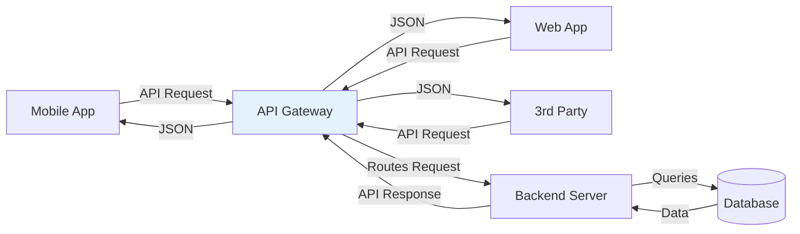
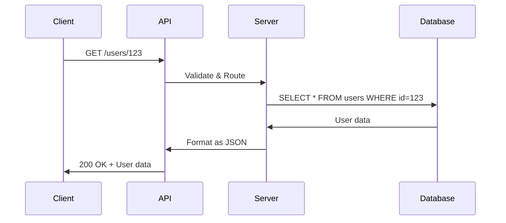
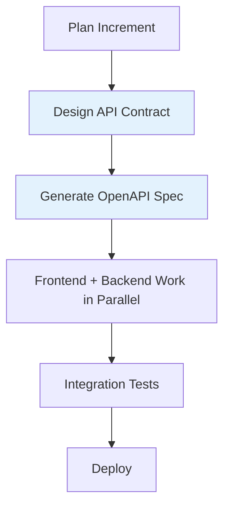

# API (Application Programming Interface)

## Definition

An **API (Application Programming Interface)** is a set of rules and protocols that allows different software applications to communicate with each other.

Think of it as **"a waiter at a restaurant"** - you (the client) tell the waiter (API) what you want, the waiter communicates with the kitchen (server), and brings back your food (response).

## What Problem Does It Solve?

### The Problem: Software Can't Talk to Each Other

**Scenario**: Your mobile app needs to get user data from a server.

**Without API**: How does the app ask for data? What format? What authentication? Every developer invents their own method = chaos.

**With API**: Standardized way to request and receive data. Everyone knows the rules.

### Why APIs Matter



## How It Works

### Request-Response Pattern



### API Components

1. **Endpoint**: URL where API is accessed
   ```
   https://api.example.com/users
   ```

2. **Method**: HTTP verb indicating action
   - `GET` - Retrieve data
   - `POST` - Create new data
   - `PUT/PATCH` - Update data
   - `DELETE` - Remove data

3. **Request**: Data sent to API
   ```json
   POST /users
   {
     "name": "John Doe",
     "email": "john@example.com"
   }
   ```

4. **Response**: Data returned by API
   ```json
   201 Created
   {
     "id": 123,
     "name": "John Doe",
     "email": "john@example.com",
     "created_at": "2025-11-04T10:00:00Z"
   }
   ```

## Real-World Examples

### Example 1: Weather App

**Your app needs current weather**:

```javascript
// API Request
fetch('https://api.weather.com/v1/current?city=London&apiKey=YOUR_KEY')
  .then(response => response.json())
  .then(data => {
    console.log(data.temperature); // 15°C
    console.log(data.conditions);   // Cloudy
  });
```

**API Response**:
```json
{
  "city": "London",
  "temperature": 15,
  "conditions": "Cloudy",
  "humidity": 78,
  "wind_speed": 12
}
```

### Example 2: Payment Processing

**Your e-commerce site processes payment**:

```javascript
// API Request to Stripe
const payment = await stripe.charges.create({
  amount: 2000,        // $20.00
  currency: 'usd',
  source: 'tok_visa',  // Credit card token
  description: 'Product Purchase'
});
```

**API Response**:
```json
{
  "id": "ch_1ABC123",
  "status": "succeeded",
  "amount": 2000,
  "receipt_url": "https://..."
}
```

### Example 3: GitHub Integration

**SpecWeave creates GitHub issue**:

```bash
POST https://api.github.com/repos/owner/repo/issues
{
  "title": "Implement user authentication",
  "body": "See increment 0007 for details",
  "labels": ["feature", "specweave"]
}
```

## API Types

### 1. REST (Most Common)

**REpresentational State Transfer** - Uses HTTP methods + URLs

```
GET    /users       # List all users
GET    /users/123   # Get user 123
POST   /users       # Create user
PUT    /users/123   # Update user 123
DELETE /users/123   # Delete user 123
```

**Characteristics**:
- ✅ Simple, intuitive
- ✅ Stateless (each request independent)
- ✅ Cacheable responses
- ✅ Wide adoption

**[Learn More: REST →](/docs/glossary/terms/rest)**

### 2. GraphQL

**Query language** - Client specifies exactly what data it needs

```graphql
query {
  user(id: 123) {
    name
    email
    posts {
      title
      createdAt
    }
  }
}
```

**Characteristics**:
- ✅ Fetch exactly what you need (no over-fetching)
- ✅ Single endpoint
- ❌ More complex than REST
- ❌ Caching harder

**[Learn More: GraphQL →](/docs/glossary/terms/graphql)**

### 3. gRPC

**High-performance RPC** - Binary protocol, faster than JSON

```protobuf
service UserService {
  rpc GetUser (UserId) returns (User);
  rpc CreateUser (User) returns (UserId);
}
```

**Characteristics**:
- ✅ Very fast (binary)
- ✅ Strongly typed
- ✅ Bidirectional streaming
- ❌ Not human-readable
- ❌ More setup complexity

**Learn More: gRPC →**

## How SpecWeave Uses APIs

### 1. Internal APIs (Application Code)

Your application's backend APIs are documented in:

```
.specweave/docs/internal/specs/spec-####-{feature}/
├── spec.md          # API requirements
├── plan.md          # API design
└── api-contract.md  # OpenAPI spec (optional)
```

### 2. External APIs (Integrations)

SpecWeave integrates with external APIs:

**GitHub API** (via `specweave-github` plugin):
```bash
# Create GitHub issue from increment
/specweave-github:create-issue
```

**Jira API** (via `specweave-jira` plugin):
```bash
# Sync increment to Jira epic
/specweave-jira:sync
```

### 3. API-First Development



**Workflow**:

1. **Design API contract** (during planning):
   ```yaml
   # api-contract.yaml (OpenAPI 3.0)
   paths:
     /users:
       get:
         summary: List users
         responses:
           200:
             content:
               application/json:
                 schema:
                   type: array
                   items:
                     $ref: '#/components/schemas/User'
   ```

2. **Generate client/server code** (optional):
   ```bash
   npm run generate-api-client
   ```

3. **Frontend & Backend work in parallel**:
   - Frontend mocks API responses
   - Backend implements API endpoints
   - Both follow same contract

4. **Integration tests** validate contract compliance

## Best Practices

### 1. Versioning

**Always version your API**:

```
/v1/users       # Version 1
/v2/users       # Version 2 (breaking changes)
```

**Why**: Allows old clients to keep working while new clients use new features.

### 2. Authentication

**Protect your API**:

```javascript
// API Key
GET /users
Headers: X-API-Key: abc123def456

// JWT Token
GET /users
Headers: Authorization: Bearer eyJhbGc...
```

**Learn More: JWT →** | **[OAuth2 →](/docs/glossary/terms/oauth2)**

### 3. Rate Limiting

**Prevent abuse**:

```
Rate Limit: 1000 requests/hour per API key
Response: 429 Too Many Requests (when exceeded)
```

### 4. Error Handling

**Clear error responses**:

```json
{
  "error": {
    "code": "INVALID_EMAIL",
    "message": "Email format is invalid",
    "field": "email"
  }
}
```

### 5. Documentation

**Document your API**:

- Use OpenAPI/Swagger spec
- Provide examples
- Show error responses
- Include authentication details

## API Design Patterns

### RESTful Resource Naming

```
✅ Good:
/users              # Collection
/users/123          # Specific user
/users/123/posts    # User's posts

❌ Bad:
/getUsers           # Verb in URL
/user-list          # Inconsistent
/userPost/123       # Confusing hierarchy
```

### HTTP Status Codes

```
200 OK               # Success
201 Created          # Resource created
400 Bad Request      # Client error
401 Unauthorized     # Auth required
404 Not Found        # Resource missing
500 Internal Error   # Server error
```

## Common Mistakes

### ❌ Mistake 1: No API Versioning

**Problem**: Breaking changes break all clients.

**Solution**: Version from day 1 (`/v1/users`).

### ❌ Mistake 2: Over-Fetching Data

**Problem**: API returns too much data (slow, wasteful).

**Solution**: Allow field selection or use GraphQL.

### ❌ Mistake 3: No Rate Limiting

**Problem**: Malicious users DDoS your API.

**Solution**: Implement rate limits (1000 req/hour).

### ❌ Mistake 4: Exposing Internal IDs

**Problem**: Database IDs leak internal structure.

**Solution**: Use UUIDs or obfuscated IDs.

## Related Terms

- **[REST](/docs/glossary/terms/rest)** - API architectural style
- **[GraphQL](/docs/glossary/terms/graphql)** - Query language for APIs
- **gRPC** - High-performance RPC
- **API Gateway** - Entry point for microservices
- **Backend** - Server-side code that implements APIs
- **[Microservices](/docs/glossary/terms/microservices)** - Architecture with many APIs

## Learn More

- **API Design Guide** - Best practices for designing APIs
- **Backend Development** - Building APIs
- **[SpecWeave API Integration](/docs/guides/github-integration)** - Using APIs with SpecWeave

---

**Category**: Backend Development

**Tags**: `#api` `#backend` `#rest` `#graphql` `#integration`
