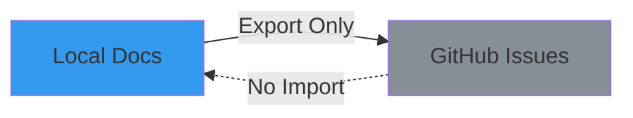
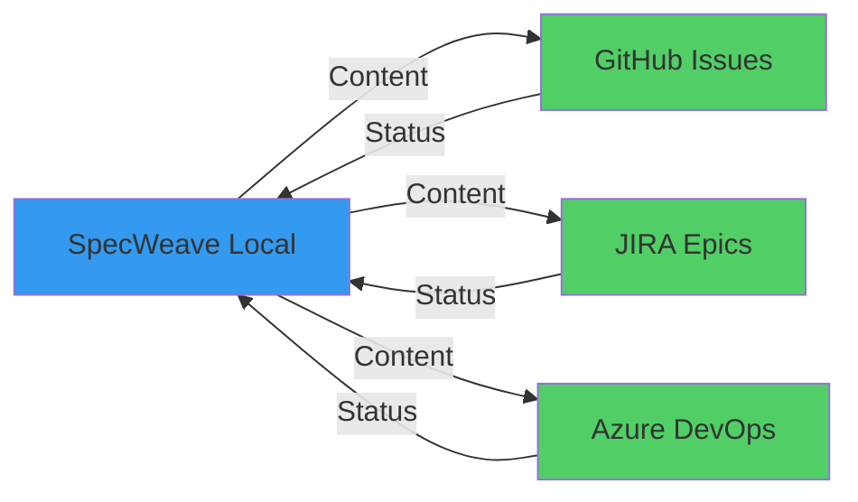
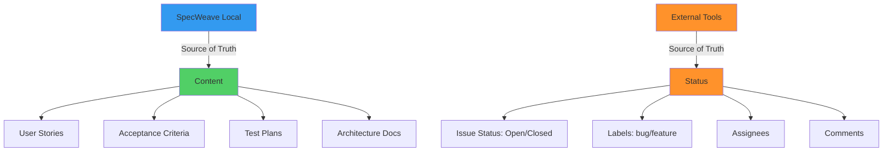
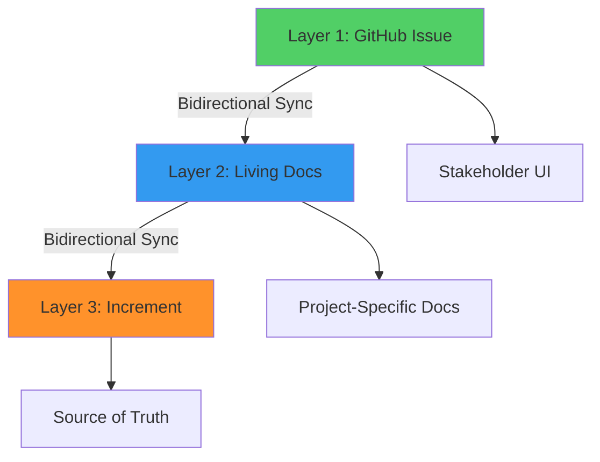
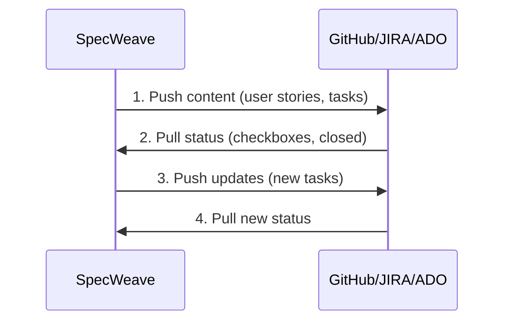
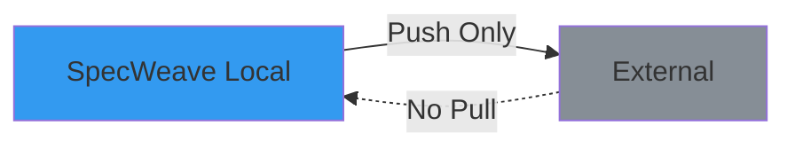
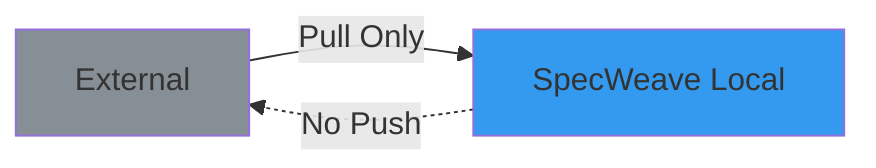
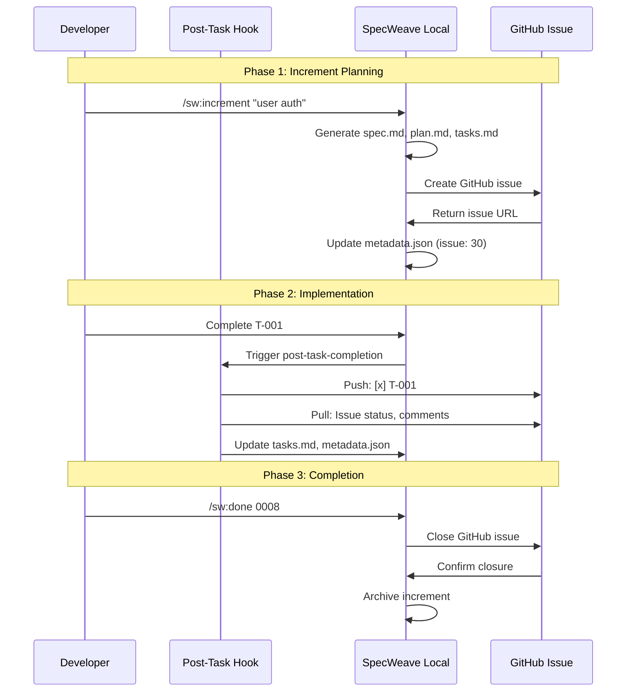
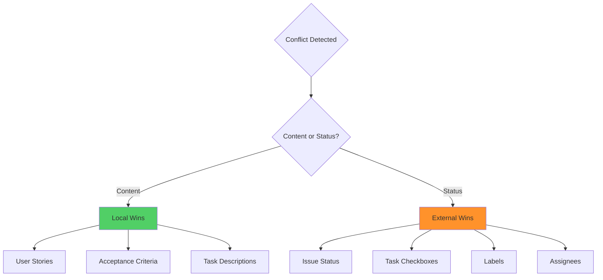

# Bidirectional Sync

> **⚠️ DEPRECATED as of v0.24.0**: The "bidirectional sync" terminology has been replaced with the **Three-Permission Architecture** for more granular control.
>
> **Migration Required**: See [Three-Permission Architecture Migration](#migration-to-three-permission-architecture-v0240) below.

**Bidirectional Sync** is a two-way synchronization pattern where changes flow in both directions between SpecWeave (local) and external tools (GitHub, JIRA, Azure DevOps). Unlike one-way sync (export-only or import-only), bidirectional sync keeps both systems in sync automatically, with SpecWeave as the source of truth for content and external tools as the source of truth for status.

**Historical Note**: This document describes the original "bidirectional sync" concept (v0.1-v0.23). For the new architecture, see [Three-Permission Architecture](#migration-to-three-permission-architecture-v0240).

---

## The Problem with One-Way Sync

Traditional workflows use **one-way sync**, which creates fragmentation:



**Problems**:
- ❌ **Status updates** in GitHub don't flow back to local
- ❌ **External changes** (issue closed, labels added) lost
- ❌ **Team collaboration** happens in GitHub, but local is outdated
- ❌ **Manual reconciliation** required (error-prone)
- ❌ **Conflicting sources of truth** (which is correct?)

---

## Bidirectional Sync: The Solution

**Two-way synchronization** keeps both systems in sync:



**Benefits**:
- ✅ **Automatic updates** (local → external, external → local)
- ✅ **Zero manual work** (hooks handle sync)
- ✅ **Single workflow** (work in either system)
- ✅ **Clear source of truth** (SpecWeave = content, External = status)
- ✅ **Team collaboration** (changes flow both ways)

---

## Source of Truth Architecture

**CRITICAL**: SpecWeave uses **split source of truth** architecture:



### What Flows in Each Direction

**Local → External (Content Sync)**:
- ✅ User stories (US-001, US-002)
- ✅ Acceptance criteria (AC-IDs)
- ✅ Task checklist (T-001, T-002)
- ✅ Test plans (unit/integration/E2E)
- ✅ Implementation details

**External → Local (Status Sync)**:
- ✅ Issue status (open → closed)
- ✅ Task completion (checkboxes)
- ✅ Labels (bug, feature, P1)
- ✅ Assignees (who's working on it)
- ✅ Comments (team discussions)

**Why Split Source of Truth?**
- SpecWeave excels at **structured content** (specs, plans, tests)
- External tools excel at **workflow management** (status, assignments, collaboration)
- Each system does what it's best at

---

## Three-Layer Bidirectional Sync

**NEW**: SpecWeave implements bidirectional sync through a **three-layer architecture** that separates concerns and ensures data consistency across all systems.

### The Three Layers



**Layer 1: GitHub Issue** (Visualization Layer)
- Checkable checkboxes for ACs and tasks
- Stakeholder-friendly UI
- No repository access needed
- Mobile-friendly tracking

**Layer 2: Living Docs User Story** (Middle Layer)
- Project-specific documentation (`specs/backend/`, `specs/frontend/`)
- COPIED ACs and tasks (not references)
- Connects GitHub with increment
- Part of version-controlled living docs

**Layer 3: Increment** (Source of Truth)
- `spec.md` - All Acceptance Criteria
- `tasks.md` - All implementation tasks
- Definitive status (no conflicts)
- Single source of truth

**Learn More**: [Three-Layer Architecture](/docs/glossary/terms/three-layer-architecture)

---

### TWO Independent Three-Layer Syncs

Bidirectional sync actually consists of **TWO independent three-layer syncs**:

#### 1. Acceptance Criteria (ACs) Sync

```
GitHub Issue Acceptance Criteria (checkboxes)
    ↕ (bidirectional)
Living Docs User Story Acceptance Criteria
    ↕ (bidirectional)
Increment spec.md (SOURCE OF TRUTH)
```

**Example Flow**:
```markdown
# Stakeholder checks AC in GitHub
GitHub Issue:
- [x] AC-US1-01: JWT token generation (backend) ← CHECKED
    ↓ (GitHub webhook/manual sync)
Living Docs User Story:
- [x] AC-US1-01: JWT token generation (backend)
    ↓ (Living docs sync)
Increment spec.md:
- [x] AC-US1-01: JWT token generation (backend)
```

#### 2. Tasks (Subtasks) Sync

```
GitHub Issue Subtasks (checkboxes)
    ↕ (bidirectional)
Living Docs User Story Implementation
    ↕ (bidirectional)
Increment tasks.md (SOURCE OF TRUTH)
```

**Example Flow**:
```markdown
# Developer completes task locally
Increment tasks.md:
- [x] T-001: Setup JWT service (AC-US1-01) ← COMPLETED
    ↓ (Living docs sync)
Living Docs User Story Implementation:
- [x] T-001: Setup JWT service
    ↓ (GitHub sync)
GitHub Issue Subtasks:
- [x] T-001: Setup JWT service
```

---

### Two Sync Directions Through Three Layers

#### Direction 1: Increment → Living Docs → GitHub
**Trigger**: Developer completes work and updates increment

```
┌─────────────────────────────────────────────┐
│ LAYER 3: INCREMENT (Source of Truth)       │
│ Developer marks task complete:              │
│ - [x] T-001: Setup JWT service             │
└──────────────────┬──────────────────────────┘
                   ↓
          (COPY to living docs, filtered)
                   ↓
┌─────────────────────────────────────────────┐
│ LAYER 2: LIVING DOCS USER STORY             │
│ Implementation section updates:             │
│ - [x] T-001: Setup JWT service             │
└──────────────────┬──────────────────────────┘
                   ↓
          (GitHub sync)
                   ↓
┌─────────────────────────────────────────────┐
│ LAYER 1: GITHUB ISSUE                       │
│ Subtask checkbox updates:                   │
│ - [x] T-001: Setup JWT service             │
└─────────────────────────────────────────────┘
```

**Commands**:
```bash
# Update increment
vim .specweave/increments/0031/tasks.md
# → Mark [x] T-001

# Sync to living docs
/sw:sync-docs

# Sync to GitHub
/sw-github:sync 0031
```

#### Direction 2: GitHub → Living Docs → Increment
**Trigger**: Stakeholder checks checkbox in GitHub issue

```
┌─────────────────────────────────────────────┐
│ LAYER 1: GITHUB ISSUE                       │
│ Stakeholder checks subtask:                 │
│ - [ ] T-002 → [x] T-002                    │
└──────────────────┬──────────────────────────┘
                   ↓
          (GitHub webhook/sync)
                   ↓
┌─────────────────────────────────────────────┐
│ LAYER 2: LIVING DOCS USER STORY             │
│ Implementation section updates:             │
│ - [x] T-002: Create login API              │
└──────────────────┬──────────────────────────┘
                   ↓
          (Living docs sync)
                   ↓
┌─────────────────────────────────────────────┐
│ LAYER 3: INCREMENT (Source of Truth)       │
│ tasks.md updates:                            │
│ - [x] T-002: Create login API              │
└─────────────────────────────────────────────┘
```

**Automatic Flow**:
1. Stakeholder checks GitHub checkbox
2. GitHub webhook fires (or manual `/sw-github:sync`)
3. Living Docs User Story Implementation updates
4. Increment tasks.md updates (source of truth)

---

### COPIED ACs and Tasks (Not References)

**Key Concept**: Living Docs User Stories contain **COPIED** content from increment, not references.

**Why COPIED?**
- ✅ Self-contained documentation (readable without increment)
- ✅ Survives increment archiving
- ✅ Project-specific filtering (backend vs frontend)
- ✅ GitHub integration (checkable checkboxes)

**Example**:

**Increment** (`.specweave/increments/0031/spec.md` and `tasks.md`):
```markdown
# spec.md
## US-001: Implement Authentication
**Acceptance Criteria**:
- [x] AC-US1-01: JWT token generation (backend)
- [ ] AC-US1-02: Protected routes (backend)

# tasks.md
- [x] **T-001**: Setup JWT service (AC-US1-01)
- [ ] **T-002**: Create login API endpoint (AC-US1-01)
```

**Living Docs User Story** (`specs/backend/FS-031/us-001.md`):
```markdown
## Acceptance Criteria (COPIED from increment spec.md, filtered by backend)
- [x] AC-US1-01: JWT token generation (backend)
- [ ] AC-US1-02: Protected routes (backend)

## Implementation (COPIED tasks from increment tasks.md, filtered by AC-ID)
- [x] T-001: Setup JWT service
- [ ] T-002: Create login API endpoint
```

**Learn More**: [COPIED ACs and Tasks](/docs/glossary/terms/copied-acs-and-tasks)

---

### Conflict Resolution Through Three Layers

**Rule**: Increment ALWAYS wins (source of truth)

**Example Scenario**:
```
Conflict: GitHub shows T-002 complete, Increment shows incomplete

Resolution:
1. Read increment tasks.md (source of truth)
2. T-002 is incomplete → That's the truth
3. Update Living Docs: [ ] T-002
4. Update GitHub: [ ] T-002
5. Increment wins!
```

**Validation & Reopen**:
```bash
# Task marked complete but code missing
/sw:validate 0031

# Validation finds: T-001 marked [x] but no code
# → Reopen in increment: [ ] T-001
# → Propagate to living docs: [ ] T-001
# → Propagate to GitHub: [ ] T-001
# → Add comment: "❌ Code not found at src/auth/jwt-service.ts"
```

---

### Benefits of Three-Layer Architecture

**1. Separation of Concerns**
- GitHub = Stakeholder UI
- Living Docs = Project organization
- Increment = Source of truth

**2. Project-Specific Tasks**
```markdown
# Backend User Story (specs/backend/FS-031/us-001.md)
- T-001: Backend task (only)
- T-002: Backend task (only)

# Frontend User Story (specs/frontend/FS-031/us-001.md)
- T-003: Frontend task (only)
- T-004: Frontend task (only)
```

**Learn More**: [Project-Specific Tasks](/docs/glossary/terms/project-specific-tasks)

**3. Stakeholder Access**
- No repository access needed
- Check/uncheck boxes in GitHub
- Changes sync automatically

**4. Data Integrity**
- All three layers stay synchronized
- Increment is always source of truth
- Validation ensures code matches status

---

## Sync Directions

SpecWeave supports **three sync directions**:

### 1. Bidirectional (Default)

**Both ways**: Local ↔ External



**Use When**:
- ✅ Team collaboration (multiple people working)
- ✅ External tool as primary interface (team uses GitHub daily)
- ✅ Status tracking matters (need to know what's closed)

**Example**:
```bash
# Task completed locally
- [x] T-001: Implement password hashing

# Hook fires automatically:
# → Push to GitHub: [x] T-001
# → Pull from GitHub: Issue status, comments, labels
# → Update local metadata.json with latest status
```

### 2. Export Only

**One way**: Local → External



**Use When**:
- ⚠️  Solo development (no team collaboration)
- ⚠️  External tool is read-only view (stakeholders only)
- ⚠️  Status doesn't matter (don't care about external changes)

**Example**:
```bash
# Task completed locally
- [x] T-001: Implement password hashing

# Hook fires automatically:
# → Push to GitHub: [x] T-001
# → NO pull from GitHub (ignored)
```

### 3. Import Only

**One way**: External → Local



**Use When**:
- ⚠️  Legacy import (migrating from external tool)
- ⚠️  External is authoritative (JIRA as source of truth)
- ⚠️  Read-only mode (observe external changes only)

**Example**:
```bash
# Manual sync command
/sw-github:sync-from 0008

# Result:
# → Pull from GitHub: Issue status, task checkboxes, comments
# → NO push to GitHub (local changes not exported)
```

---

## Configuration

**Enable Bidirectional Sync** (`.specweave/config.json`):

```json
{
  "sync": {
    "enabled": true,
    "settings": {
      "syncDirection": "bidirectional",  // or "export" or "import"
      "autoCreateIssue": true,           // Auto-create on /increment
      "conflictResolution": "external-wins"  // Status: external wins, Content: local wins
    },
    "activeProfile": "specweave-dev",
    "profiles": {
      "specweave-dev": {
        "provider": "github",
        "config": {
          "owner": "anton-abyzov",
          "repo": "specweave"
        }
      }
    }
  },
  "hooks": {
    "post_task_completion": {
      "sync_living_docs": true,
      "external_tracker_sync": true      // ✅ Enable external sync
    }
  }
}
```

**Sync Direction Options**:
- `"bidirectional"` - Both ways (default, recommended)
- `"export"` - Local → External only
- `"import"` - External → Local only

---

## Sync Flow (Bidirectional)

### Complete Lifecycle



### Step-by-Step Example

**1. Create Increment** (`/sw:increment`):

```bash
/sw:increment "Add user authentication"

# SpecWeave:
# 1. Generate spec.md (user stories, AC)
# 2. Generate plan.md (architecture)
# 3. Generate tasks.md (task checklist)
#
# Hook fires (post-increment-planning):
# 4. Create GitHub issue #30
# 5. Update metadata.json:
#    "sync": {
#      "profile": "specweave-dev",
#      "issueNumber": 30,
#      "issueUrl": "https://github.com/..."
#    }
```

**2. Complete Task** (Local):

```bash
# Edit tasks.md:
- [x] T-001: Implement password hashing

# Hook fires automatically (post-task-completion):
#
# PUSH (Local → External):
# 1. Update GitHub issue #30:
#    - [x] T-001: Implement password hashing
#    Progress: 1/5 tasks (20%)
#
# PULL (External → Local):
# 2. Fetch GitHub issue status: open
# 3. Fetch labels: ["authentication", "P1"]
# 4. Fetch comments: 2 new comments
# 5. Update metadata.json:
#    "sync": {
#      "lastSync": "2025-11-10T15:30:00Z",
#      "externalStatus": "open"
#    }
```

**3. External Change** (GitHub):

```bash
# Team member closes GitHub issue #30

# Next task completion fires hook:
#
# PUSH (Local → External):
# 1. Update GitHub issue (no-op, already closed)
#
# PULL (External → Local):
# 2. Fetch GitHub issue status: closed ✅
# 3. Update metadata.json:
#    "sync": {
#      "externalStatus": "closed"
#    }
# 4. Update tasks.md frontmatter:
#    status: done
```

**4. Close Increment** (`/sw:done`):

```bash
/sw:done 0008

# SpecWeave:
# 1. Validate all tasks complete
# 2. Finalize completion report
# 3. Sync living docs
#
# Hook fires (post-increment-done):
# 4. Close GitHub issue #30 (if not already closed)
# 5. Add completion comment:
#    "✅ Increment complete!
#     - All 5 tasks done
#     - Test coverage: 90%
#     - Living docs synced"
# 6. Archive increment
```

---

## Conflict Resolution

**What happens when both systems change the same data?**

### Conflict Resolution Strategy



**Rules**:
1. **Content changes** (user stories, AC, task descriptions) → **Local wins**
2. **Status changes** (checkboxes, issue status, labels) → **External wins**
3. **Timestamps** used to detect conflicts (lastSync vs updated)
4. **Manual resolution** for edge cases (prompt user)

### Example: Content Conflict

```bash
# Local: T-001 description updated
"T-001: Implement password hashing with bcrypt"

# External: T-001 description updated (different change)
"T-001: Implement password hashing with argon2"

# Conflict resolution:
# → Local wins (SpecWeave is source of truth for content)
# → Push local description to GitHub
# → Overwrite external change
# → Log conflict in sync report
```

### Example: Status Conflict

```bash
# Local: T-001 marked incomplete
- [ ] T-001: Implement password hashing

# External: T-001 marked complete (GitHub checkbox)
- [x] T-001: Implement password hashing

# Conflict resolution:
# → External wins (GitHub is source of truth for status)
# → Pull external status to local
# → Update local tasks.md: [x] T-001
# → Log conflict in sync report
```

---

## Automatic Sync (Hook-Based)

Bidirectional sync happens **automatically** via hooks:

### Post-Task-Completion Hook

**When**: After every task completion

**Location**: `plugins/specweave/hooks/post-task-completion.sh`

**What It Does**:
1. Sync living docs (increment → specs)
2. **Sync to external tracker** (bidirectional)
3. Update status line cache
4. Play completion sound (smart session detection)

**Example**:
```bash
# Complete task in tasks.md
- [x] T-001: Implement password hashing

# Hook fires automatically:
# ✅ Living docs synced
# ✅ GitHub issue #30 updated:
#    - [x] T-001: Implement password hashing
#    Progress: 1/5 tasks (20%)
# ✅ Status line cache updated
# 🔔 Completion sound played
```

### Post-Increment-Done Hook

**When**: After `/sw:done` completes

**Location**: `plugins/specweave/hooks/post-increment-done.sh`

**What It Does**:
1. Final living docs sync
2. **Close external issue** (if still open)
3. Add completion comment
4. Archive increment

**Example**:
```bash
/sw:done 0008

# Hook fires automatically:
# ✅ Living docs final sync
# ✅ GitHub issue #30 closed
# ✅ Completion comment added:
#    "✅ All 5 tasks complete
#     🎯 Test coverage: 90%
#     📚 Living docs synced"
# ✅ Increment archived
```

---

## Manual Sync Commands

For advanced scenarios, manual sync commands are available:

### Create Issue

```bash
# Create GitHub issue for increment
/sw-github:create-issue 0008

# Output:
# 🚀 Creating GitHub issue for 0008-user-authentication...
# 📝 Issue #30 created
# 🔗 https://github.com/anton-abyzov/specweave/issues/30
# ✅ metadata.json updated
```

### Sync (Bidirectional)

```bash
# Sync increment to external tracker
/sw-github:sync 0008

# Prompts:
# 1. Select profile (default: specweave-dev)
# 2. Select time range (default: 1M)
#
# Output:
# 🔄 Syncing 0008-user-authentication...
# 📤 PUSH: Updated GitHub issue #30
# 📥 PULL: Fetched status, comments, labels
# ✅ Sync complete (2.3 seconds)
```

### Sync From (Import Only)

```bash
# Pull changes from external tracker (no push)
/sw-github:sync-from 0008

# Output:
# 📥 Pulling from GitHub issue #30...
# ✅ Status: closed
# ✅ Task checkboxes: 5/5 complete
# ✅ Comments: 3 new comments
# ✅ Labels: ["authentication", "P1", "done"]
# ✅ Local updated (import only, no push)
```

### Close Issue

```bash
# Close external issue
/sw-github:close-issue 0008

# Output:
# 🔒 Closing GitHub issue #30...
# 💬 Adding completion comment...
# ✅ Issue closed
```

### Check Status

```bash
# Check sync status for increment
/sw-github:status 0008

# Output:
# 📊 Sync Status: 0008-user-authentication
#
# Profile: specweave-dev
# Issue: #30
# URL: https://github.com/anton-abyzov/specweave/issues/30
#
# Last Sync: 2025-11-10 15:30:00 (2 hours ago)
# External Status: closed
# Sync Direction: bidirectional
#
# Local:
#   Total Tasks: 5
#   Completed: 5
#   Progress: 100%
#
# External:
#   Issue Status: closed
#   Labels: authentication, P1, done
#   Comments: 3
#   Assignee: @anton-abyzov
```

---

## Provider-Specific Sync

### GitHub

**What Syncs**:
- ✅ Issue title (increment title)
- ✅ Issue body (spec summary + task checklist)
- ✅ Task checkboxes (T-001, T-002, etc.)
- ✅ Labels (specweave, increment, P1, etc.)
- ✅ Milestone (increment number)
- ✅ Assignee (from metadata)
- ✅ Comments (progress updates)

**Example GitHub Issue**:
```markdown
# [INC-0008] User Authentication

**Status**: Implementation → Done
**Priority**: P1
**Increment**: 0008-user-authentication

## Summary

Implement basic authentication with email/password, session management, and rate limiting.

## Tasks

Progress: 5/5 tasks (100%)

- [x] T-001: Implement Authentication Service
- [x] T-002: Create Session Manager
- [x] T-003: Create Login API Endpoint
- [x] T-004: Update Documentation
- [x] T-005: Security Audit

## Links

- **Spec**: `spec.md`
- **Plan**: `plan.md`
- **Tasks**: `tasks.md`

---

🤖 Auto-created by SpecWeave | Updates automatically on task completion
```

### JIRA

**What Syncs**:
- ✅ Epic name (increment title)
- ✅ Epic description (spec summary)
- ✅ User stories (US-001, US-002, etc.)
- ✅ Acceptance criteria (AC-IDs)
- ✅ Status (To Do, In Progress, Done)
- ✅ Labels (specweave, increment)
- ✅ Links (to SpecWeave local docs)

**Example JIRA Epic**:
```
Epic: User Authentication (INC-0008)

Description:
Implement basic authentication with email/password, session management, and rate limiting.

Status: Done
Labels: specweave, increment, authentication, P1

Stories:
- US-001: Basic Login Flow (Done)
- US-002: Session Management (Done)
- US-003: Rate Limiting (Done)

Links:
- SpecWeave Increment: file:///.specweave/increments/0008-user-authentication
```

### Azure DevOps

**What Syncs**:
- ✅ Feature name (increment title)
- ✅ Feature description (spec summary)
- ✅ Work items (tasks)
- ✅ Acceptance criteria (AC-IDs)
- ✅ State (New, Active, Closed)
- ✅ Tags (specweave, increment)
- ✅ Area path (project)
- ✅ Iteration (sprint)

---

## Benefits of Bidirectional Sync

### 1. Zero Manual Work

```bash
# Traditional (manual sync):
1. Complete task locally
2. Copy task description
3. Open GitHub issue
4. Update checkbox
5. Update status
6. Close browser
7. Context switch back to code
8. Forget to update (docs stale)

# Bidirectional sync (automatic):
1. Complete task locally
   → Hook syncs automatically ✅
   → Zero manual work!
```

### 2. Team Collaboration

```bash
# Team member A (works locally):
- [x] T-001: Implement password hashing
# → Hook pushes to GitHub

# Team member B (works in GitHub):
# → Closes GitHub issue #30
# → Adds comment: "Ready for review"

# Team member A (next task):
- [x] T-002: Create session manager
# → Hook pulls from GitHub
# → Sees issue closed ✅
# → Sees comment: "Ready for review"
```

### 3. Single Source of Truth

```bash
# Content changes:
# → Edit spec.md locally
# → Hook pushes to GitHub
# → GitHub issue updated automatically

# Status changes:
# → Close GitHub issue
# → Hook pulls to local
# → metadata.json updated automatically

# Result: Always in sync, zero conflicts
```

### 4. Audit Trail

```bash
# All sync events logged:
.specweave/logs/sync.log

# Example log:
2025-11-10 15:30:00 | PUSH | 0008 → GitHub #30 | T-001 complete
2025-11-10 15:32:15 | PULL | 0008 ← GitHub #30 | Status: open
2025-11-10 16:00:00 | PUSH | 0008 → GitHub #30 | T-002 complete
2025-11-10 16:02:30 | PULL | 0008 ← GitHub #30 | Comment added
2025-11-10 17:00:00 | PUSH | 0008 → GitHub #30 | Close issue
```

---

## Anti-Patterns

### 1. Manual Updates to External Tracker

```bash
# ❌ Bad: Manual updates break sync
# 1. Edit GitHub issue description manually
# 2. Hook pulls external description
# 3. Overwrites local spec.md (content should come from local!)
# Result: Local changes lost

# ✅ Good: Update local, let sync handle it
# 1. Edit spec.md locally
# 2. Hook pushes to GitHub
# 3. GitHub issue updated automatically
# Result: Content flows from local (source of truth)
```

### 2. Export-Only When Team Collaboration Needed

```bash
# ❌ Bad: Export-only with team collaboration
"syncDirection": "export"  // No pull from external
# Team closes GitHub issue → Local never knows
# Team adds comments → Local never sees them
# Result: Out of sync, confusion

# ✅ Good: Bidirectional with team collaboration
"syncDirection": "bidirectional"
# Team changes flow back to local automatically
# Result: Always in sync
```

### 3. Ignoring Conflict Warnings

```bash
# ❌ Bad: Ignore conflict warnings
⚠️  Conflict detected: T-001 status changed in both systems
    Local: [ ] incomplete
    External: [x] complete
# User: "Ignore it, I'll fix later"
# Result: Permanent inconsistency

# ✅ Good: Resolve conflicts immediately
⚠️  Conflict detected: T-001 status changed in both systems
# Hook: "External wins (status), updating local..."
# → Local updated to [x] complete
# Result: Consistent, no manual intervention needed
```

---

## Related Terms

- [Profile-Based Sync](/docs/glossary/terms/profile-based-sync) - Multi-repo sync configuration
- [Living Docs](/docs/glossary/terms/living-docs) - Auto-synced documentation
- [Source of Truth](/docs/glossary/terms/source-of-truth) - Single source of truth principle
- [Increments](/docs/glossary/terms/increments) - Increment structure
- [GitHub Actions](/docs/glossary/terms/github-actions) - CI/CD automation

---

## Migration to Three-Permission Architecture

### Why the Change?

The old "bidirectional sync" was a binary flag that controlled all sync operations together. The new **Three-Permission Architecture** provides granular control over different types of sync operations:

**Old (v0.23)**:
```json
{
  "sync": {
    "settings": {
      "syncDirection": "bidirectional"  // ← All-or-nothing control
    }
  }
}
```

**New (v0.24)**:
```json
{
  "sync": {
    "settings": {
      "canUpsertInternalItems": true,   // Q1: CREATE + UPDATE internal items
      "canUpdateExternalItems": true,   // Q2: UPDATE external items (full content)
      "canUpdateStatus": true           // Q3: UPDATE status (both types)
    }
  }
}
```

### Three Permission Types

**1. canUpsertInternalItems** (UPSERT = CREATE + UPDATE)
- **Controls**: Creating and updating SpecWeave-originated work items
- **Flow**: Increment progress → Living specs → CREATE/UPDATE external tool
- **Example**: Creating GitHub issue when running `/sw:increment`, then updating it as tasks complete
- **Default**: `false` (explicit opt-in required)

**2. canUpdateExternalItems** (Full Content Updates)
- **Controls**: Updating externally-originated work items (full content: title, description, ACs, tasks, comments)
- **Flow**: Increment progress → Living specs → UPDATE external tool work items
- **Example**: External PM creates GitHub issue, SpecWeave updates its content as implementation progresses
- **Default**: `false` (explicit opt-in required)

**3. canUpdateStatus** (Status Updates)
- **Controls**: Updating status for both internal and external items
- **Flow**: External tool status changes → Living specs → Increment metadata
- **Example**: Issue closed in GitHub → Status syncs back to SpecWeave
- **Default**: `false` (explicit opt-in required)

### Migration Mapping

| Old Terminology | New Permission Combination | Description |
|----------------|---------------------------|-------------|
| `syncDirection: "bidirectional"` | All 3 permissions = `true` | Full sync (all permissions enabled) |
| `syncDirection: "export"` | `canUpsertInternalItems: true`, others `false` | Create internal items only |
| `syncDirection: "import"` | `canUpdateStatus: true`, others `false` | Status updates only |
| `syncDirection: null` | All 3 permissions = `false` | No sync |

### Automatic Migration

When you upgrade to v0.24.0, SpecWeave automatically migrates your existing configuration:

```typescript
// Old config detected
if (config.sync.settings.syncDirection === "bidirectional") {
  // Automatically converted to:
  config.sync.settings = {
    canUpsertInternalItems: true,
    canUpdateExternalItems: true,
    canUpdateStatus: true
  };
}
```

### Manual Migration Steps

**Step 1**: Remove old `syncDirection` field from `.specweave/config.json`:

```json
{
  "sync": {
    "settings": {
      "syncDirection": "bidirectional",  // ← REMOVE THIS LINE
      ...
    }
  }
}
```

**Step 2**: Add three permission flags:

```json
{
  "sync": {
    "settings": {
      "canUpsertInternalItems": true,   // ← ADD THESE THREE
      "canUpdateExternalItems": true,
      "canUpdateStatus": true,
      ...
    }
  }
}
```

**Step 3**: Verify with init command:

```bash
specweave init .
# Answer the three permission questions based on your team's needs
```

### Common Migration Scenarios

**Scenario 1: Solo Developer (Previously "export")**
```json
{
  "sync": {
    "settings": {
      "canUpsertInternalItems": true,   // Create my work items
      "canUpdateExternalItems": false,  // No external items to update
      "canUpdateStatus": false          // Don't care about external status
    }
  }
}
```

**Scenario 2: Team Collaboration (Previously "bidirectional")**
```json
{
  "sync": {
    "settings": {
      "canUpsertInternalItems": true,   // Create and update my items
      "canUpdateExternalItems": true,   // Update PM-created items
      "canUpdateStatus": true           // Track issue closures
    }
  }
}
```

**Scenario 3: Read-Only Observer (Previously "import")**
```json
{
  "sync": {
    "settings": {
      "canUpsertInternalItems": false,  // Don't create items
      "canUpdateExternalItems": false,  // Don't update external items
      "canUpdateStatus": true           // Only pull status updates
    }
  }
}
```

### Breaking Changes

**1. Configuration Format**
- Old: `syncDirection: "bidirectional"`
- New: Three separate permission flags
- **Action**: Update `.specweave/config.json` or run `specweave init .`

**2. Command Behavior**
- Old: `/sw-github:sync` did everything based on `syncDirection`
- New: `/sw-github:sync` respects three permission flags
- **Action**: Review your sync workflows and adjust permissions

**3. Hook Behavior**
- Old: `post-task-completion.sh` synced if `syncDirection !== null`
- New: Hook checks each permission individually
- **Action**: Hooks work automatically, no changes needed

### Documentation Updates

**Updated Files**:
- `.specweave/config.json` - New permission structure
- `src/templates/config.json.template` - Example configuration
- `src/templates/config-permissions-guide.md` - Comprehensive guide
- `CHANGELOG.md` - Breaking change notice

**New Tools**:
- `PermissionChecker` utility - Centralized permission checking
- `migrateSyncDirection()` function - Automatic config migration
- Permission validation in `init` command

### See Also

- [Three-Permission Architecture](/docs/architecture/three-permission-architecture) - Full technical specification
- [Config Permissions Guide](/templates/config-permissions-guide.md) - Detailed usage guide
- [CHANGELOG v0.24.0](/CHANGELOG.md#v0240) - Full release notes

---

## Summary

**Bidirectional Sync** keeps SpecWeave and external tools synchronized automatically:

**Source of Truth Architecture**:
- **Content** (user stories, AC, tasks) → SpecWeave wins
- **Status** (checkboxes, labels, issue state) → External wins

**Sync Directions**:
- **Bidirectional** (default) - Both ways, automatic
- **Export** - Local → External only
- **Import** - External → Local only

**Automatic Sync**:
- Hook-based (post-task-completion, post-increment-done)
- Zero manual work
- Conflict resolution built-in

**Manual Commands**:
- `/sw-github:sync` - Bidirectional sync
- `/sw-github:sync-from` - Import only
- `/sw-github:status` - Check sync status

**Result**: Work in either system, changes flow automatically, always in sync.
