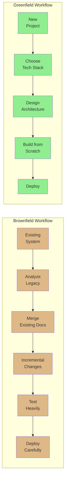
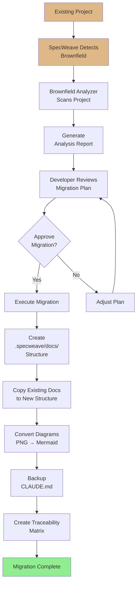
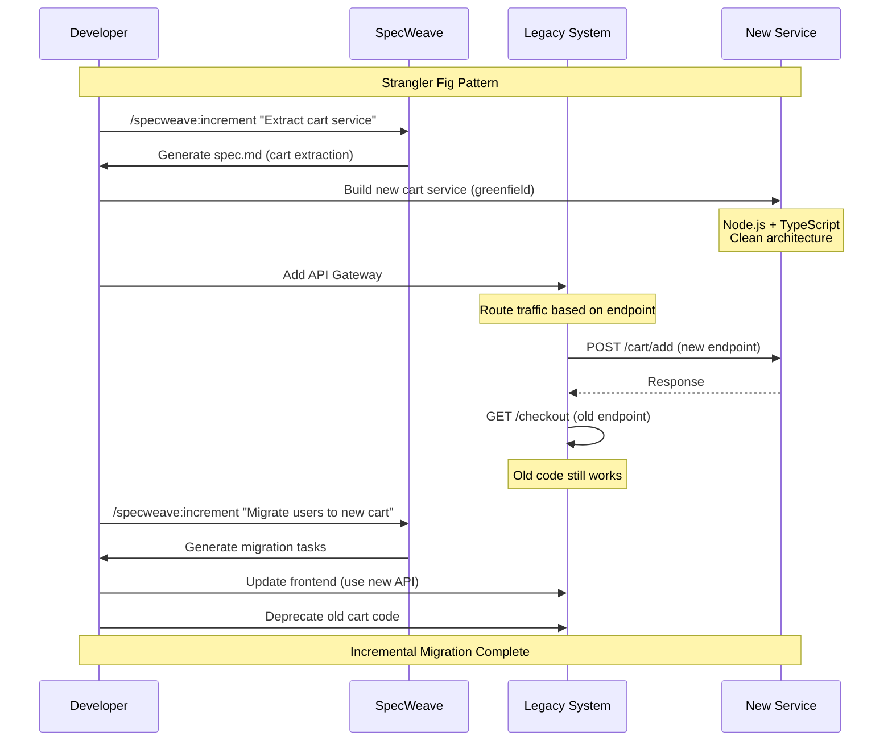
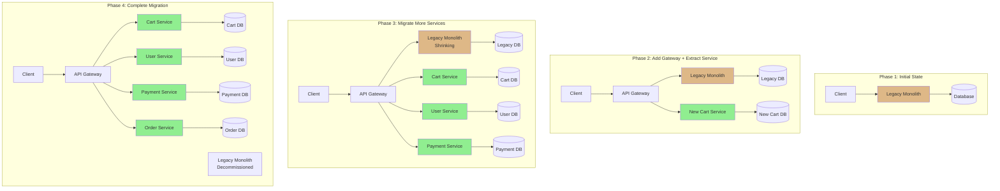

# Brownfield Development

**Category**: Development Methodology
**Related Terms**: [Greenfield](/docs/glossary/terms/greenfield), Legacy Code, Technical Debt, Refactoring, Migration

---

## Definition

**Brownfield development** refers to building new features or making improvements to an existing codebase with legacy constraints. The term comes from construction, where "brownfield" means building on previously developed land that may have contamination or infrastructure requiring special consideration.

In software, brownfield projects involve:
- Working within existing architecture constraints
- Managing accumulated technical debt
- Maintaining backward compatibility
- Balancing new features with legacy system stability
- Incremental improvements rather than ground-up rebuilds

**This is where SpecWeave excels!** SpecWeave is specifically designed to handle brownfield complexity with automated analysis, documentation merging, and incremental migration strategies.

---

## Key Characteristics

### Benefits

1. **Existing User Base and Revenue**
   - Proven product-market fit
   - Active revenue stream
   - Established customer relationships
   - Real-world usage data and feedback

2. **Proven Business Model**
   - Market validation already complete
   - Known customer pain points
   - Established pricing and monetization
   - Historical performance data

3. **Existing Patterns and Knowledge**
   - Team understands system behavior
   - Known edge cases and gotchas
   - Established operational procedures
   - Documented (or tribal) knowledge

4. **Lower Risk than Rewrite**
   - Incremental changes reduce risk
   - Existing tests catch regressions
   - Rollback possible if issues arise
   - Users continue using stable system

### Challenges

1. **Technical Debt**
   - Accumulated quick fixes and workarounds
   - Outdated dependencies and libraries
   - Code duplication and inconsistency
   - Lack of test coverage in critical areas

2. **Legacy Constraints**
   - Tied to old technology stack
   - Architectural decisions hard to change
   - Database schema migrations risky
   - Breaking changes impact users

3. **Outdated or Missing Documentation**
   - Original developers may have left
   - Documentation out of sync with code
   - Tribal knowledge not written down
   - Architecture decisions not recorded

4. **Fear of Breaking Things**
   - "If it works, don't touch it" mentality
   - Risk-averse culture
   - Difficult to refactor without tests
   - Legacy code hard to understand

---

## Brownfield vs Greenfield



| Aspect | Brownfield | Greenfield |
|--------|-----------|-----------|
| **Starting Point** | Existing codebase | Clean slate |
| **Architecture** | Work within constraints | Design freely |
| **Tech Stack** | Limited by legacy | Choose optimal |
| **Technical Debt** | Inherited | Zero (initially) |
| **Development Speed** | Faster initially, slower later | Slower initially, faster later |
| **Risk** | Stability/regression risk | Product-market fit risk |
| **Users** | Existing user base | None initially |
| **Revenue** | Current revenue stream | Future potential |
| **Documentation** | Often outdated/missing | Created from scratch |
| **Testing** | Often insufficient | Established from day one |

---

## When to Choose Brownfield

### Most Projects are Brownfield!

**The Reality**: 90%+ of professional development work is brownfield:
- Adding features to existing products
- Fixing bugs in production systems
- Migrating to new technologies incrementally
- Refactoring legacy code
- Integrating with existing systems

### Good Reasons to Stay Brownfield

1. **System is Maintainable**
   - Technical debt is manageable (&lt;40%)
   - Team can understand and modify code
   - Tests exist (or can be added incrementally)
   - Architecture is sound (or can be improved)

2. **Strong Business Case**
   - Existing revenue stream (rewrite risks revenue)
   - Large user base (can't afford downtime)
   - Market advantage (competitors would catch up during rewrite)
   - ROI of rewrite is negative

3. **Incremental Improvement is Possible**
   - Can add features without major refactoring
   - Tests can be added incrementally
   - Dependencies can be updated gradually
   - Architecture can evolve over time

4. **Team Knowledge is Valuable**
   - Team understands system quirks
   - Edge cases and business logic documented
   - Operational knowledge established
   - Customer-specific customizations understood

### When Brownfield Becomes Problematic

1. **Technical Debt > 80%**
   - More time spent fixing bugs than adding features
   - Every change breaks something else
   - Can't add features without major refactoring
   - Developers actively avoid working on codebase

2. **Security or Compliance Issues**
   - Technology is obsolete (no vendor support)
   - Critical security vulnerabilities unfixable
   - Regulatory requirements can't be met
   - Data privacy issues (GDPR, CCPA violations)

3. **Business Model Has Changed**
   - Architecture no longer fits business needs
   - Scalability issues (can't grow user base)
   - Performance problems (users leaving)
   - Cost of maintaining exceeds rewrite cost

**In these cases**: Consider [Greenfield](/docs/glossary/terms/greenfield) rewrite with proper planning.

---

## Real-World Examples

### Example 1: E-Commerce Platform Migration

**Scenario**: 10-year-old PHP monolith needs modern features

**Brownfield Reality**:
```bash
legacy-ecommerce/
├── index.php           # 5,000 lines
├── config.php          # Global state everywhere
├── includes/           # 200+ files, no namespaces
│   ├── cart.php        # SQL injection vulnerabilities
│   ├── checkout.php    # No tests
│   └── admin.php       # Mixed concerns
├── docs/               # Last updated 2015
└── README.md           # "Ask John" (John left in 2018)
```

**SpecWeave Brownfield Approach**:

```bash
# Step 1: Analyze existing system
/specweave:analyze-brownfield /path/to/legacy-ecommerce

# SpecWeave outputs:
# - Found 45 PHP files
# - Detected: MVC pattern (loose), MySQL database
# - Identified: docs/ (23 files, last updated 2015)
# - Suggested: Merge existing docs into .specweave/docs/internal/

# Step 2: Initialize SpecWeave in existing project
cd legacy-ecommerce
npx specweave init . --brownfield

# Step 3: Merge existing documentation
/specweave:merge-docs

# SpecWeave merges:
# - docs/architecture.md → .specweave/docs/internal/architecture/hld-legacy-system.md
# - docs/api-spec.md → .specweave/docs/internal/specs/spec-0001-api-design/
# - Creates CLAUDE.md.backup (preserves manual changes)

# Step 4: Start incremental migration
/specweave:increment "0001-extract-cart-service"

# Strangler Fig pattern: Extract cart to new microservice
# - New service in Node.js/TypeScript (greenfield)
# - Old PHP code remains (brownfield)
# - API Gateway routes traffic to new service
```

**Result**: Incremental modernization without big-bang rewrite risk.

### Example 2: Legacy Documentation Onboarding

**Scenario**: New developer joining team with 5 years of history

**Problem**:
- Documentation scattered (Confluence, Google Docs, GitHub wikis, README files)
- CLAUDE.md exists but manually maintained
- Team knowledge in Slack threads and email
- Architecture decisions not documented

**SpecWeave Brownfield Onboarding**:

```bash
# Developer clones repo
git clone https://github.com/company/legacy-app.git
cd legacy-app

# SpecWeave detects brownfield project
npx specweave init . --brownfield

# brownfield-onboarder skill activates automatically
# Scans:
# - /docs/ (45 markdown files)
# - /wiki/ (GitHub wiki, 23 pages)
# - Confluence space (78 pages, API access)
# - Existing CLAUDE.md (manual backup created)
# - README.md files (project root + subdirectories)

# Generates:
# - .specweave/docs/internal/ (structured documentation)
# - CLAUDE.md.backup (preserves manual changes)
# - analysis-report.md (migration summary)

# Developer now has:
# - Complete architecture overview (.specweave/docs/internal/architecture/hld-system)
# - All ADRs (.specweave/docs/internal/architecture/adr/0001-xxx)
# - Operational runbooks (.specweave/docs/internal/operations/)
# - Living documentation (stays in sync with code)
```

**Result**: Developer onboarded in hours instead of weeks.

### Example 3: API Modernization

**Scenario**: REST API needs GraphQL support without breaking existing clients

**Brownfield Strategy**:

```bash
# Existing API (brownfield)
legacy-api/
├── routes/
│   ├── users.js        # REST endpoints
│   ├── products.js
│   └── orders.js
└── tests/
    └── integration/    # Some tests exist

# Increment 1: Add GraphQL alongside REST
/specweave:increment "0001-add-graphql-layer"

# spec.md includes:
# - REST endpoints remain unchanged (backward compatibility)
# - GraphQL layer added (new clients use GraphQL)
# - Both share same business logic

# Implementation:
legacy-api/
├── routes/             # REST (unchanged)
├── graphql/            # NEW: GraphQL resolvers
│   ├── schema.graphql
│   ├── resolvers/
│   └── types/
├── services/           # REFACTORED: Shared business logic
│   ├── UserService.js  # Used by both REST and GraphQL
│   └── ProductService.js
└── tests/
    ├── rest/           # Existing REST tests (still pass)
    └── graphql/        # NEW: GraphQL tests
```

**Strangler Fig Pattern**: New features use GraphQL, legacy clients use REST.

---

## SpecWeave for Brownfield Projects

**This is where SpecWeave shines!** SpecWeave has specialized features for brownfield complexity.

### Brownfield Analyzer Skill

**Location**: `plugins/specweave/skills/brownfield-analyzer/SKILL.md`

**Automatic Detection**: Activates when SpecWeave detects:
- Existing `README.md` or `CLAUDE.md`
- Existing documentation folders (`docs/`, `wiki/`, `documentation/`)
- Existing codebase with git history

**Capabilities**:
- Scans project structure (all folders and files)
- Identifies document types (PRD, architecture, runbooks, etc.)
- Maps existing docs to SpecWeave's six folders
- Detects external tools (Jira, Azure DevOps, GitHub Projects)
- Generates migration plan with effort estimate

**Example Output**:

```markdown
# Brownfield Analysis Report

## Existing Documentation Structure

Found the following folders:
- `docs/` - 45 markdown files
- `wiki/` - GitHub wiki with 23 pages
- `architecture/` - 8 PNG diagrams (will convert to Mermaid)
- `runbooks/` - 5 operational runbooks

## Document Classification

### Strategy Documents (→ .specweave/docs/internal/strategy/)
- docs/requirements/product-spec.md → prd-product.md

### Architecture Documents (→ .specweave/docs/internal/architecture/)
- architecture/system-design.md → hld-system-overview.md
- docs/decisions/use-postgres.md → adr/0001-use-postgres.md

### Operations Documents (→ .specweave/docs/internal/operations/)
- runbooks/api-server-runbook.md → runbook-api-server.md

## External Tool Integration

### Jira Integration Detected
- Project: PROJ-123
- Active Epics: 12
- Suggested mapping: Epic → Increment

## Recommended Migration Plan

1. Create `.specweave/docs/internal/` structure
2. Migrate 45 documents to six folders
3. Convert 8 PNG diagrams to Mermaid
4. Number ADRs sequentially (0001-0008)
5. Sync with Jira (12 active epics)

## Estimated Effort: 3.5 hours
```

### Brownfield Onboarder Skill

**Location**: `plugins/specweave/skills/brownfield-onboarder/SKILL.md`

**Purpose**: Merge existing documentation into SpecWeave structure

**Capabilities**:
- Preserves existing CLAUDE.md (creates `.backup`)
- Merges project-specific documentation
- Converts external formats (Confluence, Notion, etc.)
- Maintains git history for documentation files
- Creates traceability links (old path → new path)

**Safety Features**:
- Never deletes original files (only copies)
- Creates backups before any changes
- Logs all file movements
- Rollback capability if migration fails

### Brownfield Commands

#### `/specweave:analyze-brownfield`

**Purpose**: Scan existing project and generate migration plan

**Usage**:
```bash
# Analyze current directory
/specweave:analyze-brownfield .

# Analyze specific path
/specweave:analyze-brownfield /path/to/legacy-project

# Analyze with external tool detection
/specweave:analyze-brownfield . --detect-jira --detect-ado
```

**Output**: `analysis-report.md` with:
- Existing documentation structure
- Document type classification
- Migration plan with effort estimate
- External tool integration suggestions

#### `/specweave:merge-docs`

**Purpose**: Execute migration plan (merge existing docs)

**Usage**:
```bash
# Dry run (preview changes without executing)
/specweave:merge-docs --dry-run

# Execute migration
/specweave:merge-docs --execute

# Execute with Jira sync
/specweave:merge-docs --execute --sync-jira
```

**What it does**:
1. Creates `.specweave/docs/internal/` structure
2. Copies existing docs to appropriate folders
3. Converts diagrams (PNG → Mermaid)
4. Numbers ADRs sequentially
5. Creates `CLAUDE.md.backup` (preserves manual changes)
6. Generates traceability matrix (old → new paths)

#### `/specweave:init --brownfield`

**Purpose**: Initialize SpecWeave in existing project

**Usage**:
```bash
cd existing-project
npx specweave init . --brownfield

# Prompts:
# - Found existing docs/, wiki/. Merge into SpecWeave? (Y/n)
# - Backup existing CLAUDE.md? (Y/n)
# - Detect external tools (Jira/ADO)? (Y/n)
# - Convert PNG diagrams to Mermaid? (Y/n)
```

---

## Brownfield Workflow with SpecWeave

### Phase 1: Analysis and Discovery



### Phase 2: Incremental Modernization



### Phase 3: Living Documentation Sync

```bash
# After each task completion
/specweave:do

# Post-task-completion hook fires automatically:
# 1. Syncs living docs
#    - Updates ADRs (Proposed → Accepted)
#    - Updates HLD with new architecture
#    - Generates diagrams (Mermaid → SVG)
# 2. Logs changes
# 3. Commits to git (optional)

# Living docs are ALWAYS in sync with code!
```

---

## Strangler Fig Pattern (Incremental Migration)

**The Pattern**: Gradually replace parts of legacy system with new implementation.

**Named after**: Strangler fig tree (grows around host tree, eventually replaces it)



**SpecWeave Strangler Fig Workflow**:

```bash
# Increment 1: Add API Gateway
/specweave:increment "0001-add-api-gateway"

# Increment 2: Extract first service (cart)
/specweave:increment "0002-extract-cart-service"

# Increment 3: Extract second service (users)
/specweave:increment "0003-extract-user-service"

# Continue until legacy monolith is fully replaced
```

**Benefits**:
- Low risk (incremental changes)
- Continuous delivery (each increment ships)
- Rollback possible (if extraction fails, revert)
- Users unaffected (API Gateway handles routing)

---

## Common Brownfield Patterns

### Pattern 1: Feature Flags for A/B Testing

**Problem**: Need to test new implementation alongside old

**Solution**: Feature flags

```typescript
// Legacy implementation (brownfield)
function calculateShipping(cart: Cart): number {
  // Old logic (5 years old, complex)
  return legacyShippingCalculation(cart);
}

// New implementation (greenfield)
function calculateShippingV2(cart: Cart): number {
  // New logic (clean, tested)
  return newShippingCalculation(cart);
}

// Feature flag routing
function calculateShipping(cart: Cart): number {
  if (featureFlags.isEnabled('new-shipping-calculation', cart.userId)) {
    return calculateShippingV2(cart); // 10% of users
  } else {
    return calculateShipping(cart); // 90% of users
  }
}
```

**SpecWeave Increment**:
```bash
/specweave:increment "0005-shipping-calculation-v2"

# spec.md includes:
# - Feature flag strategy (10% rollout)
# - Comparison metrics (old vs new)
# - Rollback plan (if new logic has bugs)
```

### Pattern 2: Parallel Run (Dual Write)

**Problem**: Migrating database schema without downtime

**Solution**: Write to both old and new schema, compare results

```typescript
// Phase 1: Dual Write
async function saveUser(user: User): Promise<void> {
  await saveToOldSchema(user); // Legacy
  await saveToNewSchema(user); // New
  await compareResults();      // Validate consistency
}

// Phase 2: Read from new schema (write to both)
async function getUser(id: string): Promise<User> {
  const user = await readFromNewSchema(id); // New
  await saveToOldSchema(user);              // Still write to old
  return user;
}

// Phase 3: Read and write to new schema only
async function getUser(id: string): Promise<User> {
  return await readFromNewSchema(id); // Old schema decommissioned
}
```

### Pattern 3: Branch by Abstraction

**Problem**: Refactoring code that's used everywhere

**Solution**: Introduce abstraction layer, switch implementations

```typescript
// Step 1: Create abstraction
interface PaymentProcessor {
  processPayment(amount: number): Promise<PaymentResult>;
}

// Step 2: Implement with legacy
class LegacyPaymentProcessor implements PaymentProcessor {
  async processPayment(amount: number): Promise<PaymentResult> {
    // Old code (brownfield)
    return await legacyPayment(amount);
  }
}

// Step 3: Implement new version
class StripePaymentProcessor implements PaymentProcessor {
  async processPayment(amount: number): Promise<PaymentResult> {
    // New code (greenfield)
    return await stripe.charges.create({amount});
  }
}

// Step 4: Switch implementations via config
const processor: PaymentProcessor = config.useStripe
  ? new StripePaymentProcessor()
  : new LegacyPaymentProcessor();

// Step 5: Remove legacy implementation
// (once new implementation is proven stable)
```

---

## Best Practices for Brownfield Projects

### 1. Analyze Before Acting

```bash
# ALWAYS start with analysis
/specweave:analyze-brownfield .

# Review the report:
# - What exists?
# - What's missing?
# - What's outdated?
# - What's the effort?

# Make informed decision before migrating
```

### 2. Preserve Existing Knowledge

```bash
# Backup CLAUDE.md (preserves manual changes)
cp CLAUDE.md CLAUDE.md.backup

# Merge existing docs (don't delete)
/specweave:merge-docs --preserve-originals

# Create traceability matrix
# (so you can find old docs if needed)
```

### 3. Incremental Refactoring

```bash
# DON'T: Big bang rewrite
/specweave:increment "0001-rewrite-entire-system" # ❌ Too risky!

# DO: Small increments
/specweave:increment "0001-extract-cart-service"  # ✅ Low risk
/specweave:increment "0002-add-tests-to-auth"     # ✅ Incremental
/specweave:increment "0003-upgrade-node-version"  # ✅ Manageable
```

### 4. Test Heavily

```markdown
# tasks.md (brownfield increment)

## T-001: Refactor Payment Processing

**Test Plan**:
- Given existing payment tests → When refactor → Then all tests still pass
- Given 100 test transactions → When compare old vs new → Then results match

**Test Cases**:
- Unit: All existing tests must pass (regression suite)
- Integration: Payment flow (old and new implementations)
- E2E: Complete checkout flow (100% coverage, critical path)

**Coverage**: 95%+ (brownfield = higher coverage required)
```

### 5. Use Living Documentation

```bash
# After each brownfield increment
/specweave:do

# Post-task-completion hook:
# - Captures refactoring decisions (ADRs)
# - Updates architecture diagrams
# - Documents migration strategy
# - Logs breaking changes

# Result: Complete migration history preserved
```

---

## Brownfield Migration Checklist

- [ ] **Phase 1: Analysis**
  - [ ] Run brownfield analyzer
  - [ ] Review existing documentation
  - [ ] Identify external tools (Jira, ADO)
  - [ ] Estimate migration effort

- [ ] **Phase 2: Documentation Migration**
  - [ ] Backup existing CLAUDE.md
  - [ ] Merge existing docs into SpecWeave structure
  - [ ] Convert diagrams (PNG → Mermaid)
  - [ ] Create traceability matrix

- [ ] **Phase 3: Incremental Refactoring**
  - [ ] Define refactoring strategy (Strangler Fig, Feature Flags, etc.)
  - [ ] Create increments for each refactoring step
  - [ ] Add tests before refactoring (safety net)
  - [ ] Refactor incrementally (small changes)
  - [ ] Validate with A/B testing or parallel run

- [ ] **Phase 4: Living Documentation**
  - [ ] Enable post-task-completion hook
  - [ ] Sync docs after each increment
  - [ ] Capture refactoring decisions (ADRs)
  - [ ] Update architecture diagrams

- [ ] **Phase 5: Continuous Improvement**
  - [ ] Monitor DORA metrics (deployment frequency, lead time)
  - [ ] Track technical debt reduction
  - [ ] Improve test coverage over time
  - [ ] Establish coding standards

---

## Related Documentation

- [Greenfield Development](/docs/glossary/terms/greenfield) - Starting projects from scratch
- Technical Debt - Understanding and managing debt
- [Legacy Code](/docs/glossary/terms/legacy-code) - Working with old codebases
- [Refactoring Strategies](/docs/glossary/terms/refactoring) - Improving existing code
- [Migration Patterns](/docs/glossary/terms/migration) - Moving between architectures
- [SpecWeave Brownfield Guide](../../guides/brownfield-integration) - Detailed brownfield setup

---

## External Resources

- [Martin Fowler: Strangler Fig Application](https://martinfowler.com/bliki/StranglerFigApplication.html)
- [Working Effectively with Legacy Code (Book)](https://www.goodreads.com/book/show/44919.Working_Effectively_with_Legacy_Code)
- [Refactoring: Improving the Design of Existing Code (Book)](https://martinfowler.com/books/refactoring.html)
- [Feature Toggles (Feature Flags)](https://martinfowler.com/articles/feature-toggles.html)
- [Branch by Abstraction](https://www.branchbyabstraction.com/)

---

**Last Updated**: 2025-11-04
**Status**: Published
**Maintainer**: SpecWeave Documentation Team
