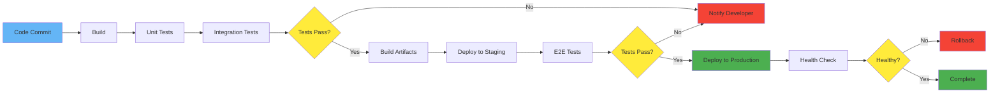
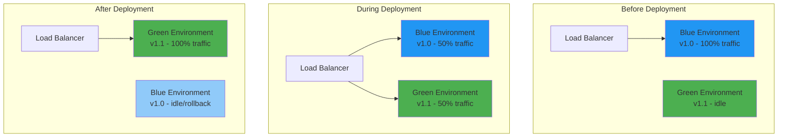

# CI/CD

**Category**: Infrastructure & DevOps

**Definition**: Continuous Integration and Continuous Deployment - automated software development practices that enable teams to deliver code changes more frequently and reliably through automated testing and deployment pipelines.

## Overview

CI/CD is a set of practices that automate the software delivery process from code commit to production deployment. It combines Continuous Integration (automated building and testing) with Continuous Deployment (automated release to production), enabling faster feedback loops and more reliable releases.

## Key Concepts

### Continuous Integration (CI)

Automatically build and test code changes:

```yaml
# Example: GitHub Actions CI workflow
name: Continuous Integration

on:
  push:
    branches: [main, develop]
  pull_request:
    branches: [main]

jobs:
  test:
    runs-on: ubuntu-latest

    steps:
      - name: Checkout code
        uses: actions/checkout@v4

      - name: Setup Node.js
        uses: actions/setup-node@v4
        with:
          node-version: '18'
          cache: 'npm'

      - name: Install dependencies
        run: npm ci

      - name: Lint code
        run: npm run lint

      - name: Run unit tests
        run: npm test -- --coverage

      - name: Run integration tests
        run: npm run test:integration

      - name: Build application
        run: npm run build

      - name: Upload coverage
        uses: codecov/codecov-action@v3
        with:
          file: ./coverage/coverage-final.json
```

### Continuous Deployment (CD)

Automatically deploy to production after passing tests:

```yaml
# Example: Production deployment workflow
name: Deploy to Production

on:
  push:
    branches: [main]
    tags:
      - 'v*'

jobs:
  deploy:
    runs-on: ubuntu-latest
    if: github.ref == 'refs/heads/main'

    steps:
      - uses: actions/checkout@v4

      - name: Configure AWS credentials
        uses: aws-actions/configure-aws-credentials@v4
        with:
          aws-access-key-id: ${{ secrets.AWS_ACCESS_KEY_ID }}
          aws-secret-access-key: ${{ secrets.AWS_SECRET_ACCESS_KEY }}
          aws-region: us-west-2

      - name: Login to Amazon ECR
        id: login-ecr
        uses: aws-actions/amazon-ecr-login@v2

      - name: Build and push Docker image
        env:
          ECR_REGISTRY: ${{ steps.login-ecr.outputs.registry }}
          ECR_REPOSITORY: my-app
          IMAGE_TAG: ${{ github.sha }}
        run: |
          docker build -t $ECR_REGISTRY/$ECR_REPOSITORY:$IMAGE_TAG .
          docker push $ECR_REGISTRY/$ECR_REPOSITORY:$IMAGE_TAG

      - name: Deploy to ECS
        run: |
          aws ecs update-service \
            --cluster production \
            --service api-service \
            --force-new-deployment

      - name: Notify Slack
        uses: slackapi/slack-github-action@v1
        with:
          webhook-url: ${{ secrets.SLACK_WEBHOOK }}
          payload: |
            {
              "text": "Deployed version ${{ github.sha }} to production"
            }
```

### Continuous Delivery (CD Alternative)

Automatic deployment to staging, manual approval for production:

```yaml
# Deployment with manual approval
name: Deploy with Approval

on:
  push:
    branches: [main]

jobs:
  deploy-staging:
    runs-on: ubuntu-latest
    steps:
      - name: Deploy to staging
        run: ./deploy.sh staging

  approve-production:
    runs-on: ubuntu-latest
    needs: deploy-staging
    environment:
      name: production
      url: https://app.example.com
    steps:
      - name: Wait for approval
        run: echo "Approved"

  deploy-production:
    runs-on: ubuntu-latest
    needs: approve-production
    steps:
      - name: Deploy to production
        run: ./deploy.sh production
```

## CI/CD Pipeline Flow



## Deployment Strategies

### Blue-Green Deployment



**Implementation**:
```yaml
# Kubernetes blue-green deployment
apiVersion: v1
kind: Service
metadata:
  name: web-service
spec:
  selector:
    app: web
    version: v2  # Switch to v2 for deployment
  ports:
  - port: 80

---
# Blue deployment (v1)
apiVersion: apps/v1
kind: Deployment
metadata:
  name: web-blue
spec:
  replicas: 3
  selector:
    matchLabels:
      app: web
      version: v1
  template:
    metadata:
      labels:
        app: web
        version: v1
    spec:
      containers:
      - name: web
        image: myapp:v1.0.0

---
# Green deployment (v2)
apiVersion: apps/v1
kind: Deployment
metadata:
  name: web-green
spec:
  replicas: 3
  selector:
    matchLabels:
      app: web
      version: v2
  template:
    metadata:
      labels:
        app: web
        version: v2
    spec:
      containers:
      - name: web
        image: myapp:v2.0.0
```

### Canary Deployment

Gradually roll out to subset of users:

```yaml
# Canary deployment with traffic split
apiVersion: networking.istio.io/v1beta1
kind: VirtualService
metadata:
  name: web-service
spec:
  hosts:
  - web.example.com
  http:
  - match:
    - headers:
        user-type:
          exact: beta
    route:
    - destination:
        host: web-service
        subset: v2
      weight: 100
  - route:
    - destination:
        host: web-service
        subset: v1
      weight: 90
    - destination:
        host: web-service
        subset: v2
      weight: 10  # 10% canary traffic
```

**Gradual Rollout**:
- Phase 1: 5% traffic to new version
- Phase 2: 25% traffic (if metrics good)
- Phase 3: 50% traffic
- Phase 4: 100% traffic (full rollout)

### Rolling Deployment

Update instances one at a time:

```yaml
# Kubernetes rolling update
apiVersion: apps/v1
kind: Deployment
metadata:
  name: api-server
spec:
  replicas: 10
  strategy:
    type: RollingUpdate
    rollingUpdate:
      maxSurge: 2        # Max 2 extra pods during update
      maxUnavailable: 1  # Max 1 pod unavailable
  template:
    spec:
      containers:
      - name: api
        image: myapp:v2.0.0
```

## CI/CD Tools Comparison

| Tool | Best For | Language | Hosting | Cost |
|------|----------|----------|---------|------|
| **GitHub Actions** | GitHub repos | YAML | GitHub-hosted | Free for public |
| **GitLab CI** | GitLab repos | YAML | GitLab/self-hosted | Free tier |
| **Jenkins** | Self-hosted | Groovy | Self-hosted | Free (infra cost) |
| **CircleCI** | Fast builds | YAML | Cloud | Free tier |
| **Travis CI** | Open source | YAML | Cloud | Free for OSS |
| **Azure Pipelines** | Microsoft stack | YAML | Azure | Free tier |

## Complete CI/CD Example

### Multi-Environment Pipeline

```yaml
# .github/workflows/complete-pipeline.yml
name: Complete CI/CD Pipeline

on:
  push:
    branches: [develop, main]
  pull_request:
    branches: [main]

env:
  NODE_VERSION: '18'
  DOCKER_REGISTRY: ghcr.io
  IMAGE_NAME: ${{ github.repository }}

jobs:
  # Stage 1: Code Quality
  lint:
    runs-on: ubuntu-latest
    steps:
      - uses: actions/checkout@v4
      - uses: actions/setup-node@v4
        with:
          node-version: ${{ env.NODE_VERSION }}
          cache: 'npm'
      - run: npm ci
      - run: npm run lint
      - run: npm run format:check

  # Stage 2: Tests
  test:
    runs-on: ubuntu-latest
    needs: lint
    services:
      postgres:
        image: postgres:15
        env:
          POSTGRES_PASSWORD: test
        options: >-
          --health-cmd pg_isready
          --health-interval 10s
          --health-timeout 5s
          --health-retries 5
    steps:
      - uses: actions/checkout@v4
      - uses: actions/setup-node@v4
        with:
          node-version: ${{ env.NODE_VERSION }}
          cache: 'npm'
      - run: npm ci
      - run: npm test -- --coverage
      - run: npm run test:integration

      - name: Upload coverage
        uses: codecov/codecov-action@v3

      - name: Check coverage threshold
        run: |
          COVERAGE=$(cat coverage/coverage-summary.json | jq '.total.lines.pct')
          if (( $(echo "$COVERAGE < 80" | bc -l) )); then
            echo "Coverage $COVERAGE% is below 80%"
            exit 1
          fi

  # Stage 3: Build
  build:
    runs-on: ubuntu-latest
    needs: test
    if: github.event_name == 'push'
    steps:
      - uses: actions/checkout@v4
      - uses: docker/setup-buildx-action@v3

      - name: Login to GitHub Container Registry
        uses: docker/login-action@v3
        with:
          registry: ${{ env.DOCKER_REGISTRY }}
          username: ${{ github.actor }}
          password: ${{ secrets.GITHUB_TOKEN }}

      - name: Build and push Docker image
        uses: docker/build-push-action@v5
        with:
          context: .
          push: true
          tags: |
            ${{ env.DOCKER_REGISTRY }}/${{ env.IMAGE_NAME }}:${{ github.sha }}
            ${{ env.DOCKER_REGISTRY }}/${{ env.IMAGE_NAME }}:latest
          cache-from: type=gha
          cache-to: type=gha,mode=max

  # Stage 4: Deploy to Staging
  deploy-staging:
    runs-on: ubuntu-latest
    needs: build
    if: github.ref == 'refs/heads/develop'
    environment:
      name: staging
      url: https://staging.example.com
    steps:
      - name: Deploy to staging
        run: |
          kubectl set image deployment/api-server \
            api=${{ env.DOCKER_REGISTRY }}/${{ env.IMAGE_NAME }}:${{ github.sha }} \
            --namespace=staging

      - name: Wait for rollout
        run: |
          kubectl rollout status deployment/api-server \
            --namespace=staging \
            --timeout=5m

  # Stage 5: E2E Tests in Staging
  e2e-tests:
    runs-on: ubuntu-latest
    needs: deploy-staging
    steps:
      - uses: actions/checkout@v4
      - uses: actions/setup-node@v4
        with:
          node-version: ${{ env.NODE_VERSION }}
      - run: npm ci
      - run: npm run test:e2e
        env:
          BASE_URL: https://staging.example.com

  # Stage 6: Deploy to Production
  deploy-production:
    runs-on: ubuntu-latest
    needs: [build, e2e-tests]
    if: github.ref == 'refs/heads/main'
    environment:
      name: production
      url: https://app.example.com
    steps:
      - name: Deploy to production
        run: |
          kubectl set image deployment/api-server \
            api=${{ env.DOCKER_REGISTRY }}/${{ env.IMAGE_NAME }}:${{ github.sha }} \
            --namespace=production

      - name: Wait for rollout
        run: |
          kubectl rollout status deployment/api-server \
            --namespace=production \
            --timeout=10m

      - name: Verify health check
        run: |
          for i in {1..30}; do
            STATUS=$(curl -s -o /dev/null -w '%{http_code}' https://app.example.com/health)
            if [ $STATUS -eq 200 ]; then
              echo "Health check passed"
              exit 0
            fi
            echo "Attempt $i: Health check returned $STATUS"
            sleep 10
          done
          echo "Health check failed after 5 minutes"
          exit 1

      - name: Notify Slack
        uses: slackapi/slack-github-action@v1
        if: always()
        with:
          webhook-url: ${{ secrets.SLACK_WEBHOOK }}
          payload: |
            {
              "text": "Production deployment ${{ job.status }}",
              "blocks": [
                {
                  "type": "section",
                  "text": {
                    "type": "mrkdwn",
                    "text": "*Deployment Status:* ${{ job.status }}\n*Version:* ${{ github.sha }}\n*URL:* https://app.example.com"
                  }
                }
              ]
            }
```

## Best Practices

### 1. Fast Feedback
```yaml
# Run fast tests first
jobs:
  lint:        # ~30 seconds
  unit-tests:  # ~2 minutes
  integration: # ~5 minutes
  e2e:         # ~15 minutes (run last)
```

### 2. Fail Fast
```yaml
# Stop pipeline on first failure
jobs:
  test:
    steps:
      - run: npm run lint || exit 1
      - run: npm test || exit 1
```

### 3. Parallel Execution
```yaml
# Run independent jobs in parallel
jobs:
  lint:
  unit-tests:
  security-scan:
  # All run simultaneously
```

### 4. Secrets Management
```yaml
# Never commit secrets!
steps:
  - name: Deploy
    env:
      API_KEY: ${{ secrets.API_KEY }}
      DB_PASSWORD: ${{ secrets.DB_PASSWORD }}
    run: ./deploy.sh
```

### 5. Idempotent Deployments
```bash
# Deployment should work even if run multiple times
# Bad: CREATE TABLE users
# Good: CREATE TABLE IF NOT EXISTS users
```

### 6. Automated Rollbacks
```yaml
- name: Health check
  run: |
    if ! curl -f https://app.example.com/health; then
      echo "Health check failed, rolling back"
      kubectl rollout undo deployment/api-server
      exit 1
    fi
```

## SpecWeave Integration

### CI/CD in Increments

**Increment Planning**:
```markdown
## Increment 0014: CI/CD Pipeline Setup

### User Stories
- US-001: Set up GitHub Actions workflow (P1)
- US-002: Add automated testing to pipeline (P1)
- US-003: Configure automatic deployment to staging (P1)
- US-004: Set up production deployment with approval (P2)

### Tasks
- T-001: Create CI workflow (lint, test, build)
- T-002: Add Docker image build step
- T-003: Configure staging deployment
- T-004: Add E2E tests to pipeline
- T-005: Set up production deployment with approval gate

### Acceptance Criteria
- AC-US1-01: Pipeline runs on every PR
- AC-US1-02: All tests must pass before merge
- AC-US2-01: Code coverage report generated
- AC-US3-01: Staging auto-deploys on develop branch
- AC-US4-01: Production requires manual approval
```

**Test Plan** (embedded in tasks):
```markdown
## T-001: Create CI Workflow

**Test Cases**:
- Unit: YAML syntax validation
- Integration: Workflow triggers on PR
- E2E: Full pipeline runs successfully

**Validation**:
```bash
# Validate workflow syntax
actionlint .github/workflows/ci.yml

# Test locally with act
act -j test

# Verify workflow triggers
git checkout -b test-ci
git commit --allow-empty -m "Test CI"
git push origin test-ci
# Check GitHub Actions tab for workflow run
```
```

### Living Documentation

After CI/CD setup, update docs:

```bash
# Sync CI/CD setup to docs
/specweave:sync-docs update

# Results in:
# - Updated README with build badges
# - ADR: "Why We Chose GitHub Actions"
# - Deployment runbook
# - Troubleshooting guide for pipeline failures
```

### Example Completion Report

```markdown
## Increment 0014: CI/CD Pipeline Setup - COMPLETE

### Delivered
- ✅ GitHub Actions workflow with lint, test, build
- ✅ Automated Docker image builds
- ✅ Staging auto-deployment
- ✅ Production deployment with approval
- ✅ Slack notifications

### Metrics
- Build time: 5 minutes (lint + test + build)
- Deployment time: 2 minutes to staging
- Coverage: 85% (exceeds 80% target)
- Pipeline reliability: 98% (2 flaky tests fixed)

### What Changed
- Added canary deployment (wasn't in original spec)
- Removed manual Docker build (automated in CI)

### Lessons Learned
- Parallel jobs reduced build time 40%
- Health checks critical for rollback decisions
- Secrets rotation needed (added to operations docs)
```

## Common Pitfalls

### Flaky Tests
```yaml
# Problem: Tests pass/fail randomly
# Solution: Retry flaky tests, fix root cause
- name: Run tests with retries
  uses: nick-invision/retry@v2
  with:
    timeout_minutes: 10
    max_attempts: 3
    command: npm test
```

### Slow Pipelines
```yaml
# Problem: 30-minute builds
# Solutions:
# 1. Use caching
- uses: actions/cache@v3
  with:
    path: ~/.npm
    key: ${{ runner.os }}-node-${{ hashFiles('**/package-lock.json') }}

# 2. Parallelize jobs
# 3. Run fast tests first
# 4. Use smaller Docker images
```

### Secrets in Logs
```yaml
# Problem: Accidentally logging secrets
# Solution: Mask secrets
- name: Deploy
  env:
    API_KEY: ${{ secrets.API_KEY }}
  run: |
    echo "::add-mask::$API_KEY"
    ./deploy.sh
```

## Related Concepts

- [GitHub Actions](/docs/glossary/terms/github-actions) - GitHub's CI/CD platform
- [Docker](/docs/glossary/terms/docker) - Container builds in pipelines
- [Kubernetes](/docs/glossary/terms/kubernetes) - Deployment target
- [Git](/docs/glossary/terms/git) - Version control triggering pipelines
- Testing - Automated tests in CI
- [DevOps](/docs/glossary/terms/devops) - CI/CD as DevOps practice

## Resources

- [GitHub Actions Documentation](https://docs.github.com/en/actions)
- [GitLab CI/CD](https://docs.gitlab.com/ee/ci/)
- [Jenkins Documentation](https://www.jenkins.io/doc/)
- [The Phoenix Project (Book)](https://itrevolution.com/product/the-phoenix-project/) - DevOps principles

---

**Last Updated**: 2025-11-04
**Category**: Infrastructure & DevOps
