# FDA (Food and Drug Administration) - Medical Device Software Regulations

## Definition

**FDA** is the United States federal agency responsible for regulating medical devices, including **Software as a Medical Device (SaMD)**. Under 21 CFR Part 820 (Quality System Regulation) and IEC 62304 (Medical Device Software Lifecycle), the FDA requires rigorous documentation, testing, and traceability for software used in medical applications.

**Key Insight**: FDA compliance is about **patient safety through rigorous documentation**. Every design decision, code change, and test result must be traceable to requirements and risk assessments.

---

## Why FDA Compliance Matters

### What is Software as a Medical Device (SaMD)?

**FDA Definition**: Software intended to be used for medical purposes that perform these purposes without being part of a hardware medical device.

**Examples**:
- ✅ **Diagnostic Software**: AI algorithms analyzing medical images (X-rays, MRIs, CT scans)
- ✅ **Treatment Planning**: Radiation therapy dose calculation software
- ✅ **Patient Monitoring**: Mobile apps monitoring glucose levels for diabetics
- ✅ **Clinical Decision Support**: Software recommending treatment options
- ✅ **Remote Patient Monitoring**: Wearable device software tracking heart rate, ECG

**Non-Examples**:
- ❌ **General Wellness**: Fitness trackers (unless making medical claims)
- ❌ **Administrative Software**: Hospital billing, scheduling systems
- ❌ **EHR Systems**: Electronic health records (separate regulations)

---

### Risk Classification

FDA classifies medical devices by risk level:


---

### Class I: Low Risk

**Definition**: Minimal potential for harm, general controls sufficient

**Requirements**:
- General controls (establishment registration, device listing)
- Usually exempt from 510(k) premarket notification

**Examples**:
- Stethoscopes
- Bandages
- Some wellness software (if making no medical claims)

---

### Class II: Moderate Risk (Most Common for SaMD)

**Definition**: Higher risk requiring special controls beyond general controls

**Requirements**:
- 510(k) premarket notification (prove "substantial equivalence" to existing device)
- Special controls (performance standards, post-market surveillance)
- Quality System Regulation (21 CFR Part 820)

**Examples**:
- Blood glucose monitoring apps
- Pregnancy test software
- X-ray interpretation AI algorithms
- Remote patient monitoring platforms

**Timeline**: 3-12 months for 510(k) clearance

---

### Class III: High Risk

**Definition**: Sustains or supports life, implanted, or high risk of illness/injury

**Requirements**:
- Premarket Approval (PMA) - most stringent FDA review
- Clinical trials often required
- Full Quality System Regulation compliance
- Continuous monitoring post-approval

**Examples**:
- Pacemaker software
- Implantable insulin pumps
- Brain-computer interfaces

**Timeline**: 1-3+ years for PMA approval

---

## Key FDA Regulations for Software

### 1. 21 CFR Part 820: Quality System Regulation (QSR)

**Definition**: FDA's quality management system requirements for medical device manufacturers

**Core Requirements**:

```mermaid
graph TB
    A[Quality System Regulation - 21 CFR 820]

    A --> B[Management Controls]
    A --> C[Design Controls]
    A --> D[Production Controls]
    A --> E[Records & Documentation]

    B --> B1[Quality Policy]
    B --> B2[Management Review]
    B --> B3[Resource Management]

    C --> C1[Design Planning]
    C --> C2[Design Inputs/Outputs]
    C --> C3[Design Review]
    C --> C4[Verification & Validation]
    C --> C5[Design Transfer]
    C --> C6[Design Changes]
    C --> C7[Design History File]

    D --> D1[Production Process]
    D --> D2[Process Validation]
    D --> D3[Change Control]

    E --> E1[Device Master Record]
    E --> E2[Device History Record]
    E --> E3[Quality System Record]

    style C fill:#f8d7da
    style C7 fill:#fff3cd
```



---

### 2. Design Controls (21 CFR 820.30)

**The Heart of FDA Compliance**: Design controls ensure medical devices are designed correctly and safely.

**Seven Design Control Elements**:

#### 1. Design Planning
```yaml
Requirement: Documented design and development plan
Example:
  - Project timeline with milestones
  - Resource allocation (team assignments)
  - Risk management plan
  - Verification/validation strategy
```

#### 2. Design Inputs
```yaml
Requirement: User needs and intended use translated into design requirements
Example:
  - User Story: "Diabetic patient needs to track glucose levels"
  - Design Input: System shall record glucose readings 0-600 mg/dL
  - Design Input: System shall alert if reading >300 mg/dL (hyperglycemia)
  - Traceability: Each requirement gets unique ID (REQ-001, REQ-002, etc.)
```

#### 3. Design Outputs
```yaml
Requirement: Design outputs meet design inputs
Example:
  - Software architecture document
  - Source code
  - User interface specifications
  - Traceability matrix: REQ-001 → MOD-auth, MOD-alerts
```

#### 4. Design Review
```yaml
Requirement: Formal reviews at key milestones
Example:
  - Design Review #1: Requirements review (before implementation)
  - Design Review #2: Architecture review (before coding)
  - Design Review #3: Final design review (before validation)
  - Attendees: Engineering, QA, Regulatory, Clinical
  - Minutes documented with action items
```

#### 5. Design Verification
```yaml
Requirement: Confirm design outputs meet design inputs
Example:
  - Unit tests (does glucose reading function work?)
  - Integration tests (does UI display readings correctly?)
  - Code reviews
  - Traceability: REQ-001 → TEST-001 (verified)
```

#### 6. Design Validation
```yaml
Requirement: Confirm device meets user needs in intended use environment
Example:
  - Usability testing with actual diabetic patients
  - Clinical validation (does software accurately detect hyperglycemia?)
  - Simulated use testing (stress tests, edge cases)
  - Result: 95% of users could successfully record glucose readings
```

#### 7. Design Transfer
```yaml
Requirement: Ensure design outputs are correctly implemented in production
Example:
  - Release notes documenting changes
  - Production build verification
  - Traceability: Source code → Production build v1.2.3
```

---

### 3. IEC 62304: Medical Device Software Lifecycle

**International Standard**: Harmonized with FDA expectations for software development

**Software Safety Classification**:

| Class | Risk | Verification Requirements | Validation Requirements |
|-------|------|--------------------------|-------------------------|
| **Class A** | No injury or damage | Low (some testing) | Light validation |
| **Class B** | Non-serious injury | Moderate (structured testing) | Formal validation |
| **Class C** | Death or serious injury | Rigorous (100% critical path coverage) | Clinical validation |

**Software Activities**:
1. Software development planning
2. Software requirements analysis
3. Software architectural design
4. Software detailed design
5. Software unit implementation and verification
6. Software integration and integration testing
7. Software system testing
8. Software release

---

## Real-World Example: AI-Powered X-Ray Analysis Software

### Product Overview

**Name**: RadAI (fictional)
**Purpose**: AI algorithm to detect pneumonia in chest X-rays
**Classification**: Class II (moderate risk, requires 510(k))
**Risk**: Misdiagnosis could delay treatment (serious but not life-threatening)

---

### FDA Submission Process


---

### Design Inputs (Requirements)

```yaml
REQ-001: System shall accept DICOM X-ray images as input
  - Acceptance Criteria: Support DICOM 3.0 standard
  - Traceability: US-001 → REQ-001

REQ-002: System shall detect pneumonia with ≥85% sensitivity
  - Acceptance Criteria: Clinical validation on 500+ images
  - Traceability: US-002 → REQ-002

REQ-003: System shall highlight suspicious regions on X-ray
  - Acceptance Criteria: Heatmap overlay showing likelihood
  - Traceability: US-002 → REQ-003

REQ-004: System shall display confidence score (0-100%)
  - Acceptance Criteria: Score based on AI model certainty
  - Traceability: US-003 → REQ-004

REQ-005: System shall generate report in &lt;10 seconds
  - Acceptance Criteria: Performance testing on reference hardware
  - Traceability: US-004 → REQ-005
```

---

### Design Outputs (Implementation)

```yaml
Software Architecture:
  - Frontend: React web app for radiologists
  - Backend: Python FastAPI server
  - AI Model: TensorFlow CNN (trained on 50,000 X-rays)
  - Database: PostgreSQL (patient data, results)
  - Deployment: AWS (HIPAA-compliant infrastructure)

Traceability:
  REQ-001 → Module: dicom_loader.py
  REQ-002 → Module: pneumonia_detector.py (AI model)
  REQ-003 → Module: heatmap_overlay.py
  REQ-004 → Module: confidence_calculator.py
  REQ-005 → Performance optimization: GPU inference
```

---

### Verification Testing

```yaml
Unit Tests:
  - test_dicom_loader.py: Validates DICOM parsing
    - Coverage: 98%
    - Pass: 45/45 tests

  - test_pneumonia_detector.py: Validates AI model
    - Coverage: 92%
    - Pass: 120/120 tests

Integration Tests:
  - test_end_to_end.py: Full workflow (upload → detect → display)
    - Coverage: 88%
    - Pass: 25/25 tests

Performance Tests:
  - test_inference_speed.py: Validates &lt;10 second requirement
    - Average: 6.2 seconds
    - 99th percentile: 8.9 seconds
    - Pass: ✅ (under 10 second requirement)
```

**Traceability**:
```
REQ-001 → test_dicom_loader.py → PASS
REQ-002 → test_pneumonia_detector.py → PASS (85.3% sensitivity)
REQ-003 → test_heatmap_overlay.py → PASS
REQ-004 → test_confidence_calculator.py → PASS
REQ-005 → test_inference_speed.py → PASS (6.2s avg)
```

---

### Validation Testing (Clinical)

```yaml
Clinical Study:
  - Dataset: 500 chest X-rays (250 pneumonia, 250 normal)
  - Gold Standard: Board-certified radiologist diagnosis
  - Blinded: Radiologist unaware of AI predictions

Results:
  - Sensitivity: 87.2% (detected 218/250 pneumonia cases)
  - Specificity: 91.6% (correctly identified 229/250 normal)
  - False Positives: 21 (flagged normal as pneumonia)
  - False Negatives: 32 (missed pneumonia cases)

FDA Requirement: ≥85% sensitivity → ✅ PASS (87.2%)

Usability Testing:
  - Participants: 10 radiologists (average 8 years experience)
  - Tasks: Upload image, interpret results, generate report
  - Success Rate: 100% (all completed tasks)
  - Time to Proficiency: 15 minutes (average)
  - User Satisfaction: 8.7/10
```

---

### Design History File (DHF)

**Definition**: Compilation of ALL design documentation proving compliance

**Contents**:
```yaml
Design History File for RadAI v1.0:
  - Design Plan (radai-design-plan-v1.0.pdf)
  - Design Inputs (requirements-v1.0.xlsx)
  - Design Outputs (architecture-v1.0.pdf, source-code-v1.0.zip)
  - Verification Test Reports (verification-results-v1.0.pdf)
  - Validation Test Reports (clinical-validation-v1.0.pdf)
  - Design Review Minutes (design-review-20250110.pdf)
  - Risk Analysis (risk-assessment-v1.0.xlsx)
  - Traceability Matrix (traceability-v1.0.xlsx)
  - 510(k) Submission (K250123-radai-510k.pdf)
  - FDA Clearance Letter (K250123-clearance-20250415.pdf)

Storage: Secure document repository (FDA requires 2+ years after last shipment)
```

---

## SpecWeave Integration: FDA Compliance Made Natural

### How SpecWeave Supports FDA Design Controls

SpecWeave's increment structure **mirrors FDA design control requirements** almost perfectly:

---

### 1. Design Inputs → Spec.md

**FDA Requires**: Documented user needs translated into design requirements

**SpecWeave Solution**:
```markdown
File: .specweave/increments/0045-pneumonia-detection/spec.md

# Increment 0045: Pneumonia Detection Feature

## User Stories (Design Inputs)
- US-001: Upload X-ray image (DICOM format)
  - REQ-001: Support DICOM 3.0 standard

- US-002: Detect pneumonia with AI
  - REQ-002: ≥85% sensitivity (FDA requirement)
  - REQ-003: Highlight suspicious regions

- US-003: Display confidence score
  - REQ-004: Confidence score 0-100%

## Acceptance Criteria (Testable Requirements)
- AC-US1-01: System accepts DICOM files (REQ-001)
- AC-US2-01: Sensitivity ≥85% on validation dataset (REQ-002)
- AC-US2-02: Heatmap overlay shows suspicious regions (REQ-003)
- AC-US3-01: Confidence score displayed (REQ-004)

## FDA Traceability
- IEC 62304 Class: C (serious injury if misdiagnosis)
- Risk Level: Moderate
- 510(k) Requirement: Yes
```

**FDA Inspector Sees**: Clear design inputs with unique IDs (REQ-001, REQ-002, etc.)

---

### 2. Design Outputs → Plan.md + Implementation

**FDA Requires**: Design outputs that meet design inputs

**SpecWeave Solution**:
```markdown
File: .specweave/increments/0045-pneumonia-detection/plan.md

# Implementation Plan

## Architecture (Design Outputs)
- Module: dicom_loader.py (implements REQ-001)
- Module: pneumonia_detector.py (implements REQ-002, REQ-003)
- Module: confidence_calculator.py (implements REQ-004)

## Traceability
REQ-001 → dicom_loader.py
REQ-002 → pneumonia_detector.py (AI model)
REQ-003 → heatmap_overlay.py
REQ-004 → confidence_calculator.py

## Risk Mitigation
- Risk: AI model false negative (misses pneumonia)
- Mitigation: Display confidence score + recommend radiologist review
- Residual Risk: Low (radiologist has final decision)
```

**FDA Inspector Sees**: Clear design outputs with traceability to inputs

---

### 3. Design Verification → Tasks.md (Embedded Tests)

**FDA Requires**: Testing that design outputs meet design inputs

**SpecWeave Solution** (with embedded tests):
```markdown
File: .specweave/increments/0045-pneumonia-detection/tasks.md

## T-001: Implement DICOM Loader

**AC**: AC-US1-01 (REQ-001)

**Test Plan** (BDD):
- Given: Valid DICOM file
- When: Upload to system
- Then: Image parsed correctly
- And: Metadata extracted (patient ID, timestamp)

**Test Cases**:
- Unit (dicom_loader.test.py):
  - test_valid_dicom_file → PASS
  - test_invalid_dicom_file → PASS (rejects gracefully)
  - test_corrupted_dicom_file → PASS (error handling)
- Coverage: 98% (45/46 lines)

**Verification**: REQ-001 → TEST-001 → PASS

---

## T-002: Implement Pneumonia Detection AI

**AC**: AC-US2-01 (REQ-002), AC-US2-02 (REQ-003)

**Test Plan** (BDD):
- Given: Chest X-ray with pneumonia
- When: AI model analyzes image
- Then: Pneumonia detected with ≥85% sensitivity
- And: Heatmap highlights suspicious regions

**Test Cases**:
- Unit (pneumonia_detector.test.py):
  - test_pneumonia_detection_positive → PASS (87.2% sensitivity)
  - test_pneumonia_detection_negative → PASS (91.6% specificity)
  - test_heatmap_generation → PASS
- Integration (end_to_end.test.py):
  - test_full_workflow → PASS
- Coverage: 92% (120/130 lines)

**Verification**: REQ-002 → TEST-002 → PASS (87.2% > 85% requirement)
```

**FDA Inspector Sees**: Complete verification testing with traceability

---

### 4. Design Validation → Completion Report

**FDA Requires**: Proof device meets user needs in real-world use

**SpecWeave Solution**:
```markdown
File: .specweave/increments/0045-pneumonia-detection/reports/COMPLETION-REPORT.md

# Completion Report: Increment 0045

## Validation Testing (Clinical Study)

### Study Design
- Dataset: 500 chest X-rays (IRB-approved, patient consent obtained)
- Gold Standard: Board-certified radiologist
- Blinded: Yes

### Results
- Sensitivity: 87.2% (detected 218/250 pneumonia)
- Specificity: 91.6% (correctly identified 229/250 normal)
- FDA Requirement: ≥85% → ✅ PASS

### Usability Testing
- Participants: 10 radiologists
- Success Rate: 100%
- Time to Proficiency: 15 minutes

### Clinical Validation Evidence
- Test Reports: tests/reports/clinical-validation-20250104.pdf
- Raw Data: tests/datasets/clinical-study-500-xrays.zip
- Statistical Analysis: tests/reports/sensitivity-analysis.xlsx

## Traceability Matrix

| REQ-ID | Design Output | Verification Test | Validation Test | Status |
|--------|---------------|-------------------|-----------------|--------|
| REQ-001 | dicom_loader.py | test_dicom_loader.py (98%) | Usability test | ✅ PASS |
| REQ-002 | pneumonia_detector.py | test_pneumonia_detector.py (92%) | Clinical study (87.2%) | ✅ PASS |
| REQ-003 | heatmap_overlay.py | test_heatmap_overlay.py (95%) | Usability test | ✅ PASS |
| REQ-004 | confidence_calculator.py | test_confidence_calculator.py (100%) | Usability test | ✅ PASS |

## Design Review
- Date: 2025-01-20
- Attendees: CTO, QA Lead, Regulatory Affairs, Clinical Advisor
- Decision: Approved for 510(k) submission
- Action Items: None (all requirements met)

## FDA Submission
- 510(k) Number: K250123
- Submission Date: 2025-02-01
- Clearance Date: 2025-04-15
- Clearance Letter: K250123-clearance-20250415.pdf
```

**FDA Inspector Sees**: Complete Design History File in ONE location (increment folder)

---

### 5. Design Transfer → Release Process

**FDA Requires**: Proof production build matches design outputs

**SpecWeave Solution**:
```bash
# Production release = increment completion
/specweave:done 0045

# Generates:
# - Release notes (what changed, why)
# - Traceability matrix (requirements → code → tests)
# - Deployment log (when deployed, by whom)
# - Verification: Production build hash matches release tag
```

**FDA Inspector Sees**: Clear audit trail from design → implementation → production

---

### 6. Design Changes → New Increments

**FDA Requires**: Change control with approval and testing

**SpecWeave Solution**: Every software update = new increment
```bash
# Bug fix or enhancement = new increment
/specweave:increment "Fix false positive in pneumonia detection (REQ-002 enhancement)"

# Spec.md documents:
# - What's changing (AI model retrained)
# - Why (reduce false positives from 8.4% to &lt;5%)
# - Risk assessment (low, improved accuracy)
# - Approval (QA + Regulatory Affairs)

# Plan.md documents:
# - Implementation plan
# - Regression testing (ensure no loss of sensitivity)

# Tasks.md documents:
# - New tests validating improvement
# - Verification: False positive rate 4.2% ✅ (under 5% target)

# Completion report = evidence for FDA
```

---

### Complete Traceability: One Command

**SpecWeave Command**: `/specweave:fda-dhf --increment=0045`

**Output**: Auto-generated Design History File (DHF)

```yaml
Design History File: Increment 0045 - Pneumonia Detection

1. Design Inputs:
   - Source: .specweave/increments/0045/spec.md
   - Requirements: REQ-001 through REQ-005

2. Design Outputs:
   - Source: .specweave/increments/0045/plan.md
   - Modules: dicom_loader.py, pneumonia_detector.py, ...

3. Verification Tests:
   - Source: .specweave/increments/0045/tasks.md (embedded tests)
   - Coverage: 92-98% per module

4. Validation Tests:
   - Source: .specweave/increments/0045/reports/COMPLETION-REPORT.md
   - Clinical Study: 87.2% sensitivity (passes FDA requirement)

5. Design Reviews:
   - Date: 2025-01-20
   - Attendees: CTO, QA, Regulatory, Clinical
   - Decision: Approved

6. Traceability Matrix:
   - Auto-generated from AC-IDs and test results

7. Risk Analysis:
   - Source: .specweave/docs/internal/architecture/adr/0045-risk-assessment.md

8. 510(k) Submission:
   - Number: K250123
   - Status: Cleared (2025-04-15)

Export Format: PDF (FDA-ready, timestamped, digitally signed)
```

**Result**: One command generates entire DHF package for FDA submission.

---

## Common FDA Compliance Pitfalls

### 1. Missing Traceability

**Problem**: Can't prove requirements were tested
**Example**: FDA asks "Show me verification tests for REQ-002" → No clear mapping

**SpecWeave Solution**: AC-IDs create automatic traceability
```
spec.md: REQ-002 → AC-US2-01
tasks.md: AC-US2-01 → TEST-002 (embedded in task)
completion report: TEST-002 → PASS (87.2% sensitivity)
```

---

### 2. Inadequate Testing Documentation

**Problem**: Tests exist but results not documented
**Example**: FDA asks for test report → Developer says "tests passed" but no formal report

**SpecWeave Solution**: Completion reports include test evidence
```markdown
## Verification Evidence
- Test suite: pneumonia_detector.test.py
- Results: 120/120 passing (100%)
- Coverage: 92%
- Report: tests/reports/pneumonia-detector-20250104.html
- Screenshot: tests/screenshots/test-results-20250104.png
```

---

### 3. No Design Review Documentation

**Problem**: Design reviews happened but not documented
**Example**: FDA asks "Who reviewed this design?" → No meeting minutes

**SpecWeave Solution**: Design reviews documented in completion reports
```markdown
## Design Review #2: Final Design Review
- Date: 2025-01-20
- Attendees: John (CTO), Sarah (QA), Mike (Regulatory), Dr. Lee (Clinical)
- Agenda: Review validation results, approve 510(k) submission
- Decisions: Approved for submission
- Action Items: None
- Minutes: .specweave/increments/0045/reports/design-review-20250120.pdf
```

---

### 4. Uncontrolled Changes

**Problem**: Code changed without formal change control
**Example**: Developer fixed bug without updating requirements → FDA flags as undocumented change

**SpecWeave Solution**: All changes = increments (automatic change control)
```bash
# Bug fix = new increment with full documentation
/specweave:increment "Fix: Reduce false positives in pneumonia detection"

# Documents:
# - What changed (AI model retrained)
# - Why (false positive rate too high)
# - Risk (low, improved accuracy)
# - Testing (regression tests + new validation)
# - Approval (QA + Regulatory)
```

---

## FDA Cost & Timeline

### 510(k) Clearance (Class II)

| Phase | Duration | Cost |
|-------|----------|------|
| **Preparation** | 6-12 months | $100,000 - $300,000 |
| - Design Controls | 3-6 months | $50,000 - $150,000 |
| - Verification Testing | 2-3 months | $30,000 - $80,000 |
| - Validation Testing (Clinical) | 2-4 months | $20,000 - $70,000 |
| **510(k) Submission** | 1 month | $10,000 - $20,000 |
| - Technical Writing | 2-4 weeks | $5,000 - $10,000 |
| - FDA Filing Fee | N/A | $12,745 (small business), $22,385 (standard) |
| **FDA Review** | 3-6 months | $0 (waiting) |
| - Additional Testing (if requested) | 1-2 months | $10,000 - $50,000 |
| **Total** | 12-24 months | $150,000 - $400,000 |

---

### PMA (Premarket Approval) - Class III

| Phase | Duration | Cost |
|-------|----------|------|
| **Development** | 12-24 months | $500,000 - $2M |
| **Clinical Trials** | 12-36 months | $1M - $10M+ |
| **PMA Submission** | 2-4 months | $50,000 - $200,000 |
| **FDA Review** | 6-18 months | $0 (waiting) |
| **Total** | 3-7 years | $2M - $15M+ |

**Key Insight**: Class III is EXTREMELY expensive. Most SaMD companies target Class II (moderate risk).

---

## Related Standards & Concepts

**Related Glossary Terms**:
- [HIPAA](/docs/glossary/terms/hipaa) - Healthcare data privacy (FDA devices must also comply with HIPAA if handling PHI)
- [SOC 2](/docs/glossary/terms/soc2) - Security audit standard (helps with FDA's cybersecurity requirements)
- Testing - Verification and validation
- Documentation - Design History File
- Compliance - Regulatory adherence

**External Resources**:
- [FDA Software as a Medical Device (SaMD)](https://www.fda.gov/medical-devices/digital-health-center-excellence/software-medical-device-samd)
- [FDA Digital Health Guidance](https://www.fda.gov/medical-devices/digital-health-center-excellence/digital-health-policies-guidance-and-resources)
- [IEC 62304 Standard](https://www.iso.org/standard/72782.html) - Medical device software lifecycle
- [AAMI SW96 Guide](https://www.aami.org/detail-pages/title/2019022) - FDA submissions for software

---

## SpecWeave Commands for FDA Compliance

```bash
# Generate Design History File (DHF)
/specweave:fda-dhf --increment=0045 --output=dhf-0045.pdf

# Validate traceability (requirements → tests)
/specweave:fda-traceability --increment=0045

# Generate 510(k) submission package
/specweave:fda-510k --increment=0045 --output=510k-K250123/

# Validate IEC 62304 compliance
/specweave:fda-validate-iec62304 --increment=0045
```

---

**Last Updated**: 2025-01-04
**SpecWeave Version**: 0.7.0
**FDA Regulations**: 21 CFR Part 820 (2024), IEC 62304:2015
