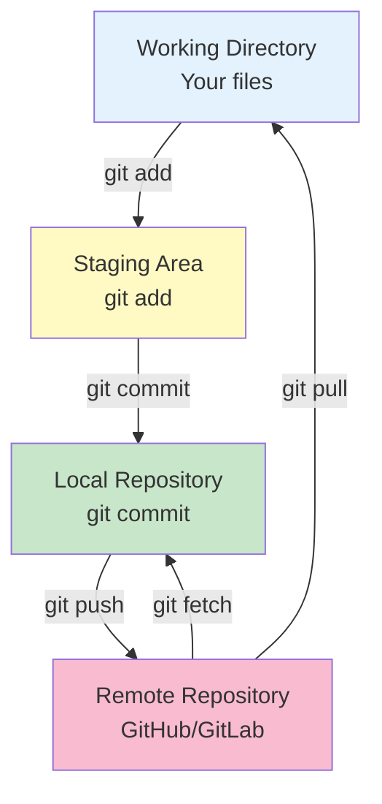
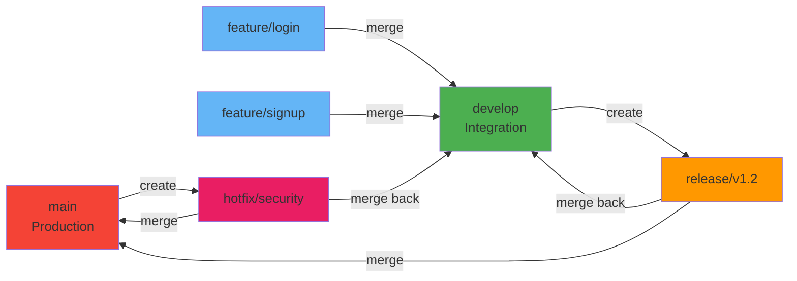
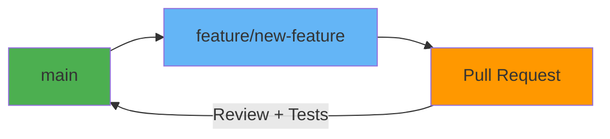

# Git

**Category**: Infrastructure & DevOps

**Definition**: Distributed version control system that tracks changes in source code during software development, enabling collaboration, branching, and complete project history management.

## Overview

Git is a free and open-source distributed version control system created by Linus Torvalds in 2005. Unlike centralized systems, every developer has a complete copy of the repository history, enabling offline work and making Git extremely fast and reliable.

## Key Concepts

### Repository (Repo)

A project's complete history and file system:

```bash
# Initialize new repository
git init

# Clone existing repository
git clone https://github.com/username/project.git

# Clone with specific branch
git clone -b develop https://github.com/username/project.git

# Clone shallow (faster, less history)
git clone --depth 1 https://github.com/username/project.git
```

### Commits

Snapshots of your project at specific points in time:

```bash
# Stage files
git add file.js
git add src/  # Add directory
git add .     # Add all changes

# Commit with message
git commit -m "Add user authentication"

# Commit with detailed message
git commit -m "Add user authentication" \
           -m "- Implement JWT tokens" \
           -m "- Add login/logout endpoints" \
           -m "- Create middleware for auth"

# Amend last commit (change message or add files)
git commit --amend -m "New message"

# View commit history
git log
git log --oneline
git log --graph --decorate --all
```

### Branches

Parallel lines of development:

```bash
# List branches
git branch           # Local branches
git branch -r        # Remote branches
git branch -a        # All branches

# Create branch
git branch feature/user-auth

# Create and switch to branch
git checkout -b feature/user-auth

# Modern syntax (Git 2.23+)
git switch -c feature/user-auth

# Switch branches
git checkout main
git switch main

# Delete branch
git branch -d feature/user-auth    # Safe delete (merged only)
git branch -D feature/user-auth    # Force delete

# Rename branch
git branch -m old-name new-name
```

### Merging

Combine branches:

```bash
# Merge feature into current branch
git checkout main
git merge feature/user-auth

# Merge with commit message
git merge feature/user-auth -m "Merge user authentication feature"

# Abort merge if conflicts
git merge --abort

# Squash merge (combine all commits into one)
git merge --squash feature/user-auth
git commit -m "Add user authentication"
```

### Remote Repositories

Connect to hosted repositories (GitHub, GitLab, etc.):

```bash
# List remotes
git remote -v

# Add remote
git remote add origin https://github.com/username/project.git

# Change remote URL
git remote set-url origin git@github.com:username/project.git

# Fetch from remote (download, don't merge)
git fetch origin

# Pull from remote (fetch + merge)
git pull origin main

# Pull with rebase (cleaner history)
git pull --rebase origin main

# Push to remote
git push origin main

# Push new branch
git push -u origin feature/user-auth

# Delete remote branch
git push origin --delete feature/user-auth
```

## Git Workflow Architecture



## Branching Strategies

### Git Flow



**Branch Types**:
- `main`: Production code
- `develop`: Integration branch
- `feature/*`: New features
- `release/*`: Release preparation
- `hotfix/*`: Emergency fixes

```bash
# Start feature
git checkout develop
git checkout -b feature/user-auth

# Finish feature
git checkout develop
git merge --no-ff feature/user-auth
git branch -d feature/user-auth

# Start release
git checkout develop
git checkout -b release/v1.2.0

# Finish release
git checkout main
git merge --no-ff release/v1.2.0
git tag -a v1.2.0 -m "Version 1.2.0"
git checkout develop
git merge --no-ff release/v1.2.0
git branch -d release/v1.2.0
```

### GitHub Flow (Simpler)



**Workflow**:
1. Create feature branch from `main`
2. Commit changes
3. Open Pull Request
4. Review and test
5. Merge to `main`
6. Deploy

```bash
# Create feature branch
git checkout main
git pull origin main
git checkout -b feature/new-feature

# Make changes and commit
git add .
git commit -m "Add new feature"
git push -u origin feature/new-feature

# On GitHub: Create Pull Request
# After approval: Merge and delete branch
```

## Essential Git Commands

### Configuration

```bash
# Set user info
git config --global user.name "Your Name"
git config --global user.email "your@email.com"

# Set default editor
git config --global core.editor "vim"

# Set default branch name
git config --global init.defaultBranch main

# List config
git config --list
git config --global --list

# Aliases
git config --global alias.st status
git config --global alias.co checkout
git config --global alias.br branch
git config --global alias.cm commit
git config --global alias.lg "log --oneline --graph --decorate --all"
```

### Status and Diff

```bash
# Check status
git status
git status -s  # Short format

# View changes
git diff               # Unstaged changes
git diff --staged      # Staged changes
git diff HEAD          # All changes since last commit
git diff main..feature # Compare branches
```

### Undoing Changes

```bash
# Discard changes in working directory
git checkout -- file.js
git restore file.js  # Modern syntax

# Unstage file
git reset HEAD file.js
git restore --staged file.js  # Modern syntax

# Undo last commit (keep changes)
git reset --soft HEAD~1

# Undo last commit (discard changes)
git reset --hard HEAD~1

# Revert commit (create new commit that undoes)
git revert abc123

# Clean untracked files
git clean -n   # Dry run (preview)
git clean -f   # Force remove
git clean -fd  # Remove files and directories
```

### Stashing

Save changes temporarily:

```bash
# Stash changes
git stash
git stash save "Work in progress on feature X"

# List stashes
git stash list

# Apply stash
git stash apply         # Apply most recent
git stash apply stash@{2}  # Apply specific stash

# Apply and remove stash
git stash pop

# Delete stash
git stash drop stash@{0}
git stash clear  # Delete all stashes
```

### Rebasing

Rewrite commit history:

```bash
# Rebase feature onto main
git checkout feature/user-auth
git rebase main

# Interactive rebase (edit last 3 commits)
git rebase -i HEAD~3

# Continue after resolving conflicts
git rebase --continue

# Abort rebase
git rebase --abort
```

**Interactive Rebase Options**:
- `pick`: Use commit
- `reword`: Change commit message
- `edit`: Stop to amend commit
- `squash`: Combine with previous commit
- `fixup`: Like squash but discard message
- `drop`: Remove commit

### Tags

Mark important points in history:

```bash
# Create lightweight tag
git tag v1.0.0

# Create annotated tag
git tag -a v1.0.0 -m "Version 1.0.0"

# Tag specific commit
git tag -a v0.9.0 abc123 -m "Version 0.9.0"

# List tags
git tag
git tag -l "v1.*"

# Push tags
git push origin v1.0.0
git push origin --tags  # Push all tags

# Delete tag
git tag -d v1.0.0
git push origin --delete v1.0.0
```

## Advanced Git Features

### Cherry-Pick

Apply specific commits:

```bash
# Apply commit from another branch
git cherry-pick abc123

# Cherry-pick multiple commits
git cherry-pick abc123 def456 ghi789

# Cherry-pick without committing
git cherry-pick --no-commit abc123
```

### Submodules

Include other repositories:

```bash
# Add submodule
git submodule add https://github.com/org/lib.git libs/lib

# Clone repo with submodules
git clone --recursive https://github.com/org/project.git

# Update submodules
git submodule update --init --recursive
git submodule update --remote
```

### Worktrees

Multiple working directories:

```bash
# Create worktree
git worktree add ../project-hotfix hotfix/critical-bug

# List worktrees
git worktree list

# Remove worktree
git worktree remove ../project-hotfix
```

### Bisect

Find bug-introducing commit:

```bash
# Start bisect
git bisect start
git bisect bad          # Current commit is bad
git bisect good v1.0.0  # v1.0.0 was good

# Git checks out middle commit
# Test it, then mark:
git bisect good  # or git bisect bad

# Repeat until found
# Reset
git bisect reset
```

## .gitignore

Exclude files from version control:

```bash
# .gitignore example
# Dependencies
node_modules/
vendor/

# Build outputs
dist/
build/
*.o
*.so

# Environment files
.env
.env.local
*.env

# IDE files
.vscode/
.idea/
*.swp

# OS files
.DS_Store
Thumbs.db

# Logs
logs/
*.log
npm-debug.log*

# Test coverage
coverage/
.nyc_output/
```

## SpecWeave Integration

### Git Workflow with Increments

**Increment-Based Branching**:
```bash
# Create increment branch
git checkout develop
git pull origin develop
git checkout -b increment/0012-user-auth

# Work on tasks
git add src/auth/
git commit -m "feat: implement JWT authentication (T-001)"

git add tests/auth.test.ts
git commit -m "test: add authentication tests (T-001)"

# Push increment branch
git push -u origin increment/0012-user-auth
```

**Commit Message Convention**:
```bash
# Format: <type>: <description> (<task-id>)

# Types:
feat:     # New feature
fix:      # Bug fix
docs:     # Documentation
test:     # Tests
refactor: # Code refactoring
chore:    # Maintenance

# Examples:
git commit -m "feat: add login endpoint (T-001)"
git commit -m "test: add integration tests for auth (T-002)"
git commit -m "docs: update API documentation (T-004)"
git commit -m "fix: resolve token expiration bug (T-005)"
```

**SpecWeave Branch Strategy**:
```markdown
## Branch Naming Convention

- `main`: Production code
- `develop`: Integration branch
- `increment/####-name`: Increment development
- `hotfix/####-name`: Critical fixes
- `experiment/####-name`: Spike work

## Example:
increment/0012-user-authentication
hotfix/0013-security-patch
experiment/0014-graphql-evaluation
```

**Increment Completion**:
```bash
# After increment complete
git checkout develop
git merge --no-ff increment/0012-user-auth \
  -m "Increment 0012: User Authentication Complete

- Implemented JWT-based authentication
- Added login/logout endpoints
- Created authentication middleware
- Test coverage: 87%

Resolves: #45, #46, #47"

# Tag increment
git tag -a v0.12.0 -m "Increment 0012: User Authentication"

# Push
git push origin develop
git push origin --tags

# Delete increment branch
git branch -d increment/0012-user-auth
git push origin --delete increment/0012-user-auth
```

### Living Documentation with Git

After increment completion, Git history becomes documentation:

```bash
# Generate changelog from commits
git log --oneline --no-merges increment/0012-user-auth

# View increment work
git log --graph --decorate increment/0012-user-auth

# Sync living docs
/specweave:sync-docs update
# Results in:
# - CHANGELOG.md updated with increment summary
# - Architecture docs updated with implementation details
# - ADRs created for technical decisions
```

### Example ADR

```markdown
# ADR-012: Git Flow vs GitHub Flow

## Status
Accepted

## Context
Need branching strategy for 5-person team with monthly releases.

## Decision
Use modified Git Flow:
- `main`: Production
- `develop`: Integration
- `increment/*`: Feature development
- `hotfix/*`: Emergency fixes
- No `release/*` branches (deploy from develop)

## Alternatives Considered
- **GitHub Flow**: Too simple (no develop branch)
- **Trunk-Based**: Team not ready for CI/CD maturity
- **Git Flow**: Too complex (release branches unnecessary)

## Rationale
- Increment branches align with SpecWeave methodology
- Develop branch isolates unstable work
- Hotfix branches for production emergencies
- Simpler than full Git Flow

## Consequences
- Clear separation of stable (main) and unstable (develop)
- Increment branches map to SpecWeave increments
- Easy to track what's in production vs development
```

## Best Practices

### 1. Write Good Commit Messages
```bash
# Bad
git commit -m "fix stuff"
git commit -m "update"

# Good
git commit -m "feat: add user authentication endpoint

- Implement JWT token generation
- Add password hashing with bcrypt
- Create login/logout routes
- Test coverage: 85%

Closes #42"
```

### 2. Commit Often, Push Regularly
```bash
# Commit frequently (small, logical units)
git commit -m "feat: add login form"
git commit -m "feat: add form validation"
git commit -m "test: add form validation tests"

# Push at least once per day
git push origin feature/user-auth
```

### 3. Pull Before Push
```bash
# Avoid conflicts
git pull --rebase origin main
git push origin main
```

### 4. Use Branches
```bash
# Never commit directly to main!
git checkout -b feature/new-feature
# ... make changes ...
git push -u origin feature/new-feature
# Create Pull Request
```

### 5. Keep History Clean
```bash
# Squash commits before merging
git rebase -i HEAD~5
# Squash "wip" and "fix typo" commits

# Or use squash merge
git merge --squash feature/user-auth
```

## Common Pitfalls

### Merge Conflicts
```bash
# When merge conflicts occur:
# 1. Open conflicted files
# 2. Resolve conflicts (remove markers: <<<<, ====, >>>>)
# 3. Stage resolved files
git add conflicted-file.js

# 4. Complete merge
git commit  # or git merge --continue / git rebase --continue
```

### Accidentally Committed Secrets
```bash
# Remove from last commit
git reset HEAD~1
git add .gitignore  # Add secret file to .gitignore
git commit -m "Add .gitignore"

# Remove from history (nuclear option)
git filter-branch --force --index-filter \
  "git rm --cached --ignore-unmatch path/to/secret.txt" \
  --prune-empty --tag-name-filter cat -- --all
```

### Lost Commits
```bash
# Find lost commits
git reflog

# Restore lost commit
git checkout abc123
git cherry-pick abc123
```

## Git Hosting Platforms

| Platform | Best For | Features |
|----------|----------|----------|
| **GitHub** | Open source, public repos | Actions, Copilot, large community |
| **GitLab** | Self-hosted, CI/CD | Built-in CI/CD, issue tracking |
| **Bitbucket** | Atlassian ecosystem | Jira integration, Trello boards |
| **Gitea** | Self-hosted, lightweight | Minimal, fast, easy setup |

## Related Concepts

- [GitHub Actions](/docs/glossary/terms/github-actions) - CI/CD automation with Git
- Pull Request - Code review workflow
- [CI/CD](/docs/glossary/terms/ci-cd) - Automated pipelines triggered by Git
- [Branching Strategy](/docs/glossary/terms/branching-strategy) - Git workflow patterns
- [Version Control](/docs/glossary/terms/version-control) - General VCS concepts

## Resources

- [Official Documentation](https://git-scm.com/doc)
- [Pro Git Book (Free)](https://git-scm.com/book/en/v2)
- [Git Cheat Sheet](https://education.github.com/git-cheat-sheet-education.pdf)
- [Learn Git Branching](https://learngitbranching.js.org/) - Interactive tutorial
- [Oh Shit, Git!?!](https://ohshitgit.com/) - Fix common mistakes

---

**Last Updated**: 2025-11-04
**Category**: Infrastructure & DevOps
