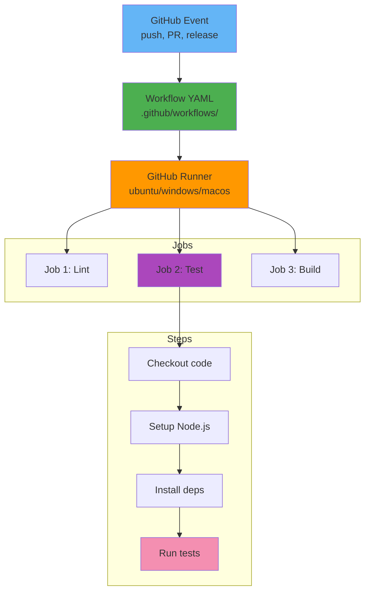

# GitHub Actions

**Category**: Infrastructure & DevOps

**Definition**: CI/CD automation platform built directly into GitHub that enables automated workflows triggered by repository events, eliminating the need for external CI/CD services.

## Overview

GitHub Actions is a continuous integration and continuous deployment (CI/CD) platform that allows you to automate your build, test, and deployment pipeline directly within GitHub. Workflows are defined using YAML files and can be triggered by various GitHub events (push, pull request, release, etc.).

## Key Concepts

### Workflows

YAML files that define automated processes:

```yaml
# .github/workflows/ci.yml
name: CI Pipeline

# Trigger on push and pull requests
on:
  push:
    branches: [main, develop]
  pull_request:
    branches: [main]

# Environment variables
env:
  NODE_VERSION: '18'

# Jobs to run
jobs:
  test:
    name: Test Application
    runs-on: ubuntu-latest

    steps:
      - name: Checkout code
        uses: actions/checkout@v4

      - name: Setup Node.js
        uses: actions/setup-node@v4
        with:
          node-version: ${{ env.NODE_VERSION }}
          cache: 'npm'

      - name: Install dependencies
        run: npm ci

      - name: Run linter
        run: npm run lint

      - name: Run tests
        run: npm test -- --coverage

      - name: Upload coverage
        uses: codecov/codecov-action@v3
        with:
          file: ./coverage/coverage-final.json
```

### Jobs

Units of work that run in parallel or sequentially:

```yaml
jobs:
  # Job 1: Lint
  lint:
    runs-on: ubuntu-latest
    steps:
      - uses: actions/checkout@v4
      - run: npm ci
      - run: npm run lint

  # Job 2: Test (depends on lint)
  test:
    needs: lint
    runs-on: ubuntu-latest
    steps:
      - uses: actions/checkout@v4
      - run: npm ci
      - run: npm test

  # Job 3: Build (depends on test)
  build:
    needs: test
    runs-on: ubuntu-latest
    steps:
      - uses: actions/checkout@v4
      - run: npm ci
      - run: npm run build
```

### Actions

Reusable units of code (marketplace or custom):

```yaml
steps:
  # Official GitHub action
  - name: Checkout
    uses: actions/checkout@v4

  # Third-party action from marketplace
  - name: Setup Node.js
    uses: actions/setup-node@v4
    with:
      node-version: '18'

  # Custom action from your repo
  - name: Custom deployment
    uses: ./.github/actions/deploy
    with:
      environment: production
```

### Runners

Servers that execute workflows:

```yaml
jobs:
  test:
    # GitHub-hosted runners
    runs-on: ubuntu-latest      # Linux
    # runs-on: windows-latest   # Windows
    # runs-on: macos-latest     # macOS

  test-matrix:
    # Matrix strategy (multiple runners)
    runs-on: ${{ matrix.os }}
    strategy:
      matrix:
        os: [ubuntu-latest, windows-latest, macos-latest]
        node: [16, 18, 20]
```

### Secrets

Encrypted environment variables:

```yaml
steps:
  - name: Deploy to AWS
    env:
      AWS_ACCESS_KEY_ID: ${{ secrets.AWS_ACCESS_KEY_ID }}
      AWS_SECRET_ACCESS_KEY: ${{ secrets.AWS_SECRET_ACCESS_KEY }}
    run: |
      aws s3 sync ./dist s3://my-bucket
```

**Setting Secrets**: Repository Settings → Secrets and variables → Actions → New repository secret

## GitHub Actions Architecture



## Complete CI/CD Example

### SpecWeave's GitHub Actions Pipeline

```yaml
# .github/workflows/ci-cd.yml
name: SpecWeave CI/CD

on:
  push:
    branches: [main, develop]
    tags:
      - 'v*'
  pull_request:
    branches: [main]

env:
  NODE_VERSION: '18'

jobs:
  # Stage 1: Code Quality
  lint:
    name: Lint Code
    runs-on: ubuntu-latest
    steps:
      - name: Checkout
        uses: actions/checkout@v4

      - name: Setup Node.js
        uses: actions/setup-node@v4
        with:
          node-version: ${{ env.NODE_VERSION }}
          cache: 'npm'

      - name: Install dependencies
        run: npm ci

      - name: Run ESLint
        run: npm run lint

      - name: Check formatting
        run: npm run format:check

  # Stage 2: Tests
  test:
    name: Test
    runs-on: ${{ matrix.os }}
    needs: lint
    strategy:
      matrix:
        os: [ubuntu-latest, windows-latest, macos-latest]
        node: [16, 18, 20]
    steps:
      - uses: actions/checkout@v4

      - name: Setup Node.js ${{ matrix.node }}
        uses: actions/setup-node@v4
        with:
          node-version: ${{ matrix.node }}
          cache: 'npm'

      - name: Install dependencies
        run: npm ci

      - name: Run unit tests
        run: npm test -- --coverage

      - name: Run integration tests
        run: npm run test:integration

      - name: Upload coverage to Codecov
        if: matrix.os == 'ubuntu-latest' && matrix.node == 18
        uses: codecov/codecov-action@v3

  # Stage 3: E2E Tests
  e2e:
    name: E2E Tests
    runs-on: ubuntu-latest
    needs: test
    steps:
      - uses: actions/checkout@v4
      - uses: actions/setup-node@v4
        with:
          node-version: ${{ env.NODE_VERSION }}

      - name: Install dependencies
        run: npm ci

      - name: Install Playwright
        run: npx playwright install --with-deps

      - name: Run E2E tests
        run: npm run test:e2e

      - name: Upload test results
        if: failure()
        uses: actions/upload-artifact@v4
        with:
          name: playwright-report
          path: playwright-report/

  # Stage 4: Build
  build:
    name: Build Package
    runs-on: ubuntu-latest
    needs: [test, e2e]
    steps:
      - uses: actions/checkout@v4
      - uses: actions/setup-node@v4
        with:
          node-version: ${{ env.NODE_VERSION }}

      - run: npm ci
      - run: npm run build

      - name: Upload build artifacts
        uses: actions/upload-artifact@v4
        with:
          name: dist
          path: dist/

  # Stage 5: Publish to NPM
  publish:
    name: Publish to NPM
    runs-on: ubuntu-latest
    needs: build
    if: startsWith(github.ref, 'refs/tags/v')
    steps:
      - uses: actions/checkout@v4
      - uses: actions/setup-node@v4
        with:
          node-version: ${{ env.NODE_VERSION }}
          registry-url: 'https://registry.npmjs.org'

      - name: Download build artifacts
        uses: actions/download-artifact@v4
        with:
          name: dist
          path: dist/

      - name: Publish to NPM
        run: npm publish
        env:
          NODE_AUTH_TOKEN: ${{ secrets.NPM_TOKEN }}

      - name: Create GitHub Release
        uses: softprops/action-gh-release@v1
        with:
          files: |
            dist/**/*
          generate_release_notes: true

  # Stage 6: Deploy Documentation
  deploy-docs:
    name: Deploy Documentation
    runs-on: ubuntu-latest
    needs: build
    if: github.ref == 'refs/heads/main'
    steps:
      - uses: actions/checkout@v4
      - uses: actions/setup-node@v4
        with:
          node-version: ${{ env.NODE_VERSION }}

      - name: Build documentation
        run: |
          cd docs-site
          npm ci
          npm run build

      - name: Deploy to GitHub Pages
        uses: peaceiris/actions-gh-pages@v3
        with:
          github_token: ${{ secrets.GITHUB_TOKEN }}
          publish_dir: ./docs-site/build
```

## Workflow Triggers

### Event Triggers

```yaml
# Push to specific branches
on:
  push:
    branches: [main, develop]

# Pull requests
on:
  pull_request:
    branches: [main]
    types: [opened, synchronize, reopened]

# Tags
on:
  push:
    tags:
      - 'v*.*.*'

# Schedule (cron)
on:
  schedule:
    - cron: '0 2 * * *'  # Daily at 2 AM UTC

# Manual trigger
on:
  workflow_dispatch:
    inputs:
      environment:
        description: 'Environment to deploy'
        required: true
        default: 'staging'
        type: choice
        options:
          - staging
          - production

# Multiple triggers
on:
  push:
    branches: [main]
  pull_request:
    branches: [main]
  schedule:
    - cron: '0 0 * * 0'  # Weekly on Sunday
  workflow_dispatch:
```

### Path Filters

```yaml
# Only run on specific file changes
on:
  push:
    paths:
      - 'src/**'
      - 'tests/**'
      - 'package.json'

# Ignore paths
on:
  push:
    paths-ignore:
      - 'docs/**'
      - '**.md'
```

## Matrix Builds

Test across multiple configurations:

```yaml
jobs:
  test:
    runs-on: ${{ matrix.os }}
    strategy:
      matrix:
        os: [ubuntu-latest, windows-latest, macos-latest]
        node: [16, 18, 20]
        include:
          # Add specific combination
          - os: ubuntu-latest
            node: 20
            experimental: true
        exclude:
          # Skip specific combination
          - os: windows-latest
            node: 16
    steps:
      - uses: actions/checkout@v4
      - uses: actions/setup-node@v4
        with:
          node-version: ${{ matrix.node }}
      - run: npm test
```

## Reusable Workflows

Share workflows across repositories:

```yaml
# .github/workflows/reusable-test.yml
name: Reusable Test Workflow

on:
  workflow_call:
    inputs:
      node-version:
        required: true
        type: string
    secrets:
      npm-token:
        required: true

jobs:
  test:
    runs-on: ubuntu-latest
    steps:
      - uses: actions/checkout@v4
      - uses: actions/setup-node@v4
        with:
          node-version: ${{ inputs.node-version }}
      - run: npm ci
        env:
          NODE_AUTH_TOKEN: ${{ secrets.npm-token }}
      - run: npm test
```

```yaml
# Use reusable workflow
name: CI

on: [push]

jobs:
  call-test-workflow:
    uses: ./.github/workflows/reusable-test.yml
    with:
      node-version: '18'
    secrets:
      npm-token: ${{ secrets.NPM_TOKEN }}
```

## Actions Marketplace

### Popular Actions

```yaml
# Checkout repository
- uses: actions/checkout@v4
  with:
    fetch-depth: 0  # Fetch all history

# Setup Node.js
- uses: actions/setup-node@v4
  with:
    node-version: '18'
    cache: 'npm'

# Setup Python
- uses: actions/setup-python@v5
  with:
    python-version: '3.11'

# Cache dependencies
- uses: actions/cache@v3
  with:
    path: ~/.npm
    key: ${{ runner.os }}-node-${{ hashFiles('**/package-lock.json') }}

# Docker build/push
- uses: docker/build-push-action@v5
  with:
    push: true
    tags: myapp:latest

# AWS credentials
- uses: aws-actions/configure-aws-credentials@v4
  with:
    aws-access-key-id: ${{ secrets.AWS_ACCESS_KEY_ID }}
    aws-secret-access-key: ${{ secrets.AWS_SECRET_ACCESS_KEY }}
    aws-region: us-west-2

# Deploy to GitHub Pages
- uses: peaceiris/actions-gh-pages@v3
  with:
    github_token: ${{ secrets.GITHUB_TOKEN }}
    publish_dir: ./build

# Slack notification
- uses: slackapi/slack-github-action@v1
  with:
    webhook-url: ${{ secrets.SLACK_WEBHOOK }}
```

## Custom Actions

### Composite Action

```yaml
# .github/actions/setup-project/action.yml
name: 'Setup Project'
description: 'Setup Node.js and install dependencies'
inputs:
  node-version:
    description: 'Node.js version'
    required: true
    default: '18'
runs:
  using: 'composite'
  steps:
    - uses: actions/setup-node@v4
      with:
        node-version: ${{ inputs.node-version }}
        cache: 'npm'
    - run: npm ci
      shell: bash
```

```yaml
# Use custom action
steps:
  - uses: actions/checkout@v4
  - uses: ./.github/actions/setup-project
    with:
      node-version: '18'
```

### Docker Action

```dockerfile
# .github/actions/custom-deploy/Dockerfile
FROM node:18-alpine

COPY entrypoint.sh /entrypoint.sh
RUN chmod +x /entrypoint.sh

ENTRYPOINT ["/entrypoint.sh"]
```

```yaml
# .github/actions/custom-deploy/action.yml
name: 'Custom Deploy'
description: 'Deploy application'
inputs:
  environment:
    description: 'Target environment'
    required: true
runs:
  using: 'docker'
  image: 'Dockerfile'
  args:
    - ${{ inputs.environment }}
```

## Environment Protection

```yaml
jobs:
  deploy-production:
    runs-on: ubuntu-latest
    environment:
      name: production
      url: https://app.example.com
    steps:
      - name: Deploy
        run: ./deploy.sh production
```

**Environment Setup**: Repository Settings → Environments → New environment
- Add required reviewers (approval required)
- Add branch protection (only main can deploy)
- Add environment secrets

## SpecWeave Integration

### SpecWeave's CI/CD Workflow

**Increment Planning**:
```markdown
## Increment 0016: GitHub Actions CI/CD

### User Stories
- US-001: Automated testing on every PR (P1)
- US-002: Automated NPM publishing on tag (P1)
- US-003: Deploy docs to GitHub Pages (P2)
- US-004: Matrix testing across OS and Node versions (P2)

### Tasks
- T-001: Create CI workflow (lint, test, build)
- T-002: Add E2E tests to pipeline
- T-003: Set up NPM publishing workflow
- T-004: Configure docs deployment
- T-005: Add status badges to README

### Acceptance Criteria
- AC-US1-01: All tests run on every PR
- AC-US1-02: PR blocked if tests fail
- AC-US2-01: NPM publish on tag push
- AC-US3-01: Docs auto-deploy on main merge
```

**Test Plan**:
```markdown
## T-001: Create CI Workflow

**Test Cases**:
- Unit: YAML syntax validation with actionlint
- Integration: Workflow triggers on PR
- E2E: Full pipeline completes successfully

**Validation**:
```bash
# Validate workflow syntax
actionlint .github/workflows/ci.yml

# Test workflow locally (requires act)
act -j test

# Create test PR
git checkout -b test-ci-workflow
git commit --allow-empty -m "Test CI workflow"
git push origin test-ci-workflow
# Create PR and verify workflow runs
```
```

### Living Documentation

After GitHub Actions setup, update docs:

```bash
# Sync CI/CD documentation
/specweave:sync-docs update

# Results in:
# - README updated with status badges
# - ADR: "Why GitHub Actions Over Jenkins"
# - Deployment runbook with workflow details
# - Troubleshooting guide for workflow failures
```

### Status Badges

```markdown
# README.md with badges
[](https://github.com/org/repo/actions)
[](https://codecov.io/gh/org/repo)
[](https://badge.fury.io/js/specweave)
```

## Best Practices

### 1. Use Caching
```yaml
- uses: actions/cache@v3
  with:
    path: ~/.npm
    key: ${{ runner.os }}-node-${{ hashFiles('**/package-lock.json') }}
    restore-keys: |
      ${{ runner.os }}-node-
```

### 2. Matrix Strategies
```yaml
strategy:
  matrix:
    os: [ubuntu-latest, macos-latest, windows-latest]
    node: [16, 18, 20]
  fail-fast: false  # Don't cancel other jobs on first failure
```

### 3. Conditional Steps
```yaml
- name: Deploy
  if: github.ref == 'refs/heads/main'
  run: ./deploy.sh
```

### 4. Secrets Management
```yaml
# Never log secrets!
- name: Deploy
  env:
    API_KEY: ${{ secrets.API_KEY }}
  run: |
    echo "::add-mask::$API_KEY"
    ./deploy.sh
```

### 5. Concurrency Control
```yaml
concurrency:
  group: ${{ github.workflow }}-${{ github.ref }}
  cancel-in-progress: true  # Cancel old runs on new push
```

## Troubleshooting

### Workflow Not Triggering
```yaml
# Check event configuration
on:
  push:
    branches: [main]  # Ensure branch name matches

# Check path filters
paths:
  - 'src/**'  # Ensure changed files match
```

### Secrets Not Working
```bash
# Verify secret exists: Settings → Secrets and variables → Actions
# Secrets are case-sensitive: ${{ secrets.AWS_ACCESS_KEY_ID }}
# Secrets are not available in forks (security)
```

### Timeout Issues
```yaml
jobs:
  test:
    timeout-minutes: 30  # Default is 360 (6 hours)
```

## Cost Management

**GitHub Actions Pricing** (as of 2024):
- Public repositories: FREE unlimited minutes
- Private repositories: 2,000 minutes/month free, then $0.008/minute
- Self-hosted runners: FREE (you pay for infrastructure)

**Optimization Tips**:
```yaml
# Use caching to reduce build time
# Use matrix selectively (each combination = separate job)
# Cancel redundant runs
concurrency:
  cancel-in-progress: true
```

## Related Concepts

- [CI/CD](/docs/glossary/terms/ci-cd) - Continuous integration and deployment
- [Git](/docs/glossary/terms/git) - Version control system
- [Docker](/docs/glossary/terms/docker) - Container builds in workflows
- [Kubernetes](/docs/glossary/terms/kubernetes) - Deployment target
- GitHub - GitHub platform

## Resources

- [Official Documentation](https://docs.github.com/en/actions)
- [Actions Marketplace](https://github.com/marketplace?type=actions)
- [Actions Toolkit](https://github.com/actions/toolkit) - Build custom actions
- [Awesome Actions](https://github.com/sdras/awesome-actions) - Curated list

---

**Last Updated**: 2025-11-04
**Category**: Infrastructure & DevOps
