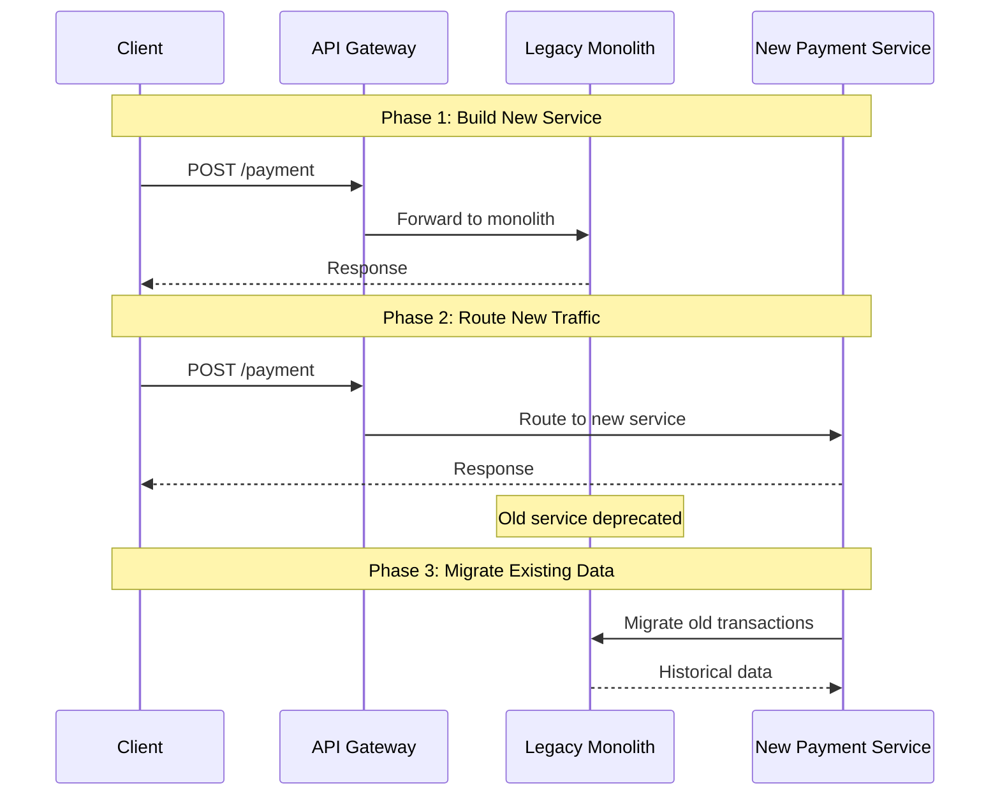
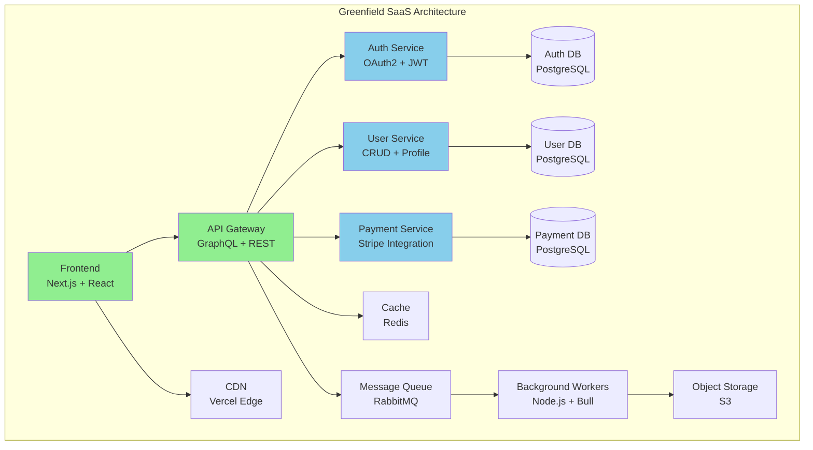
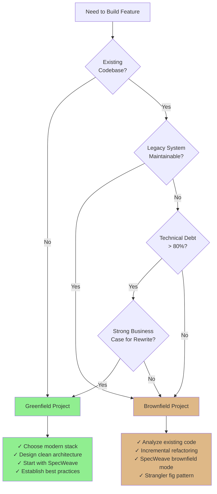

# Greenfield Development

**Category**: Development Methodology
**Related Terms**: [Brownfield](/docs/glossary/terms/brownfield), Technical Debt, Legacy Code, Architecture, Migration

---

## Definition

**Greenfield development** refers to starting a new software project from scratch, with no existing codebase, infrastructure, or legacy constraints. The term comes from construction, where "greenfield" means building on previously undeveloped land.

In software, greenfield projects offer the opportunity to:
- Choose modern technology stacks without compatibility concerns
- Design clean architecture without legacy constraints
- Implement best practices from day one
- Avoid accumulated technical debt

---

## Key Characteristics

### Benefits

1. **Clean Slate Architecture**
   - Design optimal system architecture without legacy constraints
   - Choose best-fit technologies for the problem domain
   - Implement modern design patterns (microservices, event-driven, etc.)
   - No technical debt to inherit

2. **Modern Tech Stack**
   - Use latest language versions and frameworks
   - Leverage cutting-edge tools and libraries
   - Implement cloud-native patterns from the start
   - No compatibility concerns with old systems

3. **Best Practices from Day One**
   - Establish proper testing strategy (TDD, BDD)
   - Implement CI/CD pipelines early
   - Set up observability and monitoring
   - Define coding standards and documentation practices

4. **Freedom and Flexibility**
   - No migration pain from old systems
   - Experiment with new approaches
   - Optimize for future growth, not past decisions
   - Fast iteration without legacy concerns

### Challenges

1. **No Existing Users or Revenue**
   - Must prove product-market fit from scratch
   - Longer time to revenue
   - Higher risk of building the wrong thing
   - No validated business model

2. **Building Everything from Scratch**
   - Longer initial development time
   - More upfront planning required
   - Need to establish all patterns and practices
   - Higher initial infrastructure costs

3. **No Proven Patterns**
   - No existing team knowledge or muscle memory
   - Must discover optimal architecture through iteration
   - Risk of over-engineering or under-engineering
   - Learning curve for new tech stack

4. **Resource Intensive**
   - Requires significant upfront investment
   - Team must learn new stack and patterns
   - Documentation must be created from zero
   - No existing monitoring or operational knowledge

---

## Greenfield vs Brownfield

```mermaid
graph TB
    subgraph "Greenfield Project"
        G1[New Project] --> G2[Choose Tech Stack]
        G2 --> G3[Design Architecture]
        G3 --> G4[Build from Scratch]
        G4 --> G5[Deploy]

        style G1 fill:#90EE90
        style G2 fill:#90EE90
        style G3 fill:#90EE90
        style G4 fill:#90EE90
        style G5 fill:#90EE90
    end

    subgraph "Brownfield Project"
        B1[Existing System] --> B2[Analyze Legacy]
        B2 --> B3[Work Within Constraints]
        B3 --> B4[Incremental Changes]
        B4 --> B5[Deploy]

        style B1 fill:#DEB887
        style B2 fill:#DEB887
        style B3 fill:#DEB887
        style B4 fill:#DEB887
        style B5 fill:#DEB887
    end
```



| Aspect | Greenfield | Brownfield |
|--------|-----------|-----------|
| **Starting Point** | Clean slate | Existing codebase |
| **Architecture** | Design freely | Work within constraints |
| **Tech Stack** | Choose optimal | Limited by legacy |
| **Technical Debt** | Zero (initially) | Inherited |
| **Development Speed** | Slower initially, faster later | Faster initially, slower later |
| **Risk** | Product-market fit risk | Stability/regression risk |
| **Users** | None initially | Existing user base |
| **Revenue** | Future potential | Current revenue stream |
| **Learning Curve** | New stack | Existing patterns |

---

## When to Choose Greenfield

### Good Reasons

1. **New Product or Company**
   - Building a new SaaS product from scratch
   - Startup launching first product
   - Exploring new market segment with dedicated product

2. **Failed Rewrite is Justified**
   - Legacy system is unmaintainable (technical debt > 80%)
   - Cost of maintaining old system exceeds rewrite cost
   - Technology is obsolete (no vendor support, security risks)
   - Business model has fundamentally changed

3. **Proven Product-Market Fit with Fresh Start**
   - Successful MVP being rebuilt for scale
   - Validated business model, need production-grade system
   - Moving from prototype to enterprise-ready product

4. **Strategic Business Decision**
   - New business unit with different requirements
   - Separate product targeting different market
   - Acquisition of technology requiring ground-up rebuild

### Bad Reasons

1. **"Clean Code" Syndrome**
   - Wanting perfect code (no code is perfect)
   - Developer preference over business need
   - Underestimating cost of rewrite
   - Ignoring value of existing system knowledge

2. **Avoiding Technical Debt Without Business Case**
   - Technical debt is manageable with incremental refactoring
   - Existing system still generates revenue
   - No critical scalability or security issues
   - Team can maintain and extend current system

3. **"Resume-Driven Development"**
   - Wanting to use new technologies for career growth
   - Following trends without business justification
   - Ignoring operational stability and team familiarity

---

## Real-World Examples

### Example 1: New SaaS Startup

**Scenario**: Building a project management tool from scratch

```bash
# Initialize greenfield project with SpecWeave
npx specweave init my-saas-app
cd my-saas-app

# Start first increment
/specweave:increment "0001-user-authentication"

# SpecWeave guides you through:
# - Choosing tech stack (Next.js + Supabase + Vercel)
# - Designing architecture (microservices vs monolith)
# - Setting up CI/CD (GitHub Actions)
# - Establishing documentation patterns
```

**Benefits**:
- Modern tech stack (Next.js 14, React Server Components)
- Cloud-native from day one (serverless, edge functions)
- Best practices established early (testing, monitoring)
- Clean architecture with clear separation of concerns

### Example 2: Microservices Migration

**Scenario**: Extracting a service from monolith as new greenfield service

```bash
# Legacy monolith (brownfield)
legacy-app/
├── user-service/     # Stays in monolith
├── payment-service/  # Extract to greenfield microservice
└── notification-service/

# New greenfield microservice
payment-service-v2/
├── spec.md          # Fresh architecture
├── src/
│   ├── api/         # Modern REST + GraphQL
│   ├── domain/      # Clean DDD patterns
│   └── infra/       # Kubernetes native
└── .specweave/      # SpecWeave tracks development
```

**Strategy**: Strangler Fig pattern with greenfield service



### Example 3: Failed Rewrite (What NOT to Do)

**Scenario**: Netscape rewrite (famous failure)

**Timeline**:
- **1997**: Netscape decides to rewrite browser from scratch
- **Reason**: "Code is too messy, let's start clean"
- **1998-2000**: Spend 3 years rewriting while competitors ship features
- **2000**: Release Netscape 6 (buggy, slow, missing features)
- **2002**: Mozilla switches to incremental approach (Firefox)
- **Outcome**: Greenfield rewrite killed Netscape's market share

**Lesson**: Greenfield is NOT always the answer. Consider incremental brownfield refactoring.

---

## SpecWeave for Greenfield Projects

SpecWeave is **optimized for greenfield development** with smart increment planning.

### Increment Skill

The `increment` skill automatically detects product descriptions and routes to increment planning.

**Capabilities**:
- Generate project structure from business requirements
- Suggest tech stack based on project needs
- Create initial SpecWeave increments
- Set up CI/CD templates
- Establish documentation patterns

### Greenfield Workflow

**Step 1: Initialize Project**

```bash
# Install SpecWeave globally
npm install -g specweave

# Initialize new greenfield project
npx specweave init my-app --greenfield

# SpecWeave asks:
# - Project type? (SaaS, API, CLI, library, microservice)
# - Tech stack? (Node.js, Python, Go, Rust, etc.)
# - Architecture? (monolith, microservices, serverless)
# - Hosting? (AWS, GCP, Azure, Vercel, Railway)
```

**Step 2: Plan First Increment**

```bash
# Create first feature increment
/specweave:increment "0001-user-authentication"

# PM agent generates:
# - spec.md (user stories, acceptance criteria)
# - plan.md (architecture, tech choices)
# - tasks.md (implementation tasks with embedded tests)
```

**Step 3: Implement with Living Docs**

```bash
# Execute tasks with AI assistance
/specweave:do

# After each task completes:
# - Living docs sync automatically (via post-task-completion hook)
# - Architecture decisions captured in ADRs
# - Diagrams generated and versioned
# - Tests run and coverage tracked
```

**Step 4: Iterate and Scale**

```bash
# Continue with next increments
/specweave:increment "0002-payment-processing"
/specweave:increment "0003-notification-system"

# SpecWeave maintains:
# - Complete project history (.specweave/docs/internal/specs/)
# - Architecture evolution (.specweave/docs/internal/architecture/adr/)
# - Living documentation (always in sync with code)
```

### Key SpecWeave Features for Greenfield

1. **Increment-Based Planning**
   - Break project into manageable increments
   - Each increment = spec.md + plan.md + tasks.md
   - Clear acceptance criteria and success metrics

2. **Living Documentation**
   - Auto-sync docs after every task completion
   - Architecture decisions captured in real-time
   - Diagrams always up-to-date with code

3. **Test-First Development**
   - Tasks include embedded test plans (BDD format)
   - Coverage targets per task (80-90%)
   - TDD workflow mode supported

4. **Plugin System**
   - Load only relevant plugins (70%+ context reduction)
   - Tech stack plugins (specweave-frontend, specweave-backend)
   - Domain plugins (specweave-ml, specweave-payments)

---

## Typical Greenfield Architecture



**Characteristics**:
- Clean service boundaries
- Modern tech stack (cloud-native)
- Scalability built-in from day one
- Best practices (separate DBs per service, caching, async processing)

---

## Decision Matrix: Greenfield vs Brownfield



---

## Best Practices for Greenfield Projects

### 1. Start with a Clear Vision

```markdown
# Example: Product Vision (spec)

## Problem Statement
Teams struggle with project management tools that are too complex.

## Solution Vision
Build a simple, intuitive project management tool focused on small teams (2-10 people).

## Success Metrics
- 1,000 active teams within 6 months
- 80%+ user satisfaction
- &lt;5 minutes to first project created
```

### 2. Establish Architecture Early

Use **Architecture Decision Records (ADRs)** from day one:

```bash
# Example: ADR-0001-use-postgres.md

# ADR-0001: Use PostgreSQL for Primary Database

## Status
Accepted

## Context
Need to choose a database for user data, projects, and tasks.

## Decision
Use PostgreSQL (hosted on Supabase).

## Rationale
- Relational data model fits our domain
- ACID guarantees for data consistency
- JSON support for flexible schemas
- Free tier sufficient for MVP
- Supabase provides managed hosting + real-time + auth

## Alternatives Considered
- MongoDB: No strong need for document model
- MySQL: Postgres has better JSON support
- SQLite: Not suitable for multi-user SaaS

## Consequences
- Strong data consistency
- Need to learn PostgreSQL (team familiar with MySQL)
- Supabase vendor lock-in (mitigated by standard SQL)
```

### 3. Implement CI/CD Early

```yaml
# .github/workflows/ci.yml
name: CI/CD

on: [push, pull_request]

jobs:
  test:
    runs-on: ubuntu-latest
    steps:
      - uses: actions/checkout@v3
      - uses: actions/setup-node@v3
      - run: npm ci
      - run: npm test
      - run: npm run lint

  deploy:
    needs: test
    if: github.ref == 'refs/heads/main'
    runs-on: ubuntu-latest
    steps:
      - run: npm run deploy
```

### 4. Use SpecWeave Increments

Break project into small, testable increments:

```bash
# Increment 1: Core infrastructure
/specweave:increment "0001-project-setup-and-auth"

# Increment 2: Basic features
/specweave:increment "0002-project-and-task-crud"

# Increment 3: Advanced features
/specweave:increment "0003-real-time-collaboration"
```

### 5. Document as You Go

Use SpecWeave's living docs system:
- Architecture decisions → ADRs (auto-synced)
- System design → HLD diagrams (Mermaid)
- API specs → OpenAPI (versioned)
- Runbooks → Operations docs (created before production)

---

## Common Pitfalls and Solutions

### Pitfall 1: Over-Engineering

**Problem**: Building for scale you don't have yet.

**Example**:
```bash
# DON'T: Day 1 architecture
- Microservices (10+ services)
- Kubernetes cluster
- Event sourcing + CQRS
- Complex CI/CD with canary deployments

# DO: MVP architecture
- Monolith (Next.js + API routes)
- Vercel serverless hosting
- PostgreSQL (Supabase)
- Simple GitHub Actions CI/CD
```

**Solution**: Start simple, refactor when you have real scale problems.

### Pitfall 2: No Testing Strategy

**Problem**: "We'll add tests later" (never happens).

**Solution**: Use SpecWeave's test-embedded tasks:

```markdown
# tasks.md (auto-generated by test-aware-planner agent)

## T-001: Implement User Authentication

**Test Plan** (BDD format):
- Given valid credentials → When login → Then receive JWT token

**Test Cases**:
- Unit: validLogin, invalidPassword, missingFields
- Integration: loginEndpoint, sessionPersistence
- Coverage: 90% overall

**Implementation**: AuthService.ts, JWT helper, tests first (TDD)
```

### Pitfall 3: Documentation Debt

**Problem**: Focus only on code, ignore documentation.

**Solution**: Use SpecWeave's post-task-completion hook:
- Automatically syncs living docs after every task
- ADRs updated from Proposed → Accepted
- Diagrams regenerated from code changes
- Zero manual effort!

---

## Related Documentation

- [Brownfield Development](/docs/glossary/terms/brownfield) - Working with legacy codebases
- Technical Debt - Understanding and managing debt
- [Architecture Decision Records](/docs/glossary/terms/adr) - Documenting decisions
- [Migration Strategies](/docs/glossary/terms/migration) - Moving from brownfield to greenfield
- [SpecWeave Quick Start](../../guides/getting-started/quickstart) - Greenfield setup guide

---

## External Resources

- [Martin Fowler: MonolithFirst](https://martinfowler.com/bliki/MonolithFirst.html)
- [Joel Spolsky: Things You Should Never Do (Netscape rewrite)](https://www.joelonsoftware.com/2000/04/06/things-you-should-never-do-part-i/)
- [Strangler Fig Pattern](https://martinfowler.com/bliki/StranglerFigApplication.html)
- [The Phoenix Project](https://itrevolution.com/the-phoenix-project/) (DevOps novel)

---

**Last Updated**: 2025-11-04
**Status**: Published
**Maintainer**: SpecWeave Documentation Team
