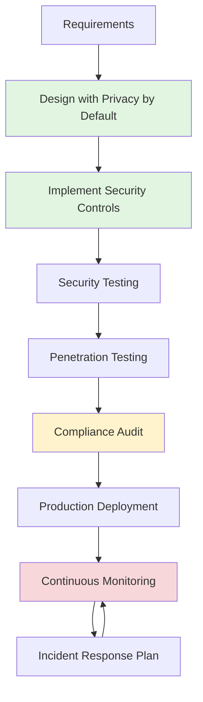
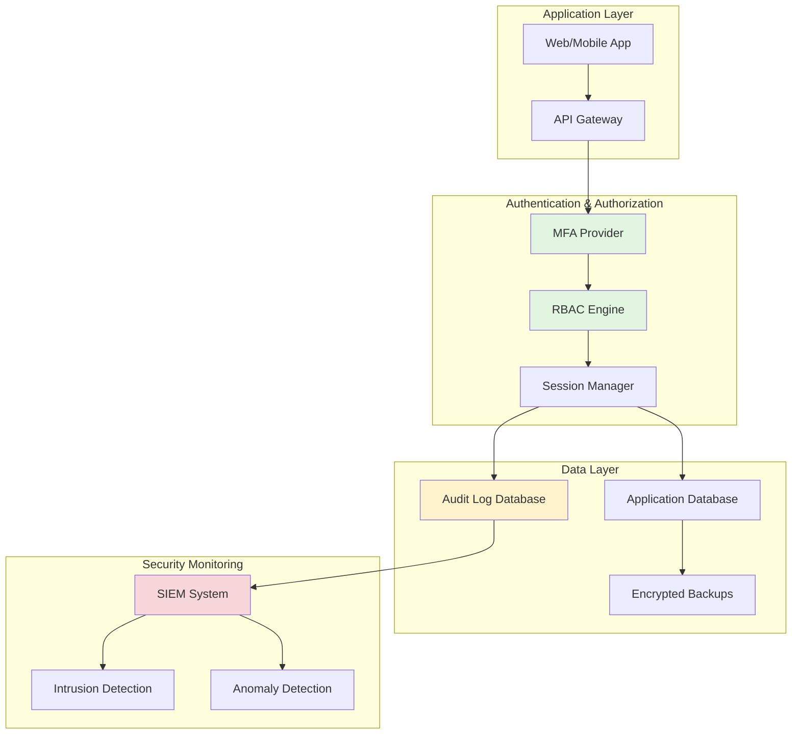

# HIPAA (Health Insurance Portability and Accountability Act)

## Definition

**HIPAA** is a United States federal law enacted in 1996 that establishes national standards for protecting sensitive patient health information from being disclosed without patient consent or knowledge. HIPAA applies to healthcare providers, health plans, healthcare clearinghouses, and their business associates who handle **Protected Health Information (PHI)**.

**Key Insight**: HIPAA is not just about technical security—it's about **accountability, traceability, and demonstrable compliance** through comprehensive documentation and audit trails.

---

## Why HIPAA Matters

### The Stakes

- **Civil Penalties**: $100 to $50,000 per violation (max $1.5M per year)
- **Criminal Penalties**: Up to 10 years imprisonment for willful misuse
- **Reputation Damage**: Data breaches destroy patient trust
- **Business Impact**: Non-compliance can result in exclusion from healthcare networks

### Who Must Comply

1. **Covered Entities**:
   - Healthcare providers (hospitals, clinics, doctors)
   - Health plans (insurers, HMOs)
   - Healthcare clearinghouses (billing services)

2. **Business Associates**:
   - IT service providers
   - Cloud storage vendors
   - Medical transcription services
   - Any vendor with access to PHI

---

## What is Protected Health Information (PHI)?

PHI is any health information that can identify an individual, including:

**Identifiers (18 types)**:
- Names, addresses, dates (birth, admission, discharge, death)
- Phone/fax numbers, email addresses
- Social Security numbers
- Medical record numbers
- Account numbers
- IP addresses
- Biometric identifiers (fingerprints, voice prints)
- Photos, medical images

**Health Data**:
- Medical diagnoses, treatment history
- Prescriptions, lab results
- Insurance claims, billing information
- Mental health records

---

## Key HIPAA Requirements

### 1. Administrative Safeguards

**Security Management Process**:
- Risk analysis (identify vulnerabilities)
- Risk management (implement safeguards)
- Sanction policy (enforce compliance)
- Information system activity review (audit logs)

**Workforce Security**:
- Authorization/supervision procedures
- Workforce clearance procedures
- Termination procedures (revoke access immediately)

**Access Management**:
- Role-based access control (RBAC)
- Unique user identification
- Emergency access procedures
- Automatic logoff after inactivity

### 2. Physical Safeguards

**Facility Access Controls**:
- Secure data centers (biometric access, surveillance)
- Device and media controls (encrypted storage)
- Workstation security (screen locks, privacy screens)

### 3. Technical Safeguards

**Encryption**:
- **Data at rest**: AES-256 encryption for databases
- **Data in transit**: TLS 1.2+ for all network communication
- **Backups**: Encrypted backups with secure key management

**Access Controls**:
- Multi-factor authentication (MFA) required
- Automatic logoff after 15 minutes inactivity
- Session timeout enforcement

**Audit Logging**:
- Who accessed what PHI, when, and why
- Log retention: minimum 6 years
- Regular log review and anomaly detection

**Integrity Controls**:
- Digital signatures for data integrity
- Hash verification for data transfers
- Version control for medical records

### 4. Organizational Requirements

**Business Associate Agreements (BAAs)**:
- Required contracts with all vendors handling PHI
- Vendor must agree to HIPAA safeguards
- Right to audit vendor compliance
- Termination clause for violations

---

## HIPAA Compliance in Software Development

### Development Lifecycle Requirements



### Security Controls Architecture



---

## Real-World Example: Healthcare SaaS App

### Scenario

**Product**: Cloud-based Electronic Health Records (EHR) system
**Users**: Medical clinics, hospitals, healthcare providers
**Data**: Patient records, diagnoses, prescriptions, billing

### HIPAA Implementation

**1. Authentication**:
```yaml
Requirements:
  - Multi-factor authentication (MFA) mandatory
  - Password complexity: 12+ chars, mixed case, numbers, symbols
  - Session timeout: 15 minutes inactivity
  - Automatic logoff: 30 minutes

Implementation:
  - Auth provider: Auth0 with MFA
  - Session management: Redis with TTL
  - Audit: Every login attempt logged (success/failure)
```

**2. Access Control**:
```yaml
Roles:
  - Admin: Full access (clinic owner)
  - Doctor: View/edit patient records (assigned patients only)
  - Nurse: View patient records (assigned patients only)
  - Receptionist: View demographics (no medical data)
  - Patient: View own records only

Implementation:
  - RBAC: PostgreSQL row-level security
  - Audit: Every data access logged (user, timestamp, record ID)
```

**3. Data Encryption**:
```yaml
At Rest:
  - Database: PostgreSQL with pgcrypto (AES-256)
  - Backups: Encrypted with AWS KMS
  - File storage: S3 with server-side encryption

In Transit:
  - TLS 1.3 for all HTTPS traffic
  - VPN for internal services
  - Certificate pinning in mobile apps
```

**4. Audit Logging**:
```sql
-- Audit log schema
CREATE TABLE audit_log (
  id SERIAL PRIMARY KEY,
  timestamp TIMESTAMPTZ DEFAULT NOW(),
  user_id INTEGER,
  action VARCHAR(50),  -- 'view', 'create', 'update', 'delete'
  resource_type VARCHAR(50),  -- 'patient_record', 'prescription'
  resource_id INTEGER,
  ip_address INET,
  user_agent TEXT,
  result VARCHAR(20)  -- 'success', 'denied'
);

-- Example: Log every patient record access
INSERT INTO audit_log (user_id, action, resource_type, resource_id, ip_address)
VALUES (123, 'view', 'patient_record', 456, '192.168.1.100');
```

**5. Breach Notification**:
```yaml
Detection:
  - Automated alerts for unusual access patterns
  - Daily anomaly detection reports
  - Real-time SIEM monitoring

Response Plan (OCR requires notification within 60 days):
  - Day 0: Incident detected, containment initiated
  - Day 1: Forensic investigation, scope assessment
  - Day 7: Affected patients identified
  - Day 30: Notification letters sent to patients
  - Day 60: Report submitted to HHS Office for Civil Rights
```

---

## SpecWeave Integration: HIPAA Compliance Made Easy

### How SpecWeave Helps HIPAA Compliance

SpecWeave's increment-based workflow naturally supports HIPAA's **documentation and traceability requirements**:

#### 1. Requirements Traceability

**HIPAA Requires**: Documented security requirements and their implementation

**SpecWeave Solution**:
```yaml
File: .specweave/increments/0012-patient-portal/spec.md

User Story US-001: Secure Patient Login
Acceptance Criteria:
  - AC-US1-01: MFA required for all users (HIPAA §164.312(a)(2)(i))
  - AC-US1-02: Session timeout after 15min inactivity (HIPAA §164.312(a)(2)(iii))
  - AC-US1-03: Login attempts logged (HIPAA §164.312(b))

Compliance Mapping:
  - AC-US1-01 → HIPAA Technical Safeguard: Access Control
  - AC-US1-02 → HIPAA Technical Safeguard: Automatic Logoff
  - AC-US1-03 → HIPAA Technical Safeguard: Audit Controls
```

#### 2. Test Evidence

**HIPAA Requires**: Proof that security controls work as designed

**SpecWeave Solution** (tasks.md with embedded tests):
```markdown
## T-001: Implement MFA Authentication

**AC**: AC-US1-01 (HIPAA §164.312(a)(2)(i))

**Test Plan** (BDD):
- Given user with valid credentials
- When user logs in
- Then MFA challenge is presented
- And login fails without valid MFA code

**Test Cases**:
- Unit (auth.test.ts):
  - validLogin_withMFA_succeeds
  - validLogin_withoutMFA_fails
  - invalidMFACode_fails
  - expiredMFACode_fails
- Coverage: 95%

**Compliance Evidence**:
- Test report: tests/reports/auth-mfa-20250104.html
- Screenshots: MFA prompt, audit log entries
```

#### 3. Audit Trail Documentation

**HIPAA Requires**: Comprehensive audit logs with 6-year retention

**SpecWeave Solution**:
```markdown
File: .specweave/docs/internal/architecture/adr/0015-audit-logging.md

# ADR-015: HIPAA Audit Logging Strategy

## Decision
Implement centralized audit logging with PostgreSQL + ELK stack

## Compliance Rationale
- HIPAA §164.312(b) requires audit controls
- OCR guidance recommends 6-year retention
- Must log: user, timestamp, action, resource, result

## Implementation
- Database: audit_log table with trigger-based logging
- Retention: 6 years via partitioning + archival to S3 Glacier
- Monitoring: Elasticsearch alerts for suspicious activity

## Verification
- Increment 0018: Audit logging implementation
- Tests: audit-logging.test.ts (98% coverage)
- Audit: Annual review by security team
```

#### 4. Change Management

**HIPAA Requires**: Documented changes to security configurations

**SpecWeave Solution** (living docs):
```markdown
File: .specweave/increments/0025-encryption-upgrade/spec.md

# Increment 0025: Upgrade Encryption to TLS 1.3

## Rationale
- HIPAA §164.312(e)(1): Encryption of PHI in transit
- TLS 1.2 has known vulnerabilities (POODLE, BEAST)
- OCR guidance recommends TLS 1.3+ (2023 update)

## Scope
- Replace TLS 1.2 with TLS 1.3 across all endpoints
- Update cipher suites to AEAD-only
- Remove deprecated algorithms

## Rollback Plan
- Keep TLS 1.2 listeners active for 30 days (gradual migration)
- Monitoring: Alert if TLS 1.2 usage exceeds 5% after Day 30

## Compliance Documentation
- ADR-021: TLS 1.3 migration decision
- Completion report: Evidence of successful upgrade
```

### Traceability Matrix Example

**HIPAA requires mapping security controls to technical implementations**:

| HIPAA Control | AC-ID | Increment | Implementation | Test Evidence |
|---------------|-------|-----------|----------------|---------------|
| §164.312(a)(2)(i) Access Control | AC-US1-01 | 0012 | auth/MFAService.ts | auth.test.ts (95% coverage) |
| §164.312(a)(2)(iii) Automatic Logoff | AC-US1-02 | 0012 | session/SessionManager.ts | session.test.ts (90% coverage) |
| §164.312(b) Audit Controls | AC-US1-03 | 0018 | audit/AuditLogger.ts | audit.test.ts (98% coverage) |
| §164.312(e)(1) Encryption | AC-US2-01 | 0025 | infra/TLSConfig.ts | encryption.test.ts (92% coverage) |

**How SpecWeave Generates This**:
1. Spec.md includes HIPAA control IDs in acceptance criteria
2. Tasks.md maps AC-IDs to implementation files
3. Tests prove controls work (embedded test results)
4. `/specweave:compliance-matrix` command auto-generates traceability matrix

---

## Common Pitfalls

### 1. Over-Focusing on Encryption
**Mistake**: "We encrypt everything, so we're HIPAA compliant!"
**Reality**: Encryption is ONE control. HIPAA requires access controls, audit logs, risk analysis, training, BAAs, and more.

### 2. Ignoring Business Associates
**Mistake**: Using cloud providers without BAAs
**Reality**: Every vendor with PHI access needs a signed BAA. AWS, Google Cloud, Azure all offer BAAs—you must request and sign them.

### 3. Insufficient Audit Logging
**Mistake**: Logging only authentication events
**Reality**: Must log ALL PHI access (view, create, update, delete) with user, timestamp, and reason.

### 4. No Incident Response Plan
**Mistake**: "We'll figure it out if a breach happens"
**Reality**: OCR requires breach notification within 60 days. You need a tested plan BEFORE a breach occurs.

---

## HIPAA Certification Myth

**Important**: There is NO such thing as "HIPAA certified software."

- ✅ Organizations can be HIPAA compliant
- ❌ Software cannot be "certified" as HIPAA compliant
- ⚠️ Vendors claiming "HIPAA certification" are misleading

**What you CAN do**:
- Attest to HIPAA compliance (self-declaration)
- Hire third-party auditors (security assessments)
- Obtain SOC 2 Type II reports (demonstrates security controls)

---

## Related Standards & Concepts

**Related Glossary Terms**:
- [SOC 2](/docs/glossary/terms/soc2) - Security audit standard (often paired with HIPAA)
- [FDA](/docs/glossary/terms/fda) - Medical device regulations (software as medical device)
- Encryption - Technical safeguard required by HIPAA
- Authentication - Access control mechanism
- Audit Logging - Tracking PHI access
- Compliance - Adhering to regulatory requirements

**External Resources**:
- [HHS HIPAA Security Rule](https://www.hhs.gov/hipaa/for-professionals/security/index.html)
- [OCR Breach Portal](https://ocrportal.hhs.gov/ocr/breach/breach_report.jsf) - Public breach reports
- [NIST 800-66](https://csrc.nist.gov/publications/detail/sp/800-66/rev-2/final) - HIPAA security implementation guide

---

## SpecWeave Commands for HIPAA Compliance

```bash
# Generate compliance traceability matrix
/specweave:compliance-matrix --standard=hipaa

# Validate HIPAA requirements coverage
/specweave:compliance-check --standard=hipaa --increment=0012

# Auto-generate compliance documentation
/specweave:compliance-report --standard=hipaa --output=reports/hipaa-compliance-2025.pdf
```

---

**Last Updated**: 2025-01-04
**SpecWeave Version**: 0.7.0
**HIPAA Regulation Version**: HITECH Act amendments (2013)
