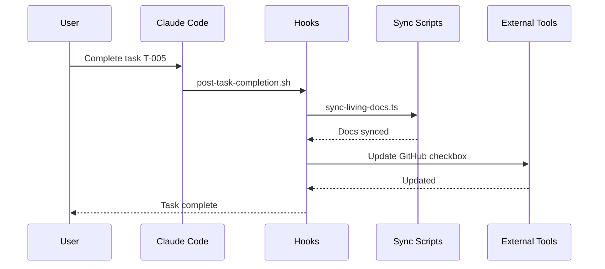

# Hooks

**Hooks** are automated scripts that execute at specific lifecycle events in SpecWeave. They enable automatic documentation sync, external tool updates, and workflow automation without manual intervention.

---

## How Hooks Work



---

## Available Hooks

| Hook | Event | Purpose |
|------|-------|---------|
| **post-increment-planning** | After `/sw:increment` | Auto-create GitHub issue, translate files |
| **post-task-completion** | After task marked complete | Sync living docs, update external tools |
| **post-increment-done** | After `/sw:done` | Close external issues, final sync |
| **pre-implementation** | Before `/sw:do` | Validate environment |

---

## Hook Location

```
plugins/specweave/hooks/
├── hooks.json                    # Hook registration
├── post-increment-planning.sh
├── post-task-completion.sh
├── post-increment-done.sh
├── pre-implementation.sh
└── lib/
    ├── sync-living-docs.ts
    └── translate-file.ts
```

---

## Configuration

Hooks are configured in `.specweave/config.json`:

```json
{
  "hooks": {
    "post_task_completion": {
      "sync_living_docs": true,
      "external_tracker_sync": true
    },
    "post_increment_planning": {
      "auto_create_github_issue": true
    },
    "post_increment_done": {
      "close_github_issue": true
    }
  }
}
```

---

## Hook Events

### Post-Task-Completion

Fires after every task is marked complete (via TodoWrite):

1. Wait for inactivity (15s debounce)
2. Sync living docs (increment → specs folder)
3. Update external tracker (GitHub/JIRA/ADO)
4. Update status line cache
5. Play completion sound

### Post-Increment-Planning

Fires after `/sw:increment` completes:

1. Translate files (if multilingual)
2. Check autoCreateIssue config
3. Create GitHub issue (if enabled)
4. Update metadata.json with issue URL

### Post-Increment-Done

Fires after `/sw:done` completes:

1. Final living docs sync
2. Close external issue (if linked)
3. Add completion comment
4. Archive increment

---

## Real-World Example

**Scenario**: You complete task T-005 (implementing JWT authentication)

**What happens**:

```
$ claude
> Complete task T-005: Implement JWT service

[Claude marks task complete in tasks.md]

┌─ Hook: post-task-completion ────────────────────────┐
│                                                     │
│ ⏳ Debouncing... (15s wait for more completions)    │
│                                                     │
│ 📚 Syncing living docs...                          │
│    → Copying spec.md to specs/backend/fs-042/      │
│    → Updating cross-links                          │
│    ✅ Living docs synced                           │
│                                                     │
│ 🔗 Syncing to GitHub Issue #42...                  │
│    → Updating checkbox: [x] T-005                  │
│    → Updating progress: 3/5 tasks (60%)            │
│    ✅ GitHub synced                                │
│                                                     │
│ 📊 Updating status cache...                        │
│    ✅ Cache updated                                │
│                                                     │
│ 🔔 Playing completion sound...                     │
│                                                     │
└─────────────────────────────────────────────────────┘

✅ Task T-005 complete!
```

---

## Troubleshooting

### Hooks Not Firing

1. **Check hook registration**:
   ```bash
   cat plugins/specweave/hooks/hooks.json
   ```

2. **Check config enabled**:
   ```json
   {
     "hooks": {
       "post_task_completion": {
         "sync_living_docs": true  // Must be true
       }
     }
   }
   ```

3. **Check for lock files**:
   ```bash
   ls -la .specweave/state/.hook-*
   # Remove stale locks: rm -f .specweave/state/.hook-*
   ```

4. **Check logs**:
   ```bash
   cat .specweave/logs/hooks.log
   ```

---

## Disabling Hooks

For emergency situations:

```bash
export SPECWEAVE_DISABLE_HOOKS=1
```

Or clear hook state:

```bash
rm -f .specweave/state/.hook-*
```

---

## Claude Code Hook Output Format

**CRITICAL**: Different hook events require different output formats!

### UserPromptSubmit / SessionStart

Use `additionalContext` to inject context into Claude:

```json
{
  "hookSpecificOutput": {
    "hookEventName": "UserPromptSubmit",
    "additionalContext": "Context to inject..."
  }
}
```

**Common Mistake**: Using `systemMessage` instead of `additionalContext` - this field does NOT exist for UserPromptSubmit hooks and will be silently ignored!

### PreToolUse (Guards/Validators)

Use `decision` to allow or block tool execution:

```json
{
  "decision": "allow",
  "reason": "Validation passed"
}
```

Or to block:

```json
{
  "decision": "block",
  "reason": "Dangerous operation detected"
}
```

### PostToolUse

Use `continue` to signal completion:

```json
{
  "continue": true
}
```

### Official Documentation

See [Claude Code Hooks Guide](https://docs.claude.com/en/docs/claude-code/hooks) for complete hook schema reference.

---

## Related Terms

- [Living Docs](/docs/glossary/terms/living-docs)
- [Increments](/docs/glossary/terms/increments)
- [Bidirectional Sync](/docs/glossary/terms/bidirectional-sync)
