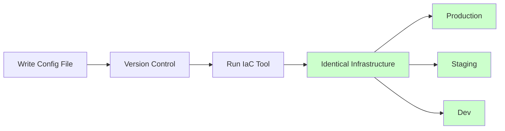
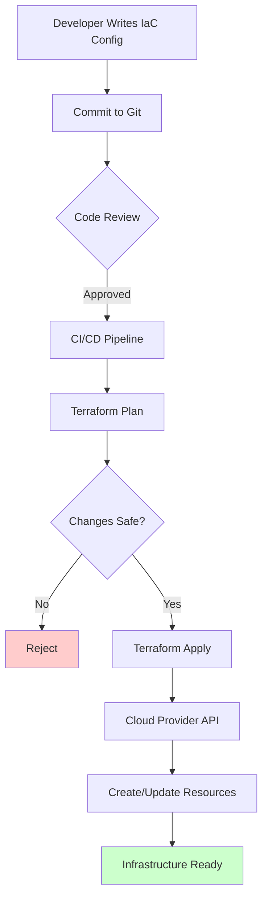
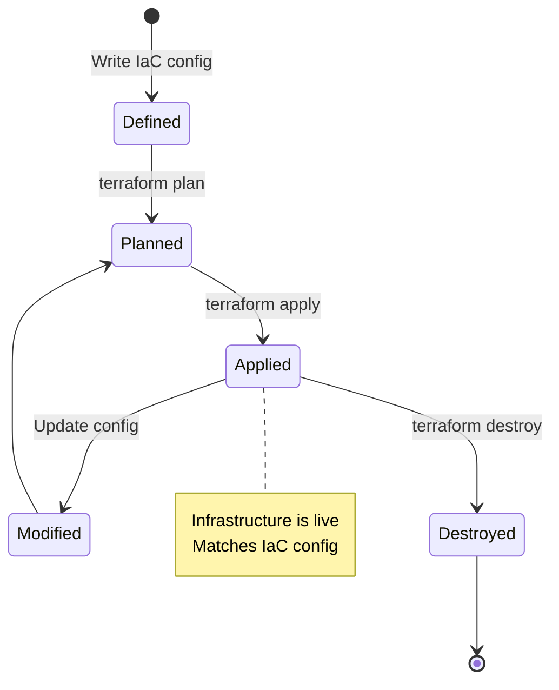

# IaC (Infrastructure as Code)

## Definition

**IaC (Infrastructure as Code)** is the practice of managing and provisioning infrastructure (servers, networks, databases) through machine-readable definition files rather than manual configuration or interactive tools.

Think of it as **"recipes for servers"** - instead of manually setting up each server (click here, configure there), you write a recipe that automatically creates identical servers every time.

## What Problem Does It Solve?

### The Problem: Manual Infrastructure Setup

**Traditional Way (Manual)**:

**Day 1**: DevOps engineer manually sets up production server:
- SSH into server → Install Node.js → Configure firewall → Set environment variables → Deploy app → 4 hours

**Day 30**: Need to create staging server with same setup:
- Try to remember all steps from Day 1 → Miss firewall rule → Staging behaves differently → 6 hours debugging

**Day 60**: Production server crashes, need to rebuild:
- "How was it configured again?" → Can't remember → Configuration drift → 8 hours of panic

### The IaC Solution



**With IaC**:
- ✅ Write infrastructure config once
- ✅ Apply to any environment (dev, staging, prod)
- ✅ Version controlled (git)
- ✅ Automated deployment (CI/CD)
- ✅ Self-documenting (code = documentation)

## How It Works

### IaC Workflow



### Infrastructure Lifecycle



## Real-World Examples

### Example 1: AWS Infrastructure with Terraform

**Create web server with database**:

```hcl
# main.tf (Terraform config)

# Provider configuration
provider "aws" {
  region = "us-east-1"
}

# VPC (Virtual Private Cloud)
resource "aws_vpc" "main" {
  cidr_block = "10.0.0.0/16"

  tags = {
    Name = "production-vpc"
  }
}

# Subnet for web servers
resource "aws_subnet" "public" {
  vpc_id            = aws_vpc.main.id
  cidr_block        = "10.0.1.0/24"
  availability_zone = "us-east-1a"

  tags = {
    Name = "public-subnet"
  }
}

# Security group (firewall rules)
resource "aws_security_group" "web" {
  name        = "web-server-sg"
  description = "Allow HTTP and HTTPS traffic"
  vpc_id      = aws_vpc.main.id

  ingress {
    from_port   = 80
    to_port     = 80
    protocol    = "tcp"
    cidr_blocks = ["0.0.0.0/0"]
  }

  ingress {
    from_port   = 443
    to_port     = 443
    protocol    = "tcp"
    cidr_blocks = ["0.0.0.0/0"]
  }

  egress {
    from_port   = 0
    to_port     = 0
    protocol    = "-1"
    cidr_blocks = ["0.0.0.0/0"]
  }
}

# EC2 instance (web server)
resource "aws_instance" "web" {
  ami           = "ami-0c55b159cbfafe1f0"  # Ubuntu 20.04
  instance_type = "t2.micro"
  subnet_id     = aws_subnet.public.id
  vpc_security_group_ids = [aws_security_group.web.id]

  user_data = <<-EOF
    #!/bin/bash
    apt-get update
    apt-get install -y nodejs npm
    npm install -g pm2
    # Deploy your app here
  EOF

  tags = {
    Name = "web-server"
  }
}

# RDS database
resource "aws_db_instance" "postgres" {
  identifier           = "production-db"
  engine               = "postgres"
  engine_version       = "13.7"
  instance_class       = "db.t3.micro"
  allocated_storage    = 20
  storage_encrypted    = true

  db_name  = "myapp"
  username = "admin"
  password = var.db_password  # From variables

  vpc_security_group_ids = [aws_security_group.db.id]
  db_subnet_group_name   = aws_db_subnet_group.main.name

  backup_retention_period = 7
  skip_final_snapshot     = false

  tags = {
    Name = "production-database"
  }
}

# Output values
output "web_server_ip" {
  value = aws_instance.web.public_ip
}

output "database_endpoint" {
  value = aws_db_instance.postgres.endpoint
}
```

**Deploy**:
```bash
# Initialize Terraform
terraform init

# Preview changes
terraform plan

# Apply changes (create infrastructure)
terraform apply

# Output:
# web_server_ip = 54.123.45.67
# database_endpoint = production-db.abc123.us-east-1.rds.amazonaws.com:5432
```

### Example 2: Kubernetes Deployment

**Deploy application to Kubernetes cluster**:

```yaml
# k8s/deployment.yaml
apiVersion: apps/v1
kind: Deployment
metadata:
  name: web-app
  labels:
    app: web-app
spec:
  replicas: 3  # Run 3 instances
  selector:
    matchLabels:
      app: web-app
  template:
    metadata:
      labels:
        app: web-app
    spec:
      containers:
      - name: web-app
        image: myapp:v1.0.0
        ports:
        - containerPort: 3000
        env:
        - name: DATABASE_URL
          valueFrom:
            secretKeyRef:
              name: db-credentials
              key: url
        resources:
          requests:
            memory: "64Mi"
            cpu: "250m"
          limits:
            memory: "128Mi"
            cpu: "500m"
---
# Service (load balancer)
apiVersion: v1
kind: Service
metadata:
  name: web-app-service
spec:
  type: LoadBalancer
  selector:
    app: web-app
  ports:
  - protocol: TCP
    port: 80
    targetPort: 3000
```

**Deploy**:
```bash
kubectl apply -f k8s/deployment.yaml

# Output:
# deployment.apps/web-app created
# service/web-app-service created
```

### Example 3: Docker Compose for Development

**Local development environment**:

```yaml
# docker-compose.yml
version: '3.8'

services:
  # Web application
  web:
    build: .
    ports:
      - "3000:3000"
    environment:
      NODE_ENV: development
      DATABASE_URL: postgres://user:pass@db:5432/myapp
      REDIS_URL: redis://redis:6379
    volumes:
      - .:/app
      - /app/node_modules
    depends_on:
      - db
      - redis

  # PostgreSQL database
  db:
    image: postgres:13
    environment:
      POSTGRES_USER: user
      POSTGRES_PASSWORD: pass
      POSTGRES_DB: myapp
    volumes:
      - postgres_data:/var/lib/postgresql/data
    ports:
      - "5432:5432"

  # Redis cache
  redis:
    image: redis:6
    ports:
      - "6379:6379"

  # Nginx reverse proxy
  nginx:
    image: nginx:alpine
    ports:
      - "80:80"
    volumes:
      - ./nginx.conf:/etc/nginx/nginx.conf
    depends_on:
      - web

volumes:
  postgres_data:
```

**Start**:
```bash
docker-compose up -d

# Output:
# Creating network "myapp_default"
# Creating myapp_db_1    ... done
# Creating myapp_redis_1 ... done
# Creating myapp_web_1   ... done
# Creating myapp_nginx_1 ... done
```

## How SpecWeave Uses IaC

### 1. Infrastructure Changes as Increments

**IaC changes are tracked like code changes**:

```
.specweave/increments/0015-kubernetes-migration/
├── spec.md                    # What infrastructure changes we need
├── plan.md                    # How we'll migrate
├── tasks.md                   # Steps to implement
├── infrastructure/            # ✅ IaC files go here
│   ├── terraform/
│   │   ├── main.tf
│   │   ├── variables.tf
│   │   └── outputs.tf
│   └── k8s/
│       ├── deployment.yaml
│       └── service.yaml
└── reports/
    └── COMPLETION-SUMMARY.md  # What was deployed
```

### 2. Documentation Integration

**Link infrastructure to architecture docs**:

```markdown
# .specweave/docs/internal/architecture/infrastructure.md

## Production Infrastructure

**Managed by**: Terraform (AWS)
**Location**: `.specweave/increments/0015-kubernetes-migration/infrastructure/terraform/`

**Resources**:
- VPC: 10.0.0.0/16
- EKS Cluster: production-k8s
- RDS: PostgreSQL 13.7
- ElastiCache: Redis 6.2

**Cost**: ~$500/month

**Last Updated**: 2025-10-15 (Increment 0015)
```

### 3. Environment Parity

**Same IaC config for all environments**:

```hcl
# terraform/main.tf
module "infrastructure" {
  source = "./modules/app-infrastructure"

  environment = var.environment  # dev, staging, prod
  instance_size = var.environment == "prod" ? "t3.large" : "t3.micro"
  db_backup_retention = var.environment == "prod" ? 30 : 7
}
```

**Deploy to multiple environments**:
```bash
# Development
terraform apply -var="environment=dev"

# Staging
terraform apply -var="environment=staging"

# Production (requires approval)
terraform apply -var="environment=prod"
```

### 4. SpecWeave Commands

```bash
# Plan infrastructure deployment
/specweave:do "T-003: Deploy Kubernetes cluster"

# Infrastructure tasks in tasks.md:
# - Write Terraform config
# - Run terraform plan (preview)
# - Review changes with team
# - Run terraform apply (deploy)
# - Verify infrastructure health
# - Update documentation
```

## Popular IaC Tools

### 1. Terraform (Most Popular)

**Multi-cloud provisioning**:

```hcl
provider "aws" {
  region = "us-east-1"
}

resource "aws_instance" "web" {
  ami           = "ami-0c55b159cbfafe1f0"
  instance_type = "t2.micro"
}
```

**Pros**:
- ✅ Multi-cloud (AWS, Azure, GCP, more)
- ✅ Declarative (describe desired state)
- ✅ Large ecosystem (modules, providers)
- ✅ State management (tracks resources)

**Cons**:
- ❌ Learning curve (HCL syntax)
- ❌ State file management complexity

**[Learn More: Terraform →](/docs/glossary/terms/terraform)**

### 2. CloudFormation (AWS Only)

**AWS-native IaC**:

```yaml
Resources:
  WebServer:
    Type: AWS::EC2::Instance
    Properties:
      ImageId: ami-0c55b159cbfafe1f0
      InstanceType: t2.micro
```

**Pros**:
- ✅ Native AWS support (no extra tools)
- ✅ Free (included with AWS)
- ✅ Deep AWS integration

**Cons**:
- ❌ AWS only (vendor lock-in)
- ❌ Verbose YAML syntax

### 3. Kubernetes (Container Orchestration)

**Deploy and manage containerized apps**:

```yaml
apiVersion: apps/v1
kind: Deployment
metadata:
  name: web-app
spec:
  replicas: 3
  template:
    spec:
      containers:
      - name: web
        image: myapp:v1.0.0
```

**Pros**:
- ✅ Industry standard for containers
- ✅ Self-healing (restarts failed containers)
- ✅ Auto-scaling
- ✅ Rolling updates (zero downtime)

**Cons**:
- ❌ Complex setup and learning curve
- ❌ Overkill for small projects

**[Learn More: Kubernetes →](/docs/glossary/terms/kubernetes)**

### 4. Ansible (Configuration Management)

**Configure servers after creation**:

```yaml
- name: Install and configure web server
  hosts: webservers
  tasks:
    - name: Install nginx
      apt:
        name: nginx
        state: present

    - name: Copy config file
      template:
        src: nginx.conf.j2
        dest: /etc/nginx/nginx.conf

    - name: Start nginx
      service:
        name: nginx
        state: started
```

**Pros**:
- ✅ Simple YAML syntax
- ✅ Agentless (SSH-based)
- ✅ Good for configuration management

**Cons**:
- ❌ Not ideal for provisioning (use Terraform)
- ❌ Limited state tracking

## Best Practices

### 1. Version Control Everything

**Treat IaC like application code**:

```bash
git add terraform/main.tf
git commit -m "feat: add production database"
git push origin feature/add-database
```

### 2. Use Variables for Environments

**Don't hardcode values**:

```hcl
❌ Bad: Hardcoded
resource "aws_instance" "web" {
  instance_type = "t2.large"  # Always t2.large
}

✅ Good: Variable
variable "instance_type" {
  type    = string
  default = "t2.micro"
}

resource "aws_instance" "web" {
  instance_type = var.instance_type
}
```

### 3. Review Changes Before Applying

**Always preview changes**:

```bash
# Terraform
terraform plan  # Shows what will change

# Kubernetes
kubectl diff -f deployment.yaml  # Shows differences

# CloudFormation
aws cloudformation create-change-set  # Preview changes
```

### 4. Use Modules for Reusability

**DRY principle for infrastructure**:

```hcl
# modules/web-server/main.tf
resource "aws_instance" "web" {
  ami           = var.ami
  instance_type = var.instance_type
  # ... more config
}

# main.tf (reuse module)
module "prod_web" {
  source        = "./modules/web-server"
  instance_type = "t3.large"
}

module "dev_web" {
  source        = "./modules/web-server"
  instance_type = "t3.micro"
}
```

### 5. Automate Deployments (CI/CD)

**Deploy via CI/CD pipeline**:

```yaml
# .github/workflows/deploy.yml
name: Deploy Infrastructure

on:
  push:
    branches: [main]

jobs:
  terraform:
    runs-on: ubuntu-latest
    steps:
      - uses: actions/checkout@v3
      - uses: hashicorp/setup-terraform@v2

      - name: Terraform Init
        run: terraform init

      - name: Terraform Plan
        run: terraform plan

      - name: Terraform Apply
        if: github.ref == 'refs/heads/main'
        run: terraform apply -auto-approve
```

## Common Mistakes

### ❌ Mistake 1: No State Management

**Problem**: Terraform doesn't know what resources exist.

**Solution**: Use remote state (S3, Terraform Cloud):

```hcl
terraform {
  backend "s3" {
    bucket = "my-terraform-state"
    key    = "prod/terraform.tfstate"
    region = "us-east-1"
  }
}
```

### ❌ Mistake 2: Hardcoded Secrets

**Problem**: Passwords in git = security breach.

```hcl
❌ Bad: Hardcoded password
resource "aws_db_instance" "db" {
  password = "MySecretPassword123"  # ❌ In git!
}

✅ Good: Environment variable
resource "aws_db_instance" "db" {
  password = var.db_password  # Passed via env var
}
```

### ❌ Mistake 3: No Resource Tagging

**Problem**: Can't track costs or ownership.

**Solution**: Tag everything:

```hcl
resource "aws_instance" "web" {
  ami           = "ami-0c55b159cbfafe1f0"
  instance_type = "t2.micro"

  tags = {
    Name        = "web-server"
    Environment = "production"
    Team        = "platform"
    CostCenter  = "engineering"
    ManagedBy   = "terraform"
  }
}
```

### ❌ Mistake 4: Manual Changes

**Problem**: Someone SSH'd into server and changed config → IaC out of sync.

**Solution**: Enforce "infrastructure = code" culture. All changes via IaC.

### ❌ Mistake 5: No Disaster Recovery Plan

**Problem**: Infrastructure deleted by mistake, no backup.

**Solution**:
- Enable backups (Terraform state, database snapshots)
- Test recovery process regularly
- Document recovery steps

## Related Terms

- **[Terraform](/docs/glossary/terms/terraform)** - Most popular IaC tool (multi-cloud)
- **[Kubernetes](/docs/glossary/terms/kubernetes)** - Container orchestration platform
- **[Docker](/docs/glossary/terms/docker)** - Container runtime (infrastructure for apps)
- **CI/CD** - Automate infrastructure deployment
- **[Cloud Computing](/docs/glossary/terms/cloud-computing)** - Where IaC manages resources
- **[DevOps](/docs/glossary/terms/devops)** - IaC is core DevOps practice

## Learn More

- **IaC Best Practices Guide** - Deep dive into IaC patterns
- **Terraform Tutorial** - Get started with Terraform
- **Kubernetes Guide** - Container orchestration

---

**Category**: Infrastructure & DevOps

**Tags**: `#iac` `#infrastructure` `#terraform` `#kubernetes` `#devops` `#automation`
