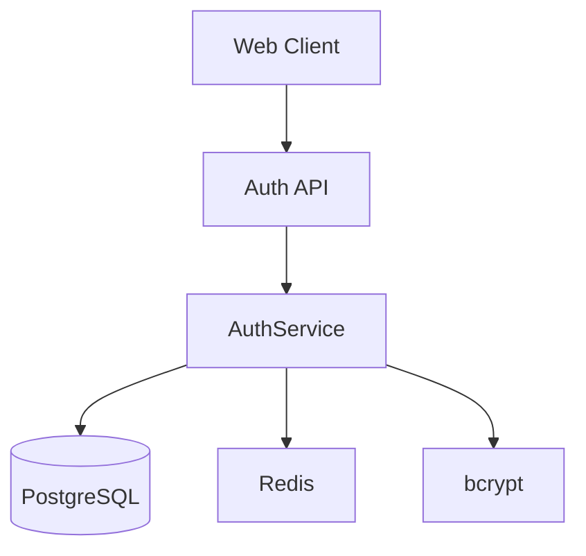
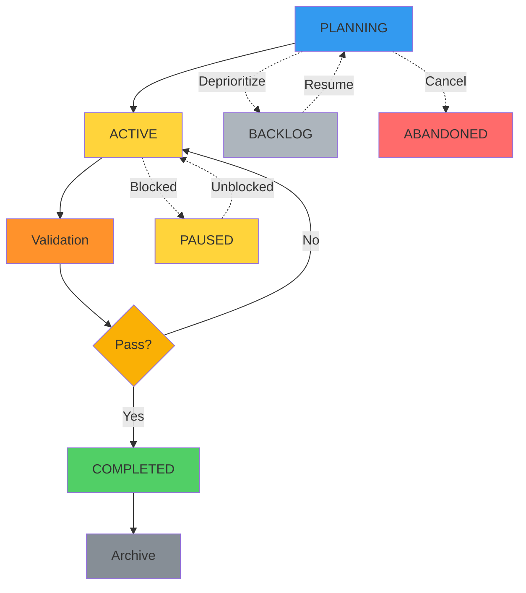
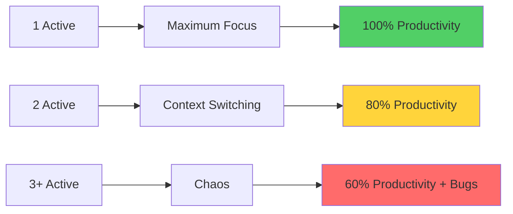

# Increments

**An Increment** is a focused unit of work in SpecWeave that represents a complete, shippable slice of functionality. Each increment contains a specification, implementation plan, and task checklist with embedded tests. Increments are the fundamental building block of SpecWeave's development workflow.

---

## What is an Increment?

An increment is a **time-boxed, goal-oriented work package** that:
- Implements 3-5 user stories (focused scope)
- Takes 1-3 weeks to complete (typical duration)
- Results in shippable functionality (production-ready)
- Has clear acceptance criteria (testable outcomes)
- Maintains living documentation (auto-synced)


**Status Phases**:
- **PLANNING** (Blue): Creating spec.md, plan.md, tasks.md
- **ACTIVE** (Yellow): Executing tasks, writing code
- **Validation** (Orange): Quality checks, testing
- **COMPLETED** (Green): Shipped to production

---

## Increment Structure

Each increment has **two required files** and one **optional file**:

```
.specweave/increments/0008-user-authentication/
├── spec.md                # WHAT: Requirements & acceptance criteria (REQUIRED)
├── plan.md                # HOW: Implementation approach & architecture (OPTIONAL)
└── tasks.md               # DO: Task checklist with embedded tests (REQUIRED)
```

> **When is plan.md needed?** Create `plan.md` for complex features with architectural decisions, multi-component design, or technology choices that need documentation. **Skip it** for bug fixes, simple migrations, hotfixes, and straightforward tasks where the spec already describes the approach.

### 1. spec.md - Requirements

**Purpose**: Define WHAT we're building

**Contents**:
- Quick overview (1-2 paragraphs)
- User stories (3-5 stories)
- Acceptance criteria (AC-IDs for traceability)
- Out of scope (what's NOT in this increment)
- Success criteria (how to measure success)
- Reference to living docs spec (permanent knowledge base)

**Example**:
```markdown
---
title: User Authentication
increment: 0008-user-authentication
status: planning
priority: P1
---

# Increment 0008: User Authentication

**Implements**: SPEC-001-authentication (US-001 to US-003 only)
**Complete Specification**: See ../../docs/internal/specs/spec-001-authentication.md

## Quick Overview

Implement basic authentication with email/password, session management,
and rate limiting. Supports OAuth 2.0 for future social login integration.

## User Stories

### US-001: Basic Login Flow
**As a** user
**I want** to log in with my email and password
**So that** I can access my personalized dashboard

**Acceptance Criteria**:
- [ ] **AC-US1-01**: User can log in with valid credentials (P1, testable)
- [ ] **AC-US1-02**: Invalid credentials show error message (P1, testable)
- [ ] **AC-US1-03**: 5 failed attempts lock account for 15 minutes (P2, testable)

### US-002: Session Management
(Similar format...)

### US-003: Rate Limiting
(Similar format...)

## Out of Scope (For This Increment)
- ❌ Social login (OAuth with Google/GitHub) → Increment 0009
- ❌ Two-factor authentication (2FA) → Increment 0010
- ❌ Password reset flow → Increment 0011

## Success Criteria
- ✅ All AC-IDs implemented and tested
- ✅ 85%+ test coverage
- ✅ Security audit passed
- ✅ Performance: &lt;200ms login latency
```

### 2. plan.md - Implementation Approach (OPTIONAL)

**Purpose**: Define HOW we'll build it (only for complex features)

**When to create plan.md:**
- Architecture decisions needed (JWT vs sessions, microservices vs monolith)
- Multi-component design (frontend + backend + infrastructure)
- Technology choices requiring documentation
- Complex integrations with external systems

**When to skip plan.md:**
- Bug fixes (the fix approach is straightforward)
- Simple migrations (mechanical find-replace patterns)
- Hotfixes (time-critical, approach emerges during fix)
- Features where spec.md already describes the approach

**Contents** (when used):
- Architecture overview (system design)
- Technical decisions (tech stack, libraries)
- Dependencies (what we need first)
- Risks (what might go wrong)
- Test strategy (coverage targets)
- Rollout plan (how to deploy)

**Example**:
```markdown
# Implementation Plan: User Authentication

## Architecture Overview



## Technical Decisions

### Tech Stack
- **Backend**: Node.js + Express
- **Database**: PostgreSQL (user credentials)
- **Cache**: Redis (rate limiting)
- **Hashing**: bcrypt (password security)
- **Tokens**: JWT (session tokens)

### Key Libraries
- `bcrypt`: Password hashing (OWASP recommended)
- `jsonwebtoken`: JWT generation/validation
- `express-rate-limit`: Rate limiting middleware
- `joi`: Request validation

## Dependencies
- T-001: Database schema (users table)
- T-002: Redis setup (rate limiting store)
- External: PostgreSQL 14+ and Redis 7+

## Risks & Mitigations
| Risk | Impact | Mitigation |
|------|--------|------------|
| bcrypt performance | High | Use async hashing, cache results |
| Rate limit bypass | Critical | Multiple layers (IP + user) |
| Session fixation | High | Rotate tokens on login |

## Test Strategy
- **Unit tests**: 90% coverage (AuthService, validators)
- **Integration tests**: 85% coverage (API endpoints)
- **E2E tests**: 100% critical path (login flow)
- **Security tests**: OWASP Top 10 scan

## Rollout Plan
1. Deploy to staging (1 day testing)
2. Canary deployment (10% traffic)
3. Monitor error rates (&lt;0.1%)
4. Full rollout (if canary succeeds)
```

### 3. tasks.md - Task Checklist

**Purpose**: Track what to DO (with embedded tests)

**Contents**:
- Frontmatter (increment ID, total tasks, test mode, coverage target)
- Task list (numbered T-001, T-002, etc.)
- Each task has:
  - AC-IDs (traceability)
  - Test plan (BDD format: Given/When/Then)
  - Test cases (unit/integration/E2E with file paths)
  - Coverage target (85-90%)
  - Implementation steps
  - Dependencies (what must complete first)

**Example**:
```markdown
---
increment: 0008-user-authentication
total_tasks: 5
test_mode: TDD
coverage_target: 85%
---

# Tasks for Increment 0008: User Authentication

## T-001: Implement Authentication Service

**AC**: AC-US1-01, AC-US1-02, AC-US1-03

**Test Plan** (BDD format):
- **Given** user with valid credentials → **When** login → **Then** receive JWT token

**Test Cases**:
- Unit (`auth.test.ts`): validLogin, invalidPassword, nonexistentUser, rateLimiting → 90% coverage
- Integration (`auth-flow.test.ts`): loginEndpoint, lockedAccount → 85% coverage
- **Overall: 87% coverage**

**Implementation**:
1. Create AuthService.ts class
2. Implement password hashing (bcrypt, salt rounds: 10)
3. Implement JWT generation (7-day expiry)
4. Implement rate limiting (Redis-backed)
5. Write unit tests (TDD: Red → Green → Refactor)
6. Write integration tests

**Dependencies**: None

**Status**: [ ] Pending

---

## T-002: Create Login API Endpoint

**AC**: AC-US1-01, AC-US1-02

**Test Plan** (BDD format):
- **Given** POST /api/auth/login → **When** valid credentials → **Then** 200 OK + JWT

**Test Cases**:
- Integration (`login-endpoint.test.ts`): successfulLogin, invalidCredentials, missingFields → 85% coverage
- E2E (`login-flow.spec.ts`): completeLoginFlow → 100% critical path
- **Overall: 88% coverage**

**Implementation**:
1. Create POST /api/auth/login route
2. Add request validation (joi schema)
3. Integrate AuthService
4. Add error handling
5. Write integration tests
6. Write E2E tests (Playwright)

**Dependencies**: T-001 (AuthService must exist)

**Status**: [ ] Pending

---

(T-003 through T-005 follow same format...)
```

---

## Increment Naming Convention

**Format**: `####-descriptive-kebab-case-name`

**Rules**:
- `####` = Zero-padded 4-digit number (0001, 0002, 0003, ...)
- `-descriptive-name` = Kebab-case description (lowercase, hyphens)
- Max 50 chars total (for readability)
- No special characters except hyphens

**Examples**:
- ✅ `0001-core-framework`
- ✅ `0008-user-authentication`
- ✅ `0015-intelligent-living-docs`
- ❌ `0003` (too generic, rejected)
- ❌ `0004_plugin_arch` (underscores not allowed)
- ❌ `New Feature` (spaces not allowed)

**Why Descriptive Names?**
- Clear intent at a glance
- Easy to reference ("the auth increment" vs "increment 8")
- Better git history
- Searchable by feature (`git log --grep="auth"`)

---

## Increment Types

SpecWeave supports **six increment types** for different work scenarios:

| Type | Description | Use When | Can Interrupt? | Auto-Abandon |
|------|-------------|----------|----------------|--------------|
| **feature** | Standard feature development | Adding new functionality | No | Never |
| **hotfix** | Critical production fixes | Production is broken | ✅ Yes | Never |
| **bug** | Production bug investigation | Bug requires root cause analysis | ✅ Yes | Never |
| **change-request** | Stakeholder requests | Business requirements change | No | Never |
| **refactor** | Code improvement | Technical debt, code quality | No | Never |
| **experiment** | POC/spike work | Exploring options, prototypes | No* | 14 days |

**Key Insights**:
- **Types are for tracking** (git log shows hotfixes vs features)
- **Required files**: spec.md, tasks.md for ALL types
- **Optional file**: plan.md (typically skipped for bug/hotfix types)
- **Experiments auto-abandon** after 14 days of inactivity (prevents stale POCs)

**Example: Bug Increment**

Even bug investigations need structured specs:

```markdown
# Increment 0012: Memory Leak Investigation (Bug)

## Quick Overview
Users report application memory growing from 200MB to 2GB after 4 hours of usage.

## Bug Description
**What**: Memory usage increases continuously
**When**: After ~4 hours of normal usage
**Impact**: Application crashes, 50+ user complaints

## Investigation Plan
1. Reproduce locally (heap snapshots)
2. Analyze heap growth (Chrome DevTools)
3. Identify leak source (event listeners? timers?)
4. Implement fix
5. Verify fix (24-hour load test)

## Acceptance Criteria
- [ ] **AC-BUG-01**: Memory stays &lt;300MB after 8 hours (P1, testable)
- [ ] **AC-BUG-02**: No crashes in 24-hour load test (P1, testable)
```

---

## Increment Lifecycle



**Status Flow**:
- **Solid lines**: Normal progression
- **Dotted lines**: State transitions (pause, resume, abandon)

**Status Definitions**:
| Status | Meaning | Counts Toward WIP? |
|--------|---------|-------------------|
| **PLANNING** | Creating spec/plan/tasks | ❌ No |
| **ACTIVE** | Executing tasks | ✅ Yes |
| **BACKLOG** | Not started yet | ❌ No |
| **PAUSED** | Temporarily blocked | ❌ No |
| **COMPLETED** | All tasks done | ❌ No |
| **ABANDONED** | Work cancelled | ❌ No |

### Phase 1: Planning (PLANNING Status)

**Command**: `/sw:increment "feature description"`

**What Happens**:
1. PM agent generates spec.md (user stories, AC)
2. Architect agent generates plan.md (architecture, tech decisions) — **optional**, use `/sw:plan` for complex features
3. Test-aware planner generates tasks.md (task checklist with tests)
4. Hooks fire (GitHub issue auto-created if configured)

**Output**: Complete increment ready for implementation

**Status Transition**: Automatically transitions from PLANNING → ACTIVE when tasks.md is created and first task starts.

### Phase 2: Implementation (ACTIVE Status)

**Command**: `/sw:do`

**What Happens**:
1. Smart resume (continues from last incomplete task)
2. Developer completes tasks (marks checkboxes)
3. Hooks fire after each task completion:
   - Living docs sync automatically
   - GitHub issue updated with progress
   - Status line cache updated

**Output**: All tasks completed

### Phase 3: Validation

**Command**: `/sw:validate 0008` or `/sw:qa 0008`

**What Happens**:
1. Rule-based validation:
   - All tasks marked complete?
   - All AC-IDs implemented?
   - Test coverage targets met?
   - Living docs synced?
2. AI quality assessment (optional):
   - Risk scoring (BMAD pattern)
   - Quality gate decision (PASS/CONCERNS/FAIL)

**Output**: Validation report

### Phase 4: Done

**Command**: `/sw:done 0008`

**What Happens**:
1. PM validation (checks all gates)
2. Completion report finalized
3. Living docs final sync
4. External trackers closed
5. Increment archived

**Output**: Increment closed, ready for next

---

## WIP Limits (Work In Progress)

**Default Rule**: **ONE active increment at a time**

**Why 1?** Research shows:
- 1 task = 100% productivity
- 2 tasks = 20% slower (context switching cost)
- 3+ tasks = 40% slower + more bugs



### Configuration

**Location**: `.specweave/config.json`

```json
{
  "limits": {
    "maxActiveIncrements": 1,  // Default: 1 active (focus)
    "hardCap": 2,               // Emergency ceiling (never exceeded)
    "allowEmergencyInterrupt": true, // hotfix/bug can interrupt
    "typeBehaviors": {
      "canInterrupt": ["hotfix", "bug"], // Emergency types
      "autoAbandonDays": {
        "experiment": 14  // Auto-abandon stale experiments
      }
    }
  }
}
```

### Enforcement

**Scenario 1: 0 Active** → Create new (no warnings)

```bash
/sw:increment "user authentication"
# ✅ Creates 0008-user-authentication (no conflict)
```

**Scenario 2: 1 Active** → Warn about context switching

```bash
# 0008-user-authentication is active
/sw:increment "dark mode"
# ⚠️  Warning: 1 increment already active (0008)
# 💡 Recommendation: Complete 0008 first
# ❓ Continue anyway? (y/N)
```

**Scenario 3: 2 Active** → HARD BLOCK

```bash
# 0008-user-authentication and 0009-dark-mode both active
/sw:increment "payment integration"
# ❌ BLOCKED! Hard cap reached (2 active)
# 💡 Must complete or pause one increment first
# Options: /sw:done 0008 OR /sw:pause 0009
```

**Exception: Emergency Interrupt**

```bash
# 0008-user-authentication is active
/sw:increment "SQL injection hotfix" --type hotfix
# ✅ Allowed! Hotfix can interrupt (emergency)
# ⚠️  Now 2 active (max reached)
```

---

## Increment Commands

### Primary Commands

| Command | Purpose | Example |
|---------|---------|---------|
| `/sw:increment` | Plan new increment | `/sw:increment "user auth"` |
| `/sw:do` | Execute tasks (smart resume) | `/sw:do` |
| `/sw:done` | Close increment | `/sw:done 0008` |
| `/sw:validate` | Validate increment | `/sw:validate 0008` |
| `/sw:qa` | Quality assessment | `/sw:qa 0008` |
| `/sw:progress` | Check current progress | `/sw:progress` |
| `/sw:status` | Show all increments | `/sw:status` |

### State Management

| Command | Purpose | Example |
|---------|---------|---------|
| `/sw:pause` | Pause active increment | `/sw:pause 0008 --reason="blocked"` |
| `/sw:resume` | Resume paused increment | `/sw:resume 0008` |
| `/sw:abandon` | Abandon increment | `/sw:abandon 0008 --reason="obsolete"` |

### Documentation

| Command | Purpose | Example |
|---------|---------|---------|
| `/sw:sync-docs` | Sync living docs | `/sw:sync-docs update` |
| `/sw:update-scope` | Log scope changes | `/sw:update-scope "Added dark mode"` |
| `/sw:check-tests` | Validate test coverage | `/sw:check-tests 0008` |

---

## Status Tracking

### Status Line (Fast Cache)

**Ultra-fast status display** (&lt;1ms)

```bash
# Shows current increment progress
[user-authentication] ████░░░░ 3/5 (60%) • T-004: Create login endpoint

# Near completion
[user-authentication] ███████░ 4/5 (80%) • T-005: Write documentation

# Complete
[user-authentication] ████████ 5/5 (100%) • Use /sw:done
```

**How It Works**:
1. Hook pre-computes cache (async, 10-50ms) - User doesn't wait
2. Status line reads cache (sync, &lt;1ms) - Ultra-fast display
3. mtime-based invalidation - Detects external edits

### Status Overview

```bash
/sw:status

# Output:
✅ 0001-core-framework (100% complete)
✅ 0007-smart-increment-discipline (100% complete)
⏳ 0008-user-authentication (60% complete) ← ACTIVE
📋 0009-dark-mode (paused)
❌ 0010-payment-integration (abandoned)
```

---

## Metadata Tracking

Each increment has optional metadata file:

**Location**: `.specweave/increments/0008-user-authentication/metadata.json`

```json
{
  "increment": "0008-user-authentication",
  "status": "active",
  "created": "2025-11-01T10:00:00Z",
  "updated": "2025-11-10T15:30:00Z",
  "github": {
    "issue": 30,
    "url": "https://github.com/owner/repo/issues/30",
    "lastSync": "2025-11-10T15:30:00Z"
  },
  "stats": {
    "totalTasks": 5,
    "completedTasks": 3,
    "percentage": 60
  }
}
```

**Valid Status Values**:
- `"planning"` - Planning phase (spec/plan/tasks creation)
- `"active"` - Active implementation
- `"backlog"` - Not started yet
- `"paused"` - Temporarily blocked
- `"completed"` - All tasks done
- `"abandoned"` - Work cancelled

---

## Increment Discipline: The Iron Rule

**⛔ THE IRON RULE: You CANNOT start increment N+1 until increment N is DONE**

### Why This Rule Exists

**The Problem**:
- Multiple incomplete increments (0002, 0003, 0006 all in progress)
- No clear source of truth ("which increment are we working on?")
- Living docs become stale
- Scope creep (jumping between features without finishing)

**The Solution**:
- ✅ Hard block on `/sw:increment` if previous incomplete
- ✅ Helper commands to close increments properly
- ✅ Force discipline = force quality

### Enforcement

**When you try to start a new increment**:

```bash
/sw:increment "new feature"

# If previous increments incomplete:
❌ Cannot create new increment!

Previous increments are incomplete:

📋 Increment 0002-core-enhancements
   Status: 73% complete (11/15 tasks)

📋 Increment 0003-intelligent-model-selection
   Status: 50% complete (11/22 tasks)

💡 What would you like to do?

1️⃣  Close incomplete increments: /sw:close
2️⃣  Check status: /sw:status
3️⃣  Force create (DANGEROUS): Add --force flag
```

### How to Resolve

**Option 1: Complete the Work** (Recommended)

```bash
/sw:do  # Continue working
# Once all tasks done, it's automatically complete
/sw:increment "new feature"  # ✅ Now works!
```

**Option 2: Close Interactively**

```bash
/sw:close

# You'll be asked to choose:
# - Force complete (mark all tasks done)
# - Move tasks to next increment (defer work)
# - Reduce scope (mark tasks as won't-do)
```

**Option 3: Force Create** (Emergency Only!)

```bash
/sw:increment "urgent-hotfix" --force
# This bypasses the check (USE SPARINGLY!)
```

---

## Increment Anti-Patterns

### 1. Scope Creep

```markdown
# ❌ Bad: Increment grows from 5 to 20 tasks
Initial: US-001, US-002, US-003 (5 tasks)
Week 2: Add US-004, US-005 (8 tasks)
Week 3: Add US-006, US-007, US-008 (15 tasks)
Week 4: Add more... (20 tasks)
Result: Never completes, 2 months in progress

# ✅ Good: Fixed scope, defer additions
Initial: US-001, US-002, US-003 (5 tasks)
Week 2: US-004 deferred → Increment 0009
Week 3: Complete original 5 tasks
Result: Increment done in 3 weeks
```

### 2. Multiple Active Increments

```bash
# ❌ Bad: Multiple increments active
0008-user-authentication (60% complete)
0009-dark-mode (30% complete)
0010-payment-integration (10% complete)
Result: Context switching, nothing ships

# ✅ Good: One active increment
0008-user-authentication (complete) ✅
0009-dark-mode (not started)
0010-payment-integration (not started)
Result: Focused work, regular shipping
```

### 3. Incomplete Documentation

```markdown
# ❌ Bad: Missing sections
spec.md: Only 2 user stories (should be 5)
plan.md: Missing test strategy
tasks.md: No test cases

# ✅ Good: Complete documentation
spec.md: All 5 user stories with AC-IDs
plan.md: Architecture + test strategy + risks
tasks.md: All tasks with embedded tests
```

---

## Related Terms

- [Living Docs](/docs/glossary/terms/living-docs) - Auto-synced documentation
- [Specs](/docs/glossary/terms/specs) - Specifications (permanent knowledge base)
- [User Stories](/docs/glossary/terms/user-stories) - User story format
- [Acceptance Criteria](/docs/glossary/terms/acceptance-criteria) - AC format
- [AC-ID](/docs/glossary/terms/ac-id) - Acceptance criteria identifiers
- [WIP Limits](/docs/glossary/terms/wip-limits) - Work in progress limits
- [TDD](/docs/glossary/terms/tdd) - Test-driven development
- [Source of Truth](/docs/glossary/terms/source-of-truth) - Single source of truth

---

## Summary

**Increments** are the fundamental building block of SpecWeave:
- **Required files**: spec.md (WHAT), tasks.md (DO)
- **Optional file**: plan.md (HOW) — only for complex features with architecture decisions
- **Naming**: `####-descriptive-name` (e.g., 0008-user-authentication)
- **Types**: feature, hotfix, bug, change-request, refactor, experiment
- **WIP Limit**: 1 active (focus), 2 max (emergency)
- **Lifecycle**: Planning → Implementation → Validation → Done

**Key Insight**: One increment at a time = maximum focus = maximum productivity.
