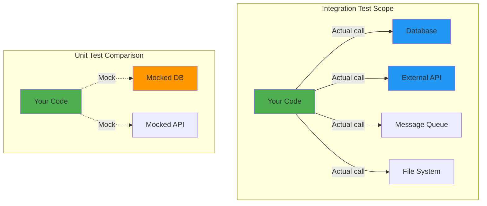
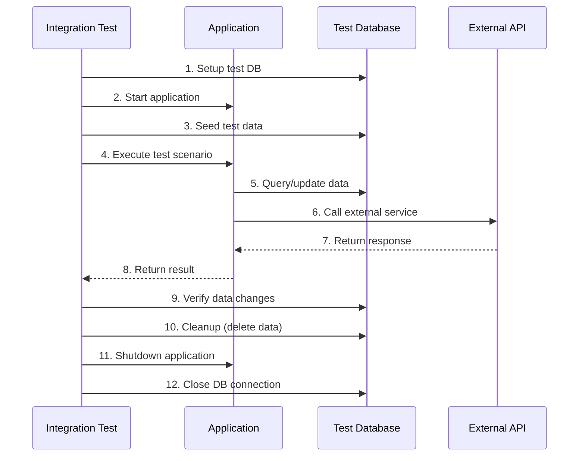

# Integration Testing

**Integration Testing** validates that different components or systems work correctly **together**. Unlike unit tests that isolate individual functions, integration tests verify the **interactions** between multiple units, services, or external systems.

---

## What is Integration Testing?

Integration tests verify the **integration points** between components:

- **Service + Database**: Does the repository correctly save/retrieve data?
- **API + Authentication**: Does the endpoint correctly validate JWT tokens?
- **Service + External API**: Does the payment service correctly call Stripe?
- **Component + Component**: Does UserService correctly call EmailService?

### Integration Test Scope



---

## Integration vs Unit Testing

| Aspect | Unit Testing | Integration Testing |
|--------|-------------|-------------------|
| **Scope** | Single function/class | Multiple components |
| **Dependencies** | Mocked/stubbed | Real (or test doubles) |
| **Speed** | Fast (milliseconds) | Slower (seconds) |
| **Environment** | In-memory | Requires infrastructure |
| **Isolation** | Complete | Partial |
| **Purpose** | Verify logic correctness | Verify integration works |
| **Example** | `calculateDiscount()` | API endpoint + database |

---

## Types of Integration Tests

### 1. Service Integration Tests

Test service interactions with infrastructure:

```typescript
// tests/integration/services/user-service.test.ts
import { UserService } from '../../../src/services/UserService';
import { setupTestDatabase } from '../../helpers/db';

describe('UserService Integration Tests', () => {
  let userService: UserService;
  let db: Database;

  beforeAll(async () => {
    // Setup: Real test database (not mocked!)
    db = await setupTestDatabase();
    userService = new UserService(db);
  });

  afterAll(async () => {
    // Cleanup: Close database connection
    await db.close();
  });

  afterEach(async () => {
    // Clear data between tests
    await db.users.deleteMany({});
  });

  test('should create user and retrieve by ID', async () => {
    // Integration: UserService + Database
    const user = await userService.create({
      email: 'user@example.com',
      name: 'Test User'
    });

    expect(user.id).toBeDefined();

    // Verify data persisted in real database
    const retrieved = await userService.findById(user.id);
    expect(retrieved.email).toBe('user@example.com');
    expect(retrieved.name).toBe('Test User');
  });

  test('should enforce unique email constraint', async () => {
    await userService.create({ email: 'user@example.com', name: 'User 1' });

    // Database constraint should prevent duplicate
    await expect(
      userService.create({ email: 'user@example.com', name: 'User 2' })
    ).rejects.toThrow('Email already exists');
  });
});
```

### 2. API Integration Tests

Test HTTP endpoints with real database:

```typescript
// tests/integration/api/auth.test.ts
import request from 'supertest';
import { app } from '../../../src/app';
import { setupTestDatabase } from '../../helpers/db';

describe('POST /api/auth/register', () => {
  let db: Database;

  beforeAll(async () => {
    db = await setupTestDatabase();
  });

  afterAll(async () => {
    await db.close();
  });

  test('should register new user and return JWT', async () => {
    // Integration: API + AuthService + Database
    const response = await request(app)
      .post('/api/auth/register')
      .send({
        email: 'user@example.com',
        password: 'SecurePass123',
        name: 'Test User'
      })
      .expect(201);

    // Verify response
    expect(response.body.user.email).toBe('user@example.com');
    expect(response.body.token).toMatch(/^eyJ/); // JWT format

    // Verify user persisted in database
    const user = await db.users.findOne({ email: 'user@example.com' });
    expect(user).toBeDefined();
    expect(user.password).not.toBe('SecurePass123'); // Hashed
  });

  test('should validate required fields', async () => {
    const response = await request(app)
      .post('/api/auth/register')
      .send({ email: 'user@example.com' }) // Missing password
      .expect(400);

    expect(response.body.error).toContain('password is required');
  });
});
```

### 3. External Service Integration Tests

Test integration with third-party APIs:

```typescript
// tests/integration/services/payment-service.test.ts
import { PaymentService } from '../../../src/services/PaymentService';
import Stripe from 'stripe';

describe('PaymentService Integration Tests', () => {
  let paymentService: PaymentService;
  let stripe: Stripe;

  beforeAll(() => {
    // Use Stripe test API key
    stripe = new Stripe(process.env.STRIPE_TEST_KEY, { apiVersion: '2023-10-16' });
    paymentService = new PaymentService(stripe);
  });

  test('should create payment intent with Stripe', async () => {
    // Integration: PaymentService + Stripe API
    const intent = await paymentService.createPayment({
      amount: 1000, // $10.00
      currency: 'usd',
      customerId: 'cus_test123'
    });

    // Verify Stripe API response
    expect(intent.id).toMatch(/^pi_/); // Payment intent ID
    expect(intent.amount).toBe(1000);
    expect(intent.status).toBe('requires_payment_method');
  });

  test('should handle invalid customer ID', async () => {
    await expect(
      paymentService.createPayment({
        amount: 1000,
        currency: 'usd',
        customerId: 'invalid_customer'
      })
    ).rejects.toThrow('No such customer');
  });
});
```

### 4. Message Queue Integration Tests

Test async communication between services:

```typescript
// tests/integration/messaging/order-processing.test.ts
import { OrderService } from '../../../src/services/OrderService';
import { EmailService } from '../../../src/services/EmailService';
import { setupRabbitMQ } from '../../helpers/rabbitmq';

describe('Order Processing Integration', () => {
  let orderService: OrderService;
  let emailService: EmailService;
  let rabbitMQ: RabbitMQConnection;

  beforeAll(async () => {
    rabbitMQ = await setupRabbitMQ();
    orderService = new OrderService(rabbitMQ);
    emailService = new EmailService(rabbitMQ);
  });

  test('should send order confirmation email after order created', async (done) => {
    // Setup: Listen for email sent event
    emailService.onEmailSent((email) => {
      expect(email.to).toBe('customer@example.com');
      expect(email.subject).toContain('Order Confirmation');
      done();
    });

    // Act: Create order (triggers message queue event)
    await orderService.createOrder({
      customerId: 'cust_123',
      customerEmail: 'customer@example.com',
      items: [{ productId: 'prod_1', quantity: 2 }]
    });

    // Message queue integration will trigger email service
  }, 10000); // 10s timeout for async processing
});
```

---

## Integration Testing in SpecWeave

SpecWeave embeds integration test strategy in `tasks.md`:

### Example Task with Integration Tests

```markdown
## T-002: Implement User Authentication API

**AC**: AC-US1-01 (API endpoints for login/register)

**Test Plan** (BDD format):
- **Given** valid credentials → **When** POST /api/auth/login → **Then** return JWT + 200
- **Given** invalid credentials → **When** POST /api/auth/login → **Then** return error + 401
- **Given** duplicate email → **When** POST /api/auth/register → **Then** return error + 409

**Test Cases**:
- Unit (`auth-controller.test.ts`): Input validation, error handling → 90% coverage
- **Integration** (`auth-api.test.ts`):
  - POST /api/auth/register: Creates user in DB, returns JWT → 85% coverage
  - POST /api/auth/login: Validates credentials against DB, returns JWT → 85% coverage
  - Database constraints: Unique email, password hashing verified → 85% coverage
- E2E (`login-flow.spec.ts`): Complete login flow in browser → 100% critical path

**Implementation**: AuthController.ts, routes, middleware, validation

**Overall Coverage**: 87%

**Dependencies**: T-001 (AuthService must be implemented first)
```

---

## Integration Testing Patterns

### Test Containers (Docker)

Use Docker containers for realistic test environments:

```typescript
// tests/helpers/db.ts
import { MongoMemoryServer } from 'mongodb-memory-server';
import mongoose from 'mongoose';

export async function setupTestDatabase(): Promise<Database> {
  // Start in-memory MongoDB for testing
  const mongoServer = await MongoMemoryServer.create();
  const uri = mongoServer.getUri();

  await mongoose.connect(uri);

  return {
    connection: mongoose.connection,
    close: async () => {
      await mongoose.disconnect();
      await mongoServer.stop();
    }
  };
}
```

**Benefits**:
- Real database (not mocked)
- Isolated per test run
- Fast startup (in-memory)
- No test pollution

### Test Data Builders

Create realistic test data easily:

```typescript
// tests/builders/user-builder.ts
export class UserBuilder {
  private user = {
    email: 'test@example.com',
    name: 'Test User',
    role: 'user'
  };

  withEmail(email: string): this {
    this.user.email = email;
    return this;
  }

  withRole(role: string): this {
    this.user.role = role;
    return this;
  }

  async create(db: Database): Promise<User> {
    return db.users.create(this.user);
  }
}

// Usage in tests
test('admin can delete any user', async () => {
  const admin = await new UserBuilder()
    .withEmail('admin@example.com')
    .withRole('admin')
    .create(db);

  const regularUser = await new UserBuilder()
    .withEmail('user@example.com')
    .create(db);

  await expect(
    userService.deleteUser(regularUser.id, admin.id)
  ).resolves.toBe(true);
});
```

### Fixture Management

Load consistent test data:

```typescript
// tests/fixtures/users.json
[
  {
    "email": "admin@example.com",
    "name": "Admin User",
    "role": "admin"
  },
  {
    "email": "user@example.com",
    "name": "Regular User",
    "role": "user"
  }
]

// tests/helpers/fixtures.ts
export async function loadFixtures(db: Database) {
  const users = require('../fixtures/users.json');
  await db.users.insertMany(users);
}

// Usage
beforeEach(async () => {
  await loadFixtures(db);
});
```

---

## Integration Test Setup Diagram



---

## Best Practices

### 1. Isolate Test Data

Each test should have its own data:

```typescript
describe('User management', () => {
  beforeEach(async () => {
    // Clear data before each test
    await db.users.deleteMany({});
  });

  test('should create user', async () => {
    const user = await userService.create({ email: 'user1@example.com' });
    expect(user.id).toBeDefined();
  });

  test('should update user', async () => {
    const user = await userService.create({ email: 'user2@example.com' });
    await userService.update(user.id, { name: 'Updated' });
    // Test has its own isolated data
  });
});
```

### 2. Use Realistic Test Data

```typescript
// ❌ Bad: Unrealistic test data
test('should validate email', async () => {
  const user = await userService.create({ email: 'x', name: 'x' });
});

// ✅ Good: Realistic test data
test('should validate email', async () => {
  const user = await userService.create({
    email: 'user@example.com',
    name: 'John Doe',
    password: 'SecurePass123'
  });
});
```

### 3. Test Error Paths

```typescript
test('should rollback transaction on error', async () => {
  const orderId = await orderService.createOrder({
    items: [{ productId: 'prod_1', quantity: 1 }]
  });

  // Simulate error during payment processing
  await expect(
    orderService.processPayment(orderId, { cardToken: 'invalid' })
  ).rejects.toThrow('Payment failed');

  // Verify order status rolled back
  const order = await orderService.findById(orderId);
  expect(order.status).toBe('pending');
  expect(order.paymentStatus).toBe('failed');
});
```

### 4. Minimize External Dependencies

```typescript
// For external APIs, use test endpoints or mocking
const stripe = new Stripe(
  process.env.NODE_ENV === 'test'
    ? 'sk_test_xxx' // Stripe test key
    : 'sk_live_xxx' // Production key
);
```

---

## Integration Testing Anti-Patterns

### 1. Testing Too Much

```typescript
// ❌ Bad: Integration test doing unit test work
test('should calculate discount correctly', async () => {
  const order = await orderService.createOrder({ items: [...] });
  const discount = orderService.calculateDiscount(order);
  expect(discount).toBe(10); // This should be unit test!
});

// ✅ Good: Focus on integration
test('should apply discount and update order total in DB', async () => {
  const order = await orderService.createOrder({ items: [...] });
  await orderService.applyDiscount(order.id, 'SAVE10');

  // Verify integration: Service + Database
  const updated = await orderService.findById(order.id);
  expect(updated.total).toBeLessThan(order.total);
});
```

### 2. Shared Test State

```typescript
// ❌ Bad: Tests share data
let testUser;

beforeAll(async () => {
  testUser = await userService.create({ email: 'shared@example.com' });
});

test('should update user', async () => {
  await userService.update(testUser.id, { name: 'Updated' });
  // testUser is modified for next test!
});

// ✅ Good: Isolated data
beforeEach(async () => {
  await db.users.deleteMany({});
});

test('should update user', async () => {
  const user = await userService.create({ email: 'test@example.com' });
  await userService.update(user.id, { name: 'Updated' });
  // Each test has clean slate
});
```

---

## Integration vs E2E Testing

| Aspect | Integration Testing | E2E Testing |
|--------|-------------------|-------------|
| **Scope** | Component interactions | Complete user flow |
| **UI** | No browser | Real browser (Playwright) |
| **Speed** | Seconds | Minutes |
| **Example** | API + Database | Login → Dashboard → Logout |
| **Failures** | Precise (which integration) | Vague (somewhere in flow) |
| **Maintenance** | Lower | Higher (UI changes) |

---

## Related Terms

- [Unit Testing](/docs/glossary/terms/unit-testing) - Testing individual functions
- E2E Testing - Testing complete user flows
- [Test Pyramid](/docs/glossary/terms/test-pyramid) - Testing strategy distribution
- Mocking - Replacing dependencies

---

## Summary

**Integration testing validates component interactions**:
- **Service + Database**: Real database queries
- **API + Service**: HTTP endpoints with dependencies
- **Service + External API**: Third-party integrations
- **Message Queue**: Async communication

**SpecWeave integration testing**:
- Embedded in `tasks.md` with 80-85% coverage targets
- BDD format (Given-When-Then) for clarity
- Focuses on integration points, not individual logic
- Part of Test Pyramid (20% of total tests)

**Key insight**: Integration tests verify that **pieces work together**, not that individual pieces work correctly (that's unit tests).
