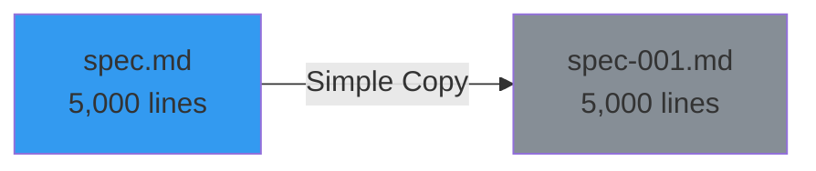
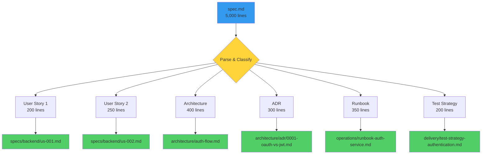
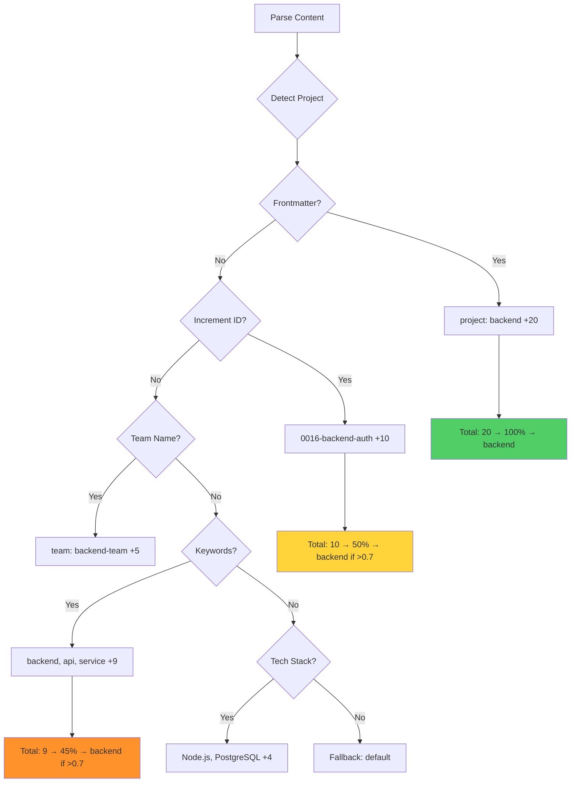
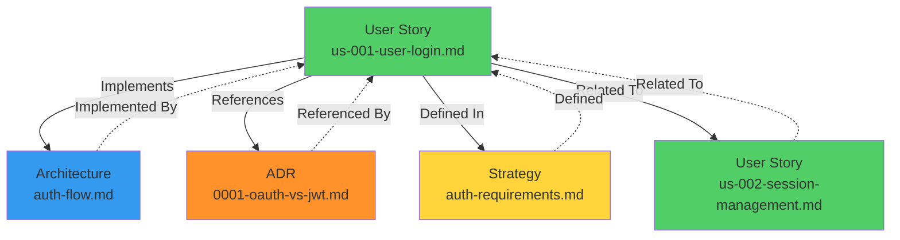

# Intelligent Living Docs Sync

**Intelligent Living Docs Sync** is SpecWeave's advanced synchronization system that automatically parses, classifies, and distributes increment specifications into organized, cross-linked documentation. Unlike simple mode (one file → one file), intelligent mode uses a 9-category classification system with project detection, Docusaurus frontmatter generation, and automatic cross-linking.

---

## The Problem with Simple Mode

Traditional living docs sync copies entire spec files:



**Problems**:
- ❌ **Giant files** (5,000+ lines, hard to navigate)
- ❌ **Mixed content** (user stories + architecture + ADRs + runbooks all together)
- ❌ **No organization** (everything in one folder)
- ❌ **Manual frontmatter** (Docusaurus metadata added manually)
- ❌ **No cross-links** (related docs not connected)
- ❌ **Single project** (can't separate backend/frontend/mobile)

---

## Intelligent Mode: The Solution

**Automatic classification and distribution**:



**Benefits**:
- ✅ **Organized files** (200-500 lines each, easy to navigate)
- ✅ **9-category classification** (user stories, NFRs, architecture, ADRs, operations, delivery, strategy, governance, overview)
- ✅ **Project detection** (backend/frontend/mobile auto-detected)
- ✅ **Auto-generated frontmatter** (Docusaurus ready out-of-the-box)
- ✅ **Automatic cross-linking** (related docs connected)
- ✅ **Multi-project support** (separate docs for backend/frontend)

---

## Simple Mode vs Intelligent Mode

| Aspect | Simple Mode | Intelligent Mode |
|--------|-------------|------------------|
| **Output** | One file (spec-001.md) | Multiple files (9 categories) |
| **File Size** | 5,000+ lines | 200-500 lines per file |
| **Classification** | None | 9-category system |
| **Project Detection** | None | Auto-detects (backend/frontend) |
| **Organization** | Flat (one folder) | Hierarchical (specs/, architecture/, operations/) |
| **Cross-Linking** | Manual | Automatic |
| **Docusaurus** | Manual frontmatter | Auto-generated |
| **LLM Context** | Generic | Rich (project, category, tags) |
| **Use Case** | Single project, simple workflow | Multi-project, enterprise |

---

## 9-Category Classification System

Intelligent sync classifies content into **nine categories**:

```mermaid
graph TB
    A{Parse Section} --> B{Detect Pattern}

    B -->|US-XXX| C1[User Story]
    B -->|NFR-XXX| C2[NFR]
    B -->|Architecture| C3[Architecture]
    B -->|ADR-XXX| C4[ADR]
    B -->|Operations| C5[Operations]
    B -->|Delivery| C6[Delivery]
    B -->|Strategy| C7[Strategy]
    B -->|Governance| C8[Governance]
    B -->|Overview| C9[Overview]

    C1 --> D1[specs/{project}/]
    C2 --> D2[specs/{project}/nfr/]
    C3 --> D3[architecture/]
    C4 --> D4[architecture/adr/]
    C5 --> D5[operations/]
    C6 --> D6[delivery/]
    C7 --> D7[strategy/]
    C8 --> D8[governance/]
    C9 --> D9[specs/{project}/]

    style B fill:#ffd43b
    style C1 fill:#51cf66
    style C4 fill:#ff922b
    style C5 fill:#ff6b6b
```

### Category Details

| Category | Detects | Pattern | Goes To | Confidence |
|----------|---------|---------|---------|------------|
| **User Story** | US-XXX, "As a" format, AC | `US-\d+`, `As a .*I want` | `specs/{project}/` | 0.9 |
| **NFR** | NFR-XXX, metrics, SLAs | `NFR-\d+`, `performance`, `scalability` | `specs/{project}/nfr/` | 0.8 |
| **Architecture** | HLD, LLD, diagrams | `architecture`, `mermaid`, `C4` | `architecture/` | 0.7 |
| **ADR** | ADR-XXX, decision format | `ADR-\d+`, `## Context`, `## Decision` | `architecture/adr/` | 0.9 |
| **Operations** | Runbooks, SLOs, incidents | `runbook`, `SLO`, `incident`, `postmortem` | `operations/` | 0.8 |
| **Delivery** | Test strategy, CI/CD, releases | `test strategy`, `pipeline`, `deployment` | `delivery/` | 0.7 |
| **Strategy** | PRDs, business requirements | `PRD`, `business`, `vision`, `objectives` | `strategy/` | 0.7 |
| **Governance** | Security, compliance, policies | `security`, `GDPR`, `HIPAA`, `policy` | `governance/` | 0.8 |
| **Overview** | Summaries, quick start | `overview`, `summary`, `quick start` | `specs/{project}/` | 0.6 |

### Classification Logic

```typescript
// Pseudocode for classification
function classifySection(section: Section): Category {
  let scores = {
    userStory: 0,
    nfr: 0,
    architecture: 0,
    adr: 0,
    operations: 0,
    delivery: 0,
    strategy: 0,
    governance: 0,
    overview: 0
  };

  // Pattern matching
  if (section.heading.match(/US-\d+/)) scores.userStory += 0.5;
  if (section.content.match(/As a .* I want/)) scores.userStory += 0.4;
  if (section.content.match(/ADR-\d+/)) scores.adr += 0.5;
  if (section.content.match(/## Context|## Decision/)) scores.adr += 0.4;

  // Keyword matching
  if (section.content.includes('runbook')) scores.operations += 0.3;
  if (section.content.includes('test strategy')) scores.delivery += 0.3;
  if (section.content.includes('architecture')) scores.architecture += 0.3;

  // Return highest score
  return Object.keys(scores).reduce((a, b) =>
    scores[a] > scores[b] ? a : b
  );
}
```

### Example: Classifying a Spec Section

**Input**:
```markdown
### US-001: User Login

**As a** user
**I want** to log in with my email and password
**So that** I can access my personalized dashboard

**Acceptance Criteria**:
- [ ] AC-US1-01: User can log in with valid credentials (P1, testable)
- [ ] AC-US1-02: Invalid credentials show error message (P1, testable)
```

**Classification**:
- Pattern: `US-001` → +0.5 (userStory)
- Pattern: `As a .* I want` → +0.4 (userStory)
- Keyword: `Acceptance Criteria` → +0.2 (userStory)
- **Total**: 1.1 (userStory)
- **Confidence**: 0.9 (high)
- **Category**: User Story
- **Output Path**: `specs/backend/us-001-user-login.md`

---

## Project Detection (Multi-Project Support)

Intelligent sync auto-detects which project (backend/frontend/mobile) content belongs to:



### Detection Signals

| Signal | Score | Example | Confidence |
|--------|-------|---------|------------|
| **Frontmatter** | +20 | `project: backend` | Highest (1.0) |
| **Increment ID** | +10 | `0016-backend-auth` | High (0.8) |
| **Team Name** | +5 | `team: backend-team` | Medium (0.6) |
| **Keywords** | +3 each | `backend`, `api`, `service` | Low (0.3 each) |
| **Tech Stack** | +2 each | `Node.js`, `PostgreSQL` | Low (0.2 each) |

**Auto-Select Threshold**: 0.7 (70% confidence)

### Example: Detecting Backend Project

**Input**:
```yaml
---
title: User Authentication
project: backend    # ← Explicit (+20 points)
---

# User Authentication

Implement OAuth for **backend services** using Node.js and PostgreSQL...
# Keywords: backend (+3), service (+3), Node.js (+2), PostgreSQL (+2) = +10
```

**Detection**:
- Frontmatter: `project: backend` → +20 (explicit, 100% confidence)
- Keywords: `backend` → +3
- Keywords: `service` → +3
- Tech Stack: `Node.js` → +2
- Tech Stack: `PostgreSQL` → +2
- **Total**: 30 points
- **Confidence**: 1.0 (100%)
- **Project**: `backend`
- **Output Path**: `specs/backend/`

### Multi-Project Configuration

**Location**: `.specweave/config.json`

```json
{
  "multiProject": {
    "projects": {
      "backend": {
        "name": "Backend Services",
        "keywords": ["api", "backend", "service", "server"],
        "techStack": ["Node.js", "PostgreSQL", "Redis"],
        "team": "Backend Team",
        "specsFolder": ".specweave/docs/internal/specs/backend"
      },
      "frontend": {
        "name": "Frontend App",
        "keywords": ["ui", "frontend", "react", "component"],
        "techStack": ["React", "Next.js", "TypeScript"],
        "team": "Frontend Team",
        "specsFolder": ".specweave/docs/internal/specs/frontend"
      },
      "mobile": {
        "name": "Mobile Application",
        "keywords": ["mobile", "ios", "android", "app"],
        "techStack": ["React Native", "Swift", "Kotlin"],
        "team": "Mobile Team",
        "specsFolder": ".specweave/docs/internal/specs/mobile"
      }
    }
  }
}
```

---

## Docusaurus Frontmatter (Auto-Generated)

Every distributed file gets **rich YAML frontmatter** for Docusaurus and LLM context:

```yaml
---
id: us-001-user-login
title: "US-001: User Login"
sidebar_label: "User Login"
description: "User can log in with email and password"
tags: ["user-story", "backend", "authentication", "P1"]
increment: "0016-authentication"
project: "backend"                    # ← LLM knows which project
category: "user-story"                # ← LLM knows document type
last_updated: "2025-11-10"
status: "planning"
priority: "P1"
author: "anton-abyzov"
related:
  - us-002-session-management
  - architecture/auth-flow
  - architecture/adr/0001-oauth-vs-jwt
---
```

### Frontmatter Fields

| Field | Source | Purpose | Example |
|-------|--------|---------|---------|
| **id** | Section heading | Docusaurus ID | `us-001-user-login` |
| **title** | Section heading | Page title | `"US-001: User Login"` |
| **sidebar_label** | Short form | Sidebar display | `"User Login"` |
| **description** | First paragraph | SEO, search | `"User can log in..."` |
| **tags** | Classification + project | Search, filtering | `["user-story", "backend"]` |
| **increment** | Increment ID | Traceability | `"0016-authentication"` |
| **project** | Project detection | Multi-project | `"backend"` |
| **category** | Classification | Document type | `"user-story"` |
| **last_updated** | Current date | Freshness | `"2025-11-10"` |
| **status** | Increment status | Workflow | `"planning"`, `"implementation"` |
| **priority** | AC priority | Importance | `"P1"`, `"P2"` |
| **related** | Cross-linking | Navigation | `["us-002-session-management"]` |

### Benefits of Rich Frontmatter

**1. LLM Context**:
```bash
# LLM reads frontmatter:
project: "backend"         # ← Knows this is backend doc
category: "user-story"     # ← Knows this is a user story
tags: ["authentication"]   # ← Knows this is about auth

# LLM can now:
# - Answer: "Show me all backend user stories"
# - Answer: "What authentication features exist?"
# - Navigate: "Find related ADRs for this user story"
```

**2. Docusaurus Ready**:
```bash
# No manual frontmatter needed!
# Docusaurus automatically:
# - Generates sidebar (sidebar_label)
# - Creates search index (description, tags)
# - Organizes by category (category field)
# - Shows last updated (last_updated)
```

**3. Better Search**:
```bash
# Search: "backend authentication"
# → Matches tags: ["backend", "authentication"]
# → Returns: us-001-user-login.md ✅
```

**4. Traceability**:
```bash
# Q: "Which increment implemented US-001?"
# → Read frontmatter: increment: "0016-authentication"
# → Answer: Increment 0016 ✅
```

---

## Cross-Linking (Bidirectional)

Intelligent sync generates **automatic cross-links** between related documents:



### Link Types

| Link Type | Direction | Meaning | Example |
|-----------|-----------|---------|---------|
| **Implements** | US → Architecture | User story implements architecture design | `us-001` → `auth-flow.md` |
| **References** | Any → Any | References another document | `us-001` → `adr/0001-oauth-vs-jwt.md` |
| **Defined In** | Any → Strategy | Defined in PRD or strategy doc | `us-001` → `auth-requirements.md` |
| **Related To** | Any → Any | Related to another document | `us-001` → `us-002-session-management.md` |

### Example: User Story with Cross-Links

**Output File**: `specs/backend/us-001-user-login.md`

```markdown
---
id: us-001-user-login
title: "US-001: User Login"
project: "backend"
category: "user-story"
---

# US-001: User Login

**As a** user
**I want** to log in with my email and password
**So that** I can access my personalized dashboard

## Acceptance Criteria

- [ ] AC-US1-01: User can log in with valid credentials (P1, testable)
- [ ] AC-US1-02: Invalid credentials show error message (P1, testable)

## Implementation Notes

See [Authentication Architecture](../../architecture/auth-flow.md) for system design.

## Related Documents

### Implements
- [Authentication Architecture](../../architecture/auth-flow.md) - System design for authentication

### References
- [ADR-001: OAuth vs JWT](../../architecture/adr/0001-oauth-vs-jwt.md) - Why we chose JWT for sessions

### Defined In
- [Business Requirements](../../strategy/auth-requirements.md) - Original business case for authentication

### Related To
- [US-002: Session Management](./us-002-session-management.md) - Related user story
- [US-003: Rate Limiting](./us-003-rate-limiting.md) - Security measure for login

---

**Source**: Increment [0016-authentication](../../../../increments/0016-authentication/spec.md)
**Last Updated**: 2025-11-10
```

### How Cross-Links Are Generated

```typescript
// Pseudocode for cross-linking
function generateCrossLinks(doc: Document): Link[] {
  const links: Link[] = [];

  // 1. Find explicit references
  const refs = doc.content.match(/\[.*?\]\((.*?)\)/g);
  refs.forEach(ref => {
    links.push({type: 'references', target: ref});
  });

  // 2. Find implements relationships
  if (doc.category === 'user-story') {
    const archDocs = findArchitectureDocsFor(doc);
    archDocs.forEach(arch => {
      links.push({type: 'implements', target: arch});
    });
  }

  // 3. Find defined-in relationships
  const strategyDocs = findStrategyDocsFor(doc);
  strategyDocs.forEach(strat => {
    links.push({type: 'defined-in', target: strat});
  });

  // 4. Find related documents
  const related = findRelatedDocs(doc);
  related.forEach(rel => {
    links.push({type: 'related-to', target: rel});
  });

  return links;
}
```

---

## Configuration

**Enable Intelligent Mode** (`.specweave/config.json`):

```json
{
  "livingDocs": {
    "intelligent": {
      "enabled": true,                             // ✅ Enable intelligent mode
      "splitByCategory": true,                     // ✅ Classify content into categories
      "generateCrossLinks": true,                  // ✅ Auto-generate cross-links
      "preserveOriginal": true,                    // ✅ Keep original spec in _archive/
      "classificationConfidenceThreshold": 0.6,    // Minimum confidence (0.0-1.0)
      "fallbackProject": "default",                // Default project if detection fails
      "generateFrontmatter": true,                 // ✅ Auto-generate Docusaurus frontmatter
      "detectProject": true                        // ✅ Enable project detection
    }
  },
  "multiProject": {
    "projects": {
      "backend": {
        "name": "Backend Services",
        "keywords": ["api", "backend", "service"],
        "techStack": ["Node.js", "PostgreSQL"]
      },
      "frontend": {
        "name": "Frontend App",
        "keywords": ["ui", "frontend", "react"],
        "techStack": ["React", "Next.js"]
      }
    }
  }
}
```

### Configuration Options

| Option | Default | Description |
|--------|---------|-------------|
| **enabled** | `false` | Enable intelligent mode |
| **splitByCategory** | `true` | Classify content into categories |
| **generateCrossLinks** | `true` | Auto-generate related documents links |
| **preserveOriginal** | `true` | Keep original spec in `_archive/` folder |
| **classificationConfidenceThreshold** | `0.6` | Minimum confidence for classification (0.0-1.0) |
| **fallbackProject** | `"default"` | Default project if detection fails |
| **generateFrontmatter** | `true` | Auto-generate Docusaurus frontmatter |
| **detectProject** | `true` | Enable project detection |

---

## Example: Before/After Intelligent Sync

### Before (Simple Mode)

**Structure**:
```
.specweave/docs/internal/specs/
└── spec-001-authentication.md  (5,000 lines)
```

**File**: `spec-001-authentication.md`
```markdown
# Specification: User Authentication

(5,000 lines of mixed content:
 - User stories
 - Architecture diagrams
 - ADRs
 - Runbooks
 - Test strategies
 - Business requirements
 All in one giant file)
```

**Problems**:
- ❌ Hard to navigate (5,000 lines)
- ❌ Mixed content types
- ❌ No frontmatter
- ❌ No cross-links
- ❌ Single project (can't separate backend/frontend)

### After (Intelligent Mode)

**Structure**:
```
.specweave/docs/internal/
├── specs/backend/
│   ├── us-001-user-login.md              (250 lines)
│   ├── us-002-session-management.md      (300 lines)
│   ├── us-003-rate-limiting.md           (200 lines)
│   ├── nfr-001-performance.md            (150 lines)
│   ├── _archive/spec-001-authentication.md (5,000 lines - preserved)
│   └── README.md                         (Auto-generated project index)
├── architecture/
│   ├── authentication-flow.md            (400 lines)
│   └── adr/
│       └── 0001-oauth-vs-jwt.md          (300 lines)
├── operations/
│   ├── runbook-auth-service.md           (350 lines)
│   └── slo-auth-availability.md          (200 lines)
├── delivery/
│   └── test-strategy-authentication.md   (200 lines)
└── strategy/
    └── auth-business-requirements.md     (300 lines)
```

**File**: `specs/backend/us-001-user-login.md` (250 lines)
```yaml
---
id: us-001-user-login
title: "US-001: User Login"
sidebar_label: "User Login"
description: "User can log in with email and password"
tags: ["user-story", "backend", "authentication", "P1"]
increment: "0016-authentication"
project: "backend"
category: "user-story"
last_updated: "2025-11-10"
status: "planning"
priority: "P1"
related:
  - us-002-session-management
  - architecture/auth-flow
  - architecture/adr/0001-oauth-vs-jwt
---

# US-001: User Login

**As a** user
**I want** to log in with my email and password
**So that** I can access my personalized dashboard

## Acceptance Criteria

- [ ] AC-US1-01: User can log in with valid credentials (P1, testable)
- [ ] AC-US1-02: Invalid credentials show error message (P1, testable)
- [ ] AC-US1-03: 5 failed attempts lock account for 15 minutes (P2, testable)

## Related Documents

### Implements
- [Authentication Architecture](../../architecture/auth-flow.md)

### References
- [ADR-001: OAuth vs JWT](../../architecture/adr/0001-oauth-vs-jwt.md)

### Defined In
- [Business Requirements](../../strategy/auth-requirements.md)

### Related To
- [US-002: Session Management](./us-002-session-management.md)

---

**Source**: Increment [0016-authentication](../../../../increments/0016-authentication/spec.md)
**Last Updated**: 2025-11-10
```

**Benefits**:
- ✅ Easy to navigate (250 lines vs 5,000)
- ✅ Organized by category (specs/, architecture/, operations/)
- ✅ Rich frontmatter (Docusaurus ready)
- ✅ Automatic cross-links (related docs connected)
- ✅ Project-specific (backend/ folder)
- ✅ LLM-friendly (AI can understand context)

---

## Performance

**Intelligent sync is fast**:

| Metric | Time | Notes |
|--------|------|-------|
| **Parse** | 5-10ms | Parse 5,000 lines into sections |
| **Classify** | 10-20ms | 9-category classification |
| **Project Detection** | 5ms | Score-based detection |
| **Cross-Linking** | 10-15ms | Generate related document links |
| **Write Files** | 10-20ms | Write 6-10 files |
| **Total** | 40-70ms | End-to-end intelligent sync |

**Result**: Fast enough to run on every task completion (&lt;100ms overhead).

---

## Anti-Patterns

### 1. Disabling Intelligent Mode for Complex Projects

```json
// ❌ Bad: Disable intelligent mode
{
  "livingDocs": {
    "intelligent": {
      "enabled": false  // Simple mode
    }
  }
}
// Result: Giant 5,000-line files, hard to navigate

// ✅ Good: Enable intelligent mode
{
  "livingDocs": {
    "intelligent": {
      "enabled": true  // Intelligent mode
    }
  }
}
// Result: Organized 200-500 line files, easy to navigate
```

### 2. Manual Frontmatter

```markdown
<!-- ❌ Bad: Manual frontmatter (will be overwritten) -->
---
title: "My User Story"
---

# US-001: User Login
(Content...)

<!-- ✅ Good: Let intelligent sync generate frontmatter -->
# US-001: User Login
(Content...)
<!-- Frontmatter auto-generated on next sync -->
```

### 3. Low Confidence Threshold

```json
// ❌ Bad: Too low threshold (0.3)
{
  "livingDocs": {
    "intelligent": {
      "classificationConfidenceThreshold": 0.3  // Accepts low-quality matches
    }
  }
}
// Result: Misclassified content, wrong folders

// ✅ Good: Default threshold (0.6)
{
  "livingDocs": {
    "intelligent": {
      "classificationConfidenceThreshold": 0.6  // Accepts high-quality matches only
    }
  }
}
// Result: Correct classification, right folders
```

---

## Related Terms

- [Living Docs](/docs/glossary/terms/living-docs) - Auto-synced documentation
- [Content Classification](/docs/glossary/terms/content-classification) - 9-category system
- [Project Detection](/docs/glossary/terms/project-detection) - Multi-project support
- [Cross-Linking](/docs/glossary/terms/cross-linking) - Automatic document linking
- [Docusaurus Frontmatter](/docs/glossary/terms/docusaurus-frontmatter) - YAML metadata

---

## Summary

**Intelligent Living Docs Sync** transforms giant spec files into organized, cross-linked documentation:

**9-Category Classification**:
- User stories, NFRs, architecture, ADRs, operations, delivery, strategy, governance, overview

**Project Detection**:
- Auto-detects backend/frontend/mobile from frontmatter, increment ID, keywords, tech stack

**Auto-Generated Frontmatter**:
- Rich Docusaurus metadata (id, title, tags, project, category, related docs)

**Automatic Cross-Linking**:
- Bidirectional links (implements, references, defined-in, related-to)

**Performance**:
- Fast (&lt;100ms overhead per sync)
- Async (non-blocking)
- Fallback to simple mode on error

**Result**: Documentation that's organized, searchable, navigable, and LLM-friendly.
